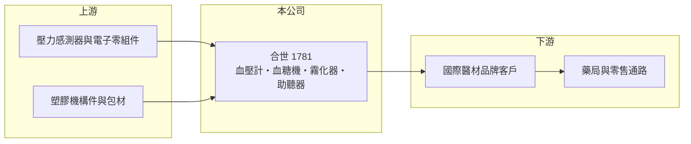

# 1781 合世

> 上櫃｜[[產業索引-生技醫療業|生技醫療業]]｜上市（櫃）日期 2004/12/24

# 第一章：企業模式與商業藍圖

> [!info] 撰寫說明
> 精簡版，由 Claude 依公開資料整理，架構比照 [[2330台積電]]，資料截至 2026-10-08。來源：櫃買中心開放資料快照（基本資料、2026 上半年損益與資產負債、本益比殖利率）、Goodinfo 經營績效頁、nstock 公司簡介、Yahoo 股市與 CMoney 新聞標題。公開資料有限，產品比重與客戶未查得。#待校對

合世生醫是以[[電子血壓計]]為主的家用醫療器材設計製造公司，本章說明代工型醫材廠的商業模式與合世面臨的轉型課題。

- **核心業務：** 合世 1996 年設立，2003 年更名為合世生醫科技，2004 年在櫃買中心掛牌。公司設計、製造並銷售血糖偵測機、電子血壓計與藥物微霧化器等家用醫材，近年也投入[[助聽器]]產品（依新聞標題，年份未查得）。這類產品結合感測元件、電子電路與醫療法規認證，屬於「醫療等級的消費電子」。
- **營收結構：** 公開資料未查得產品別比重，業界通常將合世視為以血壓計為主力的代工廠（[[ODM]]/OEM，推估）。代工模式下，產品掛客戶品牌銷售，合世賺取製造與設計的利差。
- **營運據點：** 總部位於新北中和，生產基地地點未查得（待校對）。家用醫材的組裝屬勞力密集，成本結構與一般電子代工相近。
- **長期方向：** 人口高齡化讓居家量測與聽力輔具的需求長期成長，這是合世發展助聽器的理由。但 2021 年以來營收從約 8 億元降到 2025 年約 4 億元，公司要先止住營收下滑，才談得上長期成長。

# 第二章：護城河深度與競爭優勢

代工型醫材廠的護城河主要是法規認證與客戶關係，但這兩者的保護力有限，本章分析合世的處境。

- **競爭優勢：** 血壓計、血糖機要取得美國 [[FDA 510(k)]]、歐盟 CE 等認證，新進者需要時間累積法規經驗，這是合世的基本門檻。長期合作的品牌客戶若要轉單，也要重新驗證產品，具有一定轉換成本。
- **主要對手：** 國際上有歐姆龍（Omron）等自有品牌大廠，國內同業有 [[4735豪展]]、[[4155訊映]] 等家用醫材廠，中國大陸廠商則以低價大量供貨。代工訂單的價格競爭激烈，毛利率長年只有 5% 至 21%。
- **觀察重點：** 助聽器等新產品能否成為穩定營收來源、毛利率能否回到兩成以上，以及公司能否避免持續虧損侵蝕本已偏低的股東權益。

# 第三章：財務體質與盈利規模

資料日期：2026-10-08，表格是撰寫當時的快照；最新月營收、毛利率、累計 EPS 由自動排程寫在本筆記的屬性欄位（月營收、毛利率、累計EPS 等）。#待校對

合世近年多數年度本業虧損，以下數據可以看出代工型醫材廠在低毛利下的困境。

| 年度 | 營收（億元） | [[毛利率]] | [[營業利益率]] | EPS（元） | [[ROE]] |
|---|---|---|---|---|---|
| 2020 | 7.74 | 16.4% | -2.17% | 4.34 | 58.3% |
| 2021 | 8.12 | 5.64% | -11.9% | -1.31 | -15.2% |
| 2022 | 7.98 | 12.3% | -5.57% | -0.37 | -4.67% |
| 2023 | 6.01 | 15.5% | -6.83% | -0.70 | -9.39% |
| 2024 | 7.06 | 20.9% | 0.35% | 0.51 | 6.66% |
| 2025 | 3.98 | 17.6% | -15.9% | -1.30 | -17.3% |
| 2026 上半年 | 1.93 | 14.3% | -18.0% | -0.51 | 未查得 |

- **營收規模：** 2020 至 2025 年營收年複合成長約 -12.5%（推算），2025 年營收幾乎腰斬。規模縮小後固定費用難以攤提，是營業虧損擴大的主因。
- **獲利：** 2020 年本業虧損但 EPS 4.34 元，代表當年有大額業外收益（性質未查得）；2021 年後除 2024 年小賺外多為虧損。近五年（2021 至 2025）平均 ROE 約 -8%（推算）。
- **財務特色：** 近五年沒有配息紀錄。2026 年第二季末權益僅約 3.0 億元，保留盈餘為 -1.5 億元，每股淨值約 6.4 元，低於面額；負債約 3.5 億元，負債比約 54%，財務彈性有限。
- **[[ROIC]] 與 [[WACC]]：** 2025 年營業利益約 -0.63 億元（3.98 億 × -15.9%），稅後約 -0.51 億元；投入資本以權益 3.0 億元加非流動負債 2.0 億元（有息負債未查得，以此近似）約 5.0 億元，ROIC 約 -10%（推算）。WACC 以無風險利率 1.75%、市場風險溢酬 6%、β 1.0（虧損中小型股，取較高值）得權益成本約 7.8%，負債成本 2.5%、稅率 20%、負債權重約 39%，WACC 約 5.5%（推算）。ROIC 為負且遠低於 WACC，代表目前的營運在持續消耗股東資本，必須先恢復本業獲利。

# 第四章：總體風險與地緣政治

合世的風險集中在營收萎縮與財務體質，本章列出主要風險。

- **產業週期：** 家用醫材需求長期隨高齡化成長，但新冠疫情後通路曾大量備貨，之後的庫存去化會讓代工訂單大幅波動。
- **營運風險：** 營收規模持續下滑、毛利率偏低，若無法止虧，股東權益可能進一步減少，需要減資或增資。客戶集中與轉單也是代工廠的常見風險。
- **其他風險：** 電子零組件價格與匯率波動影響成本，美國關稅政策會影響出口到美國的代工產品報價。

# 專有名詞解析

## 應用

- **[[電子血壓計]]**：以壓力感測器量測血壓的家用醫材，是居家健康管理最普及的產品之一。
- **[[助聽器]]**：放大外界聲音以協助聽損者的輔具，近年部分市場開放免處方銷售。

## 金融

- **[[ROIC]]**：投入資本報酬率，衡量公司用股東與債權人的錢，每年賺回多少稅後營業利益。
- **[[WACC]]**：加權平均資金成本，股東與債權人要求報酬率的加權平均，是 ROIC 要跨過的門檻。

## 產業

- **[[ODM]]**：原廠委託設計製造，代工廠負責設計與生產，產品掛客戶品牌銷售。
- **[[FDA 510(k)]]**：美國食品藥物管理局的醫材上市前通知，證明新產品與已上市產品實質等同即可上市。

# 核心供應鏈

- 上游：壓力感測器、微控制器、顯示器等電子零組件供應商（具體廠商未查得）。
- 下游／客戶：國際醫材品牌與通路商（客戶名稱未查得）。
- 同業：[[4735豪展]]、[[4155訊映]]，國際品牌有歐姆龍。

## 最新新聞
<!-- news:start -->
<!-- news:end -->

## 相關連結
- [公開資訊觀測站](https://mopsov.twse.com.tw/mops/web/t05st03?step=1&firstin=1&co_id=1781)
- [Goodinfo](https://goodinfo.tw/tw/StockDetail.asp?STOCK_ID=1781)
- [Yahoo 股市](https://tw.stock.yahoo.com/quote/1781)
- [鉅亨網新聞](https://www.cnyes.com/twstock/1781/news)
