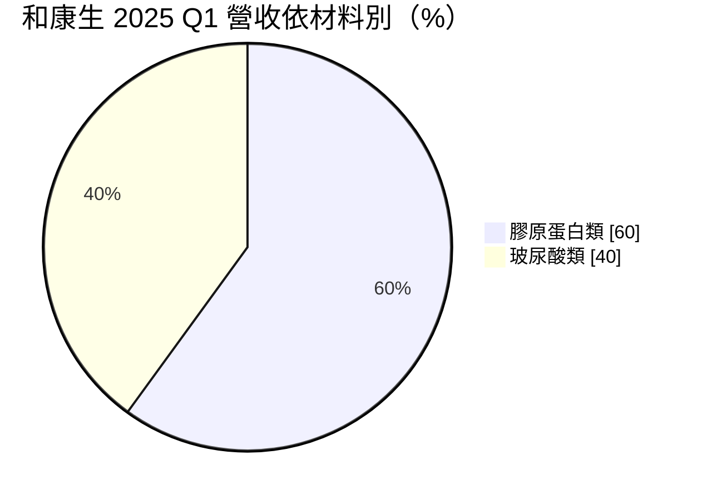
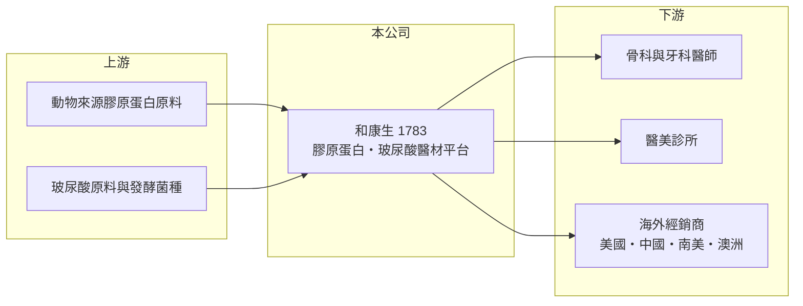

# 1783 和康生

> 上市｜[[產業索引-生技醫療業|生技醫療業]]｜上市（櫃）日期 2013/12/20

# 第一章：企業模式與商業藍圖

> [!info] 撰寫說明
> 精簡版，由 Claude 依公開資料整理，架構比照 [[2330台積電]]，資料截至 2026-10-08。來源：證交所開放資料快照（基本資料、2026 上半年損益與資產負債、股利）、Goodinfo 經營績效頁、富果 2025 年 6 月法說會備忘錄。#待校對

和康生物科技以[[膠原蛋白]]與[[玻尿酸]]兩大材料平台，開發骨科、醫美、外科與牙科的高階醫材。本章說明它如何從材料技術延伸成多科別的醫材公司。

- **核心業務：** 和康生成立於 1998 年，2013 年上市，掌握膠原蛋白與玻尿酸的純化與製劑技術，產品包括骨科填補材、醫美填充劑、傷口與外科用材料、牙科植骨材料等。材料平台的好處是同一套核心技術可以衍生出不同科別的產品，研發成果可以重複利用。
- **營收結構：** 依 2025 年第一季法說會，膠原蛋白類約占 60%、玻尿酸類約 40%，公司預期長期會趨於各半。地區上美國約占 30%、中國約 10%，產品已銷往 27 個國家。

- **營運據點：** 工廠地點未查得（待校對）。2025 年中產能稼動率已在高檔，公司規劃在 2028 年前把整體產能擴增 3 至 4 倍（依法說會）。
- **長期方向：** 2025 年已取得 116 張產品許可證，目標全年 125 張；新配方產品預計 2026 年下半年取證，2027 下半年至 2028 年貢獻營收。長期研發方向包括幹細胞與植物性發酵膠原蛋白，以取代動物來源材料，並與大江基因合作細胞治療應用。

# 第二章：護城河深度與競爭優勢

和康生的護城河來自材料技術與大量的各國[[醫材許可證]]，本章分析這些優勢的強度。

- **競爭優勢：** 醫材每進入一個國家都要取得當地許可證，和康生累積上百張許可證，代表多年法規投入，新進者難以在短期內複製。膠原蛋白與玻尿酸的純化品質直接影響安全性，也形成技術門檻。高毛利率（近年約 68% 至 71%）反映產品具有定價力。
- **主要對手：** 玻尿酸領域的國內同業有 [[1786科妍]]、[[4161聿新科]]（是否直接競爭待校對），國際上則有艾爾建（Allergan）、高德美（Galderma）等醫美大廠，以及骨科生醫材料的跨國公司。
- **觀察重點：** 擴產能否如期完成、新配方產品能否順利取證上市，以及南美、澳洲等新市場的放量速度。美國營收占比約三成，美國醫材法規與關稅變化也需持續追蹤。

# 第三章：財務體質與盈利規模

資料日期：2026-10-08，表格是撰寫當時的快照；最新月營收、毛利率、累計 EPS 由自動排程寫在本筆記的屬性欄位（月營收、毛利率、累計EPS 等）。#待校對

和康生是這批生技公司中少見的營收、毛利率與 ROE 同步逐年提升的例子。

| 年度 | 營收（億元） | [[毛利率]] | [[營業利益率]] | EPS（元） | [[ROE]] |
|---|---|---|---|---|---|
| 2020 | 4.58 | 46.9% | 13.4% | 0.91 | 7.40% |
| 2021 | 5.12 | 51.0% | 17.6% | 1.21 | 8.76% |
| 2022 | 6.04 | 61.9% | 21.3% | 1.65 | 11.4% |
| 2023 | 6.22 | 68.2% | 24.1% | 1.86 | 12.5% |
| 2024 | 6.81 | 71.0% | 26.4% | 2.13 | 13.9% |
| 2025 | 8.12 | 69.5% | 32.2% | 2.96 | 18.2% |
| 2026 上半年 | 4.12 | 69.2% | 28.0% | 1.47 | 未查得 |

- **營收規模：** 2020 至 2025 年營收年複合成長約 12%（推算），每年都比前一年成長。這是許可證數量增加、海外市場擴張逐步累積的結果。
- **獲利：** 毛利率從 47% 升到 70% 左右，營業利益率從 13% 升到 32%，展現明顯的規模經濟與產品組合改善。近五年（2021 至 2025）平均 ROE 約 13%（推算），並呈上升趨勢。
- **財務特色：** 2025 年度配發現金股利 2.0 元，約為 EPS 的 68%。2026 年第二季末權益約 15.0 億元、負債約 5.3 億元，幾乎沒有長期負債，擴產主要靠自有資金。
- **[[ROIC]] 與 [[WACC]]：** 2025 年營業利益約 2.61 億元（8.12 億 × 32.2%），稅後約 2.09 億元；投入資本以權益 15.0 億元加非流動負債約 0.04 億元（有息負債未查得，以此近似）約 15.0 億元，ROIC 約 13.9%（推算）。WACC 以無風險利率 1.75%、市場風險溢酬 6%、β 0.8（醫材同業常見值）得權益成本約 6.6%，幾乎無負債，WACC 約 6.5%（推算）。ROIC 高於 WACC 約 7 個百分點，是本批公司中價值創造最明確的一家；擴產期間資本支出增加，短期 ROIC 可能下降。

# 第四章：總體風險與地緣政治

醫材公司的風險主要在法規、擴產執行與國際市場，本章整理和康生的長期風險。

- **產業週期：** 骨科與外科醫材需求穩定，醫美產品則與消費景氣相關，景氣下行時醫美療程可能延後。整體而言，和康生的週期性低於消費電子，但高於處方藥。
- **營運風險：** 擴產 3 至 4 倍若進度延誤或需求不如預期，折舊與費用將壓低獲利率。新產品取證時程受各國主管機關審查影響，不完全由公司控制。
- **其他風險：** 美國與中國合計約四成營收，美中貿易政策、關稅與匯率波動都會影響獲利；動物來源膠原蛋白也面臨原料供應與法規限制。

# 專有名詞解析

## 金融

- **[[ROIC]]**：投入資本報酬率，衡量公司用股東與債權人的錢，每年賺回多少稅後營業利益。
- **[[WACC]]**：加權平均資金成本，股東與債權人要求報酬率的加權平均，是 ROIC 要跨過的門檻。

## 產業

- **[[膠原蛋白]]**：人體結締組織的主要蛋白質，可製成骨科填補材、傷口敷料與醫美填充劑。
- **[[玻尿酸]]**：人體內的保濕多醣體，經交聯處理後可用於關節注射、皮下填補與眼科手術。
- **[[醫材許可證]]**：醫療器材在各國上市前須取得的主管機關核准，是進入當地市場的門票。

# 核心供應鏈

- 上游：膠原蛋白與[[玻尿酸]]原料供應商（具體廠商未查得）。
- 下游／客戶：骨科、牙科、外科醫院與醫美診所，以及 27 國海外經銷商。
- 同業：[[1786科妍]]、[[4161聿新科]]，國際上有艾爾建、高德美。

## 最新新聞
<!-- news:start -->
<!-- news:end -->

## 相關連結
- [公開資訊觀測站](https://mopsov.twse.com.tw/mops/web/t05st03?step=1&firstin=1&co_id=1783)
- [Goodinfo](https://goodinfo.tw/tw/StockDetail.asp?STOCK_ID=1783)
- [Yahoo 股市](https://tw.stock.yahoo.com/quote/1783)
- [鉅亨網新聞](https://www.cnyes.com/twstock/1783/news)
