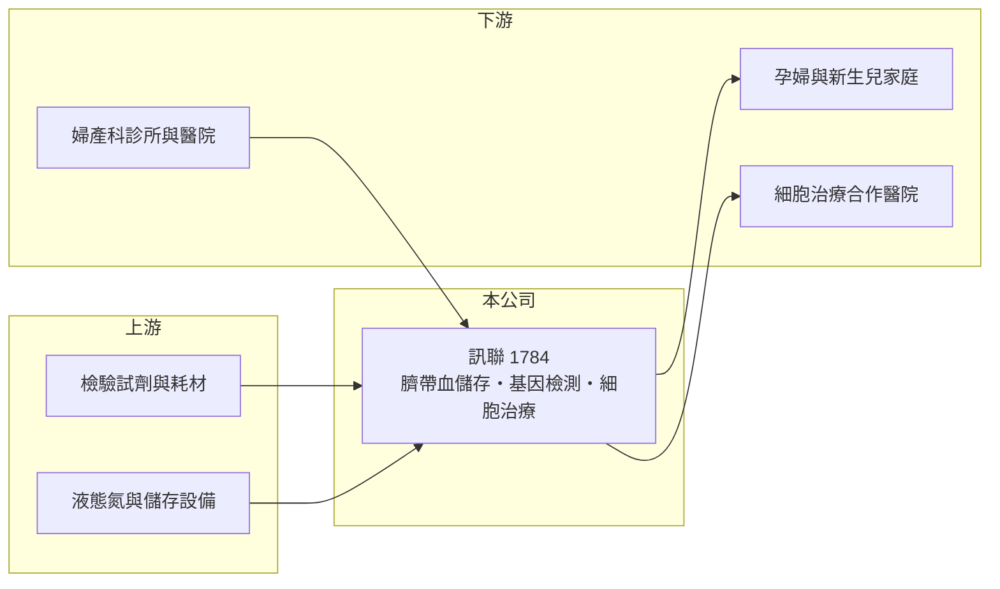

# 1784 訊聯

> 上櫃｜[[產業索引-生技醫療業|生技醫療業]]｜上市（櫃）日期 2007/07/26

# 第一章：企業模式與商業藍圖

> [!info] 撰寫說明
> 精簡版，由 Claude 依公開資料整理，架構比照 [[2330台積電]]，資料截至 2026-10-08。來源：櫃買中心開放資料快照（基本資料、2026 上半年損益與資產負債、本益比殖利率）、MoneyDJ 年度財務比率頁、Yahoo 股市新聞標題。業務描述多為憑記憶整理，已標待校對。#待校對

訊聯生物科技是以[[臍帶血]]儲存起家的細胞與基因服務公司，本章說明這種「先收費、長期保存」的服務型商業模式。

- **核心業務：** 訊聯成立於 2000 年，2007 年在櫃買中心掛牌，主要提供新生兒臍帶血、臍帶間質幹細胞的處理與長期保存服務，並透過子公司訊聯基因提供基因檢測服務（業務細節待校對）。客戶多在孕期簽約，生產時採集，之後每年或一次付清保存費用，是典型的長期合約型服務。
- **營收結構：** 公開資料未查得業務別比重，營收大致來自儲存服務、基因檢測，以及[[細胞治療]]等[[再生醫療]]相關服務（推估）。2025 年營收約 13.1 億元（以 MoneyDJ 每股營業額乘股本推算）。
- **營運據點：** 總部與實驗室位於台北內湖。細胞儲存需要符合規範的實驗室、液態氮儲存槽與長期品質管理，是固定成本高、規模越大越有效率的業務。
- **長期方向：** 台灣 2018 年施行細胞治療特管辦法後（年份待校對），保存的幹細胞有機會用於自體細胞治療，訊聯也朝再生醫療延伸。但新生兒出生數逐年下滑，是儲存業務長期成長的天花板。

# 第二章：護城河深度與競爭優勢

訊聯的護城河來自品牌信任、儲存量規模與長期合約，本章評估這些優勢與限制。

- **競爭優勢：** 家長選擇臍帶血銀行重視的是長期營運的可信度，訊聯經營二十多年、儲存量具規模，品牌是主要護城河。已簽約的客戶保存期長達數十年，帶來可預期的經常性收入，轉換成本也很高。
- **主要對手：** 國內有 [[6649台生材]] 等細胞治療相關公司（業務重疊程度待校對），以及多家私人臍帶血銀行；基因檢測則面對醫院檢驗科與 [[6615慧智]] 等檢測公司競爭（待校對）。
- **觀察重點：** 少子化下新簽約數能否維持、基因檢測與細胞治療能否成為新的成長引擎，以及子公司虧損對合併獲利的拖累。2025 年合併營業利益率轉為負值，是費用增加的警訊。

# 第三章：財務體質與盈利規模

資料日期：2026-10-08，表格是撰寫當時的快照；最新月營收、毛利率、累計 EPS 由自動排程寫在本筆記的屬性欄位（月營收、毛利率、累計EPS 等）。#待校對

訊聯的毛利率高、營業利益率低，以下多年度數據可以看出服務業「高毛利、高費用」的特性。

| 年度 | 營收（億元，推算） | [[毛利率]] | [[營業利益率]] | EPS（元） | [[ROE]] |
|---|---|---|---|---|---|
| 2020 | 約 8.5 | 51.1% | -0.47% | 0.27 | 0.10% |
| 2021 | 約 9.7 | 54.6% | 3.39% | 0.56 | 2.51% |
| 2022 | 約 10.4 | 55.3% | 5.80% | 0.80 | 4.06% |
| 2023 | 約 11.9 | 56.6% | 7.51% | 1.67 | 5.34% |
| 2024 | 約 12.9 | 56.1% | 5.11% | 1.65 | 3.39% |
| 2025 | 約 13.1 | 55.3% | -1.17% | 1.02 | 0.04% |
| 2026 上半年 | 6.53 | 55.8% | 0.2% | 0.64 | 未查得 |

營收以 2025 年每股營業額 24.58 元乘股本約 5,312 萬股推得約 13.1 億元，其他年度依 MoneyDJ 營收成長率回推，均為推算。ROE 為 MoneyDJ 數字，與 EPS 落差大，可能以含[[非控制權益]]的總權益計算，待校對。

- **營收規模：** 2020 至 2025 年營收年複合成長約 9%（推算），2026 年 1 至 8 月累計營收約 8.83 億元、年增約 10%，成長持續但速度放緩。
- **獲利：** 毛利率穩定在 51% 至 57%，但營業費用幾乎吃掉全部毛利，營業利益率長年在 -1% 至 8% 之間。2026 年上半年歸屬母公司淨利約 0.32 億元，非控制權益則虧損約 0.21 億元，顯示子公司虧損明顯拖累合併數字。
- **財務特色：** 2024 年度現金股利 1.4 元（依新聞標題），最近一次股利約 0.88 元，配息率高。2026 年第二季末總權益約 22.0 億元，其中非控制權益約 9.7 億元，比重很高；另有庫藏股約 1.5 億元。
- **[[ROIC]] 與 [[WACC]]：** 2025 年營業利益約 -0.15 億元（13.1 億 × -1.17%），稅後約 -0.12 億元；投入資本以總權益 22.0 億元加非流動負債 4.3 億元（有息負債未查得，以此近似）約 26.3 億元，ROIC 約 -0.5%（推算），2023 年獲利較好時也僅約 2% 至 3%（推算）。WACC 以無風險利率 1.75%、市場風險溢酬 6%、β 0.8（醫療服務同業常見值）得權益成本約 6.6%，負債權重約 16%，WACC 約 5.8%（推算）。ROIC 長期低於 WACC，代表以合併報表來看，目前的資本運用尚未創造足夠價值，歸屬母公司的獲利主要來自業外與子公司結構。

# 第四章：總體風險與地緣政治

訊聯的風險主要來自人口結構、法規與子公司經營，本章整理長期風險。

- **產業週期：** 業務受景氣影響小，但與出生數高度相關。台灣出生數長期下滑，新簽約客戶的天花板逐年降低。
- **營運風險：** 長期儲存須確保數十年不出差錯，一旦發生保存事故會重創品牌。細胞治療業務投入大、回收期長，子公司持續虧損會拖累整體獲利。
- **其他風險：** 再生醫療法規若調整，會直接影響細胞治療業務的可行性；基因檢測面臨技術快速進步與價格下滑。

# 專有名詞解析

## 應用

- **[[臍帶血]]**：新生兒出生時臍帶與胎盤內的血液，含有造血幹細胞，可冷凍保存供未來治療使用。
- **[[細胞治療]]**：以人體細胞經處理後回輸病人的治療方式，台灣依特管辦法開放部分項目。

## 金融

- **[[非控制權益]]**：合併報表中子公司不屬於母公司股東的權益部分，子公司虧損會分攤給此項目。
- **[[ROIC]]**：投入資本報酬率，衡量公司用股東與債權人的錢，每年賺回多少稅後營業利益。
- **[[WACC]]**：加權平均資金成本，股東與債權人要求報酬率的加權平均，是 ROIC 要跨過的門檻。

## 產業

- **[[再生醫療]]**：利用細胞、組織或基因修復受損器官與組織的醫療領域。

# 核心供應鏈

- 上游：檢驗試劑、實驗耗材與冷凍儲存設備供應商（具體廠商未查得）。
- 下游／客戶：孕婦家庭（經婦產科通路簽約）、合作醫院。
- 同業：[[6649台生材]]、[[6615慧智]]，以及其他私人臍帶血銀行（待校對）。

## 最新新聞
<!-- news:start -->
<!-- news:end -->

## 相關連結
- [公開資訊觀測站](https://mopsov.twse.com.tw/mops/web/t05st03?step=1&firstin=1&co_id=1784)
- [Goodinfo](https://goodinfo.tw/tw/StockDetail.asp?STOCK_ID=1784)
- [Yahoo 股市](https://tw.stock.yahoo.com/quote/1784)
- [鉅亨網新聞](https://www.cnyes.com/twstock/1784/news)
