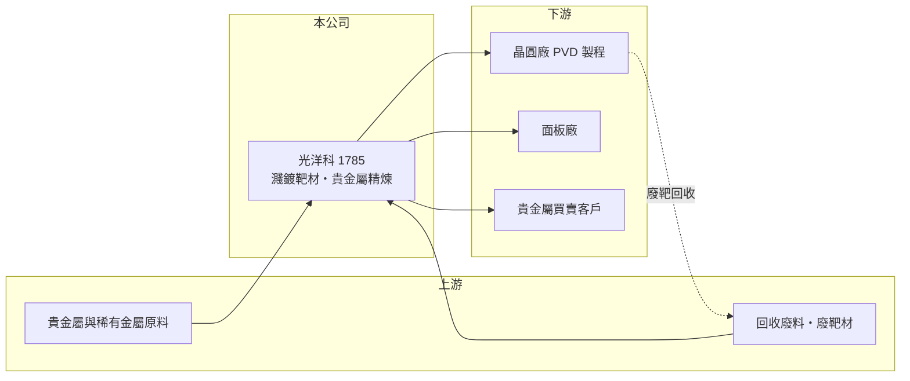

# 1785 光洋科

> 上櫃｜[[產業索引-其他電子業|其他電子業]]｜上市（櫃）日期 2005/01/31

# 第一章：企業模式與商業藍圖

> [!info] 撰寫說明
> 精簡版，由 Claude 依公開資料整理，架構比照 [[2330台積電]]，資料截至 2026-10-07。來源：nstock 公司概況頁、經濟日報與工商時報新聞標題；客戶與同業為整理性描述。#待校對

光洋科是台灣主要的[[濺鍍靶材]]與貴金屬材料廠，同時經營[[貴金屬回收]]與精煉。

- **核心業務：** 濺鍍薄膜材料、貴金屬材料及汽車化學品的製造、加工、回收、精煉與買賣。
- **營收結構：** 貴金屬買賣與回收的營收金額大但毛利率低，靶材毛利率較高（推估）；各業務營收比重未查得。
- **營運據點：** 以台灣為主要生產基地（推估）。
- **長期方向：** 2026 年 10 月進行半導體事業分割，聚焦半導體用靶材，提升專業化與評價（待公司公告確認）。

# 第二章：護城河深度與競爭優勢

光洋科的優勢在於結合回收精煉與靶材製造的垂直整合能力。

- **競爭優勢：** 能回收客戶用過的貴金屬靶材並重新精煉製造，形成材料循環，對半導體與面板客戶有成本與供應穩定的優勢（推估）。
- **主要對手：** 日本 JX 金屬、美國 Honeywell、Materion 等國際靶材大廠（推估）。
- **觀察重點：** 半導體事業分割後的營運與評價、半導體靶材打入先進製程的進度，以及金、銀、鉑等貴金屬價格。

# 第三章：財務體質與盈利規模

資料日期：2026-10-07，表格是撰寫當時的快照；最新月營收、毛利率、累計 EPS 由自動排程寫在本筆記的屬性欄位（月營收、毛利率、累計EPS 等）。#待校對

光洋科營收受貴金屬價格推升，但毛利率偏低。

- **營收規模：** 2025 年全年營收 395.58 億元；2026 年 1 至 8 月累計 405.47 億元，年增 63.4%，已超過 2025 年全年；8 月營收 45.16 億元，年增 30.71%。
- **獲利：** 2026 年第二季 EPS 1.11 元，季減 56.3%，上半年累計 3.66 元。第二季[[毛利率]] 9.74%、[[營業利益率]] 7%。
- **財務特色：** 貴金屬買賣使營收規模放大、毛利率被稀釋，評估時應以毛利金額與靶材獲利為重；貴金屬存貨評價會讓獲利隨金價波動。

# 第四章：總體風險與地緣政治

光洋科的風險集中在貴金屬價格與半導體景氣。

- **產業週期：** 靶材在晶圓廠的 [[PVD]] 製程中消耗，半導體與面板產能利用率決定靶材需求，景氣下行時客戶減少投片，靶材用量同步下降。
- **營運風險：** 持有大量貴金屬存貨，金價急跌可能帶來存貨跌價損失；事業分割的執行與後續資本規劃有不確定性。
- **其他風險：** 貴金屬價格受國際利率與避險需求影響；股價隨題材波動大。

# 專有名詞解析

## 半導體

- **[[濺鍍靶材]]**：物理氣相沉積製程中被離子撞擊、把金屬原子鍍到晶圓或面板上的高純度材料塊。
- **[[PVD]]**：物理氣相沉積，以濺鍍等物理方式把金屬鍍在基板上，常用於金屬導線層。

## 金融

- **[[毛利率]]**：毛利除以營收，反映產品或服務本身的獲利能力。
- **[[營業利益率]]**：營業利益除以營收，反映本業扣除營業費用後的獲利能力。

## 產業

- **[[貴金屬回收]]**：從廢料、廢靶材或電子廢棄物中提煉金、銀、鉑、鈀等貴金屬，再精煉成可用材料。

# 核心供應鏈

- 上游：金、銀、鉑等貴金屬與稀有金屬原料、回收廢料來源
- 下游／客戶：晶圓廠的 [[PVD]] 製程、面板廠、貴金屬買賣客戶（推估）
- 同業：JX 金屬、Honeywell、Materion（推估）

## 供應鏈關係
- 供應給 [[2330台積電]]：靶材製造與貴金屬回收（台積電供應鏈 › 上游：關鍵耗材、特用化學品與氣體）

## 最新新聞
<!-- news:start（自動產生，請勿手動編輯此範圍） -->
- 2026-10-10 📰 媒體 03:22｜熱門股》當沖熱絡 光洋科強攻漲停｜[自由時報](https://news.google.com/rss/articles/CBMiWEFVX3lxTFBBVlRTRVZhWUt2a2VLN3hIc1Fkdm01SFBpcmRKN04xalZDRnRjVVdXeXVzQ1NiSXR2MWZwdlJDeHRsNVBOR2lKa055ME9acWtaMlI1SzJncHc?oc=5)
- 2026-10-08 📰 媒體 17:23｜營收速報 - 光洋科(1785)9月營收50.78億元年增率高達49.91％｜[鉅亨網](https://news.cnyes.com/news/id/6624982)
- 2026-10-08 📰 媒體 15:00｜《業績-其他電》光洋科9月營收為50.78億元，年增49.91%｜[富聯網](https://news.google.com/rss/articles/CBMiiAFBVV95cUxPbHBIOTlxVkxQN0M5OHBGR2JXdVVjQmdPYVVQYzIwVGhjOEllMG9KMlZFYzVLR2s1UnFWRmVZNldOSGdLR1R0TnJoeVV0a29mM25FT2o3bk9Ya25pWERUajJyempJWTZVbVpycDZISGdmamIwd1JQUFpUNmVkbU02YVJyaTVOVVFv?oc=5)
- 2026-10-08 📰 媒體 14:58｜營收：光洋科(1785)9月營收50億7755萬元，月增率12.43%，年增率49.91%｜[富聯網](https://news.google.com/rss/articles/CBMikgFBVV95cUxNdnotbG5BeFRPcWxRUDlmN2hZcGt1WTRqZER4NnBaeVJVRTREUEREZDhaX2N0ZjM4Q21Ic2Y5STZCYmxLVGVVNVZkT0paY21fSTE0cHBZVkx2Tk1lbjhZVjVBYU13dlk1MG90djNka0hFaHo5M0lKY1V5RXpsSmxZdDhEWGppbTFZUk92bk1Ya1Zodw?oc=5)
- 2026-10-07 📰 媒體 05:30｜熱門股》貴金屬價格高檔 光洋科看旺｜[自由財經](https://news.google.com/rss/articles/CBMiVkFVX3lxTE5NTnN3S2dWNjZnZ1BHOW9NSHhJOU5EQUlqS3BzWmNhNlM2QWdMNW4zbURXZzE5djRaSmtucGlQRWx3YzkxS3M2MzMxWVMtQXcyS1ZNUEhR0gFbQVVfeXFMTkVnN09fbk5jYlpxWDBNV2d5MzBCSUtWdDl1Y1NScXllUzFkU0txb1NrNFFrSHVCeUtubWI4SkRuekVxaFdCb2xES0NzYmlJTUVBbktqckNJcWNpTQ?oc=5)

完整紀錄：[[1785光洋科 新聞]]
<!-- news:end -->

## 相關連結
- [公開資訊觀測站](https://mopsov.twse.com.tw/mops/web/t05st03?step=1&firstin=1&co_id=1785)
- [Goodinfo](https://goodinfo.tw/tw/StockDetail.asp?STOCK_ID=1785)
- [Yahoo 股市](https://tw.stock.yahoo.com/quote/1785)
- [鉅亨網新聞](https://www.cnyes.com/twstock/1785/news)
