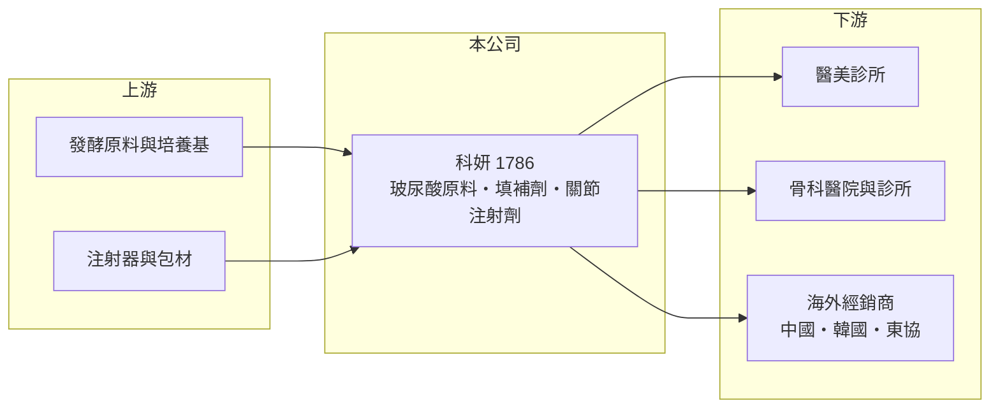

# 1786 科妍

> 上市｜[[產業索引-生技醫療業|生技醫療業]]｜上市（櫃）日期 2013/11/12

# 第一章：企業模式與商業藍圖

> [!info] 撰寫說明
> 精簡版，由 Claude 依公開資料整理，架構比照 [[2330台積電]]，資料截至 2026-10-08。來源：證交所開放資料快照（基本資料、2026 上半年損益與資產負債、股利）、Goodinfo 經營績效頁、股感（Stockfeel）2015 年公司介紹文。產品與取證資料較舊，近年發展可能已有變化。#待校對

科妍生物科技是台灣第一家國產[[玻尿酸]]皮下填補劑廠商，也生產骨科關節注射劑。本章說明它從原料到成品的一條龍模式。

- **核心業務：** 科妍成立於 2001 年，2013 年上市，主要產品包括玻尿酸皮下填補劑（醫美用）、玻尿酸關節腔注射劑（骨科用，如 Hya-Joint Plus），以及玻尿酸原料，另有保養品與食品代工、DNA 檢測等業務。公司自行生產玻尿酸原料並做成[[第三類醫材]]，掌握從原料到成品的完整製程。
- **營收結構：** 公開資料未查得產品別比重。依產品性質推估，醫美填補劑與骨科關節注射劑是主要營收來源，原料與代工為輔（推估）。
- **營運據點：** 生產基地位於台灣（廠區地點待校對）。2012 年取得國內皮下填補劑許可證，2014 年取得中國醫療器械許可證與 Hya-Joint Plus 一針劑型第三類醫材許可證，2015 年取得韓國上市許可（依股感 2015 年文章）。
- **長期方向：** 2015 年時公司以亞洲為首要市場，長期目標是取得美國 FDA 認證。2020 至 2024 年營收從 4.67 億元成長到 8.83 億元，代表海外與新產品布局已逐步收成。

# 第二章：護城河深度與競爭優勢

科妍的護城河來自國產玻尿酸的製程技術與第三類醫材許可證，本章分析其競爭位置。

- **競爭優勢：** 交聯玻尿酸的製程決定產品的支撐力與維持時間，科妍 2013 年取得交聯製程專利（依股感文章）。第三類醫材的審查最嚴格，取證需要臨床資料與長時間審查，形成進入門檻。2015 年時估計其在台灣皮下填補劑市占約 15%，且為唯一國產廠商。
- **主要對手：** 國際醫美大廠艾爾建（Allergan）、高德美（Galderma，原 Q-Med）、瑞士安緹斯等進口品牌，國內則有 [[1783和康生]] 等生醫材料公司在玻尿酸領域布局。進口品牌品牌力強，科妍以價格與在地服務競爭。
- **觀察重點：** 2025 年營業利益率由 28% 降到 21%，需觀察是費用增加還是價格競爭；另要追蹤新產品取證、海外市場占比，以及能否打入美國市場。

# 第三章：財務體質與盈利規模

資料日期：2026-10-08，表格是撰寫當時的快照；最新月營收、毛利率、累計 EPS 由自動排程寫在本筆記的屬性欄位（月營收、毛利率、累計EPS 等）。#待校對

科妍擁有醫材公司典型的高毛利率，以下用多年度數據檢視它的成長與資本效率。

| 年度 | 營收（億元） | [[毛利率]] | [[營業利益率]] | EPS（元） | [[ROE]] |
|---|---|---|---|---|---|
| 2020 | 4.67 | 73.5% | 31.4% | 2.10 | 9.26% |
| 2021 | 5.06 | 67.6% | 24.1% | 1.54 | 7.13% |
| 2022 | 5.57 | 66.7% | 24.2% | 2.14 | 9.57% |
| 2023 | 7.13 | 71.9% | 28.0% | 2.66 | 11.3% |
| 2024 | 8.83 | 74.2% | 28.1% | 3.51 | 13.8% |
| 2025 | 8.87 | 72.0% | 21.4% | 2.24 | 8.37% |
| 2026 上半年 | 4.16 | 68.3% | 12.0% | 0.76 | 未查得 |

- **營收規模：** 2020 至 2025 年營收年複合成長約 13.7%（推算），2023 與 2024 年成長最快，2025 年持平。2026 年 1 至 8 月累計營收約 5.58 億元，較去年同期略減約 3%。
- **獲利：** 毛利率長年維持 67% 至 74%，說明產品定價力穩固；但 2026 年上半年營業利益率降到 12%，營業費用占營收比重明顯升高。近五年（2021 至 2025）平均 ROE 約 10%（推算）。
- **財務特色：** 2025 年度配發現金股利約 1.91 元，約為 EPS 的 85%，配息率高。2026 年第二季末權益約 17.9 億元、負債約 7.2 億元，資本公積約 9.6 億元，代表過去曾以增資籌資；另持有庫藏股約 1.07 億元。
- **[[ROIC]] 與 [[WACC]]：** 2025 年營業利益約 1.90 億元（8.87 億 × 21.4%），稅後約 1.52 億元；投入資本以權益 17.9 億元加非流動負債 5.2 億元（有息負債未查得，以此近似）約 23.1 億元，ROIC 約 6.6%（推算），以 2026 年上半年年化則約 3.5%（推算）。WACC 以無風險利率 1.75%、市場風險溢酬 6%、β 0.9（醫材股常見值，取略高）得權益成本約 7.2%，負債成本 2.5%、稅率 20%、負債權重約 23%，WACC 約 6.0%（推算）。2024 年獲利高峰時 ROIC 明顯高於 WACC，2025 年起利差縮小到接近零，能否回復取決於費用控制與營收成長。

# 第四章：總體風險與地緣政治

醫美與骨科醫材的風險在於消費景氣、國際品牌競爭與法規，本章整理科妍的長期風險。

- **產業週期：** 醫美療程屬可選消費，景氣轉弱時需求會下降；骨科關節注射則與高齡化相關，需求較穩定，兩者在週期上有一定互補。
- **營運風險：** 進口品牌行銷資源遠大於科妍，價格戰或通路競爭可能壓縮毛利；費用率上升若持續，會侵蝕原本的高毛利優勢。
- **其他風險：** 中國市場的醫材法規、集中採購政策與兩岸關係，會影響海外營收；各國醫材法規趨嚴也會拉長新產品上市時程。

# 專有名詞解析

## 應用

- **[[皮下填補劑]]**：注射於皮下以填補凹陷、塑形的醫美產品，常見成分為交聯玻尿酸。
- **[[關節腔注射劑]]**：注射到膝關節等關節腔內以潤滑、緩解退化性關節炎疼痛的產品。

## 金融

- **[[ROIC]]**：投入資本報酬率，衡量公司用股東與債權人的錢，每年賺回多少稅後營業利益。
- **[[WACC]]**：加權平均資金成本，股東與債權人要求報酬率的加權平均，是 ROIC 要跨過的門檻。

## 產業

- **[[玻尿酸]]**：人體內的保濕多醣體，經交聯處理後可用於關節注射、皮下填補與眼科手術。
- **[[第三類醫材]]**：風險最高等級的醫療器材，上市前須提出臨床資料並經主管機關嚴格審查。

# 核心供應鏈

- 上游：發酵原料、培養基與預填式注射器等包材供應商（具體廠商未查得）。
- 下游／客戶：醫美診所、骨科醫院，以及中國、韓國等海外經銷商。
- 同業：[[1783和康生]]，國際上有艾爾建、高德美。

## 最新新聞
<!-- news:start -->
<!-- news:end -->

## 相關連結
- [公開資訊觀測站](https://mopsov.twse.com.tw/mops/web/t05st03?step=1&firstin=1&co_id=1786)
- [Goodinfo](https://goodinfo.tw/tw/StockDetail.asp?STOCK_ID=1786)
- [Yahoo 股市](https://tw.stock.yahoo.com/quote/1786)
- [鉅亨網新聞](https://www.cnyes.com/twstock/1786/news)
