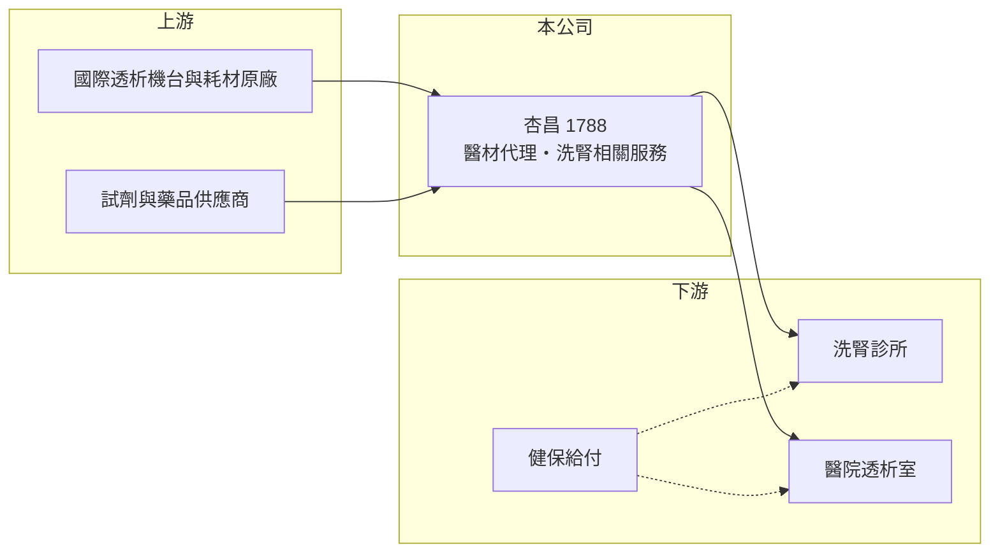

# 1788 杏昌

> 上櫃｜[[產業索引-生技醫療業|生技醫療業]]｜上市（櫃）日期 2009/07/20

# 第一章：企業模式與商業藍圖

> [!info] 撰寫說明
> 精簡版，由 Claude 依公開資料整理，架構比照 [[2330台積電]]，資料截至 2026-10-08。來源：櫃買中心開放資料快照（基本資料、2026 上半年損益與資產負債、本益比殖利率）、Goodinfo 經營績效頁、nstock 公司簡介。代理品牌與業務比重未查得，洗腎相關描述憑記憶整理。#待校對

杏昌生技是以醫療器材代理與醫療管理服務為主的通路型公司，本章說明這種「代理加服務」的商業模式為何能穩定賺錢。

- **核心業務：** 杏昌 1989 年設立，2009 年在櫃買中心掛牌，主要營業項目為醫療器材、生化試藥與西藥的買賣，以及醫療管理顧問服務。業界一般將杏昌視為以[[血液透析]]（洗腎）相關耗材、設備與洗腎中心管理服務為主的公司（待校對）。台灣洗腎盛行率居世界前列，洗腎病人每週需透析多次，耗材需求非常穩定。
- **營收結構：** 公開資料未查得業務別比重與代理品牌。營收規模約 40 億元以上，是本批生技公司中營收最大的一家之一，毛利率約 22% 至 27%，符合通路代理業的特性（推估）。
- **營運據點：** 總部位於新北三重，客戶遍布全台醫院與洗腎診所（推估）。通路業不需要大型工廠，主要資產是倉儲、物流與服務團隊。
- **長期方向：** 洗腎需求隨人口高齡化與糖尿病、高血壓患者增加而長期成長，杏昌的成長主要來自服務更多的洗腎中心與醫院。2020 至 2025 年營收從 34.3 億元成長到 42.8 億元，屬穩健成長。

# 第二章：護城河深度與競爭優勢

通路型公司的護城河在於客戶關係、服務網絡與代理權，本章分析杏昌的競爭地位。

- **競爭優勢：** 洗腎中心一旦採用特定品牌的機台，耗材通常需要配套使用，轉換成本高；杏昌若同時提供管理顧問服務，與客戶的綁定程度更深（待校對）。長期穩定的服務網絡與健保申報經驗，是新進者不易建立的優勢。
- **主要對手：** 國際透析大廠在台灣的直營或代理體系，以及其他[[醫材代理]]商，例如 [[4175杏一]]（業務重疊程度待校對）。洗腎中心本身也可能透過連鎖化增加議價力。
- **觀察重點：** 代理權續約是通路商最大的不確定性；另要觀察洗腎給付的[[健保點值]]變化，以及洗腎中心連鎖化對代理商利潤的影響。

# 第三章：財務體質與盈利規模

資料日期：2026-10-08，表格是撰寫當時的快照；最新月營收、毛利率、累計 EPS 由自動排程寫在本筆記的屬性欄位（月營收、毛利率、累計EPS 等）。#待校對

杏昌是低毛利、高周轉、高配息的典型通路股，以下用多年度數據檢視。

| 年度 | 營收（億元） | [[毛利率]] | [[營業利益率]] | EPS（元） | [[ROE]] |
|---|---|---|---|---|---|
| 2020 | 34.3 | 24.7% | 10.9% | 8.72 | 16.7% |
| 2021 | 36.8 | 26.3% | 11.2% | 8.99 | 16.1% |
| 2022 | 46.9 | 22.3% | 9.74% | 9.06 | 15.5% |
| 2023 | 39.0 | 26.1% | 10.4% | 8.01 | 12.8% |
| 2024 | 40.7 | 26.3% | 10.5% | 8.08 | 12.0% |
| 2025 | 42.8 | 26.7% | 9.79% | 8.28 | 12.2% |
| 2026 上半年 | 22.5 | 28.5% | 11.1% | 4.63 | 未查得 |

- **營收規模：** 2020 至 2025 年營收年複合成長約 4.5%（推算）。2022 年 46.9 億元的高點可能與疫情相關產品有關（推估），之後回到每年小幅成長的軌道。
- **獲利：** 毛利率穩定在 22% 至 28%，營業利益率約 10% 至 11%，EPS 每年都在 8 至 9 元，獲利穩定度在生技股中極為少見。近五年（2021 至 2025）平均 ROE 約 13.7%（推算），但呈緩步下滑，因權益持續累積。
- **財務特色：** 2025 年度現金股利 7.0 元，約為 EPS 的 85%，近五年平均現金股利約 7 元，配息穩定。2026 年第二季末權益約 29.5 億元、負債約 23.4 億元，負債比約 44%，多為通路業常見的應付帳款等營運負債（推估）。資本公積約 16 億元，代表曾以溢價增資籌資。
- **[[ROIC]] 與 [[WACC]]：** 2025 年營業利益約 4.19 億元（42.8 億 × 9.79%），稅後約 3.35 億元；投入資本以權益 29.5 億元加非流動負債 5.9 億元（有息負債未查得，以此近似）約 35.4 億元，ROIC 約 9.5%（推算），以 2026 年上半年年化約 11.3%（推算）。WACC 以無風險利率 1.75%、市場風險溢酬 6%、β 0.7（獲利穩定的醫療通路股，取較低值）得權益成本約 6.0%，負債成本 2.5%、稅率 20%、負債權重約 17%，WACC 約 5.3%（推算）。ROIC 穩定高於 WACC 約 4 至 6 個百分點，代表杏昌長期穩定創造價值。

# 第四章：總體風險與地緣政治

醫療通路業的風險主要在健保政策與代理權，本章整理杏昌的長期風險。

- **產業週期：** 洗腎需求幾乎不受景氣影響，是非常抗週期的業務；但健保總額與點值調整會直接影響客戶的支付能力與採購價格。
- **營運風險：** 若主要代理權到期未續約或原廠改為直營，營收可能大幅減少。應收帳款集中在醫療院所，回收期拉長會影響營運資金。
- **其他風險：** 代理產品多為進口，新台幣貶值會提高進貨成本；醫療法規與健保審查趨嚴也會影響洗腎中心的營運。

# 專有名詞解析

## 應用

- **[[血液透析]]**：俗稱洗腎，以機器與透析器過濾血液中的廢物與水分，腎衰竭病人需長期定期進行。

## 金融

- **[[ROIC]]**：投入資本報酬率，衡量公司用股東與債權人的錢，每年賺回多少稅後營業利益。
- **[[WACC]]**：加權平均資金成本，股東與債權人要求報酬率的加權平均，是 ROIC 要跨過的門檻。

## 產業

- **[[醫材代理]]**：代理國外醫療器材品牌在國內銷售、安裝與維修，賺取進銷差價與服務收入。
- **[[健保點值]]**：健保總額制度下每一點醫療服務實際能換得的金額，影響醫療院所的實際收入。

# 核心供應鏈

- 上游：國際透析機台與耗材原廠（代理品牌未查得）、試劑與藥品供應商。
- 下游／客戶：全台洗腎診所與醫院透析室，最終由健保給付。
- 同業：其他醫材代理商與原廠直營體系，例如 [[4175杏一]]（業務重疊程度待校對）。

## 最新新聞
<!-- news:start -->
<!-- news:end -->

## 相關連結
- [公開資訊觀測站](https://mopsov.twse.com.tw/mops/web/t05st03?step=1&firstin=1&co_id=1788)
- [Goodinfo](https://goodinfo.tw/tw/StockDetail.asp?STOCK_ID=1788)
- [Yahoo 股市](https://tw.stock.yahoo.com/quote/1788)
- [鉅亨網新聞](https://www.cnyes.com/twstock/1788/news)
