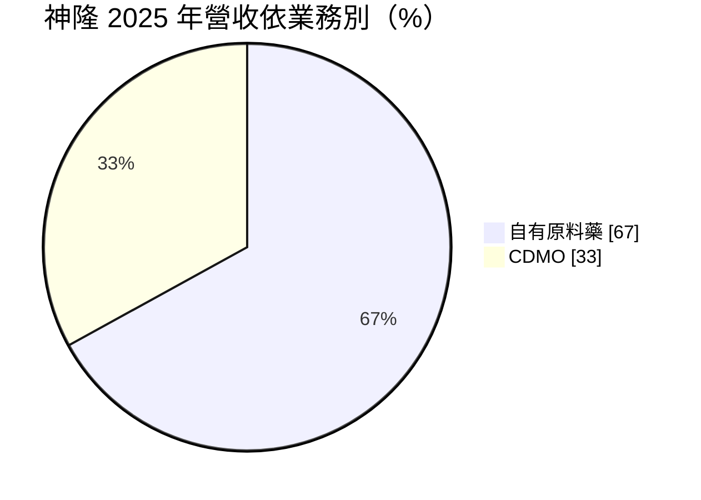
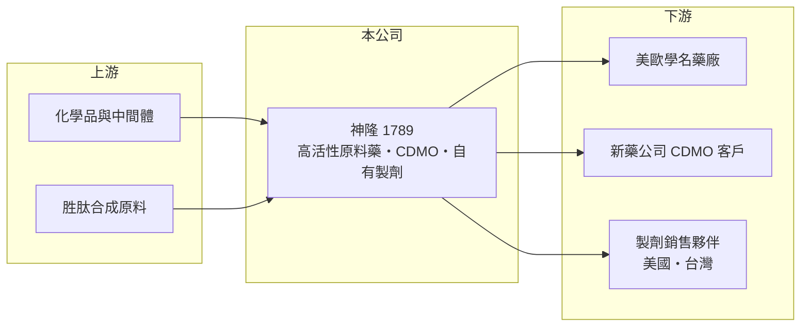

# 1789 神隆

> 上市｜[[產業索引-生技醫療業|生技醫療業]]｜上市（櫃）日期 2011/09/29

# 第一章：企業模式與商業藍圖

> [!info] 撰寫說明
> 精簡版，由 Claude 依公開資料整理，架構比照 [[2330台積電]]，資料截至 2026-10-08。來源：證交所開放資料快照（基本資料、2026 上半年損益與資產負債、股利）、Goodinfo 經營績效頁、富果 2026 年 3 月法說會備忘錄。廠區描述為憑記憶整理，已標待校對。#待校對

台灣神隆是台灣規模最大的高門檻[[原料藥]]廠，近年從單純賣原料藥，轉向[[CDMO]]與自有製劑。本章說明它的三條業務線與轉型方向。

- **核心業務：** 神隆 1997 年成立，2011 年上市，董事長由 [[1216統一]] 集團的羅智先擔任。主力是腫瘤用藥等高活性原料藥，已完成 80 項產品開發，其中 44 項為腫瘤用藥；另提供委託研發製造（CDMO），聚焦[[胜肽]]、類固醇與細胞毒性藥物；2026 年起自有製劑成為新的成長動能。
- **營收結構：** 依 2026 年 3 月法說會，2025 年營收約三分之二來自自有原料藥、三分之一來自 CDMO；腫瘤用藥占原料藥線一半以上。

- **營運據點：** 主要廠區位於台南科學園區，並在中國常熟設有生產基地（待校對）。高活性抗癌原料藥需要密閉隔離的生產環境，廠房與品質系統投資大，新進者難以快速建置。
- **長期方向：** 自有製劑已有 4 項產品取得 5 張美國與台灣藥證、另 3 項審查中；胜肽類糖尿病藥已回覆 FDA 提問，減重胜肽藥於 2026 年 2 月向 FDA 遞件。公司目標從原料供應商升級為具製劑與胜肽 CDMO 能力的整合型藥廠。

# 第二章：護城河深度與競爭優勢

神隆的護城河來自高活性藥物的製程能力與美國 FDA 查廠紀錄，本章分析這些優勢與近年的壓力。

- **競爭優勢：** 抗癌原料藥毒性高，生產需要特殊隔離設備與嚴格的人員防護，加上美國 FDA 查廠與 [[DMF]] 登錄，形成高門檻。原料藥一旦寫入客戶藥證，更換供應商需重新送審，轉換成本高。
- **主要對手：** 國際上有義大利、印度與中國的高活性原料藥廠，胜肽 CDMO 則面對國際大型 CDMO 業者。國內同業包括 [[1762中化生]]、[[1777生泰]]，但神隆在高活性領域規模較大。
- **觀察重點：** 2025 年心血管與部分癌症原料藥因客戶需求減少與價格競爭而下滑（依法說會），顯示原料藥本業正面臨價格壓力。未來觀察胜肽藥證能否取得、自有製劑能否放量，以及 CDMO 能否維持成長（2025 年 CDMO 營收約 10 億元、年增 5.1%）。

# 第三章：財務體質與盈利規模

資料日期：2026-10-08，表格是撰寫當時的快照；最新月營收、毛利率、累計 EPS 由自動排程寫在本筆記的屬性欄位（月營收、毛利率、累計EPS 等）。#待校對

神隆股本大、EPS 低，以下多年度數據可以看出它的資本報酬長期偏低。

| 年度 | 營收（億元） | [[毛利率]] | [[營業利益率]] | EPS（元） | [[ROE]] |
|---|---|---|---|---|---|
| 2020 | 30.8 | 42.7% | 12.2% | 0.36 | 2.71% |
| 2021 | 27.6 | 46.4% | 10.4% | 0.31 | 2.31% |
| 2022 | 32.6 | 38.3% | 12.4% | 0.45 | 3.37% |
| 2023 | 31.9 | 38.2% | 9.87% | 0.36 | 2.76% |
| 2024 | 34.1 | 38.2% | 9.42% | 0.43 | 3.25% |
| 2025 | 31.6 | 34.7% | 3.44% | 0.17 | 1.30% |
| 2026 上半年 | 13.4 | 26.6% | -4.25% | -0.02 | 未查得 |

- **營收規模：** 2020 至 2025 年營收幾乎持平，年複合成長約 0.5%（推算）。2026 年 1 至 8 月累計營收約 17.2 億元，年減約 13%，原料藥本業仍在調整。
- **獲利：** 毛利率從 46% 降到 2026 年上半年的 27%，營業利益在 2026 年上半年轉為虧損。2025 年營收以美元計年減 4%、台幣計年減 7%，另有約 3,000 萬元匯兌損失（依法說會）。近五年（2021 至 2025）平均 ROE 約 2.6%（推算），明顯偏低。
- **財務特色：** 2025 年度現金股利 0.29 元，高於當年 EPS 0.17 元，部分動用以前年度盈餘。2026 年第二季末權益約 104.6 億元、負債僅約 19.0 億元，財務非常穩健，但股本約 79 億元，龐大的資本基礎是 EPS 偏低的主因。
- **[[ROIC]] 與 [[WACC]]：** 2025 年營業利益約 1.09 億元（依法說會），稅後約 0.87 億元；投入資本以權益 104.6 億元加非流動負債 6.7 億元（有息負債未查得，以此近似）約 111.3 億元，ROIC 約 0.8%（推算）；2026 年上半年營業虧損，年化 ROIC 約 -0.8%（推算）。即使在 2022 年較好的年度，ROIC 也只約 3%（推算）。WACC 以無風險利率 1.75%、市場風險溢酬 6%、β 0.9（原料藥同業常見值）得權益成本約 7.2%，負債權重約 6%，WACC 約 6.8%（推算）。ROIC 長期低於 WACC，代表神隆的大量資本投入尚未換來足夠報酬，轉型製劑與胜肽是否成功，決定它能否開始創造價值。

# 第四章：總體風險與地緣政治

神隆的風險集中在原料藥價格競爭、美國政策與新藥審查，本章整理長期風險。

- **產業週期：** 學名藥原料需求隨下游專利到期與庫存週期波動，熱門品項在專利到期後幾年內價格往往大幅下滑，迫使公司不斷補充新品項。
- **營運風險：** 自有製劑與胜肽藥證取決於 FDA 審查，延誤或補件會拖延收入；製劑採銷售分潤模式，營收認列可能與實際銷售有時間差。新產品投入費用增加，短期壓抑獲利。
- **其他風險：** 主要客戶在美國，美國關稅、232 條款調查與藥價政策是重要變數；營收以美元計價，新台幣升值直接壓縮營收與毛利；常熟廠也面臨兩岸與中美政策風險。

# 專有名詞解析

## 金融

- **[[ROIC]]**：投入資本報酬率，衡量公司用股東與債權人的錢，每年賺回多少稅後營業利益。
- **[[WACC]]**：加權平均資金成本，股東與債權人要求報酬率的加權平均，是 ROIC 要跨過的門檻。

## 產業

- **[[原料藥]]**：具有藥理活性的化學成分，是製成錠劑、針劑等成品藥的原料。
- **[[CDMO]]**：委託開發暨製造服務，替藥廠從製程開發到量產一條龍代工，類似製藥業的晶圓代工。
- **[[胜肽]]**：由數個到數十個胺基酸組成的分子，GLP-1 類減重與糖尿病藥物即屬胜肽藥。
- **[[DMF]]**：藥物主檔案，原料藥廠向各國主管機關登錄製程與品質資料，讓使用其原料的製劑廠引用申請藥證。

# 核心供應鏈

- 上游：化學品、中間體與胜肽合成原料供應商（具體廠商未查得）。
- 下游／客戶：美歐[[學名藥]]廠、委託開發的新藥公司，以及自有製劑的銷售夥伴。
- 同業：[[1762中化生]]、[[1777生泰]]，國際上有印度、中國、義大利原料藥廠與大型 CDMO。
- 集團：[[1216統一]]（董事長所屬集團）。

## 最新新聞
<!-- news:start（自動產生，請勿手動編輯此範圍） -->
- 2026-10-08 📰 媒體 19:50｜營收速報 - 神隆(1789)9月營收3.09億元年增率高達74.45％｜[鉅亨網](https://news.cnyes.com/news/id/6625860)

完整紀錄：[[1789神隆 新聞]]
<!-- news:end -->

## 相關連結
- [公開資訊觀測站](https://mopsov.twse.com.tw/mops/web/t05st03?step=1&firstin=1&co_id=1789)
- [Goodinfo](https://goodinfo.tw/tw/StockDetail.asp?STOCK_ID=1789)
- [Yahoo 股市](https://tw.stock.yahoo.com/quote/1789)
- [鉅亨網新聞](https://www.cnyes.com/twstock/1789/news)
