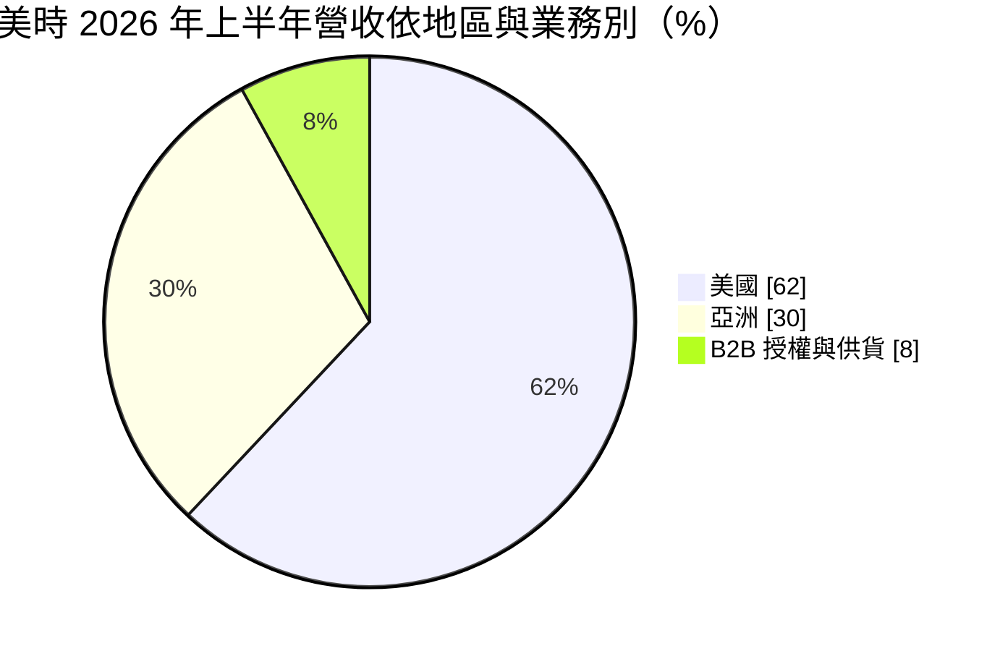
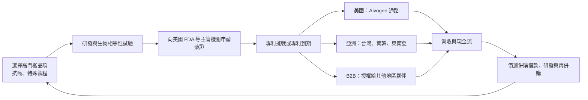
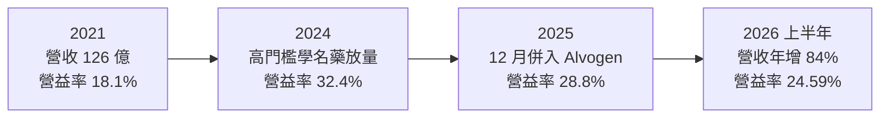
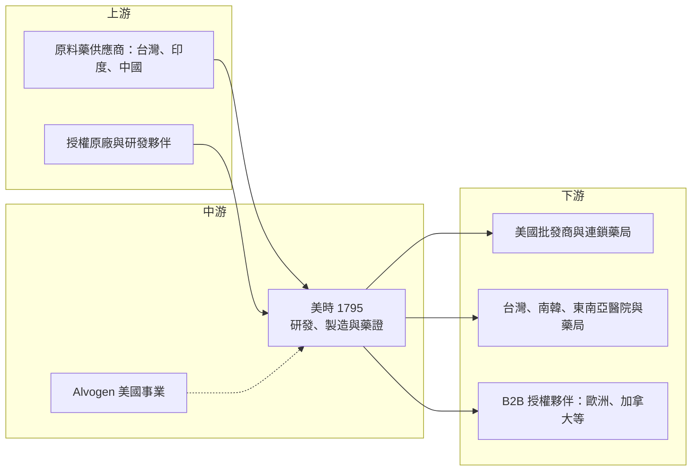

# 1795 美時

> 上市｜[[產業索引-生技醫療業|生技醫療業]]｜上市（櫃）日期 2019/12/16

# 第一章：企業模式與商業藍圖

> [!info] 撰寫說明
> 本文由 Claude 依公開資料整理，架構比照 [[2330台積電]] 的四章研究，資料截至 2026-10-08。財務數字來源：Goodinfo 年度經營績效頁、美時 2026 年第二季財務新聞稿、優分析 2026 年 1 月與 8 月報導、證交所開放資料（基本資料、2026 年第二季資產負債與綜合損益、股利）；產業描述為整理性內容，尚未逐條比對原始文件。#待校對

在評估單一個股的長期投資價值時，首要步驟是拆解企業的底層獲利邏輯。本章針對美時化學製藥（股票代號：1795，以下簡稱美時）的商業模式進行定性分析，說明這家台灣藥廠如何從本土學名藥廠，轉型為以美國與亞洲為主要市場的國際特殊學名藥公司，以及 2025 年併購 Alvogen 美國事業對它的長期意義。

## 一、核心定位：以高門檻學名藥與併購擴張的國際藥廠

美時成立於 1966 年，總部在台北，實收資本額約 27 億元。董事長 Róbert Wessman 是國際學名藥集團 Alvogen 的創辦人，總經理 Petar Vazharov 亦為外籍經理人，經營團隊與董事會具有濃厚的國際學名藥產業背景。

美時的商業模式建立在兩個支柱上：

* **高門檻[[學名藥]]：** 美時不和大量同業搶做一般學名藥，而是專注於開發難度高、競爭者少的品項，例如抗癌藥、需要特殊製程的藥品，或是率先挑戰原廠專利的[[首家學名藥]]。這類藥品上市初期競爭者少，價格與毛利都遠高於一般學名藥。美時的血癌用藥 Lenalidomide 學名藥在美國市場就是這種模式的代表。
* **併購擴張：** 美時透過併購取得市場與通路。2025 年 9 月宣布以 6.85 億美元（約新台幣 199 億元）收購 NAGH 全部股權，取得 Alvogen 美國事業，同年 12 月開始貢獻營收；2026 年再完成 Sandoz 菲律賓業務的收購。

依 2026 年第二季新聞稿，美時目前開發中專案共 135 項，產品上市 250 個品項。公司表示併購後營收與 [[EBITDA]] 預期大致倍增。

## 二、市場板塊：美國成為最大市場

依 2026 年第二季新聞稿，2026 年上半年營收結構如下：

* **美國：** 2026 年上半年營收 107.32 億元、年增 180%，占比 62%。成長主要來自整合 Alvogen 美國事業後擴大的產品組合。美國是全球最大的學名藥市場，也是高門檻學名藥最能發揮價值的地方。2026 年美國 FDA 核准美時的流感藥 Baloxavir Marboxil 學名錠劑，是 Xofluza 首款獲准的學名藥。
* **亞洲：** 營收 52.55 億元、年增 1%，占比 30%，包括台灣、南韓與東南亞，泰國與越南是主要成長動能。亞洲業務以品牌藥與授權引進的專科藥為主，例如心血管藥 VAZKEPA 取得新加坡核准，是美時在東南亞的第一張藥證。
* **B2B 授權與供貨：** 營收 14.66 億元、年增 245%，占比 8%，主要來自 Nintedanib 在美國與歐洲等約 30 個市場上市，以及 Enzalutamide 學名藥在加拿大與南韓上市。B2B 是把美時開發的產品授權或供貨給其他地區的合作夥伴，屬於輕資產的收入來源。

## 三、資本轉化邏輯：開發、專利挑戰、上市與通路

* **選題能力決定獲利：** 學名藥的獲利取決於上市時有多少競爭者。只有一兩家競爭者時，價格可以維持在原廠的數成；競爭者一多，價格可能在一兩年內跌掉九成。美時的核心能力是挑選難以仿製、競爭者少的品項。
* **通路決定規模：** 在美國賣學名藥，需要與大型批發商、連鎖藥局與[[藥品福利管理機構]]談判。收購 Alvogen 美國事業，讓美時直接擁有美國的銷售團隊與通路，不必再透過合作夥伴，可以保留更多利潤。
* **[[槓桿併購]]的取捨：** 這次併購主要以借款支應，2026 年第二季底總負債約 842.8 億元、權益總計約 243.1 億元（證交所開放資料），負債比由併購前的低水準升至約 78%。槓桿放大了營收與 EBITDA，但也帶來利息負擔與匯率風險。

## 四、企業長期藍圖

美時的長期方向可以歸納為四點。第一，整合 Alvogen 美國事業，提高美國市場的規模與通路效率。第二，延伸產品線到更高價值的領域，包括首款 [[505(b)(2)]] 口服腫瘤新藥 Cabozantinib（LP757）已獲美國 FDA 受理審查，以及透過策略合作推進 Keytruda 的[[生物相似藥]] FYB206 與[[孤兒藥]] SLX-100。第三，擴大亞洲布局，以泰國、越南、菲律賓等東南亞市場帶動亞洲業務成長。第四，優化資本結構，降低財務成本並提升財務彈性。

整體而言，美時已從台灣本土藥廠轉變為一家「以美國為主、亞洲為輔」的國際特殊學名藥公司。長期價值取決於高門檻學名藥的研發選題能否持續成功，以及併購帶來的高槓桿能否在幾年內順利降低。

# 第二章：護城河深度與競爭優勢

本章針對美時的競爭優勢進行分析，說明它在學名藥市場的護城河從何而來，以及在大型國際學名藥廠與印度藥廠的競爭下，哪些優勢守得住。

## 一、護城河的核心組成要素

* **高門檻品項的研發選題：** 美時專注抗癌藥、特殊劑型與專利挑戰的品項，這些產品需要較高的製程技術、[[生物相等性試驗]]與法律能力，一般學名藥廠不易跟進。上市初期的少數競爭者地位，是高毛利的來源。
* **美國自有通路：** 併購 Alvogen 美國事業後，美時擁有美國的銷售團隊與客戶關係。學名藥的通路由少數大型批發商與連鎖藥局主導，有穩定供貨紀錄與產品組合的供應商更容易取得合約。
* **國際經營團隊：** 董事長與經營團隊來自 Alvogen 體系，熟悉美國學名藥市場、專利訴訟與併購整合，這種人才與經驗在台灣藥廠中相當少見。
* **亞洲品牌藥與授權引進：** 在台灣、南韓與東南亞，美時以授權引進的專科藥與品牌藥經營，醫院通路關係與藥證累積需要多年時間，是區域性的進入門檻。

## 二、全球主要競爭對手格局

| 競爭對手 | 國家 | 主要重疊領域 | 與美時的比較 |
|---|---|---|---|
| Teva | 以色列 | 美國學名藥 | 全球最大學名藥廠之一，產品線與通路規模遠大於美時 |
| Sandoz | 瑞士 | 學名藥與生物相似藥 | 全球學名藥龍頭，美時收購其菲律賓業務 |
| Viatris | 美國 | 學名藥與品牌藥 | 由 Mylan 與輝瑞學名藥部門合併而成，規模龐大 |
| 太陽製藥、Dr. Reddy's 等印度藥廠 | 印度 | 美國學名藥 | 成本低、品項多，在一般學名藥價格競爭力強 |
| [[1789神隆]] | 台灣 | 抗癌[[原料藥]] | 國內抗癌原料藥廠，部分為上游供應角色 |
| [[1720生達]]、[[4123晟德]] 等 | 台灣 | 台灣學名藥市場 | 國內同業，以台灣市場為主 |

## 三、優勢轉化：守得住、守不住與觀察重點

* **守得住：** 高門檻學名藥的研發與專利挑戰能力，以及美國自有通路。只要能持續推出競爭者少的品項，美時就能維持遠高於一般學名藥廠的毛利率。
* **守不住：** 單一產品的高價期。學名藥上市後，競爭者會陸續進入，價格與營收在幾年內下滑是必然的。美時過去依賴 Lenalidomide 等少數重磅產品，產品生命週期結束後需要新產品接棒；併購 Alvogen 也帶來較多一般學名藥，使毛利率由 2025 年的 58.1% 降到 2026 年上半年的 52.2%。
* **觀察重點：** 第一，Alvogen 美國事業的整合效益與毛利率走勢；第二，負債比與財務成本能否逐年下降；第三，Cabozantinib 505(b)(2) 新藥與生物相似藥等高價值產品的上市進度。

# 第三章：財務體質與盈利規模

資料日期：2026-10-08。數字取自 Goodinfo 年度經營績效頁、美時財務新聞稿與證交所開放資料，表格是撰寫當時的快照；最新月營收、毛利率、累計 EPS 由自動排程寫在本筆記的屬性欄位（月營收、毛利率、累計EPS 等）。#待校對

財務報表是檢驗護城河是否真實存在的最終標準。本章用多年度的三率、ROE 與資本報酬，檢視美時高門檻學名藥模式的獲利品質，以及併購後的變化。

## 一、獲利能力的基石：三率

| 年度 | 營收（新台幣） | [[毛利率]] | [[營業利益率]] | EPS（元） | [[ROE]] |
|---|---|---|---|---|---|
| 2019 | 96.1 億 | 46.0% | 12.5% | 2.74 | 9.96% |
| 2020 | 107 億 | 42.8% | 15.0% | 4.22 | 12.5% |
| 2021 | 126 億 | 44.6% | 18.1% | 5.50 | 14.2% |
| 2022 | 146 億 | 53.3% | 28.1% | 11.59 | 24.2% |
| 2023 | 170 億 | 55.3% | 28.9% | 15.72 | 26.3% |
| 2024 | 186 億 | 58.8% | 32.4% | 19.35 | 26.3% |
| 2025 | 205 億 | 58.1% | 28.8% | 18.14 | 21.0% |
| 2026 上半年 | 174.5 億 | 52.22% | 24.59% | 4.65 | 未查得 |

* **[[毛利率]]：** 2019 至 2024 年毛利率從 46% 一路提高到 58.8%，反映高門檻學名藥（特別是美國的抗癌藥）占比提升。2026 年上半年降到 52.22%，原因是併入 Alvogen 美國事業後，產品組合中一般學名藥的比重增加。
* **[[營業利益率]]：** 營業利益率從 2019 年的 12.5% 提升到 2024 年的 32.4%，2026 年上半年為 24.59%。併購後營業費用年增 94%，增幅高於毛利的 60%，代表整合期間的費用負擔仍重。
* **業外與稅後：** 2026 年上半年營業利益約 42.9 億元，但業外損失約 25.8 億元（證交所開放資料），主因是併購借款的財務成本與美元升值造成的匯兌損失約 2.04 億元，加上一次性稅務項目，稅後淨利只有約 12.1 億元，年減 44%。這說明併購後的獲利能力，需要分成營業利益與財務成本兩層來看。
* **營收趨勢：** 2019 至 2025 年營收從 96.1 億元成長到 205 億元，2021 至 2025 年營收年複合成長率約 12.9%（推算），2026 年上半年因併購再年增 84%。

## 二、[[ROE]]：資本效率

2021 至 2025 年平均 ROE 約 22.4%（推算），2022 至 2024 年連續三年超過 24%，是台灣藥廠中少見的高水準。每股淨值從 2019 年的 31.85 元成長到 2025 年的 90.48 元，六年成長近兩倍。併購後 ROE 的結構改變了：過去的高 ROE 來自高利潤率與低負債，未來則更多依賴財務槓桿，獲利若因利息與匯率而波動，ROE 的波動也會放大。

## 三、資本支出、自由現金流與股利

美時本身的資本支出以研發與製造設備為主，併購前自由現金流長期為正（推估，具體金額未查得）；2025 年的 6.85 億美元併購則是一次性的大額投資。股利方面，2025 年度配發現金股利每股 2.56 元，並經股東會通過增資配股（證交所股利資料），以 EPS 18.14 元計算，現金配發率約 14%（推算）。Goodinfo 統計長期一般平均現金股利約 1.03 元。低現金配息、保留盈餘用於併購與償債，符合美時以成長與併購為優先的資本配置習慣。

## 四、[[ROIC]] 與 [[WACC]]：價值創造利差

**ROIC 推算：** 併購前以 2024 年估算，營業利益約 60.3 億元（營收 186 億元 × 32.4%），扣除 20% 稅率後約 48.2 億元；股東權益約 208 億元（每股淨值 79.81 元 × 約 2.6 億股，推估），加上有息負債約 100 億元（推估），投入資本約 308 億元，ROIC 約 15.6%（推算）。併購後以 2026 年上半年營業利益約 42.9 億元年化（約 85.8 億元，稅後約 68.7 億元），權益總計約 243.1 億元，假設總負債 842.8 億元中約七成為有息負債（推估，約 590 億元），投入資本約 833 億元，ROIC 約 8.2%（推算）。

**WACC 推算：** 假設台灣 10 年期公債殖利率 1.75%、市場風險溢酬 6%，併購後財務槓桿提高，β 取 1.0（製藥股常見值約 0.8，因槓桿上調），股東權益成本約 7.75%。併購借款以美元計價，負債成本假設 4%（推估），稅後約 3.2%。以市值計算權益（股價淨值比約 1.93 倍，權益市值約 469 億元），權益約占 44%、負債約占 56%，WACC 約 5.2%（推算）。

**結論：** 併購前美時的 ROIC 約 15%，遠高於資金成本，是典型的價值創造型公司；併購後 ROIC 降到約 8%，仍高於約 5.2% 的資金成本，但利差明顯縮小。這次併購的長期成敗，取決於 Alvogen 美國事業的整合效益能否把 ROIC 拉回兩位數，以及借款能否逐年償還、降低財務成本。若整合不順或學名藥價格下滑過快，利差可能進一步收窄。

# 第四章：總體風險與地緣政治

任何企業都無法脫離宏觀環境獨立存在。本章分析美時長期必須面對的地緣政治、產業結構、營運與法規風險。

## 一、地緣政治

* **美國藥品關稅與在地製造政策：** 美國是美時最大的市場，美國政府對進口藥品的關稅與在地製造要求，可能影響成本與定價。財經報導指出，併購 Alvogen 美國事業有助於深化美國布局、降低關稅影響，但政策走向仍有不確定性。
* **原料藥供應鏈：** 全球學名藥的原料藥大量依賴中國與印度，地緣政治緊張或出口限制可能影響原料供應與成本。
* **東南亞市場：** 泰國、越南、菲律賓等市場的政治與法規環境各不相同，擴張過程中需要面對不同的藥價政策與審批制度。

## 二、產業週期與市場結構

* **學名藥價格下滑：** 美國學名藥市場由少數大型採購聯盟主導，議價能力強，學名藥價格長期呈下滑趨勢。單一產品上市後，競爭者進入會使價格快速下跌。
* **產品生命週期：** 高門檻學名藥的高價期通常只有幾年，美時需要持續推出新產品接棒，否則營收與毛利會隨舊產品老化而下滑。
* **藥品福利管理機構與保險：** 美國藥品的最終價格受保險公司與藥品福利管理機構影響，政策改革可能改變學名藥的定價環境。

## 三、營運環境的隱性風險

* **高財務槓桿：** 併購後負債比約 78%，利率上升或獲利下滑時，財務成本會壓縮淨利，償債壓力也會限制未來的投資與配息彈性。
* **匯率：** 美國營收占六成以上，借款也以美元為主，美元與新台幣的匯率變動會同時影響營收換算與匯兌損益，2026 年上半年就因美元升值產生約 2.04 億元匯損。
* **整合風險：** 跨國併購的整合包括系統、人員、通路與產品線的調整，整合不順可能造成費用增加或客戶流失。
* **專利訴訟：** 挑戰原廠專利是高門檻學名藥的核心策略，但訴訟結果不確定，敗訴可能導致產品延後上市或需要支付賠償。

## 四、科技與法規演進

* **美國 FDA 審查與查廠：** 學名藥上市需要 FDA 核准，工廠也需要通過 FDA 查核，查廠發現缺失可能導致產品無法出貨。
* **生物相似藥與新藥：** 美時正從小分子學名藥延伸到生物相似藥與 505(b)(2) 新藥，這些產品的開發成本與技術門檻更高，成功能帶來更高的毛利，失敗也會造成較大的研發損失。
* **藥價政策：** 美國的藥價改革、台灣健保藥價調整與各國的藥價管制，都會直接影響學名藥與品牌藥的獲利空間。

# 專有名詞解析

## 金融

- **[[EBITDA]]**：稅息折舊及攤銷前利潤，常用於衡量併購後企業的營運現金創造能力與償債能力。
- **[[槓桿併購]]**：主要以借款支應收購資金的併購方式，可放大報酬，但也提高財務風險。
- **[[毛利率]]**：營業毛利占營收的比例，反映產品定價能力與生產成本控制。
- **[[ROE]]**：股東權益報酬率，稅後淨利除以股東權益，衡量公司運用股東資金的效率。
- **[[ROIC]]**：投入資本報酬率，稅後營業利益除以股東權益與有息負債的合計，衡量本業對所有資金提供者的報酬。
- **[[WACC]]**：加權平均資金成本，依股東權益與負債的比重加權計算的資金成本，ROIC 高於它才代表創造價值。

## 產業

- **[[學名藥]]**：原廠藥專利到期後，由其他藥廠生產、成分與療效相同的藥品，價格通常遠低於原廠藥。
- **[[首家學名藥]]**：第一個獲准上市的學名藥，在美國可能享有一段市場獨占期，價格與毛利遠高於後續競爭者。
- **[[生物相等性試驗]]**：比較學名藥與原廠藥在人體內吸收程度的試驗，是學名藥取得藥證的必要條件。
- **[[505(b)(2)]]**：美國 FDA 的新藥申請途徑，可引用既有藥品的資料，用於新劑型、新配方等改良型新藥。
- **[[生物相似藥]]**：與已上市生物藥高度相似的藥品，開發難度與成本高於小分子學名藥。
- **[[孤兒藥]]**：治療罕見疾病的藥品，患者人數少，各國常給予市場獨占期等獎勵措施。
- **[[原料藥]]**：藥品中具有療效的活性成分，製劑廠購入後再加工成錠劑、膠囊等成品。
- **[[藥品福利管理機構]]**：美國替保險公司與雇主管理處方藥給付的中介機構，簡稱 PBM，對藥價影響很大。

# 核心供應鏈

## 1. 上游：原料藥與授權夥伴
- 原料藥：[[1789神隆]]等台灣原料藥廠，以及印度、中國供應商（個別供貨關係本文未查證）
- 授權引進的專科藥原廠與生物相似藥合作夥伴

## 2. 中游：美時本身與子公司
- Alvogen 美國事業（2025 年收購 NAGH 取得）
- Sandoz 菲律賓業務（2026 年完成收購）

## 3. 下游：通路與客戶
- 美國大型藥品批發商、連鎖藥局與藥品福利管理機構
- 台灣、南韓、泰國、越南、菲律賓的醫院與藥局
- B2B 授權與供貨夥伴（Nintedanib、Enzalutamide 等產品的海外市場）

## 4. 同業
- 台灣：[[1720生達]]、[[4123晟德]]
- 國際：Teva、Sandoz、Viatris、印度學名藥廠

## 最新新聞
<!-- news:start（自動產生，請勿手動編輯此範圍） -->
- 2026-10-07 📰 媒體 10:48｜美時完成收購韓國UroVaxom藥證 強化泌尿與感染預防專科藥品｜[鉅亨網](https://news.cnyes.com/news/id/6623485)

完整紀錄：[[1795美時 新聞]]
<!-- news:end -->

## 相關連結
- [公開資訊觀測站](https://mopsov.twse.com.tw/mops/web/t05st03?step=1&firstin=1&co_id=1795)
- [Goodinfo](https://goodinfo.tw/tw/StockDetail.asp?STOCK_ID=1795)
- [Yahoo 股市](https://tw.stock.yahoo.com/quote/1795)
- [鉅亨網新聞](https://www.cnyes.com/twstock/1795/news)
