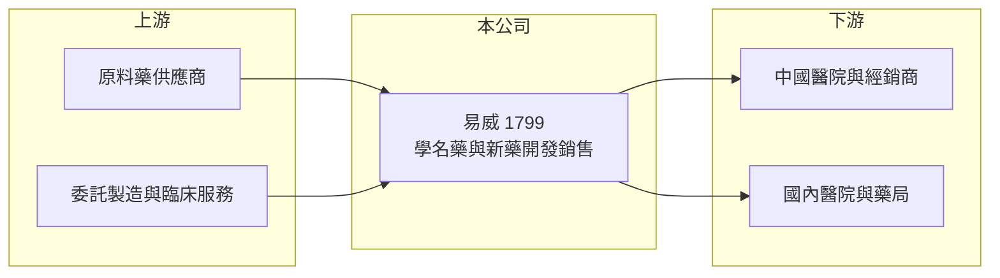

# 1799 易威

> 上櫃｜[[產業索引-生技醫療業|生技醫療業]]｜上市（櫃）日期 2008/11/10

# 第一章：企業模式與商業藍圖

> [!info] 撰寫說明
> 精簡版，由 Claude 依公開資料整理，架構比照 [[2330台積電]]，資料截至 2026-10-08。來源：櫃買中心開放資料快照（基本資料、2026 上半年損益與資產負債、每月營收備註）、Goodinfo 經營績效頁、nstock 公司簡介。公開資料有限，產品清單、子公司與授權細節未查得。#待校對

易威生醫是從醫材公司轉型為[[學名藥]]與新藥開發的小型藥廠，本章說明它的轉型過程與目前的商業模式。

- **核心業務：** 易威 1998 年成立，原名紅電醫學科技，2008 年在櫃買中心掛牌，現在的主要業務是學名藥與新藥的開發、製造與銷售。公司位於新竹科學園區，屬於規模較小、仍在建立產品線的藥廠。
- **營收結構：** 公開資料未查得產品別比重。依 2026 年 8 月營收公告的備註，營收成長來自新藥與學名藥產品出貨增加，代表兩條產品線都已開始貢獻營收。2023 年底報導其慢性心臟衰竭用藥取得中國藥證，預計 2024 年起銷售（依 nstock 所列新聞）。
- **營運據點：** 總部位於新竹科學園區，生產與子公司據點未查得（待校對）。合併報表有少量非控制權益，代表旗下有非全資子公司。
- **長期方向：** 2022 至 2025 年營收從約 1.8 億元成長到約 6 億元，2026 年 1 至 8 月累計約 6.39 億元、年增約 78%，已超越前一年全年。公司正從長期虧損的研發型公司，走向靠產品銷售養活自己的階段。

# 第二章：護城河深度與競爭優勢

小型藥廠的護城河取決於藥證組合與市場准入，本章評估易威目前的競爭位置。

- **競爭優勢：** 取得中國等海外藥證需要多年法規作業，已取證的產品具有一定的先行優勢。毛利率從 2021 年的約 26% 提升到 2023 年以後的 47% 至 63%，顯示產品組合已轉向較高價值的藥品。
- **主要對手：** 國內學名藥與新藥同業眾多，例如 [[4123晟德]]、[[1720生達]]（產品領域不完全相同，僅為國內藥廠參考），中國市場則面對大量本土學名藥廠與[[集中採購]]的價格壓力。
- **觀察重點：** 營收快速成長能否帶來穩定的營業利益、中國市場集中採購對售價的影響，以及股本變動對每股獲利的稀釋。

# 第三章：財務體質與盈利規模

資料日期：2026-10-08，表格是撰寫當時的快照；最新月營收、毛利率、累計 EPS 由自動排程寫在本筆記的屬性欄位（月營收、毛利率、累計EPS 等）。#待校對

易威過去多年虧損，2026 年上半年才首度出現小幅營業利益，以下數據呈現它的轉型軌跡。

| 年度 | 營收（億元） | [[毛利率]] | [[營業利益率]] | EPS（元） | [[ROE]] |
|---|---|---|---|---|---|
| 2020 | 2.68 | 31.4% | -59.4% | -1.30 | -25.3% |
| 2021 | 1.97 | 25.6% | -107% | -0.99 | -20.4% |
| 2022 | 1.79 | 42.7% | -90.1% | -1.41 | -20.0% |
| 2023 | 2.72 | 62.8% | -59.9% | -1.27 | -24.4% |
| 2024 | 5.40 | 55.4% | -13.8% | -0.81 | -13.0% |
| 2025 | 5.97 | 46.9% | -11.2% | -0.59 | -10.5% |
| 2026 上半年 | 4.63 | 47.8% | 4.1% | 0.06 | 未查得 |

- **營收規模：** 2020 至 2025 年營收年複合成長約 17%（推算），主要成長集中在 2024 年以後。營收規模擴大讓營業虧損率從 -107% 一路收斂，2026 年上半年轉為正值。
- **獲利：** 近五年（2021 至 2025）平均 ROE 約 -18%（推算），每年都在虧損。2026 年上半年營業利益約 0.19 億元、歸屬母公司淨利約 0.08 億元，是轉折的訊號，但規模仍小。
- **財務特色：** 長期虧損未配息。2026 年第二季末權益約 7.2 億元，保留盈餘約 -6.1 億元，累積虧損已達股本一半左右；負債約 5.7 億元。官方基本資料登載的實收資本額約 24.9 億元，高於第二季資產負債表的股本約 12.5 億元，可能在第二季後有增資或[[私募]]（基本資料列私募股數約 7,700 萬股），細節待校對。
- **[[ROIC]] 與 [[WACC]]：** 2025 年營業利益約 -0.67 億元（5.97 億 × -11.2%），稅後約 -0.53 億元；投入資本以權益 7.2 億元加非流動負債 3.0 億元（有息負債未查得，以此近似）約 10.3 億元，2025 年 ROIC 約 -5.2%（推算）；以 2026 年上半年年化約 3.0%（推算）。WACC 以無風險利率 1.75%、市場風險溢酬 6%、β 1.1（虧損型生技股，取較高值）得權益成本約 8.4%，負債成本 2.5%、稅率 20%、負債權重約 30%，WACC 約 6.5%（推算）。ROIC 長期為負，代表過去的研發投入尚未回收；即使 2026 年轉正，仍低於資金成本，要持續放大營收才能開始創造價值。

# 第四章：總體風險與地緣政治

轉型中的小型藥廠風險高，本章整理易威的主要長期風險。

- **產業週期：** 學名藥價格隨競爭者增加而下滑，中國市場的集中採購更可能讓單一產品價格一次大幅下降，營收成長不等於獲利成長。
- **營運風險：** 產品線仍少，對少數藥證與市場的依賴度高；若主要產品在中國的銷售受阻，營收會明顯回落。累積虧損大，未來仍可能需要增資，稀釋既有股東。
- **其他風險：** 兩岸關係與中國藥政法規變化直接影響海外營收；匯率波動與研發失敗也是生技公司的常態風險。

# 專有名詞解析

## 金融

- **[[ROIC]]**：投入資本報酬率，衡量公司用股東與債權人的錢，每年賺回多少稅後營業利益。
- **[[WACC]]**：加權平均資金成本，股東與債權人要求報酬率的加權平均，是 ROIC 要跨過的門檻。

## 產業

- **[[學名藥]]**：原廠藥專利到期後，由其他藥廠以相同成分、劑型生產的藥品，價格較低、競爭較激烈。
- **[[集中採購]]**：中國政府以量換價的藥品招標制度，得標廠商取得大量訂單但售價常大幅下降。
- **[[私募]]**：公司不公開發行、直接向特定人募集股份的增資方式，常用於引進策略投資人。

# 核心供應鏈

- 上游：[[原料藥]]供應商、委託製造與臨床試驗服務業者（具體廠商未查得）。
- 下游／客戶：中國與國內的醫院、經銷商（客戶名稱未查得）。
- 同業：[[4123晟德]]、[[1720生達]] 等國內藥廠。

## 最新新聞
<!-- news:start（自動產生，請勿手動編輯此範圍） -->
- 2026-10-08 📰 媒體 18:21｜營收速報 - 易威(1799)9月營收1.38億元年增率高達80.64％｜[鉅亨網](https://news.cnyes.com/news/id/6625149)

完整紀錄：[[1799易威 新聞]]
<!-- news:end -->

## 相關連結
- [公開資訊觀測站](https://mopsov.twse.com.tw/mops/web/t05st03?step=1&firstin=1&co_id=1799)
- [Goodinfo](https://goodinfo.tw/tw/StockDetail.asp?STOCK_ID=1799)
- [Yahoo 股市](https://tw.stock.yahoo.com/quote/1799)
- [鉅亨網新聞](https://www.cnyes.com/twstock/1799/news)
