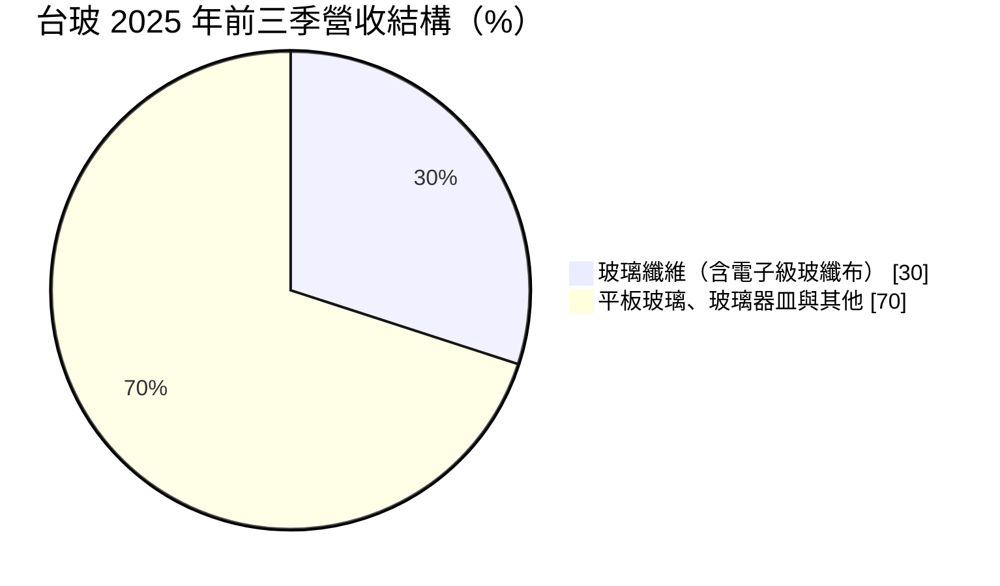
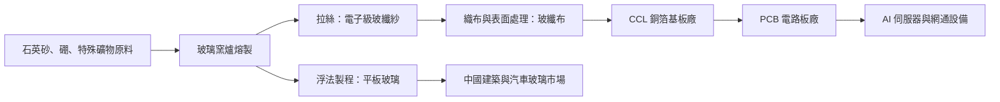
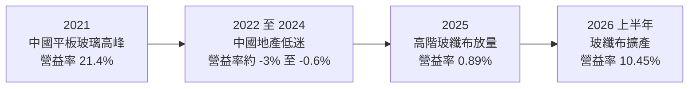
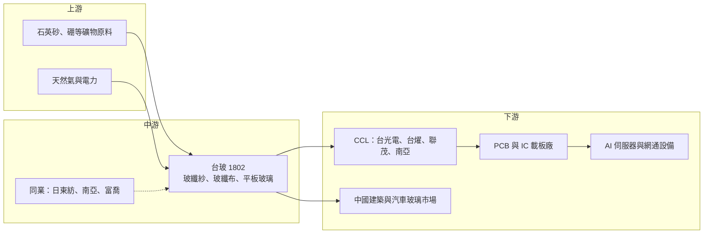

# 1802 台玻

> 上市｜[[產業索引-玻璃陶瓷|玻璃陶瓷]]｜上市（櫃）日期 1973/07/20

# 第一章：企業模式與商業藍圖

> [!info] 撰寫說明
> 本文由 Claude 依公開資料整理，架構比照 [[2330台積電]] 的四章研究，資料截至 2026-10-08。財務數字來源：Goodinfo 年度經營績效頁、富果研究 2025 年 11 月法說會整理、聯合報 2025 年 11 月法說會報導、優分析 2026 年 9 月報導、證交所開放資料（基本資料、2026 年第二季資產負債與綜合損益、股利）；產業描述為整理性內容，尚未逐條比對原始文件。#待校對

在評估單一個股的長期投資價值時，首要步驟是拆解企業的底層獲利邏輯。本章針對台灣玻璃工業（股票代號：1802，以下簡稱台玻）的商業模式進行定性分析，說明這家以平板玻璃起家的傳統產業公司，如何因為 AI 伺服器帶動的高階[[玻纖布]]需求，從長期虧損的建材股轉變為電子材料供應商。

## 一、核心定位：從建築玻璃轉向電子材料的玻璃集團

台玻成立於 1964 年，由林氏家族經營，董事長林伯豐，實收資本額約 290.8 億元。台玻是台灣最大的玻璃製造商，業務橫跨三大領域：平板玻璃（建築與汽車用）、玻璃纖維（含電子級玻纖布）與玻璃器皿。平板玻璃的主要市場在中國，台玻在中國多個省份設有生產基地。

過去數十年，台玻的獲利主要隨中國房地產與建築玻璃景氣起伏。2021 年中國平板玻璃價格大漲，台玻當年 EPS 達 3.95 元；之後中國房地產長期低迷，平板玻璃轉為虧損，台玻在 2022 至 2025 年連續四年 EPS 為負或接近零。

轉折點來自玻纖布。玻纖布是 [[CCL]]（銅箔基板）與 [[PCB]]（印刷電路板）的補強材料，AI 伺服器需要高速、低訊號損耗的電路板，帶動 [[Low-Dk 玻纖布]] 與 [[Low CTE 玻纖布]] 的需求大爆發。台玻在 2018 年完成第一代 Low-Dk 開發，2023 年完成第二代 Low-Dk 與 Low CTE 開發，因為提前布局，在這波需求中成為全球第二大的高階玻纖布供應商。

## 二、產品板塊：玻纖占比快速提升

依富果研究整理的法說會資料，玻纖業務的營收占比從 2024 年的 23% 提高到 2025 年前三季的 30%：

* **電子級玻纖布：** 台玻成長最快、獲利最好的業務。2025 年前三季玻纖布營收 93.1 億元、獲利約 10 億元。高階產品包括第一代、第二代 Low-Dk 與 Low CTE 玻纖布，產能滿載，訂單能見度延伸到 2027 年。優分析 2026 年 9 月報導指出，高階玻纖布產線由 4 條擴增至 12 條，法人預期玻纖布營收占比在 2026 年底可能超過五成。
* **平板玻璃：** 以中國市場為主，用於建築與汽車。2025 年前三季平板玻璃部門營業虧損約 12 億元，主因是中國房地產低迷。中國工信部在 2025 年發布建材行業穩增長方案，嚴控玻璃產能、淘汰落後產能，長期可能改善供需，但時程不確定。
* **玻璃器皿：** 外銷美國以客製化、高單價商品為主，關稅成本大多可轉嫁；台灣內銷則面臨同業轉向內銷搶單的價格競爭。
* **玻璃纖維（FRP 用途）：** 用於複合材料等工業用途，全球需求尚未好轉。

## 三、資本轉化邏輯：窯爐、紗、布與客戶認證

* **[[窯爐]]是核心資產：** 不論平板玻璃或玻纖紗，都需要高溫窯爐連續生產，窯爐一旦點火就要長期運轉，停爐重啟成本很高。這讓玻璃業具有高固定成本與高營運槓桿的特性，產能利用率對獲利影響很大。
* **配方與製程是門檻：** Low-Dk 玻纖需要特殊的玻璃配方，降低介電常數與介電損耗，同時維持拉絲與織布的良率。這需要多年的材料研發與製程調校，不是一般玻纖廠可以立即量產。
* **客戶認證綁定：** 高階玻纖布要先通過 CCL 廠、PCB 廠，最後還要通過伺服器品牌與晶片廠的材料認證，認證週期長，一旦進入供應鏈就不容易被替換。
* **擴產速度是競爭力：** 法說會提到台玻擴產約需 1.5 年，對手約需 3 年。在供不應求的市場中，能更快開出產能，就能搶下更多客戶認證與市占。

## 四、企業長期藍圖

台玻的長期策略很明確：把資本支出集中在台灣的高階玻纖布產能，目標是把高階市場市占從 20% 至 25% 提升到 40%，同時控制平板玻璃的虧損。平板玻璃方面，公司以產品技術優勢、降本增效與高附加價值產品因應中國市場的不確定性。

整體而言，台玻正在經歷一次產業屬性的轉換：從受中國房地產主導的建材股，轉變為受 AI 伺服器與高速運算主導的電子材料股。長期價值取決於高階玻纖布能否持續維持技術領先與產能優勢，以及平板玻璃的虧損能否收斂。

# 第二章：護城河深度與競爭優勢

本章針對台玻的競爭優勢進行分析，說明它在高階玻纖布市場的護城河從何而來，以及在日本龍頭與中國大廠的夾擊下，哪些優勢守得住。

## 一、護城河的核心組成要素

* **材料配方的先行優勢：** 台玻在 2018 年就完成第一代 Low-Dk 開發，2023 年完成第二代 Low-Dk 與 Low CTE，比多數競爭者早了數年。AI 伺服器需求爆發時，台玻已經有通過認證的產品可以供貨，這種時間優勢在材料產業非常關鍵。
* **垂直整合：** 台玻同時擁有玻璃熔製、拉絲與織布能力，從玻纖紗到玻纖布一條龍生產，比只做織布的業者更能控制品質與原料供應。法說會提到，因為提前布局，台玻在原料短缺時仍能供貨。
* **擴產速度：** 台玻擴產約 1.5 年，比競爭者的約 3 年快一倍。在需求快速成長的時期，擴產速度直接轉化為市占。
* **客戶認證：** 高階玻纖布需要通過 CCL、PCB 與終端客戶的層層認證，已經進入供應鏈的業者享有轉換成本的保護。

## 二、全球主要競爭對手格局

| 競爭對手 | 國家 | 主要重疊領域 | 與台玻的比較 |
|---|---|---|---|
| 日東紡（Nittobo） | 日本 | 高階 Low-Dk、Low CTE 玻纖布 | 全球高階玻纖布龍頭，技術與市占領先 |
| [[1303南亞]] | 台灣 | 玻纖紗、玻纖布與 CCL | 台塑集團，垂直整合到 CCL，規模大 |
| [[1815富喬]] | 台灣 | 玻纖紗與玻纖布 | 國內同業，積極切入高階產品 |
| 中國巨石 | 中國 | 玻纖紗 | 全球最大玻纖紗廠，以一般規格為主 |
| 建滔積層板 | 中國香港 | 玻纖布與 CCL | 中國 CCL 龍頭，垂直整合 |
| 信義玻璃、旗濱集團 | 中國 | 平板玻璃 | 中國平板玻璃主要業者，規模與成本優勢明顯 |

## 三、優勢轉化：守得住、守不住與觀察重點

* **守得住：** 高階 Low-Dk 與 Low CTE 玻纖布的地位。材料配方、認證與擴產速度三者結合，使台玻在未來幾年仍可望維持全球第二大高階供應商的位置。
* **守不住：** 中國平板玻璃的價格。平板玻璃是高度同質化的產品，中國產能過剩、房地產低迷，台玻作為外資業者沒有定價權，只能等待產能出清。
* **觀察重點：** 第一，12 條高階產線的良率與產能爬坡；第二，下一代材料（例如[[石英玻纖布]]）的開發進度，因為 AI 伺服器的規格升級可能讓現有 Low-Dk 產品被更高階的材料取代；第三，中國平板玻璃產能控制政策能否讓虧損收斂。

# 第三章：財務體質與盈利規模

資料日期：2026-10-08。數字取自 Goodinfo 年度經營績效頁、富果研究法說會整理與證交所開放資料，表格是撰寫當時的快照；最新月營收、毛利率、累計 EPS 由自動排程寫在本筆記的屬性欄位（月營收、毛利率、累計EPS 等）。#待校對

財務報表是檢驗護城河是否真實存在的最終標準。本章用十年的三率、ROE 與資本報酬，檢視台玻從建材循環走向電子材料的獲利變化。

## 一、獲利能力的基石：三率

| 年度 | 營收（新台幣） | [[毛利率]] | [[營業利益率]] | EPS（元） | [[ROE]] |
|---|---|---|---|---|---|
| 2019 | 418 億 | 8.39% | -2.20% | -0.50 | -3.53% |
| 2020 | 418 億 | 16.8% | 6.01% | 0.85 | 5.46% |
| 2021 | 536 億 | 32.2% | 21.4% | 3.95 | 23.4% |
| 2022 | 439 億 | 10.2% | -1.70% | -0.25 | -1.50% |
| 2023 | 456 億 | 10.0% | -0.61% | 0.01 | 0.05% |
| 2024 | 425 億 | 8.64% | -3.03% | -0.54 | -3.44% |
| 2025 | 415 億 | 11.6% | 0.89% | -0.20 | -1.39% |
| 2026 上半年 | 223.1 億 | 21.44% | 10.45% | 0.64 | 未查得 |

* **[[毛利率]]：** 2019 至 2025 年，台玻的毛利率大多在 8% 至 17% 之間，只有 2021 年中國平板玻璃大漲時達到 32.2%。2026 年上半年毛利率回到 21.44%，這次的推動力不是平板玻璃，而是高階玻纖布的占比提升，代表獲利結構正在改變。
* **[[營業利益率]]：** 玻璃業的固定成本高，毛利率在 10% 左右時營業利益接近損益兩平，毛利率每提高幾個百分點，營業利益率就會大幅擴張。2026 年上半年營業利益率 10.45%，是 2021 年以來的最高水準。
* **營收趨勢：** 2016 年營收 431 億元，2025 年為 415 億元，十年間大致持平；2021 至 2025 年營收年複合成長率約 -6.2%（推算），主因是 2021 年的高基期與中國平板玻璃的萎縮。

## 二、[[ROE]]：資本效率

2021 至 2025 年平均 ROE 約 3.4%（推算），而且這個平均主要由 2021 年的 23.4% 撐起，其餘四年都在零附近或為負。2016 至 2025 年十年間，ROE 超過 10% 的只有 2021 年一年，說明台玻過去是典型的低報酬景氣循環股。每股淨值長期在 14 至 19 元之間，2025 年為 16.37 元。2026 年第二季底總負債約 391.4 億元、權益總計約 545.6 億元，負債比約 42%（證交所開放資料）。

## 三、資本支出、自由現金流與股利

台玻目前把資本支出集中在台灣的高階玻纖布產能，產線由 4 條擴增至 12 條，擴產期間資本支出明顯增加；具體金額與歷年自由現金流本文未查得。股利方面，Goodinfo 統計長期一般平均現金股利只有約 0.36 元，2025 年度因虧損未配發股利（證交所股利資料）。公司章程規定，盈餘分配不低於可分配盈餘的 50%，其中現金股利不低於 20%，若玻纖布獲利持續，配息有望恢復。

## 四、[[ROIC]] 與 [[WACC]]：價值創造利差

**ROIC 推算：** 2025 年營收 415 億元、營業利益率 0.89%，營業利益約 3.7 億元，扣除 20% 稅率後約 3.0 億元。2026 年第二季底權益總計約 545.6 億元，總負債約 391.4 億元，假設其中約 65% 為有息負債（推估，約 254 億元），投入資本約 800 億元，2025 年 ROIC 約 0.4%（推算）。若以 2026 年上半年營業利益約 23.3 億元年化（約 46.6 億元，稅後約 37.3 億元），ROIC 約 4.7%（推算）。以同樣的資本基礎估算 2021 年高峰（營業利益約 114.7 億元、稅後約 91.8 億元），ROIC 約 11.5%（推算）。

**WACC 推算：** 假設台灣 10 年期公債殖利率 1.75%、市場風險溢酬 6%、β 取景氣循環材料股常見值 1.0，股東權益成本約 7.75%。負債成本假設 2.5%，稅後約 2.0%；以帳面價值計，權益約占 68%、負債約占 32%，WACC 約 5.9%（推算）。

**結論：** 2022 至 2025 年台玻的 ROIC 遠低於資金成本，持續毀損經濟價值；2026 年上半年年化 ROIC 約 4.7%，已接近但仍略低於約 5.9% 的資金成本。只要高階玻纖布產能順利開出、平板玻璃虧損收斂，ROIC 有機會在未來幾年跨過 WACC。這是台玻從低報酬建材股轉為價值創造型材料股的關鍵門檻（推估）。

# 第四章：總體風險與地緣政治

任何企業都無法脫離宏觀環境獨立存在。本章分析台玻長期必須面對的地緣政治、產業結構、營運與技術風險。

## 一、地緣政治

* **中國資產的曝險：** 台玻的平板玻璃產能主要在中國，中國的房地產政策、產能管制與兩岸關係，都會直接影響這部分資產的價值與獲利。
* **AI 供應鏈的地緣布局：** 高階玻纖布客戶多為台灣、日本與中國的 CCL 與 PCB 廠，終端是美國的 AI 伺服器。美國對中國的科技管制可能改變 PCB 產業的生產地分布，台玻把高階產能集中在台灣，有利於服務非中國供應鏈，但也增加對台灣單一生產地的依賴。
* **美國關稅：** 玻璃器皿外銷美國，關稅成本目前大多可轉嫁，但若稅率進一步提高，可能影響訂單。

## 二、產業週期與市場結構

* **平板玻璃的長期萎縮：** 中國房地產自 2021 年起長期低迷，平板玻璃需求持續下降，產能出清緩慢，這可能是長達數年的結構性壓力。
* **玻纖布的景氣循環：** 電子級玻纖布過去也是典型的景氣循環產品，供不應求時價格大漲，各家擴產後可能轉為供過於求。目前高階玻纖布供需吃緊，法人預期到 2027 年仍看好，但若全球同業大舉擴產，2028 年以後價格可能回落。
* **AI 資本支出的週期：** 高階玻纖布的需求高度依賴雲端業者與 AI 伺服器的資本支出，若 AI 投資放緩，需求可能出現 [[長鞭效應]] 式的劇烈修正。

## 三、營運環境的隱性風險

* **擴產執行：** 產線由 4 條擴增至 12 條，新產線的良率與產能爬坡若不如預期，會影響出貨與獲利。擴產期間折舊先行增加、出貨卻逐步爬坡，獲利可能出現落差，這是材料業擴產時常見的現象。
* **原料供應：** 高階玻纖需要特殊原料，原料短缺可能限制出貨；台玻目前靠提前布局維持供貨，但這種優勢需要持續維護。
* **平板玻璃減損：** 中國平板玻璃若長期虧損，相關資產可能需要提列減損，影響帳面獲利與淨值。

## 四、科技與法規演進

* **材料世代交替：** AI 伺服器的傳輸速度持續提高，對 PCB 材料的要求也不斷升級，從第一代、第二代 Low-Dk 到更高階的石英玻纖布，產品世代約每幾年就更替一次。台玻若無法在下一代材料上保持領先，現有優勢可能被日本或中國業者超越。
* **先進封裝載板：** Low CTE 玻纖布用於 IC 載板，與 [[先進封裝]] 的發展相關。若載板技術轉向玻璃基板等新材料，玻纖布在載板中的角色可能改變，這既是風險也是機會。
* **碳排與能源：** 玻璃窯爐高耗能，台灣碳費與中國碳交易制度都會增加生產成本，減碳能力將成為長期競爭力的一部分。

# 專有名詞解析

## 半導體

- **[[先進封裝]]**：把多顆晶片以中介層等方式高密度整合的封裝技術，對載板的平整度與熱穩定性要求很高。

## 應用

- **[[HPC]]**：高效能運算，指 AI 伺服器、資料中心等需要大量運算的應用，是高階電路板材料需求的來源。

## 金融

- **[[毛利率]]**：營業毛利占營收的比例，反映產品定價能力與生產成本控制。
- **[[ROE]]**：股東權益報酬率，稅後淨利除以股東權益，衡量公司運用股東資金的效率。
- **[[ROIC]]**：投入資本報酬率，稅後營業利益除以股東權益與有息負債的合計，衡量本業對所有資金提供者的報酬。
- **[[WACC]]**：加權平均資金成本，依股東權益與負債的比重加權計算的資金成本，ROIC 高於它才代表創造價值。
- **[[長鞭效應]]**：終端需求的小幅變動，沿供應鏈往上游傳遞時被逐級放大，造成上游庫存與訂單劇烈波動。

## 產業

- **[[玻纖布]]**：以玻璃纖維紗織成的布，浸漬樹脂後作為銅箔基板與電路板的補強材料。
- **[[Low-Dk 玻纖布]]**：低介電常數玻纖布，能降低高速訊號在電路板中的延遲與損耗，是 AI 伺服器電路板的關鍵材料。
- **[[Low CTE 玻纖布]]**：低熱膨脹係數玻纖布，受熱時尺寸變化小，主要用於 IC 載板，避免晶片與載板因熱脹冷縮而翹曲。
- **[[CCL]]**：銅箔基板，把銅箔壓合在浸過樹脂的玻纖布上，是製作印刷電路板的基本材料。
- **[[PCB]]**：印刷電路板，承載並連接電子元件的板子，高速伺服器需要低損耗材料製成的多層電路板。
- **[[浮法玻璃]]**：把熔融玻璃倒在熔錫表面上攤平冷卻的製程，可生產表面平整的平板玻璃，用於建築與汽車。
- **[[窯爐]]**：高溫熔製玻璃的爐子，需長期連續運轉，停爐重啟成本高，是玻璃業高固定成本的來源。
- **[[石英玻纖布]]**：以高純度石英纖維織成的玻纖布，介電損耗更低，被視為下一代 AI 伺服器電路板材料。

# 核心供應鏈

## 1. 上游：原料與能源
- 石英砂、硼礦等玻璃原料
- 天然氣與電力（窯爐燃料）

## 2. 中游：台玻本身與玻纖同業
- 玻纖同業：[[1303南亞]]、[[1815富喬]]、日東紡、中國巨石、建滔積層板
- 平板玻璃同業：信義玻璃、旗濱集團

## 3. 下游：銅箔基板與電路板
- CCL 銅箔基板：[[2383台光電]]、[[6274台燿]]、[[6213聯茂]]、[[1303南亞]]（個別供貨關係本文未查證）
- PCB 與載板：[[3037欣興]]、[[8046南電]]、[[2368金像電]]（個別供貨關係本文未查證）

## 4. 下游：終端應用
- AI 伺服器：[[NVDA輝達]] 等晶片平台帶動的伺服器需求
- 中國建築與汽車玻璃市場

## 最新新聞
<!-- news:start（自動產生，請勿手動編輯此範圍） -->
- 2026-10-08 📰 媒體 09:30｜台玻(1802)爆量由紅翻黑、台塑(1301)逆勢續強！玻纖布與塑化行情開始分歧｜[鉅亨網](https://news.cnyes.com/news/id/6624578)

完整紀錄：[[1802台玻 新聞]]
<!-- news:end -->

## 相關連結
- [公開資訊觀測站](https://mopsov.twse.com.tw/mops/web/t05st03?step=1&firstin=1&co_id=1802)
- [Goodinfo](https://goodinfo.tw/tw/StockDetail.asp?STOCK_ID=1802)
- [Yahoo 股市](https://tw.stock.yahoo.com/quote/1802)
- [鉅亨網新聞](https://www.cnyes.com/twstock/1802/news)
