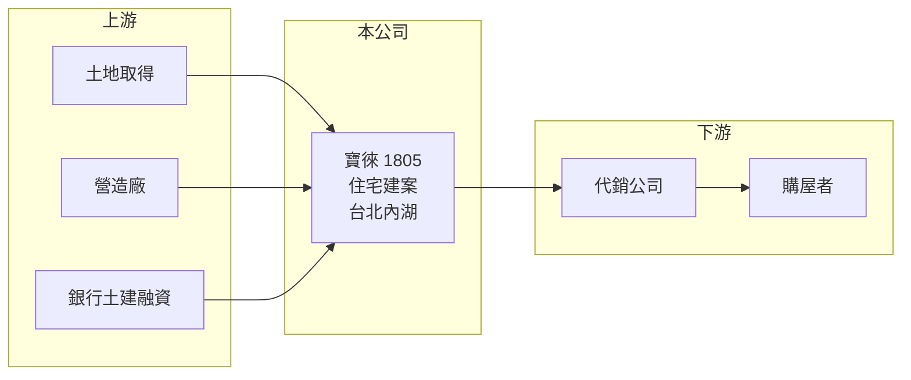

# 1805 寶徠

> 上市｜[[產業索引-建材營造業|建材營造業]]｜上市（櫃）日期 1989/10/20

# 第一章：企業模式與商業藍圖

> [!info] 撰寫說明
> 精簡版，由 Claude 依公開資料整理，架構比照 [[2330台積電]]，資料截至 2026-10-08。來源：MoneyDJ 理財網財務比率年表（2021 至 2025 年）與個股基本資料（2025 年營收比重、歷年股利）、科技新報公司資料頁與富果法說會整理頁標題。公開資料有限，建案名稱與區域、土地庫存與營收金額未查得；MoneyDJ 頁面註明 2025 年數字可能為季表累計，待以年報校對。#待校對

寶徠建設成立於 1978 年，是以營建為主的建設公司，營收約九成七來自建案銷售；近五年經歷三年虧損後在 2024 年迎來交屋大年，財務結構也隨之大幅改善。

- **核心業務：** 依 MoneyDJ 的分類，2025 年營建占 96.71%、勞務占 2.81%、租金收入占 0.48%。公司購地、規劃興建住宅並銷售，勞務收入可能來自建案相關的服務或管理（推估）。
- **營收認列：** 建案採[[預售屋]]銷售、交屋時才入帳的[[完工認列]]，營收在交屋年與空窗年差距可達數倍：2023 年營收減少 58%，2024 年成長 330%，2025 年又減少 54%。
- **營運據點：** 公司登記於台北市內湖區，推案區域本次未查得（推估以北部為主）。
- **長期方向：** 2022 至 2023 年[[毛利率]]不到 1%，代表當時交屋的建案幾乎沒有賺錢；2024 年毛利率回到 47%，2025 年 29%。公司能否持續推出高毛利建案、避免低毛利案再度出現，是長期獲利能否穩定的關鍵。

# 第二章：護城河深度與競爭優勢

寶徠的規模小、推案數少，護城河有限；它的長期表現主要取決於個別建案的土地成本與時機。

- **競爭優勢：** 小型建商的優勢在於決策快、能挑選中小型基地，靈活度較高。2024 年交屋後負債比率由 50% 降到 19%，財務彈性大幅提升，有利於下一輪購地。
- **主要對手：** 北部建商眾多，上市櫃同業例如 [[2520冠德]]、[[2548華固]]、[[2542興富發]]（推估名單），以及眾多未上市建商。
- **觀察重點：** [[合約負債]]（預售訂金）與在建工程的規模可預估未來入帳；另外要看公司是否把 2024 年的獲利用於補充土地，以及是否恢復配發股利，2022 至 2025 年度都未配息。

# 第三章：財務體質與盈利規模

資料日期：2026-10-08，表格是撰寫當時的快照；最新月營收、毛利率、累計 EPS 由自動排程寫在本筆記的屬性欄位（月營收、毛利率、累計EPS 等）。#待校對

寶徠五年中有三年虧損，獲利集中在 2024 年（EPS 2.96 元、ROE 30.8%），典型的「一個建案決定一年」。

| 年度 | 營收（年增率） | [[毛利率]] | [[營業利益率]] | EPS（元） | [[ROE]] |
|---|---|---|---|---|---|
| 2021 | 未查得（-15.6%） | 17.24% | -18.28% | -0.34 | -5.61% |
| 2022 | 未查得（+88.1%） | 0.56% | -20.90% | -1.10 | -19.23% |
| 2023 | 未查得（-58.3%） | 0.46% | -35.68% | -1.55 | -16.58% |
| 2024 | 未查得（+329.8%） | 46.91% | 32.09% | 2.96 | 30.77% |
| 2025 | 未查得（-54.4%） | 29.28% | 9.57% | 0.20 | 1.86% |

- **長期指標：** 近 5 年平均 ROE 約 -1.8%（推算）。2022 至 2025 年度均未配發現金股利。每股淨值由 2022 年的 5.03 元回升到 2025 年的 12.05 元，回升幅度大於同期累計 EPS，期間可能有現金增資（推估，待校對）。
- **[[ROIC]] 與 [[WACC]]：** 以每股計算：2025 年每股營收約 2.18 元（EPS 0.2 ÷ 稅後淨利率 9.16%），每股營業利益約 0.21 元，稅後約 0.17 元；投入資本以每股淨值 12.05 元加上每股有息負債約 1.4 元（負債比率 18.76% 換算的總負債一半）計，約 13.4 元，ROIC 約 1.2%（推算）。WACC 約 7.2%（推算：無風險利率 1.75%、市場風險溢酬 6%、β 取建設股常見值 1.0，股東權益成本約 7.75%；稅前負債成本 3%、稅率 20%；權益比重約 90%）。除了 2024 年，ROIC 多數年度低於 WACC，五年合計並未創造價值。
- **財務特色：** 負債比率由 2022 年的 61% 降到 2025 年的 19%，在建設股中非常低，代表目前在建案量也不多（推估）。

# 第四章：總體風險與地緣政治

寶徠的風險在於推案不連續與個別建案的成本控制。

- **產業週期：** 房地產週期長，推案時與交屋時的市場可能完全不同；建商在景氣高點買地，常在下一個低點交屋時吃到低毛利。
- **營運風險：** 建案數少，單一建案的成敗就決定全年獲利；2022 至 2023 年的接近零毛利，顯示營造成本上漲或售價不如預期的風險確實存在。
- **其他風險：** 央行選擇性信用管制、囤房稅與預售屋轉售限制等政策；利率上升；營造缺工與建材漲價。

# 專有名詞解析

## 金融

- **[[完工認列]]**：建案完工並交屋後才一次認列營收與獲利，使獲利集中在交屋期間。
- **[[合約負債]]**：已向客戶收取但尚未交付產品的款項，建商的預售屋訂金即屬此類，可作為未來營收的領先指標。
- **[[ROIC]]**：投入資本報酬率，稅後營業利益除以股東權益加有息負債，衡量本業運用資本的效率。
- **[[WACC]]**：加權平均資金成本，股東與債權人要求報酬率的加權平均，是 ROIC 要超越的門檻。

## 產業

- **[[預售屋]]**：房屋在興建完成前就先銷售，買方分期繳款，建商可藉此降低資金與銷售風險。

# 核心供應鏈

- 上游：土地賣方、營造廠、建材供應商與提供土建融資的銀行（名稱未查得）。
- 下游／客戶：代銷公司與購屋者。
- 同業：[[2520冠德]]、[[2548華固]]、[[2542興富發]]（推估名單）。

## 最新新聞
<!-- news:start -->
<!-- news:end -->

## 相關連結
- [公開資訊觀測站](https://mopsov.twse.com.tw/mops/web/t05st03?step=1&firstin=1&co_id=1805)
- [Goodinfo](https://goodinfo.tw/tw/StockDetail.asp?STOCK_ID=1805)
- [Yahoo 股市](https://tw.stock.yahoo.com/quote/1805)
- [鉅亨網新聞](https://www.cnyes.com/twstock/1805/news)
