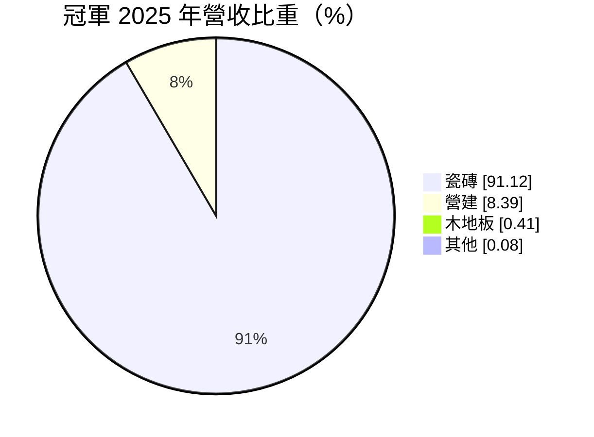
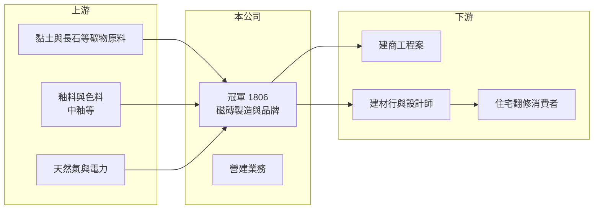

# 1806 冠軍

> 上市｜[[產業索引-玻璃陶瓷|玻璃陶瓷]]｜上市（櫃）日期 1992/09/29

# 第一章：企業模式與商業藍圖

> [!info] 撰寫說明
> 精簡版，由 Claude 依公開資料整理，架構比照 [[2330台積電]] 的四章研究，資料截至 2026-10-08。財務數字來源：Goodinfo 年度經營績效頁、MoneyDJ 個股基本資料（2025 年營收比重）、證交所開放資料（基本資料、2026 年第二季資產負債與綜合損益、營益分析、股利、本益比、每月營收）；生產據點與經營細節部分憑既有知識撰寫，已標「待校對」。公開資料有限。#待校對

本章說明冠軍建材（股票代號：1806，以下簡稱冠軍）作為台灣磁磚品牌廠的商業模式，以及營建業務在它獲利中的角色。

- **核心業務：** 冠軍成立於 1972 年，1992 年上市，董事長為林榮德，實收資本額約 39.0 億元。依 MoneyDJ 的 2025 年營收分類，瓷磚占 91.12%、營建占 8.39%、木地板占 0.41%，本業是設計、製造與銷售地壁磚，屬於台灣磁磚業的主要品牌之一。
- **營運據點：** 生產基地以苗栗竹南一帶的工廠為主（憑既有知識，待校對），產品透過建材行經銷、自有展示中心與建商工程案銷售。冠軍早年曾布局中國等海外市場，現行海外據點規模這次未查得。
- **雙引擎結構：** 磁磚銷售有兩條通路，一是建商大批採購的工程市場，二是住家翻修的零售市場。工程市場量大但價格競爭激烈，零售市場較能反映品牌價值，兩者比例會影響毛利率。
- **長期方向：** 冠軍的長期課題是以設計、[[綠建材]]與大尺寸磁磚等產品，和低價進口磚做出區隔，同時善用自有土地發展營建業務。2025 年起營收下滑、2026 年上半年轉為小幅虧損，代表轉型仍面臨考驗。

# 第二章：護城河深度與競爭優勢

本章分析冠軍的競爭優勢、面臨的壓力，以及能讓它脫離價格戰的條件。

- **競爭優勢：** 磁磚是重量大、單價低的產品，長途運輸成本高，本土工廠在交期、少量多樣與售後補貨上比進口品方便。冠軍經營品牌數十年，在建商工程案與建材行通路都有長期關係。
- **主要壓力：** 中國、越南、印度等地的進口磚價格低廉，持續侵蝕台灣中低價位市場。磁磚窯爐使用大量天然氣與電力，能源價格上漲時，本土廠的成本劣勢更明顯，2022 年後冠軍毛利率由近 29% 降到 2025 年的 22.8%。
- **主要對手：** 國內其他磁磚廠，以及來自中國、越南、印度、義大利與西班牙的進口磁磚。高階市場由歐洲品牌主導，低階市場由亞洲進口品主導，冠軍夾在中間。
- **觀察重點：** 一是能否維持營業利益為正；二是進口磚[[反傾銷稅]]等貿易措施的變化；三是營建業務與土地開發能否提供穩定的額外收益。

# 第三章：財務體質與盈利規模

資料日期：2026-10-08，表格是撰寫當時的快照；最新月營收、毛利率、累計 EPS 由自動排程寫在本筆記的屬性欄位（月營收、毛利率、累計EPS 等）。#待校對

本章用多年度的三率、ROE 與資本報酬，檢視冠軍本業的獲利能力。

| 年度 | 營收（新台幣） | [[毛利率]] | [[營業利益率]] | EPS（元） | [[ROE]] |
|---|---|---|---|---|---|
| 2020 | 36.1 億 | 19.1% | -9.71% | -0.93 | -7.04% |
| 2021 | 32.1 億 | 23.5% | 0.67% | 2.29 | 16.5% |
| 2022 | 30.1 億 | 28.7% | 8.21% | -0.45 | -3.15% |
| 2023 | 31.4 億 | 28.9% | 7.86% | 0.00 | 0.01% |
| 2024 | 34.3 億 | 25.9% | 6.22% | 0.31 | 2.17% |
| 2025 | 32.6 億 | 22.8% | 3.04% | 0.29 | 2.07% |
| 2026 上半年 | 14.4 億 | 20.64% | -0.25% | -0.06 | 未查得 |

註：2020 至 2025 年取自 Goodinfo，2026 上半年取自證交所營益分析與綜合損益。

- **營收規模：** 2020 至 2025 年營收在 30 億至 36 億元之間，年複合成長率約 -2.0%（推算）。2026 年 1 至 8 月累計營收約 18.5 億元，較去年同期減少約 19%（證交所每月營收），衰退幅度明顯。
- **獲利結構：** 冠軍的 EPS 和營業利益經常不同步。2021 年營業利益率不到 1%，EPS 卻有 2.29 元；2022 年營業利益率 8.2%，卻是虧損。這代表業外項目（推估為資產處分或投資損益，明細未查得）對淨利影響很大，判斷本業要看營業利益。
- **長期指標：** 2021 至 2025 年平均 ROE 約 3.5%（推算），且年度間正負交錯。現金股利很低，2025 年下半年每股配發 0.15 元，2026 年上半年因虧損未配發（證交所股利資料）。
- **財務特色：** 2026 年第二季底總負債約 26.9 億元、權益約 52.7 億元，負債比約 34%；每股淨值約 13.6 元，股價淨值比約 0.58 倍（證交所開放資料），市場評價明顯低於帳面價值。

**[[ROIC]] 與 [[WACC]]：** 以 2025 年營收 32.6 億元乘營業利益率 3.04%，營業利益約 0.99 億元，稅後約 0.79 億元；投入資本以權益 52.7 億元加上假設占總負債五成的有息負債約 13.4 億元，合計約 66.2 億元，ROIC 約 1.2%（推算）。WACC 以 CAPM 推估：無風險利率 1.75%、市場風險溢酬 6%、β 取建材業常見值 0.8，股東權益成本約 6.55%；負債成本 2.5%、稅後 2.0%；權益約占 80%，WACC 約 5.6%（推算）。ROIC 明顯低於 WACC，2026 年上半年本業又轉為虧損，代表冠軍目前的資本運用沒有創造價值，股價淨值比低於 1 倍也反映了這一點。

# 第四章：總體風險與地緣政治

本章分析冠軍長期面對的風險。

- **產業週期：** 磁磚需求跟著新屋完工與住宅翻修走，房市降溫會在一至兩年後反映到磁磚出貨。2026 年營收大幅衰退，顯示目前正處於需求下行階段。
- **營運風險：** 窯爐是高耗能設備，天然氣與電價上漲直接壓縮毛利；本業規模不大，固定成本攤提壓力在營收衰退時更明顯。營建業務的收入依建案完工認列，年度間波動大。
- **其他風險：** 低價進口磚的競爭可能長期存在，關稅與反傾銷措施若不延續，價格壓力更大；[[碳費]]與能源政策也可能提高窯爐的營運成本。

# 專有名詞解析

## 金融

- **[[毛利率]]**：營業毛利占營收的比例，反映產品定價能力與生產成本控制。
- **[[營業利益率]]**：扣除營業費用後的營業利益占營收的比例，衡量本業整體獲利能力。
- **[[ROE]]**：股東權益報酬率，稅後淨利除以股東權益，衡量公司運用股東資金的效率。
- **[[ROIC]]**：投入資本報酬率，稅後營業利益除以股東權益與有息負債的合計，衡量本業對所有資金提供者的報酬。
- **[[WACC]]**：加權平均資金成本，依股東權益與負債的比重加權計算的資金成本，ROIC 高於它才代表創造價值。

## 產業

- **[[綠建材]]**：經認證在生產、使用與回收過程中對環境與健康影響較低的建築材料，台灣由內政部建築研究所標章認證。
- **[[反傾銷稅]]**：進口國認定外國產品以低於正常價格出口時加徵的關稅，常用於限制特定國家的水泥、鋼鐵等產品。
- **[[碳費]]**：政府對溫室氣體排放大戶依排放量收取的費用，台灣自 2025 年起開徵，水泥、鋼鐵等產業首當其衝。

# 核心供應鏈

- 上游：黏土、長石等礦物原料，釉料與色料供應商（如 [[1809中釉]]），天然氣與電力。
- 下游／客戶：建商工程案、建材行與室內設計師、住宅翻修消費者。
- 同業：國內其他磁磚廠，中國、越南、印度與歐洲的進口磁磚品牌。

## 最新新聞
<!-- news:start -->
<!-- news:end -->

## 相關連結
- [公開資訊觀測站](https://mopsov.twse.com.tw/mops/web/t05st03?step=1&firstin=1&co_id=1806)
- [Goodinfo](https://goodinfo.tw/tw/StockDetail.asp?STOCK_ID=1806)
- [Yahoo 股市](https://tw.stock.yahoo.com/quote/1806)
- [鉅亨網新聞](https://www.cnyes.com/twstock/1806/news)
