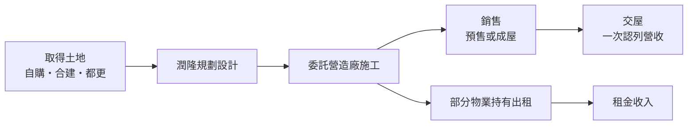
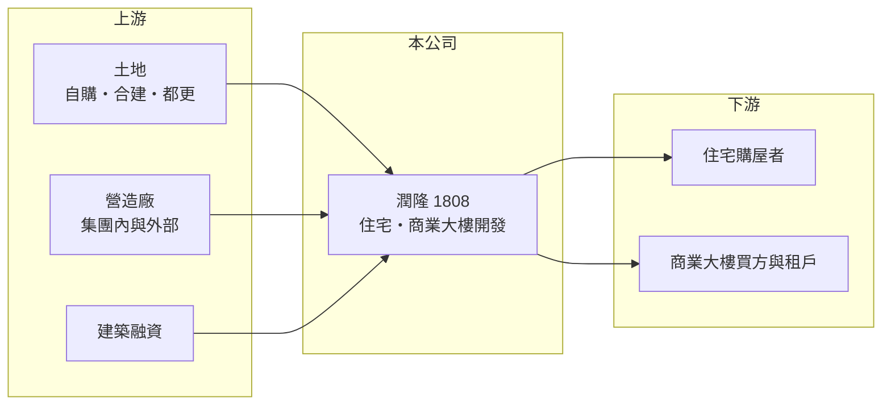

# 1808 潤隆

> 上市｜[[產業索引-建材營造業|建材營造業]]｜上市（櫃）日期 1994/10/26

# 第一章：企業模式與商業藍圖

> [!info] 撰寫說明
> 本文由 Claude 依公開資料整理，架構比照 [[2330台積電]] 的四章研究，資料截至 2026-10-08。財務數字來源：Goodinfo 年度經營績效頁、nStock 公司頁；集團關係、經營模式與產業描述為整理性內容，尚未逐條比對原始文件。公開資料有限，未查得營收比重、推案明細與已售未入帳金額。#待校對

在評估單一個股的長期投資價值時，首要步驟是拆解企業的底層獲利邏輯。本章說明潤隆建設（股票代號：1808，以下簡稱潤隆）這家委託營造廠興建住宅與商業大樓、再出售或出租的建設公司。

## 一、核心定位：委建住宅與商業大樓的開發商

潤隆成立於 1977 年、1994 年上市，主要營業項目是委託營造廠商興建住宅及商業大樓，並從事出租與出售業務。它一般被歸為潤泰集團的建設公司（集團關係為整理性內容，以年報為準）。

「委建」的意思是潤隆自己負責取得土地、規劃與銷售，施工則交給營造廠。這種模式讓建設公司不必養龐大的施工團隊，資本集中在土地與在建工程上；獲利則取決於土地取得成本、房價與營造成本之間的差距。

## 二、營收結構：銷售為主、出租為輔

公司未揭露業務別營收比重。從營收變化看，潤隆的營收在 2016 至 2025 年間介於 25 億元到 307 億元之間，起伏非常大，代表營收主要來自建案銷售，並在[[建案交屋]]時一次認列；出租收入金額相對穩定，但規模不足以平滑整體營收。

## 三、資本轉化邏輯：長週期開發與集中認列

建商從買地到交屋常需 4 至 6 年，潤隆的營收高峰因此間隔出現：2018 年營收 138 億元、2021 年 105 億元、2023 年 307 億元，其餘年度則多在 25 至 90 億元之間。2023 年是近十年最大的交屋年度，EPS 達 17.08 元、ROE 達 78.9%，但這是單一年度的集中認列，不代表常態獲利能力。

## 四、企業長期藍圖

公開資料未查得潤隆的具體推案計畫與長期策略。從 2026 年前三季累計營收約 154 億元、上半年 EPS 約 2.52 元來看，潤隆在 2026 年又進入一個交屋較集中的年度。長期而言，潤隆的價值取決於土地取得能力、集團資源的運用，以及能否維持穩定的推案與交屋節奏。

# 第二章：護城河深度與競爭優勢

「護城河」指企業抵禦競爭、維持超額利潤的保護機制。本章分析潤隆在建設業中的競爭位置。

## 一、潤隆護城河的核心組成要素

建設業進入門檻不高，潤隆的優勢主要來自兩方面。第一是集團資源：潤泰集團旗下有營造（如 [[2597潤弘]]）等相關企業，在施工品質、工期與土地資訊上可能有互補（整理性內容）。第二是長期的毛利率表現：2021 至 2025 年毛利率在 26% 至 45% 之間，顯示其交屋建案的土地成本與定價具有一定優勢。

## 二、主要競爭對手格局

| 對手 | 定位 | 對潤隆的威脅 |
|---|---|---|
| [[2501國建]] | 全台品牌建商 | 在住宅市場以品牌與規模競爭 |
| [[2520冠德]] | 雙北住宅、商辦與商場 | 在台北都會區住宅與商辦競爭 |
| [[5534長虹]] | 雙北中高價住宅 | 在中高價市場競爭 |

## 三、優勢轉化：守得住／守不住／觀察重點

守得住的是已取得土地的開發權益與較高的毛利率。守不住的是房市景氣與交屋時點造成的營收波動。長期觀察重點是後續推案量、[[已售未入帳]]金額（目前未查得），以及股本變動對每股數字的影響。

# 第三章：財務體質與盈利規模

資料日期：2026-10-08。數字取自 Goodinfo 年度經營績效與 nStock 公司頁，表格是撰寫當時的快照；最新月營收、毛利率、累計 EPS 由自動排程寫在本筆記的屬性欄位（月營收、毛利率、累計EPS 等）。#待校對

財務報表是檢驗護城河是否真實存在的最終標準。本章用五年的三率、ROE 與資本報酬，檢視潤隆的獲利品質。

## 一、獲利能力的基石：三率

| 年度 | 營收（新台幣） | [[毛利率]] | [[營業利益率]] | EPS（元） | [[ROE]] |
|---|---|---|---|---|---|
| 2021 | 105 億 | 26.1% | 19.9% | 4.26 | 28.5% |
| 2022 | 24.9 億 | 32.7% | 8.83% | 0.35 | 2.47% |
| 2023 | 307 億 | 36.8% | 30.9% | 17.08 | 78.9% |
| 2024 | 87.9 億 | 45.2% | 32.8% | 2.28 | 16.1% |
| 2025 | 65.0 億 | 38.7% | 27.4% | 1.36 | 9.50% |

潤隆的營收隨交屋年度大幅跳動，營收年複合成長率沒有參考意義。毛利率由 2016 至 2020 年的 12% 至 28%，提升到 2021 至 2025 年的 26% 至 45%，營業利益率也在 2023 至 2025 年維持約 27% 至 33%，代表近年交屋的建案獲利性明顯較好。2021 至 2025 年平均 ROE 約 27%（推算），但被 2023 年的 78.9% 大幅拉高，排除該年後平均約 14%（推算）。

## 二、營建業指標：股本變動與財務結構

股本在 2024 年由 45.1 億元增加到 99.2 億元（推估為大額盈餘轉增資配股），2025 年又降為 89.3 億元（原因未查得，推估為減資），每股淨值因此由 2023 年的 29.96 元降到 2024 年的 14.65 元。比較不同年度的 EPS 與每股淨值時，必須考慮股本變動，否則會誤判獲利趨勢。依 Goodinfo 的 ROE 與 ROA 推算，2025 年總資產約為股東權益的 3.9 倍（推算），財務槓桿在建商中偏高；已售未入帳與存貨明細未查得。

## 三、股利

依 nStock 資料，潤隆近五年平均現金股利約 1.82 元，2024 年度現金股利 2 元，2025 年度現金股利 1.5 元。股利金額隨交屋獲利起伏，但近年皆有發放。

## 四、[[ROIC]] 與 [[WACC]]：價值創造利差

**ROIC 推算：** 2025 年營業利益約 17.8 億元（65 億 × 27.4%），稅後約 14.2 億元。股東權益約 128 億元（每股淨值 14.38 元 × 約 8.93 億股），依 ROA 2.41% 推算總資產約 539 億元、總負債約 411 億元，假設六成為有息負債約 247 億元（推估），投入資本約 375 億元，ROIC 約 3.8%（推算）。以 2021 至 2025 年平均營業利益計算，ROIC 約 7%（推算），但受 2023 年單一大案影響很大。總資產推算值偏高，可能與合併範圍或平均資產口徑有關，應以財報核對。

**WACC 推算：** 台灣 10 年期公債殖利率假設 1.75%、市場風險溢酬 6%、β 取營建同業常見值 0.9，股東權益成本約 7.2%。負債成本假設 3%，稅後 2.4%；權益占投入資本約 34%（推估），WACC 約 4.0%（推算）。高槓桿下實際 β 與 WACC 可能更高。

**結論：** 潤隆在大案交屋年度的 ROIC 明顯高於 WACC，五年平均也略高於推算的資金成本，但在交屋較少的年度只與資金成本相當。由於財務槓桿偏高且資料有限，這個利差的可靠度較低，需要以年報的負債與存貨明細進一步確認。

# 第四章：總體風險與地緣政治

任何企業都無法脫離宏觀環境獨立存在。本章分析潤隆長期必須面對的產業、政策與營運風險。

## 一、產業週期與營收集中

潤隆的營收與獲利集中在少數交屋年度，景氣若在推案或交屋時轉弱，會直接影響當期銷售與獲利。房地產景氣循環長達數年，少子化與人口老化也會在長期壓抑住宅總需求。

## 二、政策與金融風險

央行[[信用管制]]、房地合一稅與預售屋相關法規，會影響買方的貸款條件與購屋意願；高財務槓桿也使潤隆對利率與建築融資條件特別敏感。

## 三、營運環境的隱性風險

委建模式依賴外部或集團內營造廠，營建成本上漲、缺工與工期延誤都會壓縮毛利。都會區土地取得成本持續上升，也會使新案的毛利率不易維持過去的水準。

## 四、資訊透明度

公開資料中未查得推案明細、已售未入帳與營收結構，投資人較難事先掌握未來營收的時點與規模。分析時應以公司年報、法說會簡報與公開資訊觀測站的交屋公告為準。

# 專有名詞解析

## 金融

- **[[信用管制]]**：央行限制購屋與建商貸款成數的政策，會影響房市成交與建商資金。
- **[[ROIC]]**：投入資本報酬率，稅後營業利益除以股東權益加有息負債，衡量本業運用資本的效率。
- **[[WACC]]**：加權平均資金成本，股東與債權人要求報酬率的加權平均，是 ROIC 要超越的門檻。

## 產業

- **[[建案交屋]]**：建商在房屋完工並交付買方時才認列營收，因此營建公司的營收常集中在交屋年度。
- **[[已售未入帳]]**：已經賣出、但尚未完工交屋而未認列營收的建案金額，是建商未來營收的主要能見度指標。

# 核心供應鏈

## 1. 上游：土地、營造與資金
- 土地來源、營造廠（集團內如 [[2597潤弘]]，整理性內容）、銀行建築融資

## 2. 中游：潤隆
- 集團相關企業：[[9945潤泰新]]、[[2915潤泰全]]（整理性內容）
- 同業：[[2501國建]]、[[2520冠德]]、[[5534長虹]]

## 3. 下游：客戶
- 住宅購屋者、商業大樓買方與租戶

## 最新新聞
<!-- news:start -->
<!-- news:end -->

## 相關連結
- [公開資訊觀測站](https://mopsov.twse.com.tw/mops/web/t05st03?step=1&firstin=1&co_id=1808)
- [Goodinfo](https://goodinfo.tw/tw/StockDetail.asp?STOCK_ID=1808)
- [Yahoo 股市](https://tw.stock.yahoo.com/quote/1808)
- [鉅亨網新聞](https://www.cnyes.com/twstock/1808/news)
