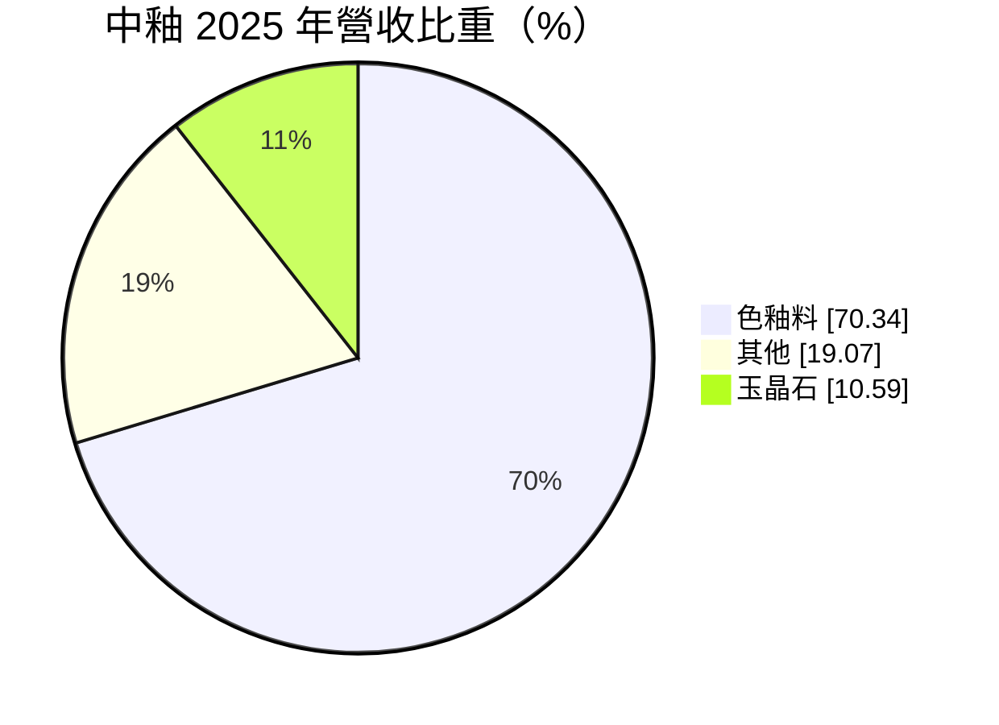
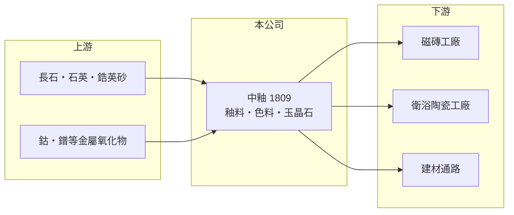

# 1809 中釉

> 上市｜[[產業索引-玻璃陶瓷|玻璃陶瓷]]｜上市（櫃）日期 1996/04/30

# 第一章：企業模式與商業藍圖

> [!info] 撰寫說明
> 精簡版，由 Claude 依公開資料整理，架構比照 [[2330台積電]] 的四章研究，資料截至 2026-10-08。財務數字來源：Goodinfo 年度經營績效頁、MoneyDJ 個股基本資料（2025 年營收比重）、證交所開放資料（基本資料、2026 年第二季資產負債與綜合損益、營益分析、股利、本益比）；海外據點與產品細節部分憑既有知識撰寫，已標「待校對」。公開資料有限。#待校對

本章說明中國製釉（股票代號：1809，以下簡稱中釉）作為陶瓷材料供應商的商業模式。它的客戶是磁磚與衛浴陶瓷工廠，因此營運跟著亞洲陶瓷業的景氣起伏。

- **核心業務：** 中釉成立於 1974 年，1996 年上市，董事長為蔡憲龍，實收資本額約 16.7 億元。公司名稱的「中國」是早年命名習慣，總部在台灣。依 MoneyDJ 的 2025 年營收分類，[[色釉料]]占 70.34%、[[玉晶石]]占 10.59%、其他占 19.07%。
- **產品角色：** 釉料是燒在磁磚與陶瓷表面的玻璃質塗層，決定產品的顏色、光澤與耐磨性；色料則是讓釉面呈現各種顏色的無機顏料。這些材料占磁磚成本的比例不高，卻直接影響成品外觀，因此客戶重視配方穩定與技術服務。
- **營運據點：** 除台灣外，中釉在中國與東南亞等陶瓷產區設有生產或銷售據點，貼近當地磁磚工廠（憑既有知識，具體國家與規模待校對）。2026 年第二季底權益總計約 33.0 億元中，非控制權益約 3.7 億元，代表有部分子公司與當地夥伴合資。
- **長期方向：** 磁磚產業逐漸從台灣、中國移往東南亞與南亞，中釉的長期成長要跟著客戶外移，並發展[[數位噴墨]]印刷用墨水等新世代材料。玉晶石屬於建材類產品，是公司在材料本業之外的延伸。

# 第二章：護城河深度與競爭優勢

本章分析中釉的競爭優勢與困境。材料供應商的護城河來自配方技術與客戶關係，但規模不足時很難抵擋國際大廠與當地低價競爭。

- **競爭優勢：** 釉料配方需要和客戶的窯爐溫度、坯體成分一起調整，換供應商就要重新試燒，因此存在一定的轉換成本。中釉在亞洲陶瓷業經營數十年，累積了大量配方資料與在地技術服務人員。
- **主要壓力：** 國際陶瓷材料大廠擁有更完整的產品線與研發資源，中國本地釉料廠則以低價競爭。中釉 2020 至 2025 年營業利益率在 -5.6% 到 1.1% 之間，代表本業長期只能勉強打平。
- **主要對手：** 西班牙、義大利的陶瓷材料大廠（如 Torrecid、Esmalglass 等），以及中國本地的釉料與色料工廠。
- **觀察重點：** 一是東南亞與南亞客戶的接單能否提升；二是數位噴墨墨水等高附加價值產品的比重；三是營業利益能否穩定轉正。

# 第三章：財務體質與盈利規模

資料日期：2026-10-08，表格是撰寫當時的快照；最新月營收、毛利率、累計 EPS 由自動排程寫在本筆記的屬性欄位（月營收、毛利率、累計EPS 等）。#待校對

本章用多年度的三率、ROE 與資本報酬，檢視中釉的獲利能力。

| 年度 | 營收（新台幣） | [[毛利率]] | [[營業利益率]] | EPS（元） | [[ROE]] |
|---|---|---|---|---|---|
| 2020 | 18.6 億 | 17.9% | -5.55% | -0.36 | -2.71% |
| 2021 | 22.0 億 | 20.1% | -0.63% | 0.25 | 0.86% |
| 2022 | 25.9 億 | 20.4% | -0.42% | 0.38 | 0.94% |
| 2023 | 23.6 億 | 15.8% | -3.11% | -0.10 | -1.65% |
| 2024 | 24.2 億 | 20.0% | 1.06% | 0.33 | 1.16% |
| 2025 | 25.0 億 | 19.9% | 1.00% | 0.19 | 0.72% |
| 2026 上半年 | 12.0 億 | 20.35% | 1.01% | 0.10 | 未查得 |

註：2020 至 2025 年取自 Goodinfo，2026 上半年取自證交所營益分析與綜合損益。

- **營收規模：** 2020 至 2025 年營收由 18.6 億元增加到 25.0 億元，年複合成長率約 6.1%（推算），但 2022 年後大致持平在 24 億至 26 億元之間。
- **獲利結構：** 毛利率大致 16% 至 20%，但營業費用幾乎吃掉全部毛利，營業利益率長期在 0% 上下。這代表中釉的營收規模不足以支撐研發、技術服務與海外據點的費用，營運槓桿不利。
- **長期指標：** 2021 至 2025 年平均 ROE 約 0.4%（推算），長期接近零。2025 年度每股配發現金股利 0.25 元，高於當年 EPS 0.19 元（證交所股利資料），代表股利部分動用了過去的保留盈餘。
- **財務特色：** 2026 年第二季底總負債約 12.5 億元、權益總計約 33.0 億元，負債比約 27%；保留盈餘約 12.3 億元（證交所開放資料）。財務結構保守，但資產報酬偏低。

**[[ROIC]] 與 [[WACC]]：** 以 2025 年營收 25.0 億元乘營業利益率 1.0%，營業利益約 0.25 億元，稅後約 0.20 億元；投入資本以權益 33.0 億元加上假設占總負債四成的有息負債約 5.0 億元，合計約 38.0 億元，ROIC 約 0.5%（推算）。WACC 以 CAPM 推估：無風險利率 1.75%、市場風險溢酬 6%、β 取材料業常見值 0.8，股東權益成本約 6.55%；負債成本 2.5%、稅後 2.0%；權益約占 87%，WACC 約 6.0%（推算）。ROIC 遠低於 WACC，代表中釉長期沒有替股東創造價值；改善的關鍵在於提高營收規模或削減費用，讓營業利益率回到 5% 以上。

# 第四章：總體風險與地緣政治

本章分析中釉長期面對的風險。

- **產業週期：** 釉料需求跟著磁磚與衛浴陶瓷的產量走，而磁磚又跟著全球營建景氣。中國房地產長期調整，使當地磁磚產能過剩，對上游材料的價格與需求都形成壓力。
- **營運風險：** 本業長期在損益兩平附近，營收小幅下滑就可能轉為虧損。海外據點分散在多個國家，管理成本高，且客戶外移時需要跟著投資新據點。
- **其他風險：** 色料使用鈷、鋯、鐠等金屬原料，價格波動會影響成本；各國環保法規對重金屬與排放的要求趨嚴；新台幣、人民幣與東南亞貨幣的匯率變動也會影響換算後的營收與獲利。

# 專有名詞解析

## 金融

- **[[毛利率]]**：營業毛利占營收的比例，反映產品定價能力與生產成本控制。
- **[[營業利益率]]**：扣除營業費用後的營業利益占營收的比例，衡量本業整體獲利能力。
- **[[ROE]]**：股東權益報酬率，稅後淨利除以股東權益，衡量公司運用股東資金的效率。
- **[[ROIC]]**：投入資本報酬率，稅後營業利益除以股東權益與有息負債的合計，衡量本業對所有資金提供者的報酬。
- **[[WACC]]**：加權平均資金成本，依股東權益與負債的比重加權計算的資金成本，ROIC 高於它才代表創造價值。

## 產業

- **[[色釉料]]**：釉料與色料的合稱，釉料是燒在陶瓷表面的玻璃質塗層，色料是讓釉面呈色的無機顏料。
- **[[玉晶石]]**：中釉的建材類產品，屬於以玻璃陶瓷技術製成的人造石材，用於牆面與檯面裝飾（產品細節待校對）。
- **[[數位噴墨]]**：以噴墨印表機原理，把陶瓷墨水直接印在磁磚表面形成圖案的技術，已成為磁磚裝飾的主流製程。

# 核心供應鏈

- 上游：長石、石英、鋯英砂等礦物原料，以及鈷、鐠等金屬氧化物。
- 下游／客戶：亞洲各地磁磚與衛浴陶瓷工廠，例如 [[1806冠軍]]、[[1810和成]]、[[1817凱撒衛]]（客戶關係為推估，待校對）；玉晶石銷往建材通路。
- 同業：西班牙、義大利的陶瓷材料大廠，以及中國本地釉料廠。

## 最新新聞
<!-- news:start -->
<!-- news:end -->

## 相關連結
- [公開資訊觀測站](https://mopsov.twse.com.tw/mops/web/t05st03?step=1&firstin=1&co_id=1809)
- [Goodinfo](https://goodinfo.tw/tw/StockDetail.asp?STOCK_ID=1809)
- [Yahoo 股市](https://tw.stock.yahoo.com/quote/1809)
- [鉅亨網新聞](https://www.cnyes.com/twstock/1809/news)
