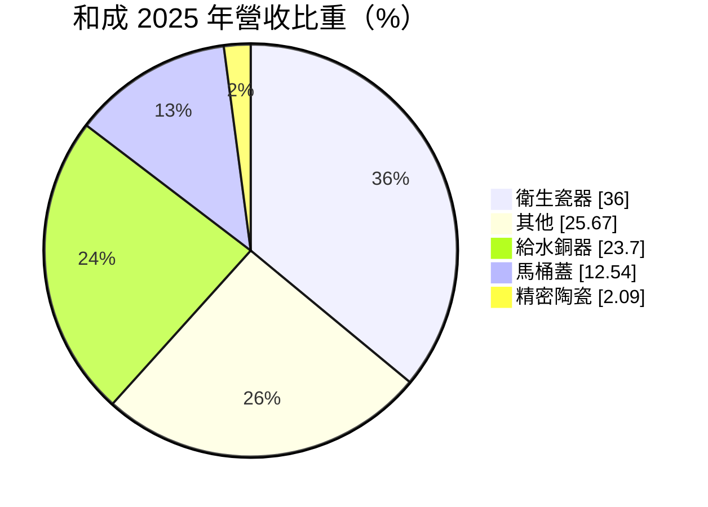
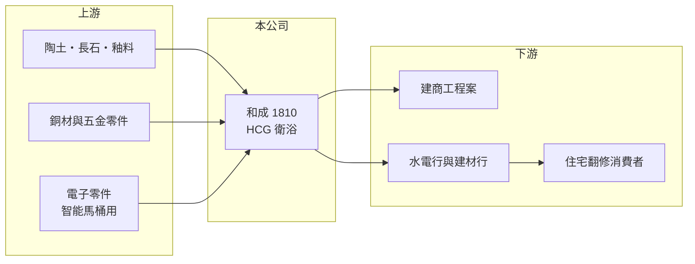

# 1810 和成

> 上市｜[[產業索引-玻璃陶瓷|玻璃陶瓷]]｜上市（櫃）日期 1991/10/14

# 第一章：企業模式與商業藍圖

> [!info] 撰寫說明
> 精簡版，由 Claude 依公開資料整理，架構比照 [[2330台積電]] 的四章研究，資料截至 2026-10-08。財務數字來源：Goodinfo 年度經營績效頁、MoneyDJ 個股基本資料（2025 年營收比重）、證交所開放資料（基本資料、2026 年第二季資產負債與綜合損益、營益分析、股利、本益比、每月營收）；品牌與通路細節部分憑既有知識撰寫，已標「待校對」。公開資料有限。#待校對

本章說明和成欣業（股票代號：1810，以下簡稱和成）作為台灣老牌衛浴品牌 HCG 的商業模式，以及它本業微利、業外收益影響大的獲利特性。

- **核心業務：** 和成成立於 1963 年（證交所資料；MoneyDJ 記載為 1961 年 12 月，待校對），1991 年上市，董事長為邱立堅，實收資本額約 30.2 億元。依 MoneyDJ 的 2025 年營收分類，衛生瓷器（馬桶、面盆）占 36.00%、給水銅器（龍頭、淋浴設備）占 23.70%、[[溫水洗淨便座]]等馬桶蓋占 12.54%、精密陶瓷占 2.09%，其他（推估含廚具、浴櫃與配件）占 25.67%。
- **品牌與通路：** HCG 是台灣家喻戶曉的衛浴品牌，透過水電行、建材行、自有展示中心與建商工程案銷售（憑既有知識，待校對）。衛浴產品的購買決策常由建商、設計師與水電師傅影響，因此通路關係和品牌一樣重要。
- **產品升級：** 馬桶蓋類產品占比超過一成，代表消費者逐漸從傳統馬桶升級到具溫水洗淨、自動掀蓋等功能的[[智能馬桶]]。這類產品單價高，但也是國際品牌與中國品牌競爭最激烈的區塊。
- **長期方向：** 和成的長期課題是讓本業重新賺錢：2023 至 2025 年營業利益率都在 0% 上下，2026 年上半年甚至是 -10%。精密陶瓷雖然占比小，卻是少數技術門檻較高、可延伸到工業與半導體應用的業務（應用範圍待校對）。

# 第二章：護城河深度與競爭優勢

本章分析和成的品牌優勢為何沒有轉化為穩定的本業獲利。

- **競爭優勢：** HCG 品牌知名度高，在台灣住宅與公共工程市場有長期的通路與安裝服務網路。衛浴產品安裝後需要維修與零件替換，售後服務網路是新進品牌不容易短期複製的資產。
- **主要壓力：** 日本品牌（TOTO、LIXIL 等）占據高階市場，中國品牌與進口低價產品搶攻中低階市場，和成夾在中間。毛利率長期在 24% 至 26% 之間，看似不差，但營業費用占比高，營業利益幾乎被吃光。
- **主要對手：** [[1817凱撒衛]]、TOTO、LIXIL、科勒（Kohler）、美標（American Standard），以及中國衛浴品牌。
- **觀察重點：** 一是本業營業利益能否轉正並穩定在 3% 以上；二是智能馬桶與高單價產品的占比；三是業外收益的來源與可持續性，避免把一次性收益誤認為獲利能力。

# 第三章：財務體質與盈利規模

資料日期：2026-10-08，表格是撰寫當時的快照；最新月營收、毛利率、累計 EPS 由自動排程寫在本筆記的屬性欄位（月營收、毛利率、累計EPS 等）。#待校對

本章用多年度的三率、ROE 與資本報酬，檢視和成本業與業外的落差。

| 年度 | 營收（新台幣） | [[毛利率]] | [[營業利益率]] | EPS（元） | [[ROE]] |
|---|---|---|---|---|---|
| 2020 | 51.0 億 | 24.6% | 0.00% | 0.24 | 1.36% |
| 2021 | 53.1 億 | 25.5% | 1.25% | 3.33 | 26.2% |
| 2022 | 50.0 億 | 26.1% | 2.05% | 0.46 | 2.28% |
| 2023 | 48.7 億 | 24.6% | -0.15% | 0.06 | 0.33% |
| 2024 | 48.6 億 | 24.9% | 0.04% | 0.19 | 0.90% |
| 2025 | 45.6 億 | 25.8% | -1.08% | 0.05 | 0.25% |
| 2026 上半年 | 21.8 億 | 21.59% | -10.35% | 3.62 | 未查得 |

註：2020 至 2025 年取自 Goodinfo，2026 上半年取自證交所營益分析與綜合損益。

- **營收規模：** 營收由 2021 年的 53.1 億元逐年下滑到 2025 年的 45.6 億元，2020 至 2025 年年複合成長率約 -2.2%（推算）。2026 年 1 至 8 月累計營收約 29.2 億元，較去年同期減少約 6%（證交所每月營收）。
- **獲利結構：** 2026 年上半年營業虧損約 2.26 億元，但營業外收入約 14.5 億元，使 EPS 達 3.62 元。2021 年也出現營業利益率僅 1.25%、EPS 卻有 3.33 元的情況。這兩年的高 EPS 都來自業外（推估為資產處分或轉投資相關收益，性質未查得），不代表本業改善。
- **長期指標：** 2021 至 2025 年平均 ROE 約 6.0%（推算），但扣除 2021 年後只有約 0.9%。2025 年度每股配發現金股利 0.20 元，高於當年 EPS 0.05 元（證交所股利資料）。
- **財務特色：** 2026 年第二季底總負債約 21.7 億元、權益約 85.9 億元，負債比約 20%；保留盈餘約 44.0 億元，每股淨值約 28.3 元（證交所開放資料）。帳上資產充裕，但本業對這些資本的運用效率很低。

**[[ROIC]] 與 [[WACC]]：** 以 2025 年營收 45.6 億元乘營業利益率 -1.08%，營業損失約 0.49 億元；投入資本以權益 85.9 億元加上假設占總負債三成的有息負債約 6.5 億元，合計約 92.5 億元，ROIC 約 -0.4%（推算）。WACC 以 CAPM 推估：無風險利率 1.75%、市場風險溢酬 6%、β 取建材業常見值 0.7，股東權益成本約 5.95%；負債成本 2.5%、稅後 2.0%；權益約占 93%，WACC 約 5.7%（推算）。本業 ROIC 為負、遠低於 WACC，代表和成的衛浴本業正在消耗價值；公司的股東價值目前主要來自資產與轉投資，而非品牌經營。

# 第四章：總體風險與地緣政治

本章分析和成長期面對的風險。

- **產業週期：** 衛浴需求跟著新屋交屋與老屋翻修，房市轉弱會先影響工程案，再影響零售。營收已連續多年下滑，若房市進一步降溫，本業虧損可能擴大。
- **營運風險：** 本業連年接近或低於損益兩平，代表成本結構與營收規模不匹配。若業外收益屬一次性，未來 EPS 可能大幅回落；高單價智能馬桶的競爭也可能壓縮毛利。
- **其他風險：** 銅價影響給水銅器的成本；陶瓷窯爐耗用天然氣與電力，受能源價格與[[碳費]]影響；低價進口衛浴產品的競爭可能長期存在。

# 專有名詞解析

## 金融

- **[[毛利率]]**：營業毛利占營收的比例，反映產品定價能力與生產成本控制。
- **[[營業利益率]]**：扣除營業費用後的營業利益占營收的比例，衡量本業整體獲利能力。
- **[[ROE]]**：股東權益報酬率，稅後淨利除以股東權益，衡量公司運用股東資金的效率。
- **[[ROIC]]**：投入資本報酬率，稅後營業利益除以股東權益與有息負債的合計，衡量本業對所有資金提供者的報酬。
- **[[WACC]]**：加權平均資金成本，依股東權益與負債的比重加權計算的資金成本，ROIC 高於它才代表創造價值。

## 產業

- **[[溫水洗淨便座]]**：裝在馬桶上、具溫水沖洗、座圈加熱等功能的電子馬桶蓋，日本普及率高，台灣近年快速成長。
- **[[智能馬桶]]**：整合沖洗、烘乾、自動掀蓋與自動沖水等電子功能的一體式馬桶，單價遠高於傳統馬桶。
- **[[碳費]]**：政府對溫室氣體排放大戶依排放量收取的費用，台灣自 2025 年起開徵，水泥、鋼鐵等產業首當其衝。

# 核心供應鏈

- 上游：陶土、長石與釉料（如 [[1809中釉]]，關係待校對）、銅材與五金零件、智能馬桶用電子零件。
- 下游／客戶：建商工程案、水電行與建材行、住宅翻修消費者。
- 同業：[[1817凱撒衛]]、TOTO、LIXIL、科勒、美標與中國衛浴品牌。

## 最新新聞
<!-- news:start -->
<!-- news:end -->

## 相關連結
- [公開資訊觀測站](https://mopsov.twse.com.tw/mops/web/t05st03?step=1&firstin=1&co_id=1810)
- [Goodinfo](https://goodinfo.tw/tw/StockDetail.asp?STOCK_ID=1810)
- [Yahoo 股市](https://tw.stock.yahoo.com/quote/1810)
- [鉅亨網新聞](https://www.cnyes.com/twstock/1810/news)
