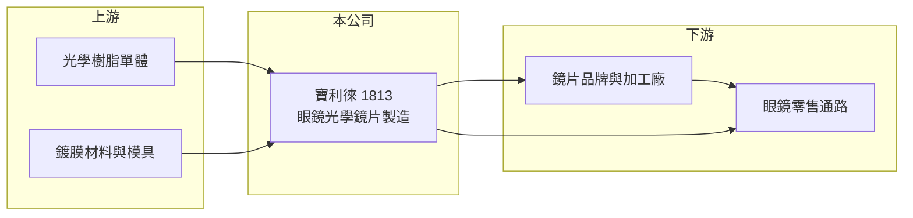

# 1813 寶利徠

> 上櫃｜[[產業索引-生技醫療業|生技醫療業]]｜上市（櫃）日期 2009/08/04

# 第一章：企業模式與商業藍圖

> [!info] 撰寫說明
> 精簡版，由 Claude 依公開資料整理，架構比照 [[2330台積電]]，資料截至 2026-10-08。來源：櫃買中心開放資料快照（基本資料、2026 上半年損益與資產負債、本益比殖利率）、MoneyDJ 年度財務比率頁。公開資料有限，產品與據點多為憑記憶整理，已標待校對。#待校對

寶利徠光學科技是台灣少數的眼鏡鏡片製造商，雖然歸類在生技醫療業，本質上是光學製造業。本章說明它的商業模式與長期困境。

- **核心業務：** 寶利徠成立於 1993 年，2009 年在櫃買中心掛牌，主要生產[[樹脂鏡片]]等眼鏡用光學鏡片（產品細項待校對），英文名稱為 Polylite。眼鏡鏡片屬於醫療器材管理範圍，因此被歸在生技醫療類股。
- **營收結構：** 公開資料未查得產品別與地區別比重。鏡片廠的客戶通常是國內外眼鏡通路、鏡片品牌商與加工廠，以代工與自有品牌並行（推估）。
- **營運據點：** 公司與工廠位於桃園大園（依登記地址），合併報表有非控制權益，代表有非全資子公司（據點待校對）。
- **長期方向：** 近視人口增加、高齡化帶動老花與[[漸進多焦鏡片]]需求，是鏡片產業的長期動能。但寶利徠營收從 2019 年前後的約 5 億元降到 2025 年約 3 億元，長期處於萎縮，需要產品升級或轉型才能扭轉。

# 第二章：護城河深度與競爭優勢

鏡片產業由國際大廠主導，中小廠的護城河有限，本章分析寶利徠的競爭處境。

- **競爭優勢：** 鏡片生產需要模具、鍍膜與光學檢測技術，累積多年的製程經驗是基本門檻。但一般單焦樹脂鏡片已高度標準化，技術門檻不足以支撐定價力。
- **主要對手：** 全球鏡片市場由依視路陸遜梯卡（EssilorLuxottica）、豪雅（Hoya）、蔡司（Zeiss）等國際大廠主導，中國大陸則有大量低價鏡片廠。國內同類型的上市櫃公司很少，缺乏直接可比的同業。
- **觀察重點：** 毛利率自 2022 年起轉為負值，代表售價已無法覆蓋生產成本，是最需要關注的警訊。未來要觀察公司是否縮減產能、轉向高附加價值鏡片，或進行資產活化。

# 第三章：財務體質與盈利規模

資料日期：2026-10-08，表格是撰寫當時的快照；最新月營收、毛利率、累計 EPS 由自動排程寫在本筆記的屬性欄位（月營收、毛利率、累計EPS 等）。#待校對

寶利徠的財務數字顯示本業長期虧損、依賴[[業外收益]]，以下用多年度數據說明。

| 年度 | 營收（億元，推算） | [[毛利率]] | [[營業利益率]] | EPS（元） | [[ROE]] |
|---|---|---|---|---|---|
| 2020 | 約 4.46 | 10.2% | -9.1% | 0.00 | 0.04% |
| 2021 | 約 4.51 | 4.34% | -13.1% | -0.28 | -2.93% |
| 2022 | 約 3.62 | -6.15% | -28.9% | 0.14 | -1.18% |
| 2023 | 約 3.60 | -1.09% | -23.9% | 0.24 | -0.55% |
| 2024 | 約 3.10 | -19.3% | -46.6% | -0.63 | -5.78% |
| 2025 | 約 3.05 | -17.2% | -41.8% | -1.03 | -7.92% |
| 2026 上半年 | 1.48 | -7.4% | -33.1% | 0.21 | 未查得 |

營收以 MoneyDJ 每股營業額乘股本約 4,664 萬股推算，股本近年未明顯變動，與營收成長率互相吻合。三率、EPS、ROE 為 MoneyDJ 數字；2022、2023 年 EPS 為正但 ROE 為負，可能因 ROE 以含非控制權益的總權益計算，待校對。

- **營收規模：** 2020 至 2025 年營收年複合成長約 -7%（推算），2026 年 1 至 8 月累計約 1.93 億元，年減約 8%，萎縮趨勢未止。
- **獲利：** 營業利益率連續多年為負，2024 至 2025 年甚至在 -40% 以上。2022、2023 與 2026 年上半年 EPS 轉正，靠的是業外收益（2026 年上半年業外收入約 0.50 億元，性質未查得）。近五年（2021 至 2025）平均 ROE 約 -3.7%（推算）。
- **財務特色：** 近年未配息。2026 年第二季末權益約 6.6 億元、負債約 3.0 億元，幾乎沒有長期負債；每股淨值約 14.9 元，非流動資產約 6.0 億元占總資產六成以上，土地廠房等資產是主要價值所在（推估）。
- **[[ROIC]] 與 [[WACC]]：** 2025 年營業利益約 -1.28 億元（3.05 億 × -41.8%），稅後約 -1.02 億元；投入資本以權益 6.6 億元加非流動負債 0.1 億元（有息負債未查得，以此近似）約 6.7 億元，ROIC 約 -15%（推算），2026 年上半年年化約 -12%（推算）。WACC 以無風險利率 1.75%、市場風險溢酬 6%、β 1.0（虧損中小型股，取較高值）得權益成本約 7.8%，幾乎無負債，WACC 約 7.7%（推算）。ROIC 深度為負，代表本業持續消耗股東資本，長期價值取決於資產處分或業務重整，而非本業獲利。

# 第四章：總體風險與地緣政治

寶利徠的風險主要是本業競爭力與持續虧損，本章整理長期風險。

- **產業週期：** 眼鏡鏡片需求穩定、週期性低，但價格長期受到中國低價產能壓抑，中小廠缺乏議價能力。
- **營運風險：** 毛利率為負代表每多賣一片都在虧錢，若無法調整產品組合或降低成本，虧損會持續侵蝕權益。依賴業外收益維持帳面獲利，品質不穩定。
- **其他風險：** 樹脂單體等原料多為進口石化材料，價格與匯率波動影響成本；外銷市場的關稅與貿易政策也會影響訂單。

# 專有名詞解析

## 應用

- **[[漸進多焦鏡片]]**：同一片鏡片從上到下度數漸變，可同時看遠與看近，主要用於老花族群。

## 金融

- **[[ROIC]]**：投入資本報酬率，衡量公司用股東與債權人的錢，每年賺回多少稅後營業利益。
- **[[WACC]]**：加權平均資金成本，股東與債權人要求報酬率的加權平均，是 ROIC 要跨過的門檻。

## 產業

- **[[樹脂鏡片]]**：以高分子樹脂製成的眼鏡鏡片，比玻璃鏡片輕且不易碎，是目前市場主流。
- **[[業外收益]]**：本業以外的收入，例如利息、投資收益或處分資產利益，通常不具持續性。

# 核心供應鏈

- 上游：光學樹脂單體、鍍膜材料與玻璃模具供應商（具體廠商未查得）。
- 下游／客戶：國內外鏡片品牌商、加工廠與眼鏡零售通路（客戶名稱未查得）。
- 同業：國際大廠依視路陸遜梯卡、豪雅、蔡司，以及中國鏡片廠；國內缺乏直接可比的上市櫃公司。

## 最新新聞
<!-- news:start -->
<!-- news:end -->

## 相關連結
- [公開資訊觀測站](https://mopsov.twse.com.tw/mops/web/t05st03?step=1&firstin=1&co_id=1813)
- [Goodinfo](https://goodinfo.tw/tw/StockDetail.asp?STOCK_ID=1813)
- [Yahoo 股市](https://tw.stock.yahoo.com/quote/1813)
- [鉅亨網新聞](https://www.cnyes.com/twstock/1813/news)
