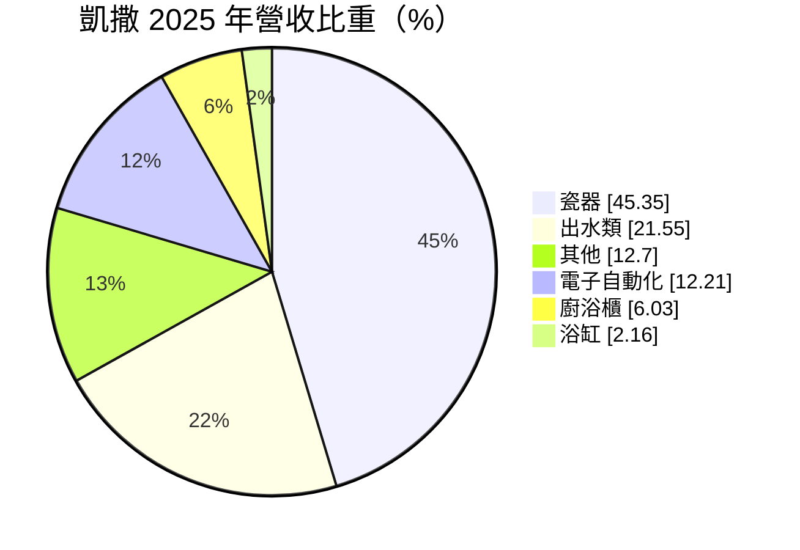
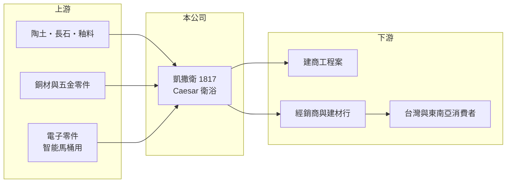

# 1817 凱撒衛

> 上市｜[[產業索引-玻璃陶瓷|玻璃陶瓷]]｜上市（櫃）日期 2013/10/24

# 第一章：企業模式與商業藍圖

> [!info] 撰寫說明
> 精簡版，由 Claude 依公開資料整理，架構比照 [[2330台積電]] 的四章研究，資料截至 2026-10-08。財務數字來源：Goodinfo 年度經營績效頁、MoneyDJ 個股基本資料（2025 年營收比重）、證交所開放資料（基本資料、2026 年第二季資產負債與綜合損益、營益分析、股利、本益比、每月營收）；生產據點與海外市場部分憑既有知識撰寫，已標「待校對」。公開資料有限。#待校對

本章說明凱撒衛浴（股票代號：1817，以下簡稱凱撒）作為台灣衛浴品牌的商業模式，以及它為何能在同一個產業中維持比同業更好的獲利。

- **核心業務：** 凱撒成立於 1988 年，2013 年上市，董事長為蕭俊祥，實收資本額約 7.26 億元。依 MoneyDJ 的 2025 年營收分類，瓷器（馬桶、面盆）占 45.35%、出水類（龍頭、淋浴）占 21.55%、電子自動化（推估為[[智能馬桶]]與感應式產品）占 12.21%、廚浴櫃占 6.03%、浴缸占 2.16%、其他占 12.70%。
- **品牌與據點：** Caesar 品牌在台灣與東南亞都有知名度，生產基地除台灣外也設在中國等地，產品銷往東南亞多國（憑既有知識，據點與市場待校對）。由品牌商自行掌握製造，讓凱撒能控制品質與成本。
- **獲利特色：** 凱撒的毛利率由 2020 年的 31.8% 逐步提高到 2025 年的 36.8%，2026 年上半年更達 38.4%，明顯高於主要同業。這反映產品組合往智能馬桶與整套衛浴空間升級，以及品牌定價能力。
- **長期方向：** 凱撒的長期成長來自兩條路：一是台灣市場的產品升級與翻修需求，二是東南亞都市化帶來的新屋衛浴需求。電子自動化產品占比提升，是觀察它能否持續拉高單價的指標。

# 第二章：護城河深度與競爭優勢

本章分析凱撒的護城河、主要對手，以及它和同業 [[1810和成]] 的差異。

- **競爭優勢：** 衛浴是耐久品，消費者重視品牌與售後維修，凱撒在台灣與東南亞累積的通路與服務網路是主要資產。和本業接近損益兩平的和成相比，凱撒 2020 至 2025 年營業利益率穩定在 11.5% 到 14.0% 之間，顯示它的成本控制與產品組合明顯較好。
- **產品升級：** 智能馬桶與整套衛浴空間的單價高，品牌與設計的重要性也比傳統馬桶大。凱撒在這個區塊有完整產品線，可以把顧客從單件購買帶到整套更換。
- **主要對手：** [[1810和成]]、TOTO、LIXIL、科勒（Kohler）、美標（American Standard），以及中國衛浴品牌。在東南亞市場還要面對當地品牌與日系品牌的競爭。
- **觀察重點：** 一是毛利率能否維持在 35% 以上；二是東南亞營收占比與成長；三是中國生產基地的成本與地緣政治風險。

# 第三章：財務體質與盈利規模

資料日期：2026-10-08，表格是撰寫當時的快照；最新月營收、毛利率、累計 EPS 由自動排程寫在本筆記的屬性欄位（月營收、毛利率、累計EPS 等）。#待校對

本章用多年度的三率、ROE 與資本報酬，檢視凱撒的獲利品質。

| 年度 | 營收（新台幣） | [[毛利率]] | [[營業利益率]] | EPS（元） | [[ROE]] |
|---|---|---|---|---|---|
| 2020 | 23.1 億 | 31.8% | 12.5% | 3.04 | 12.9% |
| 2021 | 23.7 億 | 33.6% | 12.0% | 3.07 | 12.8% |
| 2022 | 26.7 億 | 34.4% | 14.0% | 4.04 | 15.4% |
| 2023 | 25.0 億 | 34.3% | 11.5% | 3.27 | 11.7% |
| 2024 | 27.9 億 | 35.5% | 13.4% | 4.37 | 14.8% |
| 2025 | 26.2 億 | 36.8% | 12.4% | 3.61 | 11.5% |
| 2026 上半年 | 13.0 億 | 38.38% | 15.77% | 2.95 | 未查得 |

註：2020 至 2025 年取自 Goodinfo，2026 上半年取自證交所營益分析與綜合損益。

- **營收規模：** 2020 至 2025 年營收由 23.1 億元增加到 26.2 億元，年複合成長率約 2.6%（推算）。2026 年 1 至 8 月累計營收約 17.8 億元，較去年同期成長約 3%（證交所每月營收）。
- **獲利結構：** 毛利率逐年上升，營業利益率穩定，EPS 六年都在 3 元以上，沒有虧損年度。2026 年上半年 EPS 已達 2.95 元，營業利益率 15.8%，是近年較高的水準。
- **長期指標：** 2021 至 2025 年平均 ROE 約 13.2%（推算）。2025 年度每股配發現金 2.20 元（盈餘 1.87 元加資本公積 0.33 元），以 EPS 3.61 元計算，[[配息率]]約 61%（推算，證交所股利資料）。
- **財務特色：** 2026 年第二季底總負債約 7.9 億元、權益約 23.6 億元，負債比約 25%；保留盈餘約 16.0 億元，遠大於股本 7.26 億元（證交所開放資料），代表公司長年累積盈餘、財務穩健。

**[[ROIC]] 與 [[WACC]]：** 以 2025 年營收 26.2 億元乘營業利益率 12.4%，營業利益約 3.25 億元，稅後約 2.60 億元；投入資本以權益 23.6 億元加上假設占總負債三成的有息負債約 2.4 億元，合計約 26.0 億元，ROIC 約 10.0%（推算）。WACC 以 CAPM 推估：無風險利率 1.75%、市場風險溢酬 6%、β 取建材業常見值 0.7，股東權益成本約 5.95%；負債成本 2.5%、稅後 2.0%；權益約占 91%，WACC 約 5.6%（推算）。ROIC 高出 WACC 約 4 個百分點，代表凱撒的品牌與產品組合確實轉化為超額報酬，是台灣衛浴業中少數長期創造價值的公司。

# 第四章：總體風險與地緣政治

本章分析凱撒長期面對的風險。

- **產業週期：** 衛浴需求跟著新屋完工與翻修，台灣與東南亞的房市景氣都會影響出貨。工程案比重高的年度，營收受建商推案節奏影響較大。
- **營運風險：** 生產基地分布在中國等地，若遇到地緣政治、關稅或當地經營環境改變，可能需要調整產能配置。智能馬桶的電子零件與軟體品質，也會影響品牌口碑與售後成本。
- **其他風險：** 銅價影響出水類產品成本；陶瓷窯爐的能源成本與[[碳費]]；新台幣、人民幣與東南亞貨幣的匯率變動會影響換算後的營收與獲利。

# 專有名詞解析

## 金融

- **[[配息率]]**：現金股利占每股盈餘的比例，反映公司把獲利發還給股東的程度。
- **[[毛利率]]**：營業毛利占營收的比例，反映產品定價能力與生產成本控制。
- **[[營業利益率]]**：扣除營業費用後的營業利益占營收的比例，衡量本業整體獲利能力。
- **[[ROE]]**：股東權益報酬率，稅後淨利除以股東權益，衡量公司運用股東資金的效率。
- **[[ROIC]]**：投入資本報酬率，稅後營業利益除以股東權益與有息負債的合計，衡量本業對所有資金提供者的報酬。
- **[[WACC]]**：加權平均資金成本，依股東權益與負債的比重加權計算的資金成本，ROIC 高於它才代表創造價值。

## 產業

- **[[智能馬桶]]**：整合沖洗、烘乾、自動掀蓋與自動沖水等電子功能的一體式馬桶，單價遠高於傳統馬桶。
- **[[碳費]]**：政府對溫室氣體排放大戶依排放量收取的費用，台灣自 2025 年起開徵，水泥、鋼鐵等產業首當其衝。

# 核心供應鏈

- 上游：陶土、長石與釉料、銅材與五金零件、智能馬桶用電子零件。
- 下游／客戶：建商工程案、經銷商與建材行、台灣與東南亞的住宅消費者。
- 同業：[[1810和成]]、TOTO、LIXIL、科勒、美標與中國衛浴品牌。

## 最新新聞
<!-- news:start -->
<!-- news:end -->

## 相關連結
- [公開資訊觀測站](https://mopsov.twse.com.tw/mops/web/t05st03?step=1&firstin=1&co_id=1817)
- [Goodinfo](https://goodinfo.tw/tw/StockDetail.asp?STOCK_ID=1817)
- [Yahoo 股市](https://tw.stock.yahoo.com/quote/1817)
- [鉅亨網新聞](https://www.cnyes.com/twstock/1817/news)
