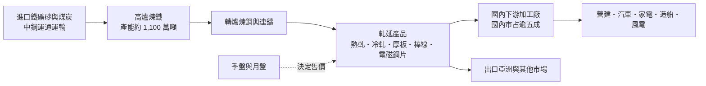
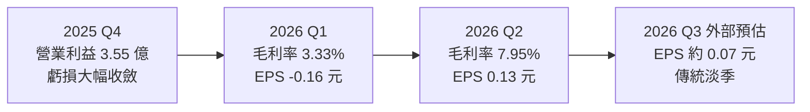
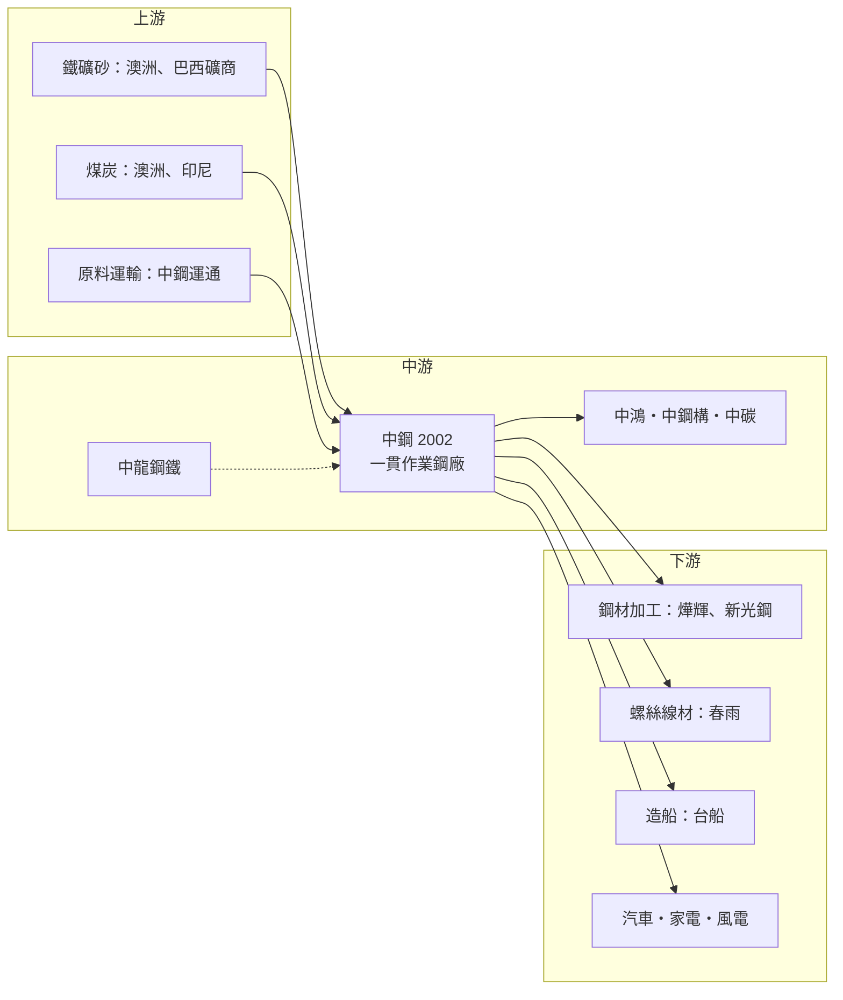

# 2002 中鋼

> 上市｜[[產業索引-鋼鐵工業|鋼鐵工業]]｜上市（櫃）日期 1974/12/26

# 第一章：企業模式與商業藍圖

> [!info] 撰寫說明
> 本文由 Claude 依公開資料整理，架構比照 [[2330台積電]] 的四章研究，資料截至 2026-10-07。財務數字來源：優分析、經濟日報、三立新聞、旺得富理財網、永豐金證券 AI 投資網、nstock、維基百科；產業描述為整理性內容，尚未逐條比對原始文件。#待校對

在評估單一個股的長期投資價值時，首要步驟是拆解企業的底層獲利邏輯。本章針對中國鋼鐵（股票代號：2002，以下簡稱中鋼）的商業模式進行定性分析，說明它在台灣鋼鐵產業中扮演的上游角色、產品如何對應到各種終端產業，以及在中國鋼材大量出口的環境下，它試圖用什麼方式走出低利潤的困境。

## 一、核心定位：台灣唯一大型高爐一貫作業鋼廠集團

中鋼於 1971 年 12 月 3 日正式成立，是十大建設之一，總部與主要廠區位在高雄小港臨海工業區。依永豐金證券 AI 投資網的公司簡介，中鋼是台灣最大的鋼鐵公司，經濟部持股約 22.5%，擁有[[高爐]]煉鋼與軋鋼[[一貫作業]]廠，高爐產能約 1,100 萬噸，產品在國內市占率超過 50%。

「一貫作業」指從鐵礦砂、煤炭開始，經過煉焦、燒結、高爐煉鐵、轉爐煉鋼、連續鑄造，一路軋延成鋼板、[[熱軋]]鋼捲、[[冷軋]]鋼捲、電鍍鋅、[[電磁鋼片]]、棒線等成品。台灣大部分民營鋼廠是用[[電弧爐]]熔化廢鋼，或向中鋼買鋼胚、熱軋捲再加工，因此中鋼有兩個商業意義：

* **產業源頭：** 下游數千家加工廠的原料成本，很大一部分取決於中鋼的出貨價格。
* **價格指標：** 中鋼每季、每月公布的[[盤價]]，是國內鋼價的重要風向球，也是市場判斷鋼市景氣的第一手訊號。

## 二、終端應用板塊：從營建到電動車馬達

本次未查得中鋼依產品別的營收比重，因此不繪製營收結構圖，改以產品對應的終端用途說明：

* **熱軋鋼捲與鋼板：** 用於建築、鋼構、造船、機械、管材，是銷量最大的品項。
* **冷軋、鍍鋅與電磁鋼片：** 用於汽車、家電、馬達與變壓器；高階電磁鋼片是 [[EV]] 馬達的關鍵材料。
* **棒線：** 用於螺絲螺帽、鋼線鋼纜、汽車零件。
* **厚板：** 用於造船、離岸風電水下基礎與大型鋼構。

集團轉投資企業超過 15 家，包括第二座一貫作業鋼廠中龍鋼鐵、冷軋與鋼管的 [[2014中鴻]]、鋼結構工程的 [[2013中鋼構]]、碳材料的 [[1723中碳]]、台灣最大鋁軋延廠中鋼鋁業、航運的中鋼運通，以及離岸風電的中能風場。

## 三、資本轉化邏輯：規模與開工率決定獲利

* **重資產、高固定成本：** 高爐一旦點火就必須連續運轉，折舊、人力與維修成本大致固定，因此銷量與售價的小幅變化就會造成獲利大幅波動。
* **價差生意：** 中鋼的毛利取決於「鋼價減去鐵礦砂與煤炭成本」的價差。依優分析與三立新聞 2026 年 7 至 8 月的報導，中鋼 2026 年第二季鋼品銷量 270.7 萬噸，季增約 7%、年增 5.3%；第一季約 253 萬噸。熱軋主力產品 4 至 6 月累計每噸調漲約 3,600 元，價量齊揚讓第二季毛利率從 3.33% 跳到 7.95%。
* **風電收入：** 2025 年 12 月的獲利改善被歸因於鋼鐵銷售毛利與中能風場發電度數增加，顯示風電已開始提供與鋼價無關的穩定收入。

## 四、企業長期藍圖：高值化、綠能與減碳

* **高值化產品：** 擴大高階電磁鋼片、汽車用高強度鋼、離岸風電用厚板的比重，降低對一般建築用鋼的依賴。這些產品需要長期認證，價格較不受國際大宗鋼價牽動。
* **綠能轉型：** 透過中能風場參與離岸風電，並投入水下基礎鋼構製造，把自家厚板與鋼構能力轉成風電產業鏈的一環。
* **減碳：** 鋼鐵業是台灣主要碳排來源之一，中鋼面對[[碳費]]與歐盟[[CBAM]]，需推動高爐減碳、增加廢鋼使用與低碳製程（未查得具體投資金額）。

# 第二章：護城河深度與競爭優勢

在長期價值投資中，「護城河」指企業抵禦競爭、維持超額利潤的保護機制。鋼鐵是典型的大宗商品，護城河通常不深。本章分析中鋼的護城河構成、全球主要競爭對手，以及這些優勢在中國鋼材傾銷的環境中能守住多少。

## 一、護城河的核心組成要素

中鋼的護城河主要來自「規模與地理位置」，屬於「窄護城河」：

* **1. 國內唯一大型高爐體系：** 新建一貫作業鋼廠需要龐大資本、港口與環評，台灣幾乎不可能再出現新的競爭者，中鋼與中龍形成國內上游寡占。
* **2. 鄰近客戶的交期與服務：** 國內下游加工廠可以小量、快速向中鋼取得鋼胚與鋼捲，比起從日韓中進口，交期與規格彈性較好。
* **3. 品質與認證：** 汽車用鋼、電磁鋼片、厚板等需要長期認證，中鋼在部分高階品項具備國內獨家供應的地位。

## 二、全球主要競爭對手格局

| 對手 | 定位 | 對中鋼的威脅 |
|---|---|---|
| 中國寶武、鞍鋼、河鋼 | 全球最大的鋼鐵集團，產能遠大於中鋼 | 中國鋼品大量出口，是亞洲鋼價的主要壓力來源 |
| 日本製鐵、JFE、POSCO、現代製鐵 | 日韓大型一貫作業鋼廠 | 在汽車鋼板與高階產品正面競爭 |
| 台塑河靜鋼鐵、和發鋼鐵、印度新產能 | 東南亞與印度新興鋼廠 | 在東南亞出口市場搶單 |
| [[2006東和鋼鐵]]、[[2015豐興]]、[[2027大成鋼]] | 國內電爐與加工廠 | 在型鋼、鋼筋、不鏽鋼等特定產品重疊 |

## 三、優勢轉化：哪些守得住、哪些守不住

* **守得住：** 國內市場的交期、服務與高階認證產品，以及風電、軍工、造船等重視在地供應的領域。
* **守不住：** 一般熱軋、冷軋產品價格由國際行情決定，中國出口量大時中鋼也只能跟著降價。2025 年中鋼[[毛利率]]僅 2.85%、[[營業利益率]] -1.23%，就是中國低價鋼材充斥市場的結果。
* **觀察重點：** 中國[[粗鋼]]產量與出口是否減少；國內營建與製造業需求能否回升；中鋼季盤與月盤的漲跌方向。優分析指出，這兩點是確認台灣鋼市復甦的關鍵。

# 第三章：財務體質與盈利規模

資料日期：2026-10-07。數字取自優分析、經濟日報、三立新聞、旺得富理財網、永豐金證券 AI 投資網與 nstock 整理，表格是撰寫當時的快照；最新月營收、毛利率、累計 EPS 由自動排程寫在本筆記的屬性欄位（月營收、毛利率、累計EPS 等）。#待校對

財務報表是檢驗護城河是否真實存在的最終標準。本章用三率、ROE、現金流與資本報酬，檢視中鋼在鋼鐵景氣低谷與初步回升之間的獲利品質。

## 一、獲利能力的基石：三率

| 項目 | 2025 全年 | 2026 Q1 | 2026 Q2 | 2026 上半年 |
|---|---|---|---|---|
| 營收（新台幣） | 3,171.55 億 | 約 791.6 億（推算） | 888.4 億 | 1,680.0 億 |
| [[毛利率]] | 2.85% | 3.33% | 7.95% | 5.78% |
| [[營業利益率]] | -1.23% | -0.78% | 4.13% | 1.81% |
| 歸屬母公司淨利 | 約 -35.1 億 | 未查得 | 20.75 億 | -3.77 億 |
| EPS（元） | -0.28 | -0.16 | 0.13 | -0.03 |
| 鋼品銷量 | 未查得 | 約 253 萬噸 | 270.7 萬噸 | 約 524 萬噸 |

* **由虧轉盈：** 2025 年營收年減 12%，營業淨損 39.04 億元、稅前虧損 46.84 億元；2026 年第二季營業利益 36.7 億元、稅前盈餘 33.1 億元，結束連續四季虧損。
* **營運槓桿：** 第二季銷量只比第一季多約 7%，毛利率卻增加 4.6 個百分點，說明固定成本高的鋼廠在價量回升時獲利彈性很大，反之亦然。
* **短期展望：** 三立新聞引述投顧預估第三季 EPS 約 0.07 元、第四季約 0.15 元、2026 全年約 0.21 元，屬外部預估；第三季屬傳統淡季，鋼價有下修壓力。2026 年 7 月營收 297.2 億元、8 月營收 279.48 億元，分別年增 21.85% 與 12.97%。
* 2026 年第一季營收為上半年減第二季的推算值。

## 二、ROE：資本效率

中鋼股本約 1,577 億元，資產龐大。2022 年 EPS 1.13 元之後，2023 與 2024 年分別僅 0.11 與 0.13 元，2025 年轉為虧損。[[ROE]] 長期處在個位數低檔，屬典型的重資產、低周轉、景氣循環型公司。要讓 ROE 明顯回升，需要鋼價與銷量同時改善，而非單靠成本控制。

## 三、資本支出、自由現金流與股利

* **[[CapEx]]：** 未查得 2026 年資本支出總額。中鋼的資本支出主要用於高爐大修、設備更新、減碳與綠能（風電）投資。
* **[[自由現金流]]：** 由於獲利偏低，推估現金流主要用於維持性支出與股利，擴產空間有限。
* **股利：** 依永豐金證券 AI 投資網與旺得富資料，中鋼 2026 年配發現金股利 0.15 元（8 月發放），2022 年高點曾達 3.10 元，近年股利隨獲利下滑。2025 年雖然虧損仍配息，推估動用保留盈餘或公積。

## 四、[[ROIC]] 與 [[WACC]]：價值創造利差

企業創造價值的條件是投入資本報酬率高於資金成本。中鋼 2023 至 2025 年本業獲利微薄甚至虧損，ROIC 明顯低於 WACC，代表龐大的資產並未創造超額報酬（推估，具體數值未查得）。2026 年第二季的轉盈若能延續，利差有機會縮小，但要轉為正值，仍需要中國減產與國內需求回升的結構性改善。

# 第四章：總體風險與地緣政治

任何企業都無法脫離宏觀環境獨立存在，鋼鐵業又特別容易受到貿易政策牽動。本章分析中鋼未來必須面對的地緣政治、產業週期、營運與減碳風險。

## 一、地緣政治風險

* **歐盟鋼品關稅：** 三立新聞報導，歐盟新鋼品關稅制度導致台灣銷歐配額減少約 50%，出口市場受限。
* **日本反傾銷：** 日本可能對台灣鋼品課徵[[反傾銷]]稅，影響對日出口。
* **美國 232 關稅：** 美國對進口鋼鐵課徵高額關稅，台灣鋼品出口美國受限，也讓原本銷美的中國、東南亞鋼材轉向亞洲市場，壓低區域價格。
* **兩岸風險：** 中國鋼品出口與傾銷是中鋼最大的外部壓力，兩岸關係也影響貿易救濟措施的推動。

## 二、產業週期與市場結構風險

* **中國產能過剩：** 中國粗鋼產量與出口量是決定亞洲鋼價的最大變數。
* **國內需求：** 營建、機械與製造業需求疲弱時，國內鋼價難以上漲。
* **原料成本：** 鐵礦砂與煤炭價格波動，若原料上漲而鋼價無法轉嫁，毛利率會被壓縮。
* **[[長鞭效應]]：** 下游加工廠在鋼價上漲時搶進備貨、下跌時觀望，會放大中鋼接單的季節性波動。

## 三、營運環境的隱性風險

* **高爐大修與設備老化：** 高爐定期大修會降低產量並增加支出。
* **工安與環保：** 煉鋼高耗能、高排放，面臨空污、碳排與用水規範。
* **轉投資與風電：** 中能風場等綠能投資金額大，若發電效率或電價不如預期，會影響集團獲利。

## 四、科技與法規演進風險

全球鋼鐵業正朝[[氫能煉鋼]]、電爐化與低碳鋼發展。歐盟 CBAM 將對高碳排鋼品課徵費用，若中鋼減碳進度落後，未來出口歐洲的成本會上升，國內客戶也可能因供應鏈減碳要求而改採低碳鋼材。高爐體系的碳排強度天生高於電爐，這是中鋼長期必須面對的結構性挑戰。

# 專有名詞解析

## 應用

- **[[EV]]**：電動車，以電池與馬達取代內燃機，帶動高階電磁鋼片需求。

## 金融

- **[[自由現金流]]**：營業活動現金流減去資本支出，代表企業可自由用於配息、還債或併購的現金。
- **[[長鞭效應]]**：終端需求的小幅變動，沿供應鏈往上游傳遞時被逐級放大，造成上游庫存與訂單劇烈波動。

## 產業

- **[[一貫作業]]**：從鐵礦砂、煤炭到煉鐵、煉鋼、軋延成品都在同一體系完成的鋼廠生產方式。
- **[[高爐]]**：以焦炭還原鐵礦砂、煉出鐵水的大型豎爐，產量大但碳排高，一旦點火需連續運轉。
- **[[電弧爐]]**：以電力產生電弧熔化廢鋼的煉鋼設備，投資較小、碳排較低，台灣多數民營鋼廠採用。
- **[[熱軋]]**：在高溫下把鋼胚軋成鋼捲或鋼板，產品用於建築、鋼構與管材，也是冷軋的原料。
- **[[冷軋]]**：把熱軋鋼捲在常溫下再軋薄，表面與尺寸精度較高，用於汽車、家電與鍍鋅產品。
- **[[電磁鋼片]]**：含矽的特殊鋼片，可降低馬達與變壓器的能量損耗，高階品是電動車馬達的關鍵材料。
- **[[盤價]]**：鋼廠定期公布的各產品出貨價格，中鋼盤價是國內鋼價的主要參考指標。
- **[[粗鋼]]**：煉鋼爐產出、尚未軋延的鋼，粗鋼產量是衡量一國鋼鐵產能的標準指標。
- **[[反傾銷]]**：進口國認定外國產品以低於正常價格銷售時，額外課徵關稅的貿易救濟措施。
- **[[CBAM]]**：歐盟碳邊境調整機制，對進口的高碳排產品依碳含量收費，鋼鐵是首批適用產業。
- **[[碳費]]**：政府依企業碳排放量收取的費用，台灣已開徵，高耗能產業成本將上升。
- **[[氫能煉鋼]]**：以氫氣取代焦炭還原鐵礦砂的煉鋼技術，排放物為水，是鋼鐵業長期減碳方向。

# 核心供應鏈

## 1. 上游：原料與運輸
- 鐵礦砂：澳洲、巴西等國際礦商
- 煤炭：澳洲、印尼等產地
- 原料運輸：中鋼運通

## 2. 中游：中鋼本身與集團企業
- 一貫作業鋼廠：中鋼、中龍鋼鐵
- 冷軋與鋼管：[[2014中鴻]]
- 鋼構工程：[[2013中鋼構]]
- 碳材料：[[1723中碳]]
- 離岸風電：中能風場

## 3. 同業競爭者
- 國內：[[2006東和鋼鐵]]、[[2015豐興]]、[[2027大成鋼]]
- 國外：中國寶武、日本製鐵、JFE、POSCO、現代製鐵

## 4. 下游：客戶產業
- 鋼材加工與鍍鋅：[[2023燁輝]]、[[2031新光鋼]]
- 螺絲與線材：[[2012春雨]]
- 造船：[[2208台船]]
- 汽車與家電：國內車廠與家電廠

## 最新新聞
<!-- news:start（自動產生，請勿手動編輯此範圍） -->
- 2026-10-05 📰 媒體 08:11｜鉅亨速報 - Factset 最新調查：中鋼(2002-TW)EPS預估下修至0.15元，預估目標價為21.5元｜[鉅亨網](https://news.cnyes.com/news/id/6621407)

完整紀錄：[[2002中鋼 新聞]]
<!-- news:end -->

## 相關連結
- [公開資訊觀測站](https://mopsov.twse.com.tw/mops/web/t05st03?step=1&firstin=1&co_id=2002)
- [Goodinfo](https://goodinfo.tw/tw/StockDetail.asp?STOCK_ID=2002)
- [Yahoo 股市](https://tw.stock.yahoo.com/quote/2002)
- [鉅亨網新聞](https://www.cnyes.com/twstock/2002/news)
