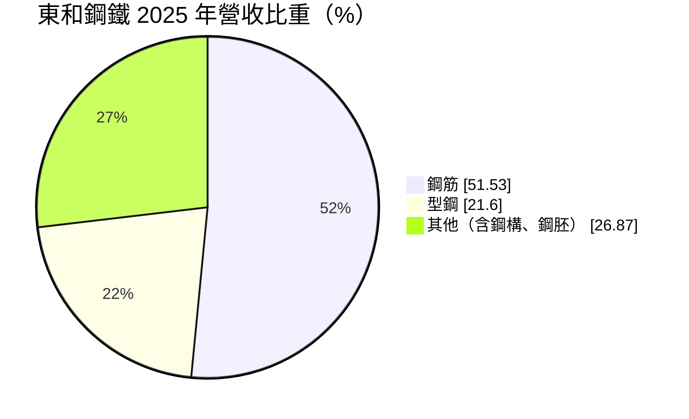
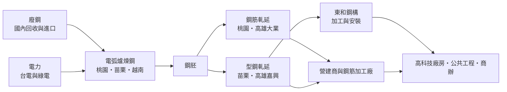
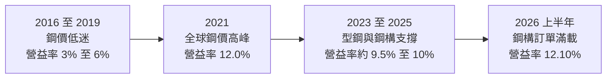
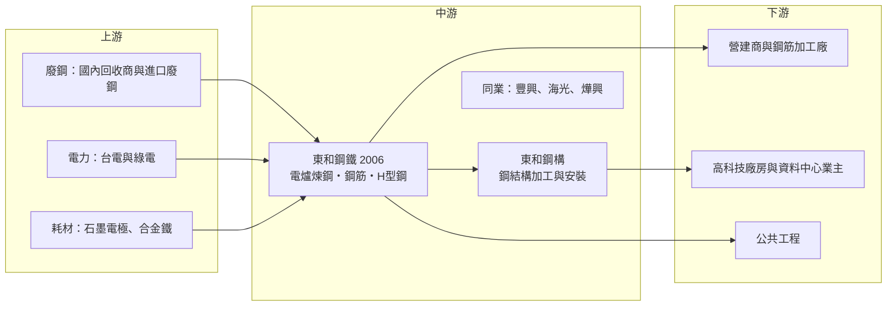

# 2006 東和鋼鐵

> 上市｜[[產業索引-鋼鐵工業|鋼鐵工業]]｜上市（櫃）日期 1988/07/13

# 第一章：企業模式與商業藍圖

> [!info] 撰寫說明
> 本文由 Claude 依公開資料整理，架構比照 [[2330台積電]] 的四章研究，資料截至 2026-10-08。財務數字來源：Goodinfo 年度經營績效與現金流量頁、MoneyDJ 理財網財務比率與營收比重、富果研究法說會備忘錄（2026 年 3 月）、優分析、證交所開放資料（基本資料、資產負債、綜合損益、營益分析、股利）；產業描述為整理性內容，尚未逐條比對原始文件。#待校對

在評估單一個股的長期投資價值時，首要步驟是拆解企業的底層獲利邏輯。本章針對東和鋼鐵企業（股票代號：2006，以下簡稱東和鋼鐵）的商業模式進行定性分析，說明一家以[[電弧爐]]回收[[廢鋼]]為核心的條鋼廠，如何在價格高度透明的鋼筋市場裡，靠型鋼的市場地位與鋼構工程的延伸，建立比同業穩定的獲利結構。

## 一、核心定位：台灣最大的型鋼廠與主要鋼筋供應商

東和鋼鐵成立於 1962 年，1988 年在台灣證券交易所上市，董事長為侯傑騰，是台灣歷史最久的民營鋼廠之一。和以鐵礦砂、煤炭為原料的[[一貫作業鋼廠]]（例如 [[2002中鋼]]）不同，東和鋼鐵全部採用電弧爐製程，原料是回收的廢鋼，產品屬於「條鋼」類，也就是用在建築結構的[[鋼筋]]與 [[H型鋼]]，而不是用在汽車、家電的鋼板。

這個定位決定了東和鋼鐵的三個基本特徵。第一，它的需求幾乎完全來自營建業，包括住宅、廠房、公共工程與商辦，因此景氣循環跟著台灣營建週期走，而不是跟著全球製造業走。第二，它的成本結構以廢鋼和電力為主，獲利來自「鋼品售價減廢鋼成本」的[[價差]]，而不是單純看鋼價高低。第三，電弧爐可以依訂單調整開爐時間，產量彈性比高爐大很多，景氣差時可以減產保價差，這是電爐廠在週期中守住現金流的重要工具。

依優分析整理，東和鋼鐵在台灣鋼筋市場的市占率約 15% 至 20%，排名第三；在 H 型鋼市場則接近六成，是國內最大的型鋼供應商。這種「鋼筋跟著市場走、型鋼有定價影響力」的雙重身分，是理解東和鋼鐵的起點。

## 二、終端應用／產品板塊：鋼筋為量、型鋼為質、鋼構為延伸

依 MoneyDJ 理財網整理的 2025 年營收比重，鋼筋占 51.53%、型鋼占 21.60%、其他（主要為鋼構工程與鋼胚等）占 26.87%。

* **鋼筋：** 鋼筋是鋼筋混凝土建築的骨架，規格標準化程度高，各家鋼廠的產品差異小，價格主要由廢鋼成本與營建需求決定。東和鋼鐵在這個市場是價格接受者，2025 年公司在法說會上表示採取「毛利率優先、不追求市占」的策略，寧可讓接單量下滑，也不參與殺價。依 2026 年 3 月法說會資料，2025 年台灣鋼筋表面需求量約 644 萬噸，與前一年持平，但住宅需求下滑約兩成。
* **型鋼：** H 型鋼用在鋼骨結構的高樓、廠房、橋梁與倉儲。台灣 H 型鋼表面需求量每年約 100 萬噸，東和鋼鐵是國內少數具備大型型鋼軋延能力的廠商，市占接近六成，因此在型鋼的報價上有較大的主導權。型鋼的毛利率通常高於鋼筋，是東和鋼鐵獲利品質優於純鋼筋廠的主因。
* **鋼構工程（子公司東和鋼構）：** 東和鋼鐵把自家 H 型鋼往下游延伸到鋼結構的加工與安裝。依 2026 年 3 月法說會資料，高科技廠房（半導體廠、資料中心）的訂單占鋼構業務比重倍增到接近三成，2025 年鋼構營收創新高，2026 年訂單已滿，能見度延伸到 2027 年第三季。鋼構業務讓東和鋼鐵從「賣鋼材」走向「賣工程」，可以分享較高的附加價值。
* **越南廠：** 越南子公司以當地市場為主，煉鋼產能約 100 萬噸、軋鋼約 60 萬噸。越南建築鋼材需求量 2025 年約 1,176 萬噸，但當地競爭激烈、鋼價比台灣低，公司刻意降低出貨量以保價格，2025 年第三、四季轉為獲利。

## 三、資本轉化邏輯（營運模式）：廢鋼進、條鋼出，價差決定一切

依 2026 年 3 月法說會資料，東和鋼鐵的主要廠區如下：桃園廠以小鋼胚與鋼筋為主，煉鋼約 140 萬噸、軋鋼約 150 萬噸；苗栗廠生產大鋼胚與 H 型鋼，煉鋼約 125 萬噸、軋鋼約 80 萬噸；高雄嘉興廠生產型鋼約 40 萬噸；高雄大業廠生產鋼筋約 35 萬噸；越南廠煉鋼約 100 萬噸、軋鋼約 60 萬噸。

這個營運模式有幾個關鍵：

* **價差管理：** 鋼筋與型鋼的售價多半每週或每月開盤，廢鋼價格則跟著國際行情每天變動。東和鋼鐵的毛利率取決於兩者的差距，以及原料庫存的進貨時點。廢鋼急漲時若售價跟不上，毛利率會被壓縮；反之，鋼價上漲時手上的低價庫存會帶來[[庫存利益]]。
* **電力是第二大成本：** 電弧爐用電量大，2025 年每噸鋼耗電從 650 度降到 600 度，部分抵銷了台電電價上漲。電價政策對電爐廠的影響，遠大於對一般製造業的影響。
* **[[在手訂單]]作為緩衝：** 依法說會資料，鋼筋未交訂單約可支應 9 至 10 個月，型鋼訂單能見度較短（約 1 至 1.5 個月）。長天期的鋼筋訂單讓營收穩定，但也代表價格調整會有落後。

## 四、企業長期藍圖：從煉鋼廠走向「鋼材加工程」與低碳電爐

東和鋼鐵的長期策略可以歸納為三條主線：

* **鋼構工程放大附加價值：** 台灣半導體與資料中心建廠潮帶動鋼構需求，東和鋼構已成為集團的主要成長動能。鋼構工程把型鋼的出海口握在自己手上，在型鋼需求波動時多了一個穩定的去化管道，也能接觸到台積電等科技廠的建廠供應鏈。
* **低碳鋼材的結構性優勢：** 電弧爐使用廢鋼，每噸鋼的碳排遠低於高爐。在台灣開徵[[碳費]]、歐盟推動 [[CBAM]] 的趨勢下，低碳鋼材對營建業主與科技廠的 ESG 採購越來越重要。公司設定 2035 年集團碳排較 2021 年減少 30%、再生能源使用比例達 30% 的目標，2025 年再生能源比例約 19%。
* **越南作為第二市場：** 越南都市化與基礎建設需求長期成長，但當地競爭激烈。公司目前的策略是控制量、守價格，讓越南廠穩定貢獻獲利，而不是追求擴產。

整體而言，東和鋼鐵屬於「成熟產業中的穩定現金流公司」，長期成長主要來自產品組合往型鋼與鋼構移動，而不是產能擴張。

# 第二章：護城河深度與競爭優勢

在長期價值投資中，「護城河」指企業抵禦競爭、維持超額利潤的保護機制。本章分析東和鋼鐵在高度同質化的條鋼市場中，靠哪些要素維持比同業更穩定的毛利率，以及這些優勢的邊界在哪裡。

## 一、護城河的核心組成要素

東和鋼鐵的護城河屬於「窄護城河」，來源不是技術專利，而是規模、產品線與地理位置：

* **1. 型鋼市場的寡占地位：** 大型 H 型鋼需要專用的軋延設備與足夠的訂單量才能攤平成本，國內具備這種能力的鋼廠很少。東和鋼鐵市占接近六成，讓它在型鋼報價上有主導權，這是鋼筋廠無法複製的優勢，也是公司毛利率長期優於純鋼筋廠的原因。
* **2. 運輸半徑形成的在地保護：** 鋼筋與型鋼重量大、單價相對低，長途運輸成本高。台灣本地鋼廠對進口鋼材有天然的運費與交期優勢，而東和鋼鐵在北、中、南都有廠區，可以就近供貨。不過這個保護並非絕對，進口低價鋼材仍會在價差大時進入市場。
* **3. 垂直整合到鋼構工程：** 自產型鋼加上自有鋼構子公司，可以提供從材料到施工的一站式服務。對工期緊、品質要求高的高科技廠房業主而言，材料與施工由同一集團負責，可以降低協調成本與交期風險，這形成一定的客戶黏著度。
* **4. 財務紀律：** 負債比從 2024 年的 40% 降到 2025 年的 34%（法說會資料），2026 年第二季底有息負債約 82 億元，相對於 343 億元的股東權益不高。保守的財務結構讓公司在鋼價下跌時有能力維持配息，也能在同業困難時保持接單與報價的彈性。

## 二、全球主要競爭對手格局

| 對手 | 定位 | 對東和鋼鐵的影響 |
|---|---|---|
| [[2015豐興]] | 台灣主要鋼筋廠之一，財務穩健 | 鋼筋市場直接競爭，開盤價互相參考 |
| [[2038海光]]、[[2007燁興]] 等 | 台灣電爐鋼筋業者 | 鋼筋市場價格競爭 |
| [[2002中鋼]] | 一貫作業鋼廠，主力為鋼板 | 非直接競爭，但中鋼的盤價影響整體鋼價情緒 |
| 中國、越南、日韓條鋼廠 | 低價進口鋼筋與型鋼 | 價差大時進口量增加，壓抑國內報價 |
| 鋼構同業（如[[2013中鋼構]]等） | 鋼結構加工與安裝 | 在高科技廠房鋼構工程上競標 |

註：鋼筋同業名單依產業常識整理，個別公司市占未查得（待校對）。

## 三、優勢轉化：守得住／守不住／觀察重點

* **守得住：** H 型鋼的國內市場與高科技廠房鋼構工程。型鋼的寡占地位與鋼構的整合服務，使東和鋼鐵在這兩個市場有議價能力，即使住宅需求下滑，科技廠與公共工程的需求仍能支撐獲利。2025 年營收年減 3.84%，但毛利率反而從 13.95% 升到 14.82%，就是產品組合與價格紀律的結果。
* **守不住：** 鋼筋的價格與廢鋼成本。鋼筋是標準品，東和鋼鐵無法決定市場價格，只能透過控制接單量來保價差。當廢鋼國際價格急漲、或中國鋼材大量出口時，鋼筋獲利會被壓縮，這部分屬於整個產業共同承擔的風險。
* **觀察重點：** 第一，台灣住宅市場在信用管制下的長期走勢，這決定鋼筋需求的基本盤。第二，高科技廠房與資料中心的建廠潮能延續多久，這決定鋼構與型鋼的成長空間。第三，電價政策與綠電取得成本，這是電爐廠長期成本結構的最大變數。

# 第三章：財務體質與盈利規模

資料日期：2026-10-08。數字取自 Goodinfo 年度經營績效與現金流量頁、MoneyDJ 理財網財務比率、富果研究法說會備忘錄與證交所開放資料，表格是撰寫當時的快照；最新月營收、毛利率、累計 EPS 由自動排程寫在本筆記的屬性欄位（月營收、毛利率、累計EPS 等）。#待校對

財務報表是檢驗護城河是否真實存在的最終標準。本章用十年的三率、ROE、現金流與資本報酬，檢視東和鋼鐵在鋼價循環中的獲利品質。

## 一、獲利能力的基石：三率

| 年度 | 營收（新台幣） | [[毛利率]] | [[營業利益率]] | EPS（元） | [[ROE]] |
|---|---|---|---|---|---|
| 2016 | 252 億 | 11.8% | 5.92% | 1.49 | 6.35% |
| 2017 | 317 億 | 12.0% | 5.80% | 1.72 | 7.15% |
| 2018 | 398 億 | 8.36% | 3.21% | 0.88 | 3.70% |
| 2019 | 449 億 | 9.21% | 4.70% | 1.56 | 6.45% |
| 2020 | 429 億 | 15.4% | 10.3% | 3.52 | 13.7% |
| 2021 | 588 億 | 16.1% | 12.0% | 5.95 | 20.6% |
| 2022 | 592 億 | 12.6% | 8.64% | 5.47 | 13.7% |
| 2023 | 610 億 | 14.2% | 9.84% | 6.48 | 15.8% |
| 2024 | 602 億 | 13.9% | 9.48% | 6.13 | 14.2% |
| 2025 | 579 億 | 14.8% | 10.1% | 6.47 | 14.2% |
| 2026 上半年 | 298.7 億 | 16.53% | 12.10% | 4.07 | 未查得 |

註：2016 至 2025 年取自 Goodinfo 合併報表；2026 上半年取自證交所營益分析與綜合損益開放資料。

* **[[毛利率]]的結構性提升：** 2016 至 2019 年東和鋼鐵的毛利率在 8% 至 12% 之間，2020 年之後穩定在 12% 至 16%。這個變化不只是鋼價循環，也反映公司把重心從「追量」轉向「保價差」，以及鋼構工程比重提高。觀察毛利率時，要同時看廢鋼價格與型鋼、鋼構的比重。
* **[[營業利益率]]：** 鋼廠的營業費用率低，營業利益率與毛利率的差距約 4 至 5 個百分點，代表獲利幾乎完全由毛利決定，也就是由價差決定。
* **營收趨勢：** 營收從 2020 年的 429 億元成長到 2025 年的 579 億元，年複合成長率約 6.2%（推算）。但 2021 年之後營收大致停在 580 億至 610 億元之間，代表成長主要來自鋼價上漲，而非出貨量大幅增加。
* **[[營運槓桿]]：** 2026 年上半年毛利率 16.53%、營業利益率 12.10%，高於 2025 年全年，顯示鋼構訂單與型鋼價格同時改善時，利潤率會明顯擴張。

## 二、[[ROE]]：資本效率

2021 至 2025 年平均 ROE 約 15.7%（推算），在台灣鋼鐵業中屬於高水準。對照 2016 至 2019 年平均僅約 6%，可以看出東和鋼鐵在過去十年經歷了一次獲利結構的升級。ROE 的提升主要來自利潤率，而不是財務槓桿：MoneyDJ 資料顯示負債比率從 2021 年的 46.3% 降到 2025 年的 33.7%，在槓桿下降的同時 ROE 仍維持在 14% 以上，代表本業的資本報酬確實改善。

## 三、資本支出、自由現金流與股利

| 年度 | 營業現金流 | 投資現金流 | [[自由現金流]] | 現金股利（元） |
|---|---|---|---|---|
| 2019 | 38.3 億 | -6.24 億 | 32.1 億 | 1.35 |
| 2020 | 93.3 億 | -3.18 億 | 90.1 億 | 1.5 |
| 2021 | -10.5 億 | -13.6 億 | -24.1 億 | 6.4 |
| 2022 | 68.7 億 | -28.7 億 | 39.9 億 | 3.5 |
| 2023 | 46.2 億 | -6.59 億 | 39.6 億 | 4.2 |
| 2024 | 73.8 億 | -9.47 億 | 64.3 億 | 4.0 |
| 2025 | 86.4 億 | -14.1 億 | 72.3 億 | 4.3 |

註：現金流取自 Goodinfo（自由現金流＝營業現金流＋投資現金流），股利依所屬年度列示。

* **資本支出輕：** 電爐鋼廠的主要設備已建置多年，近年的投資現金流多在 3 億至 30 億元之間，遠低於營業現金流。這讓東和鋼鐵在多數年度都有正的自由現金流，2019 至 2025 年七年中有六年為正。
* **2021 年的例外：** 2021 年鋼價急漲，公司需要更多營運資金買進廢鋼與累積庫存，營業現金流轉為負值。這是鋼廠在漲價週期的典型現象：帳上獲利增加，但現金被存貨吃掉，要等鋼價回穩後才會回收。
* **股利政策：** 公司章程載明企業處於穩定成熟階段，現金股利不低於股利總額的八成。2025 年度配發現金股利 4.3 元，以 EPS 6.47 元計算[[配發率]]約 66%（推算）。2022 年以來每年現金股利維持在 3.5 至 4.3 元，穩定度明顯高於 2020 年以前。

## 四、[[ROIC]] 與 [[WACC]]：價值創造利差

**ROIC 推算：** 2025 年營業利益 58.47 億元（法說會資料），扣除 20% 稅率後稅後營業利益約 46.8 億元。投入資本以 2026 年第二季底計算：股東權益 342.7 億元（證交所資產負債開放資料），有息負債約 81.8 億元（短期借款 72.6 億元、長期借款與一年內到期部分約 6.2 億元、租賃負債約 3 億元，MoneyDJ 資產負債表），合計約 424.5 億元。ROIC 約 11.0%（推算）。若以 2026 年上半年營業利益 36.13 億元年化，ROIC 約 13.6%（推算）。

**WACC 推估（CAPM）：** 假設台灣 10 年期公債殖利率約 1.75%、市場風險溢酬 6%、β 取 0.8（推估，台灣電爐鋼廠常見值），股東權益成本約 6.55%；稅前負債成本假設 2.2%（推估），稅後約 1.76%。資本結構以市值計算（股價淨值比約 1.85 倍，市值約 632 億元），權益約占 89%、負債約占 11%，WACC 約 6.0%（推算）；若以帳面價值計算約 5.6%。

**結論：** 東和鋼鐵 2025 年 ROIC 約 11%，高於 WACC 約 6%，利差約 5 個百分點，代表公司在目前的產品組合下長期創造價值。不過回看 2016 至 2019 年營業利益率僅 3% 至 6% 的年代，ROIC 約只有 3% 至 6%（推估），當時幾乎沒有超額報酬。因此判斷東和鋼鐵能否持續創造價值，關鍵在於型鋼與鋼構帶來的毛利率提升是否具有持續性。

# 第四章：總體風險與地緣政治

任何企業都無法脫離宏觀環境獨立存在。本章分析東和鋼鐵未來必須面對的地緣政治、產業週期與營運風險。

## 一、地緣政治

* **中國鋼材出口與貿易保護：** 中國粗鋼產量占全球過半，內需疲弱時會把過剩產量出口，壓低亞洲鋼價。台灣對中國部分鋼品已有[[反傾銷]]措施，但條鋼進口仍會在價差擴大時增加。中國近年推動「反內卷」與減產政策，若落實可減輕壓力，但政策執行的力道與持續性難以預測。
* **美國關稅：** 東和鋼鐵以內需為主，美國鋼鋁關稅對它的直接影響有限。間接影響在於其他國家被擋在美國門外的鋼材轉向亞洲市場，增加區域競爭。
* **廢鋼的國際流向：** 台灣廢鋼部分仰賴進口，美國、日本、澳洲的廢鋼出口政策或價格變化，會直接影響東和鋼鐵的原料成本。

## 二、產業週期與市場結構

* **營建週期：** 鋼筋需求高度依賴住宅開工。台灣央行的信用管制使住宅需求在 2025 年下滑約兩成（法說會資料），這類政策性降溫可能持續數年。
* **高科技建廠的集中度：** 鋼構業務近年受惠半導體與資料中心建廠，但這類需求集中在少數大客戶，一旦建廠計畫放緩或移往海外，鋼構訂單會明顯減少。
* **鋼價循環：** 鋼鐵業的獲利每隔幾年就會因全球供需變化大幅起伏，2018 年 EPS 只有 0.88 元，2023 年達 6.48 元。投資人不應以景氣高峰的獲利作為長期基準。

## 三、營運環境的隱性風險

* **電價與供電穩定：** 電弧爐是用電大戶，台電電價調漲直接墊高成本；夏季限電或供電不穩也可能影響生產排程。這是台灣電爐廠特有、且公司難以自行控制的風險。
* **[[存貨跌價損失]]：** 鋼廠庫存週轉天數約 130 天（MoneyDJ 資料），鋼價急跌時，高價庫存需要提列跌價損失，會造成單季獲利波動。
* **越南市場：** 越南鋼價比台灣低，當地同業規模大，越南廠的獲利穩定性仍需觀察。

## 四、科技或法規演進

* **碳費與碳邊境稅：** 台灣碳費制度上路後，電爐廠的碳排雖低於高爐，但用電產生的間接排放仍需管理。電爐鋼的低碳特性在法規趨嚴下是相對優勢，但取得足量綠電的成本會是長期挑戰。
* **建築工法轉變：** 鋼骨結構、預鑄工法與耐震規範的演進，會改變鋼筋與型鋼的需求比例。整體趨勢對型鋼與鋼構較有利，這與東和鋼鐵的產品重心一致。

# 專有名詞解析

## 金融

- **[[庫存利益]]**：原料或產品價格上漲時，先前以低價買進的庫存被以較高售價賣出所產生的額外利潤。
- **[[存貨跌價損失]]**：存貨的市價低於帳上成本時必須提列的損失，常見於原物料價格急跌時。
- **[[營運槓桿]]**：固定成本比重高的企業，營收增加時利潤增加得更快，營收減少時利潤也掉得更快。
- **[[配發率]]**：現金股利占當年度每股盈餘的比例，用來衡量公司把多少獲利分給股東。

## 產業

- **[[電弧爐]]**：以電力產生的電弧熔化廢鋼來煉鋼的設備，開停爐彈性大、碳排較低，是台灣條鋼廠的主要製程。
- **[[一貫作業鋼廠]]**：從鐵礦砂、煤炭經高爐煉鐵到軋延成品都在同一廠區完成的鋼廠，代表為中鋼，投資規模大、碳排較高。
- **[[廢鋼]]**：回收的鋼鐵料，是電弧爐的主要原料，價格隨國際供需每日變動，占電爐廠成本最大比重。
- **[[鋼筋]]**：埋在混凝土中提供抗拉強度的條狀鋼材，規格標準化，是住宅與公共工程的主要用鋼。
- **[[H型鋼]]**：斷面呈 H 字形的結構鋼材，用於鋼骨大樓、廠房與橋梁，需要大型軋延設備生產。
- **[[價差]]**：鋼品售價減去主要原料成本的差額，是鋼鐵業衡量獲利能力最直接的指標。
- **[[在手訂單]]**：已簽約但尚未出貨的訂單，可用來判斷未來數月的營收能見度。
- **[[碳費]]**：台灣對大型排放源依溫室氣體排放量收取的費用，會增加高耗能產業的成本。
- **[[CBAM]]**：歐盟碳邊境調整機制，對進口鋼鐵等高碳產品依碳排量課徵費用，使低碳製程較具競爭力。
- **[[反傾銷]]**：進口國對低於正常價格銷售的進口商品加徵關稅，以保護本國產業的貿易救濟措施。

# 核心供應鏈

## 1. 上游：原料與能源
- 廢鋼：國內回收體系與美國、日本、澳洲進口廢鋼（供應商名稱未查得）
- 電力：台灣電力公司與再生能源業者
- 耗材：石墨電極、合金鐵等煉鋼耗材（供應商未查得）

## 2. 中游：東和鋼鐵與同業
- 子公司：東和鋼構（鋼結構工程）、越南子公司（建築鋼材）
- 鋼筋同業：[[2015豐興]]、[[2038海光]]、[[2007燁興]]
- 一貫作業鋼廠參考：[[2002中鋼]]

## 3. 下游：營建與工程
- 營建商、鋼筋加工廠與經銷商
- 高科技廠房業主（半導體廠、資料中心）與其營造廠
- 政府公共工程與交通建設

## 最新新聞
<!-- news:start -->
<!-- news:end -->

## 相關連結
- [公開資訊觀測站](https://mopsov.twse.com.tw/mops/web/t05st03?step=1&firstin=1&co_id=2006)
- [Goodinfo](https://goodinfo.tw/tw/StockDetail.asp?STOCK_ID=2006)
- [Yahoo 股市](https://tw.stock.yahoo.com/quote/2006)
- [鉅亨網新聞](https://www.cnyes.com/twstock/2006/news)
