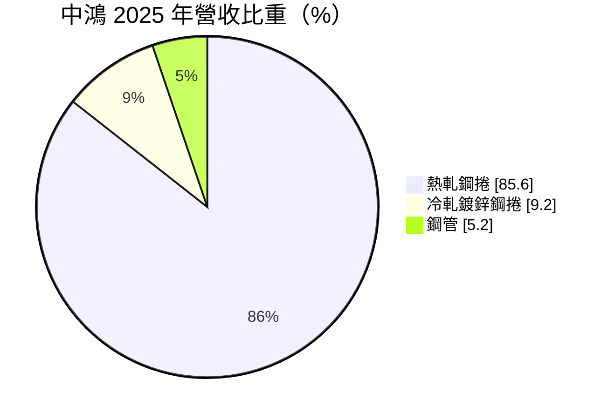
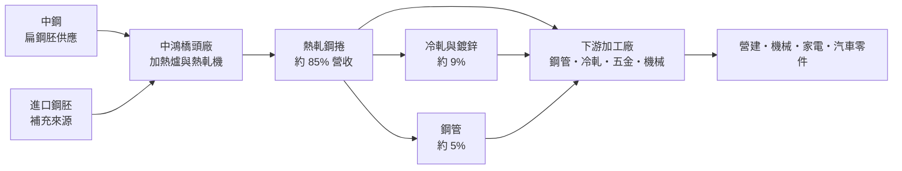
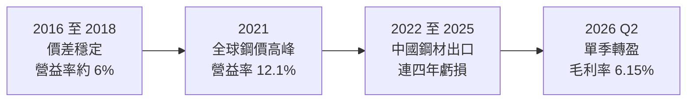
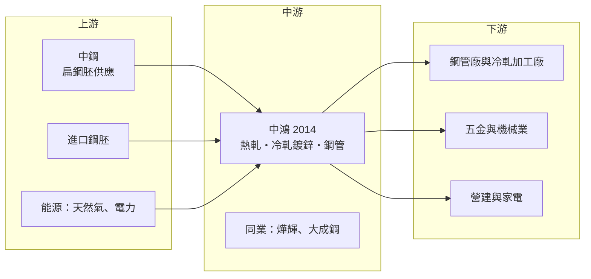

# 2014 中鴻

> 上市｜[[產業索引-鋼鐵工業|鋼鐵工業]]｜上市（櫃）日期 1992/02/20

# 第一章：企業模式與商業藍圖

> [!info] 撰寫說明
> 本文由 Claude 依公開資料整理，架構比照 [[2330台積電]] 的四章研究，資料截至 2026-10-08。財務數字來源：Goodinfo 年度經營績效與現金流量頁、MoneyDJ 理財網財務比率、營收比重與資產負債表、nStock、窮人股票網法說會整理、優分析、經濟日報、證交所開放資料（基本資料、資產負債、綜合損益、營益分析、股利）；產業描述為整理性內容，尚未逐條比對原始文件。#待校對

在評估單一個股的長期投資價值時，首要步驟是拆解企業的底層獲利邏輯。本章針對中鴻鋼鐵（股票代號：2014，以下簡稱中鴻）的商業模式進行定性分析，說明一家沒有自有煉鋼設備、向母公司買鋼胚再軋延的鋼廠，它的獲利從哪裡來，又為什麼在 2022 年之後連年虧損。

## 一、核心定位：中鋼集團旗下的熱軋鋼捲專業廠

中鴻成立於 1983 年，前身為燁隆企業，1992 年在台灣證券交易所上市，廠區位於高雄市橋頭區。2000 年燁隆集團財務出現困難，[[2002中鋼]] 接手經營，此後中鴻成為中鋼集團成員（燁隆的經營權轉移細節與改名時間為整理性描述，待校對）。依 nStock 引用的財報資料，中鋼截至 2026 年 6 月底持有中鴻約 40.59% 股權，是最大股東。

中鴻的定位可以用一句話說明：它是中鋼集團在熱軋鋼捲市場的「第二條生產線」。中鴻本身沒有高爐，主要向中鋼購買扁鋼胚，加熱後軋成[[熱軋鋼捲]]，再部分加工成冷軋、鍍鋅鋼捲與鋼管。因此中鴻的獲利不是來自煉鋼，而是來自「熱軋鋼捲售價減鋼胚成本」的軋延[[價差]]。

這個定位有一個關鍵含意：中鴻的原料成本與售價都高度受中鋼影響。中鋼開出的鋼胚價格決定中鴻的成本，中鋼開出的熱軋[[盤價]]又是中鴻報價的主要參考。當鋼價下跌時，原料端的鋼胚價格往往調整得比成品慢，中鴻的價差就會被擠壓，這正是它的獲利波動遠大於中鋼的結構原因。

## 二、終端應用／產品板塊：熱軋鋼捲占八成以上

依 MoneyDJ 理財網整理的 2025 年營收比重，熱軋鋼捲占 85.60%、冷軋鍍鋅鋼捲占 9.20%、鋼管占 5.20%。窮人股票網整理的法說會資料也指出，熱軋產品長年約占銷售金額 87%，內銷比重維持在 80% 以上。

* **熱軋鋼捲：** 熱軋鋼捲是鋼鐵產業的基礎半成品，下游客戶會再加工成冷軋鋼板、鋼管、型鋼、五金與機械零件。由於是標準規格的大宗商品，熱軋鋼捲的價格由區域供需決定，中國鋼材出口量對亞洲報價影響很大。
* **冷軋與鍍鋅鋼捲：** 冷軋是在常溫下把熱軋鋼捲再壓薄、提升表面品質，鍍鋅則是加上防鏽塗層，用於家電、建材與汽車零件。這部分附加價值較高，但在中鴻的營收中占比不到一成。
* **鋼管：** 用於結構、配管與營建用途，占比約 5%。

整體而言，中鴻的產品組合高度集中在單一大宗商品，缺乏高附加價值產品來緩衝景氣波動，這是它與 [[2027大成鋼]]、[[2023燁輝]] 這類以加工或通路見長的同業最大的差別。

## 三、資本轉化邏輯（營運模式）：買鋼胚、賺軋延價差

中鴻的營運模式可以拆成三個關鍵：

* **原料來源集中：** 中鴻的鋼胚主要來自中鋼，也會視價格向國外採購（具體比例未查得）。集團內供料的好處是品質與供應穩定，壞處是議價空間有限，成本跟著中鋼的定價政策走。
* **盤價機制：** 中鴻每月公布內銷盤價，通常跟隨中鋼的調價方向。例如 2026 年 3 月中鴻宣布 4 月熱軋、冷軋及鍍鋅鋼捲每公噸上漲 1,200 元（經濟日報）。盤價的調整速度與幅度，決定了價差能否擴大。
* **高固定成本：** 熱軋產線需要連續生產才有效率，[[產能利用率]]下降時固定成本攤提上升，價差縮小加上產量下滑，會讓營業利益快速轉為虧損。

## 四、企業長期藍圖：在中鋼集團內的角色調整

中鴻並未對外揭露明確的長期擴產或轉型計畫（未查得）。從公開資訊可以歸納出幾個方向：

* **集團分工：** 作為中鋼集團成員，中鴻的產能規劃與產品分工受集團整體策略影響。中鋼若調整熱軋產能配置或鋼胚供應政策，中鴻的營運會跟著改變。
* **減碳與合規：** 依窮人股票網整理的法說會資料，中鴻透過自主減量計畫審查，節省碳費支出約 3,098 萬元，並已連續五年沒有環保罰單。在[[碳費]]上路後，能源效率與減碳管理會直接影響成本。
* **財務修復：** 2022 至 2025 年連續虧損，2026 年第二季底保留盈餘為負約 8.2 億元（證交所資產負債開放資料），[[每股淨值]]約 8.56 元，低於面額 10 元。在[[累積虧損]]彌補完成以前，中鴻無法發放股利，因此改善獲利、修復資產負債表是當前最重要的任務。

# 第二章：護城河深度與競爭優勢

在長期價值投資中，「護城河」指企業抵禦競爭、維持超額利潤的保護機制。本章分析中鴻在熱軋鋼捲這個高度商品化的市場裡，有哪些防禦能力，以及為什麼這些防禦在下行週期中顯得薄弱。

## 一、護城河的核心組成要素

坦白說，中鴻的護城河很窄，甚至可以說主要依附在中鋼集團之上：

* **1. 集團背書與穩定供料：** 中鋼是中鴻的最大股東與主要鋼胚供應商，提供穩定的原料來源、技術支援與信用背書。這讓中鴻在銀行融資與客戶信任上比獨立的軋延廠更有優勢，也是它在連年虧損下仍能維持營運的重要原因。
* **2. 在地供應與交期：** 熱軋鋼捲體積大、重量重，台灣本地的下游加工廠向國內鋼廠採購可以節省運費、縮短交期，並且減少匯率與貿易政策風險。內銷占八成以上，說明中鴻的客戶基礎在台灣在地市場。
* **3. 規模與設備：** 熱軋產線投資金額高，新進者不容易進入，這構成產業層面的進入門檻。不過這個門檻保護的是整個台灣熱軋產能，而不是中鴻個別公司。

## 二、全球主要競爭對手格局

| 對手 | 定位 | 對中鴻的影響 |
|---|---|---|
| [[2002中鋼]] | [[一貫作業鋼廠]]，台灣熱軋最大供應商，也是中鴻母公司與原料來源 | 既是合作夥伴也是市場上的參考價格制定者 |
| [[2023燁輝]] | 冷軋、鍍鋅與烤漆鋼捲加工 | 在冷軋、鍍鋅產品市場競爭 |
| [[2027大成鋼]] | 不銹鋼與鋁材加工與通路 | 同屬鋼鐵類股，產品線重疊有限 |
| 中國鋼廠（寶武等） | 全球最大熱軋產能，內需疲弱時大量出口 | 壓低亞洲熱軋報價，是中鴻價差的最大外部變數 |
| 日韓與印度鋼廠 | 區域主要熱軋出口商 | 在東南亞與台灣進口市場競爭 |

## 三、優勢轉化：守得住／守不住／觀察重點

* **守得住：** 台灣在地下游加工廠的基本訂單。運費、交期與集團信用，讓中鴻在國內市場保有基本客群，景氣回升時能較快恢復出貨。
* **守不住：** 價差與獲利。熱軋鋼捲是全球定價的大宗商品，中鴻既無法控制原料成本，也無法主導售價。2025 年毛利率為 -8.36%、營業利益率為 -10.6%（Goodinfo），代表在中國低價鋼材充斥的環境下，中鴻的售價甚至無法覆蓋原料與加工成本。
* **觀察重點：** 第一，中國的減產與出口管制政策能否持續，這是亞洲鋼價能否回升的關鍵。第二，中鋼的鋼胚定價與熱軋盤價走勢，這直接決定中鴻的價差。第三，中鴻能否把累積虧損彌補完成、恢復配息，這是判斷公司體質是否修復的里程碑。

# 第三章：財務體質與盈利規模

資料日期：2026-10-08。數字取自 Goodinfo 年度經營績效與現金流量頁、MoneyDJ 理財網財務比率與資產負債表、窮人股票網法說會整理與證交所開放資料，表格是撰寫當時的快照；最新月營收、毛利率、累計 EPS 由自動排程寫在本筆記的屬性欄位（月營收、毛利率、累計EPS 等）。#待校對

財務報表是檢驗護城河是否真實存在的最終標準。本章用十年的三率、ROE、現金流與資本報酬，檢視中鴻在鋼價循環中的獲利品質與財務韌性。

## 一、獲利能力的基石：三率

| 年度 | 營收（新台幣） | [[毛利率]] | [[營業利益率]] | EPS（元） | [[ROE]] |
|---|---|---|---|---|---|
| 2016 | 334 億 | 9.83% | 6.12% | 1.33 | 23.8% |
| 2017 | 408 億 | 9.53% | 6.31% | 1.82 | 24.4% |
| 2018 | 482 億 | 9.09% | 5.96% | 2.11 | 22.7% |
| 2019 | 405 億 | 3.08% | -0.54% | 0.01 | 0.07% |
| 2020 | 368 億 | 3.95% | 0.92% | 0.37 | 3.55% |
| 2021 | 537 億 | 14.0% | 12.1% | 4.42 | 33.6% |
| 2022 | 445 億 | -2.53% | -3.96% | -0.69 | -5.0% |
| 2023 | 378 億 | 1.36% | -0.08% | 0.11 | 0.96% |
| 2024 | 305 億 | -2.45% | -4.07% | -0.62 | -5.86% |
| 2025 | 190 億 | -8.36% | -10.6% | -1.29 | -14.1% |
| 2026 上半年 | 103.2 億 | 3.05% | 1.16% | 0.07 | 未查得 |

註：2016 至 2025 年取自 Goodinfo 合併報表；2026 上半年取自證交所營益分析與綜合損益開放資料。2016 至 2018 年 ROE 偏高，是因為當時股東權益基數較小（歷年累積虧損使淨值偏低，推估）。

* **[[毛利率]]極度波動：** 十年之間毛利率從 14% 到 -8.36%，這種幅度在台灣上市公司中相當少見。原因在於中鴻只賺軋延價差，而價差本身就是兩個大宗商品價格（鋼胚與熱軋鋼捲）的差額，任何一邊變動都會被放大。
* **[[營業利益率]]：** 營業費用相對營收很小，營業利益率幾乎等於毛利率減 2 個百分點，因此獲利完全由價差決定。
* **營收規模萎縮：** 營收從 2021 年的 537 億元降到 2025 年的 190 億元，2020 至 2025 年年複合成長率約 -12.4%（推算）。這不只是鋼價下跌，也反映出貨量明顯減少，代表中鴻在低價競爭中選擇減產，或在市場上失去部分訂單（原因未查得，推估兩者皆有）。
* **2026 年的回溫：** 依窮人股票網整理的法說會資料，2026 年第一季每股虧損 0.10 元，第二季轉為每股獲利 0.17 元、毛利率 6.15%，主因是鋼價回升。單季轉盈是否能延續，仍取決於亞洲鋼價。

## 二、[[ROE]]：資本效率

2021 至 2025 年平均 ROE 約 1.9%（推算），其中只有 2021 年一年大幅獲利，其餘四年合計為負。這說明中鴻的資本報酬幾乎完全取決於景氣高峰，一般年份很難為股東創造報酬。[[股價淨值比]]約 1.98 倍（證交所 2026 年 10 月資料），明顯高於其帳面獲利能力所能支撐的水準，市場可能在反映鋼價回升與集團整併的想像，屬於景氣循環的預期，而非已實現的報酬。

## 三、資本支出、自由現金流與股利

| 年度 | 營業現金流 | 投資現金流 | [[自由現金流]] |
|---|---|---|---|
| 2019 | 25.1 億 | -4.29 億 | 20.8 億 |
| 2020 | 47.4 億 | -3.63 億 | 43.8 億 |
| 2021 | 20.2 億 | -12.0 億 | 8.25 億 |
| 2022 | 0.28 億 | -7.75 億 | -7.48 億 |
| 2023 | 17.6 億 | 4.53 億 | 22.1 億 |
| 2024 | -1.13 億 | -3.79 億 | -4.92 億 |
| 2025 | 24.5 億 | -3.94 億 | 20.6 億 |

註：取自 Goodinfo（自由現金流＝營業現金流＋投資現金流）。

* **資本支出低：** 中鴻每年投資現金流多在 4 億至 12 億元之間，屬於維護性支出，沒有大型擴產計畫。
* **自由現金流：** 2019 至 2025 年七年中有五年為正，即使帳上虧損，營業現金流仍可能因為存貨減少而轉正，例如 2025 年淨損下仍有 24.5 億元的營業現金流。這是鋼廠在下行週期回收營運資金的典型現象。
* **股利：** 證交所股利資料顯示 2025 年度本期淨損約 18.5 億元、可分配盈餘為負，未配發股利。2022 年以後連年虧損，在累積虧損彌補完成前無法配息。2021 年度大賺時的配息金額未查得。
* **財務結構：** 2026 年第二季底有息負債約 127.9 億元（短期借款 41 億元、短期票券 5 億元、長期借款 81 億元、租賃負債約 1 億元，MoneyDJ），高於 122.9 億元的股東權益；負債比率從 2021 年的 39.8% 上升到 2025 年的 55%（MoneyDJ）。連年虧損讓財務槓桿逐步升高。

## 四、[[ROIC]] 與 [[WACC]]：價值創造利差

**ROIC 推算：** 2025 年營業利益約 -20.1 億元（營收 190 億元 × 營業利益率 -10.6%），稅後仍為虧損約 -16 億元（以 20% 稅率估算，實際可能無所得稅抵減）。投入資本以 2026 年第二季底計算：股東權益 122.9 億元（證交所）加有息負債約 127.9 億元，合計約 250.8 億元，2025 年 ROIC 約 -6.4%（推算）。以 2026 年上半年營業利益 1.20 億元年化，ROIC 約 0.8%（推算）。以同樣的資本基礎回推 2021 年高峰（營業利益約 65 億元），ROIC 約 20%（推算）。

**WACC 推估（CAPM）：** 假設台灣 10 年期公債殖利率約 1.75%、市場風險溢酬 6%、β 取 1.0（推估，景氣循環型鋼廠常見值），股東權益成本約 7.75%；稅前負債成本假設 2.5%（推估），稅後約 2.0%。以市值計算（市值約 243 億元），權益約占 66%、負債約占 34%，WACC 約 5.8%（推算）。

**結論：** 中鴻的 ROIC 只有在 2021 年這類景氣高峰才明顯高於 WACC，其他年份多半低於資金成本，2022 至 2025 年甚至為負。以十年平均來看，中鴻長期沒有穩定創造超額價值，屬於「景氣好時賺回來、景氣差時再虧出去」的週期型公司。投資判斷應以鋼價循環位置與價差變化為主，而非以單年獲利推估長期價值。

# 第四章：總體風險與地緣政治

任何企業都無法脫離宏觀環境獨立存在。本章分析中鴻未來必須面對的地緣政治、產業週期與營運風險。

## 一、地緣政治

* **中國鋼材出口：** 中國是全球最大的熱軋鋼捲生產國，房地產低迷時大量出口，壓低亞洲熱軋價格。這是中鴻 2022 年至 2025 年虧損的主要外部原因。中國的減產與出口管制政策走向，對中鴻的影響比任何公司內部決策都大。
* **各國貿易保護：** 美國鋼鋁關稅、歐盟防衛措施與 [[CBAM]]，讓被擋在歐美以外的鋼材轉向亞洲，加劇區域競爭。台灣對部分中國鋼品實施[[反傾銷]]稅，能提供有限保護。
* **兩岸與航運風險：** 台灣鋼鐵業以內需為主，但原料與部分出口依賴海運，區域局勢緊張會影響運費與供應穩定。

## 二、產業週期與市場結構

* **大宗商品週期：** 熱軋鋼捲價格隨全球供需大幅波動，中鴻十年間 EPS 從 4.42 元到 -1.29 元，週期性極強。
* **下游需求：** 熱軋鋼捲的下游是鋼管、五金、機械與營建，台灣製造業與營建景氣同步轉弱時，需求會雙重下滑。
* **單一產品風險：** 熱軋鋼捲占營收八成以上，缺乏其他產品分散風險，景氣差時沒有緩衝。

## 三、營運環境的隱性風險

* **原料議價受限：** 鋼胚主要來自母公司中鋼，原料成本調整的時點與幅度由集團決定，中鴻難以自主管理價差。
* **[[存貨跌價損失]]：** 平均售貨天數從 2021 年約 67 天拉長到 2025 年約 100 天（MoneyDJ），存貨週轉變慢，鋼價下跌時跌價損失風險增加。
* **財務槓桿上升：** 連年虧損讓淨值下降、負債比升高，若景氣低迷再延長，可能需要增資或依賴集團支援（推估）。

## 四、科技或法規演進

* **減碳壓力：** 熱軋屬於高耗能製程，[[碳費]]與能源價格上漲會增加成本。中鴻本身不煉鋼，直接碳排低於一貫作業鋼廠，但仍需面對加熱爐的燃料與電力排放。
* **低碳鋼胚的取得：** 若下游客戶要求低碳鋼材，中鴻需要仰賴中鋼或其他供應商提供低碳鋼胚，這方面的主動權不在中鴻手上。

# 專有名詞解析

## 金融

- **[[產能利用率]]**：實際產量占總產能的比例，固定成本高的產業獲利高度取決於此數字。
- **[[存貨跌價損失]]**：存貨的市價低於帳上成本時必須提列的損失，常見於原物料價格急跌時。
- **[[累積虧損]]**：公司歷年虧損累積使保留盈餘為負數，依法須先彌補完才能分配股利。
- **[[每股淨值]]**：股東權益除以流通股數，代表每一股在帳面上對應的公司淨資產。
- **[[股價淨值比]]**：股價除以每股淨值，景氣循環股常用來判斷估值高低。

## 產業

- **[[熱軋鋼捲]]**：鋼胚加熱後在高溫下軋成的鋼板卷，是冷軋、鋼管、五金等下游加工的基礎原料，屬全球定價的大宗商品。
- **[[一貫作業鋼廠]]**：從鐵礦砂、煤炭經高爐煉鐵到軋延成品都在同一廠區完成的鋼廠，代表為中鋼，投資規模大、碳排較高。
- **[[價差]]**：鋼品售價減去主要原料成本的差額，是鋼鐵業衡量獲利能力最直接的指標。
- **[[盤價]]**：鋼廠定期公布的牌告售價，通常每月或每季調整，是下游客戶議價的基準。
- **[[碳費]]**：台灣對大型排放源依溫室氣體排放量收取的費用，會增加高耗能產業的成本。
- **[[CBAM]]**：歐盟碳邊境調整機制，對進口鋼鐵等高碳產品依碳排量課徵費用，使低碳製程較具競爭力。
- **[[反傾銷]]**：進口國對低於正常價格銷售的進口商品加徵關稅，以保護本國產業的貿易救濟措施。

# 核心供應鏈

## 1. 上游：鋼胚與能源
- 主要鋼胚供應與最大股東：[[2002中鋼]]
- 進口鋼胚：亞洲鋼廠（供應商名稱未查得）
- 能源：台灣電力公司、天然氣供應商

## 2. 中游：中鴻與同業
- 中鋼集團其他成員：[[2002中鋼]]、[[2013中鋼構]]
- 冷軋、鍍鋅同業：[[2023燁輝]]
- 鋼鐵類股同業：[[2027大成鋼]]、[[2006東和鋼鐵]]

## 3. 下游：加工與終端產業
- 鋼管、冷軋與鋼材加工廠（客戶名稱未查得）
- 五金、扣件與機械零件製造商
- 營建業與家電業

## 最新新聞
<!-- news:start（自動產生，請勿手動編輯此範圍） -->
- 2026-10-07 📰 媒體 17:56｜中鋼集團資源整合攻低碳鋼材 中鴻攜中馬發揮產線互補優勢｜[鉅亨網](https://news.cnyes.com/news/id/6623756)

完整紀錄：[[2014中鴻 新聞]]
<!-- news:end -->

## 相關連結
- [公開資訊觀測站](https://mopsov.twse.com.tw/mops/web/t05st03?step=1&firstin=1&co_id=2014)
- [Goodinfo](https://goodinfo.tw/tw/StockDetail.asp?STOCK_ID=2014)
- [Yahoo 股市](https://tw.stock.yahoo.com/quote/2014)
- [鉅亨網新聞](https://www.cnyes.com/twstock/2014/news)
