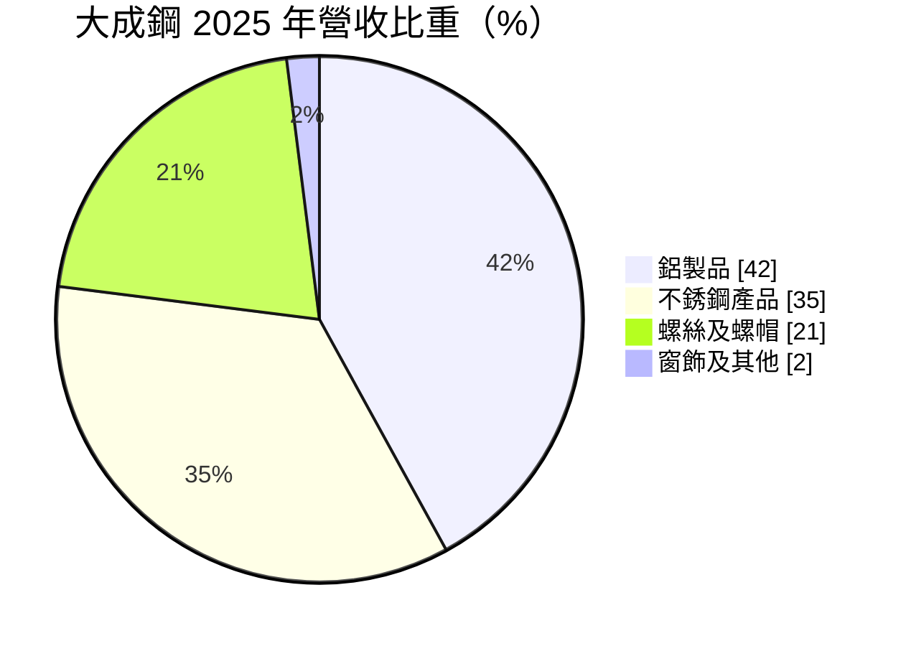
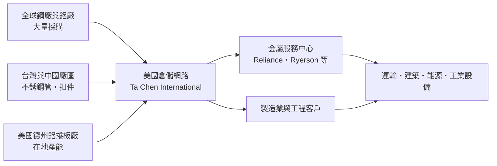
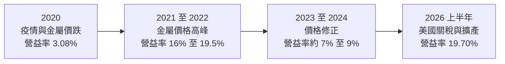
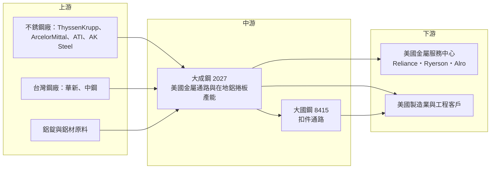

# 2027 大成鋼

> 上市｜[[產業索引-鋼鐵工業|鋼鐵工業]]｜上市（櫃）日期 1996/10/24

# 第一章：企業模式與商業藍圖

> [!info] 撰寫說明
> 本文由 Claude 依公開資料整理，架構比照 [[2330台積電]] 的四章研究，資料截至 2026-10-08。財務數字來源：Goodinfo 年度經營績效、現金流量與股利政策頁、MoneyDJ 理財網財務比率、營收比重與資產負債表、富果研究個股分析、鉅亨號產業研究文章（2025 年 7 月）、證交所開放資料（基本資料、資產負債、綜合損益、營益分析、股利）；產業描述為整理性內容，尚未逐條比對原始文件。#待校對

在評估單一個股的長期投資價值時，首要步驟是拆解企業的底層獲利邏輯。本章針對大成不銹鋼工業（股票代號：2027，以下簡稱大成鋼）的商業模式進行定性分析，說明一家總部在台南的公司，如何以美國金屬通路為核心，把「大量庫存」這個一般人眼中的風險，轉化為在美國市場的競爭優勢。

## 一、核心定位：以美國為主戰場的金屬材料通路商

大成鋼成立於 1986 年，1996 年在台灣證券交易所上市，總部位於台南市仁德區，董事長為謝麗雲、總經理為謝榮坤。雖然名字裡有「不銹鋼」，但大成鋼今天的本質並不是一家煉鋼廠，而是一家以美國市場為主的**金屬材料通路商**。依富果研究整理，大成鋼約 94% 的產品銷往美國，營運中約 96% 屬於貿易通路、自產僅約 4%（以不銹鋼管為主）。

大成鋼的美國通路主要透過美國子公司 Ta Chen International 經營（子公司名稱與據點數為整理性資料，待校對），在美國各地設有倉儲據點，向全球鋼廠與鋁廠大量採購不銹鋼、鋁材與扣件，存放在美國倉庫，再以小批量、多品項、短交期的方式賣給美國的金屬服務中心與製造業客戶。依富果研究整理，最大客戶為美國最大金屬服務中心 Reliance（約占營收 12%），其他客戶包括 Ryerson、Alro Steel 等。

這個定位的核心邏輯是：美國的金屬下游客戶需要的是「當下就有貨」，而不是最便宜的價格。大成鋼用自己的資本負擔龐大庫存，替客戶承擔備貨與價格波動的風險，賺取的是「現貨可得性」的溢價。

## 二、終端應用／產品板塊：鋁、不銹鋼與扣件三分天下

依 MoneyDJ 理財網整理的 2025 年營收比重，鋁製品占 42%、不銹鋼產品占 35%、螺絲及螺帽占 21%、窗飾及其他產品占 2%。

* **鋁製品（以鋁捲板為主）：** 鋁捲板用於運輸設備、建材、容器與工業製品。依鉅亨號 2025 年 7 月的產業研究文章，大成鋼是美國最大的鋁捲板通路商，市占率超過 60%（此為法人引述數字，待校對）。大成鋼在美國德州設有鋁捲板廠，文章指出擴建預計 2026 年初完成，月產能由 1.8 萬噸提升到 3.1 萬噸。擁有美國在地產能，是大成鋼在美國提高鋼鋁關稅後最重要的競爭優勢。
* **不銹鋼產品：** 包括不銹鋼板、管、棒與配件，用於化工、食品設備、能源與建築。大成鋼在台灣自產部分不銹鋼管，其餘多數向全球鋼廠採購。依富果研究整理，大成鋼是美國前四大不銹鋼通路商之一，市占率約 10%。
* **螺絲及螺帽（扣件）：** 主要透過持股的 [[8415大國鋼]] 經營，富果研究整理的持股約 38.8%，大國鋼以不銹鋼扣件通路為主。扣件品項極多、單價低，通路商的價值在於備齊數萬種規格並快速出貨。

## 三、資本轉化邏輯（營運模式）：用資產負債表換取市占

大成鋼的營運模式有三個關鍵特徵：

* **高庫存、慢週轉：** MoneyDJ 資料顯示，大成鋼的平均售貨天數長年在 270 至 290 天之間，2025 年約 280 天，2026 年第二季底存貨約 590 億元，占總資產超過三分之一。對一般製造業來說，九個月的庫存是嚴重警訊；但對大成鋼而言，這是它的商業模式本身：用龐大庫存換取「客戶要什麼都有」的地位。
* **金屬價格的雙面刃：** 庫存大，代表金屬價格上漲時有巨額[[庫存利益]]，下跌時則有[[存貨跌價損失]]。大成鋼的獲利因此高度受鋁價與鎳價（不銹鋼主要合金成本）影響，2021 年金屬價格大漲時毛利率達 30%，2016 年則只有 15%。
* **低應收、低應付：** 2026 年第二季底應收帳款約 126 億元、應付帳款僅約 30 億元（MoneyDJ），代表大成鋼向供應商採購多以現金或短期融資支付，議價時可以爭取較好的價格，但相對需要較多自有資金與銀行借款支應庫存。

## 四、企業長期藍圖：美國製造與在地化

大成鋼的長期策略主軸是「把產能搬到美國」：

* **美國在地鋁捲板產能：** 美國對進口鋼鋁加徵關稅（鉅亨號文章指出已調升至 50%）後，進口商的成本大幅墊高，而大成鋼在美國本土生產的鋁捲板不受影響。德州廠擴產完成後，產能大增約七成，公司有機會進一步擴大市占（法人預估由 60% 提升至 70%，待校對）。
* **不銹鋼與扣件的通路深化：** 不銹鋼與扣件仍以台灣、中國及海外採購為主，長期挑戰在於美國關稅政策對進口品的影響，因此通路的價值會更依賴庫存深度與服務能力，而不是價格。
* **資本配置：** 大成鋼持有庫藏股（2026 年第二季底母子公司合計持有約 2.4 億股，證交所資產負債開放資料），長期有買回自家股票的習慣（推估），這顯示經營層認為公司股價低於內在價值時會動用資本回饋股東。

# 第二章：護城河深度與競爭優勢

在長期價值投資中，「護城河」指企業抵禦競爭、維持超額利潤的保護機制。本章分析大成鋼在美國金屬通路市場的護城河構成、主要對手，以及這些優勢在關稅與金屬價格循環中的韌性。

## 一、護城河的核心組成要素

大成鋼的護城河屬於「中等寬度」，由三個互相強化的要素組成：

* **1. 庫存深度形成的規模優勢：** 金屬通路的競爭力在於能否隨時供應客戶需要的規格。大成鋼擁有數百億元的庫存，品項廣、數量深，中小型通路商難以複製。這種規模讓大成鋼成為美國大型金屬服務中心的「供應商的供應商」，Reliance 等大型客戶依賴它補足自身庫存。
* **2. 美國在地產能：** 在美國提高鋼鋁進口關稅之後，擁有本土產能成為最難複製的優勢。新建一座鋁捲板廠需要數年時間與大量資本，而大成鋼已在德州擁有產能並完成擴建。這個優勢在關稅政策維持時會持續存在。
* **3. 採購議價力：** 大成鋼一次採購量大、付款條件佳（應付帳款天數僅約 10 天，MoneyDJ 2026 年第二季資料），能從全球鋼廠取得較好的價格與供貨優先權。富果研究列出的供應商包括 ThyssenKrupp、ArcelorMittal、ATI、AK Steel、[[1605華新]] 與 [[2002中鋼]]。

## 二、全球主要競爭對手格局

| 對手 | 定位 | 對大成鋼的影響 |
|---|---|---|
| Reliance、Ryerson | 美國大型金屬服務中心 | 既是客戶也是潛在競爭者，若自行擴大進口或庫存會減少對大成鋼的依賴 |
| AA Metals、Metal Exchange | 美國金屬通路商（鉅亨號文章點名） | 在鋁材與不銹鋼通路直接競爭 |
| 美國本土鋁廠（如 Novelis、Arconic 等） | 鋁捲板生產商 | 在美國本土鋁捲板供應上競爭（名單為整理性描述，待校對） |
| [[2002中鋼]]、[[2023燁輝]] 與中國鋼廠 | 亞洲鋼材出口商 | 在不銹鋼與鋼材出口美國時競爭，但受關稅限制 |

## 三、優勢轉化：守得住／守不住／觀察重點

* **守得住：** 美國鋁捲板的在地供應地位。只要美國維持鋼鋁關稅，大成鋼的德州產能就有明顯的成本優勢，市占與毛利率都有支撐。2025 年毛利率回升到 24.7%、2026 年上半年進一步升到 29.02%，反映這個優勢正在轉化為獲利。
* **守不住：** 金屬價格循環帶來的庫存損益。大成鋼無法控制鋁價與鎳價，金屬價格下跌時，龐大庫存會變成跌價損失。2019 至 2020 年與 2023 至 2024 年 ROE 都只有個位數甚至負值，就是金屬價格修正與匯兌損失造成的。
* **觀察重點：** 第一，美國鋼鋁關稅政策是否延續，這是在地產能優勢的前提。第二，德州廠擴產後的產能利用率與鋁捲板市占。第三，新台幣兌美元匯率，因為大成鋼營收以美元為主，匯率波動會造成大額匯兌損益，例如 2024 年第三季曾認列約 6 億元匯兌損失（富果研究）。

# 第三章：財務體質與盈利規模

資料日期：2026-10-08。數字取自 Goodinfo 年度經營績效、現金流量與股利政策頁、MoneyDJ 理財網財務比率與資產負債表、證交所開放資料，表格是撰寫當時的快照；最新月營收、毛利率、累計 EPS 由自動排程寫在本筆記的屬性欄位（月營收、毛利率、累計EPS 等）。#待校對

財務報表是檢驗護城河是否真實存在的最終標準。本章用十年的三率、ROE、現金流與資本報酬，檢視大成鋼在金屬價格循環中的獲利品質。

## 一、獲利能力的基石：三率

| 年度 | 營收（新台幣） | [[毛利率]] | [[營業利益率]] | EPS（元） | [[ROE]] |
|---|---|---|---|---|---|
| 2016 | 477 億 | 15.3% | 3.89% | 0.61 | 4.38% |
| 2017 | 644 億 | 17.7% | 7.31% | 1.25 | 8.96% |
| 2018 | 837 億 | 21.8% | 11.1% | 5.83 | 21.8% |
| 2019 | 779 億 | 18.3% | 6.94% | 1.49 | 6.01% |
| 2020 | 592 億 | 15.1% | 3.08% | -0.44 | -0.28% |
| 2021 | 969 億 | 30.0% | 19.5% | 5.76 | 25.3% |
| 2022 | 1,141 億 | 27.2% | 16.2% | 6.23 | 22.4% |
| 2023 | 1,013 億 | 19.2% | 8.75% | 2.30 | 9.18% |
| 2024 | 904 億 | 18.9% | 6.76% | 1.53 | 6.12% |
| 2025 | 1,018 億 | 24.7% | 13.8% | 2.88 | 9.74% |
| 2026 上半年 | 671.7 億 | 29.02% | 19.70% | 3.10 | 未查得 |

註：2016 至 2025 年取自 Goodinfo 合併報表；2026 上半年取自證交所營益分析與綜合損益開放資料。

* **[[毛利率]]：** 大成鋼的毛利率在 15% 至 30% 之間，遠高於一般金屬通路商。原因是它承擔了庫存風險，金屬價格上漲時能賺取庫存利益，同時美國客戶願意為現貨支付溢價。
* **[[營業利益率]]：** 倉儲、物流與人事費用占營收約 9% 至 11%，營業利益率與毛利率的差距較大，因此營收規模越大、費用攤提越有效率，營業利益率擴張越快。
* **營收趨勢：** 營收從 2020 年的 592 億元成長到 2025 年的 1,018 億元，年複合成長率約 11.5%（推算），其中有相當部分來自金屬價格上漲與美國市占擴大。
* **稅負較高：** 2026 年上半年所得稅費用約 35.6 億元，占稅前淨利約 28.5%（推算），高於台灣 20% 的營所稅率，因為主要獲利來自美國子公司。

## 二、[[ROE]]：資本效率

2021 至 2025 年平均 ROE 約 14.5%（推算），但年度之間落差很大，從 6% 到 25%。大成鋼的 ROE 主要受毛利率波動影響，而槓桿相對保守：MoneyDJ 資料顯示負債比率從 2019 年的 65.6% 降到 2025 年的 42.3%，流動比率長期在 290% 至 370% 之間，財務結構穩健。另外，2026 年第二季底非控制權益約 136.6 億元（證交所），代表部分子公司（如大國鋼）的獲利歸屬其他股東，計算 ROE 時要用歸屬母公司的權益。

## 三、資本支出、自由現金流與股利

| 年度 | 營業現金流 | 投資現金流 | [[自由現金流]] | 現金股利（元） |
|---|---|---|---|---|
| 2019 | 21.1 億 | -34.0 億 | -12.9 億 | 1.0 |
| 2020 | 40.7 億 | 4.95 億 | 45.7 億 | 0.8 |
| 2021 | 127 億 | -71.4 億 | 55.6 億 | 1.8 |
| 2022 | 40.9 億 | -60.9 億 | -20.0 億 | 2.4 |
| 2023 | 253 億 | -95.3 億 | 157 億 | 1.2 |
| 2024 | 152 億 | -64.8 億 | 87.7 億 | 1.1 |
| 2025 | 30.1 億 | -82.1 億 | -52.0 億 | 1.5 |

註：現金流取自 Goodinfo（自由現金流＝營業現金流＋投資現金流），股利依所屬年度列示；2022 年度另配發股票股利 2 元。

* **營運資金的循環：** 大成鋼的營業現金流與金屬價格反向波動。金屬價格上漲時，公司需要用更多現金買庫存，營業現金流變小；價格下跌時庫存變現，現金流大增。2023 年營業現金流高達 253 億元，正是金屬價格修正、庫存回收的結果。
* **資本支出上升：** 2021 年以後投資現金流每年約 60 億至 95 億元，高於過去，主要用於美國產能擴建（推估）。這是大成鋼從純通路走向「通路加在地製造」的投資期。
* **股利政策：** 公司章程規定每年提撥不低於可分配盈餘 20% 發放股利，其中現金股利不低於 20%。實際上大成鋼的現金股利相對保守，2025 年度配發 1.5 元，以 EPS 2.88 元計算[[配發率]]約 52%（推算）。經營層傾向保留現金以支應庫存與擴產，並以庫藏股作為另一種回饋方式。

## 四、[[ROIC]] 與 [[WACC]]：價值創造利差

**ROIC 推算：** 2025 年營業利益約 140.5 億元（營收 1,018 億元 × 營業利益率 13.8%），扣除 20% 稅率後約 112.4 億元。投入資本以 2026 年第二季底計算：股東權益總計 932.3 億元（證交所），有息負債約 532.4 億元（短期借款 120.9 億元、短期票券 2.8 億元、長期借款含一年內到期約 299.4 億元、租賃負債約 109.4 億元，MoneyDJ），合計約 1,464.7 億元，ROIC 約 7.7%（推算）。以 2026 年上半年營業利益 132.3 億元年化，ROIC 約 14.5%（推算）。若以實際約 28% 的有效稅率計算，ROIC 會再低約 1 個百分點。

**WACC 推估（CAPM）：** 假設台灣 10 年期公債殖利率約 1.75%、市場風險溢酬 6%、β 取 1.0（推估，金屬原料類股常見值），股東權益成本約 7.75%；稅前負債成本假設 3%（推估，含部分美元借款），稅後約 2.4%。以市值計算（股價淨值比約 1.40 倍，市值約 1,114 億元），權益約占 68%、負債約占 32%，WACC 約 6.0%（推算）。

**結論：** 大成鋼的 ROIC 在金屬價格好的年份（2021、2022、2026 年上半年）明顯高於 WACC，在修正年份（2020、2023、2024）則接近或低於 WACC。長期平均來看利差為正但不穩定，屬於「有護城河的週期股」。美國在地產能若能讓毛利率中樞從過去的 18% 至 20% 提升到 25% 以上，ROIC 與 WACC 的利差將更穩定地維持在正值。

# 第四章：總體風險與地緣政治

任何企業都無法脫離宏觀環境獨立存在。本章分析大成鋼未來必須面對的地緣政治、產業週期與營運風險。

## 一、地緣政治

* **美國關稅政策的雙面性：** 美國對進口鋼鋁加徵關稅，讓大成鋼的美國在地鋁產能受惠；但同時，大成鋼的不銹鋼與扣件多數仍從亞洲進口，也會承擔關稅成本。關稅政策若隨美國政府更替而大幅調整，大成鋼的相對優勢也會改變。
* **中美貿易衝突：** 大成鋼在中國設有兩座廠（富果研究），若美國對中國製金屬產品加徵更高關稅或限制進口，中國廠的出口將受影響。
* **營收高度集中美國：** 約 94% 產品銷往美國，美國景氣與政策變化對大成鋼的影響遠大於台灣本地。

## 二、產業週期與市場結構

* **金屬價格循環：** 鋁價與鎳價受全球供需、能源成本與中國產能影響，大成鋼的龐大庫存讓它對價格變動特別敏感。十年間 EPS 從 -0.44 元到 6.23 元，週期性明顯。
* **美國製造業景氣：** 金屬服務中心的需求跟著美國製造業、營建與能源投資走，美國景氣衰退時需求會同步下滑。
* **客戶集中：** 最大客戶 Reliance 約占營收 12%，若大型服務中心改變採購策略，會影響大成鋼的出貨。

## 三、營運環境的隱性風險

* **匯率：** 營收與資產多以美元計價，新台幣升值會造成換算損失與匯兌損失。
* **[[存貨跌價損失]]：** 約 280 天的庫存在金屬價格急跌時，可能需要大額提列跌價損失。
* **治理與家族經營：** 大成鋼由創辦家族經營，決策效率高，但資訊揭露與法說會頻率相對有限（推估），投資人取得細部營運資料的難度較高。

## 四、科技或法規演進

* **低碳鋁的需求：** 美國與歐洲客戶越來越重視鋁材的碳足跡，使用再生鋁或綠電生產的低碳鋁逐漸取得溢價。大成鋼的美國鋁廠能否取得足夠的再生料與低碳能源，會影響長期競爭力。
* **[[CBAM]] 與碳關稅：** 若美國未來也推動類似歐盟 CBAM 的碳邊境措施，從亞洲進口的高碳排金屬材料成本將上升，對在地生產者較有利。

# 專有名詞解析

## 金融

- **[[庫存利益]]**：原料或產品價格上漲時，先前以低價買進的庫存被以較高售價賣出所產生的額外利潤。
- **[[存貨跌價損失]]**：存貨的市價低於帳上成本時必須提列的損失，常見於原物料價格急跌時。
- **[[非控制權益]]**：合併子公司中不屬於母公司股東的權益部分，相關獲利不計入母公司 EPS。
- **[[庫藏股]]**：公司從市場買回並持有的自家股票，可用來回饋股東或轉讓員工。
- **[[配發率]]**：現金股利占當年度每股盈餘的比例，用來衡量公司把多少獲利分給股東。
- **[[平均售貨天數]]**：存貨從購入到賣出平均需要的天數，數字越大代表庫存越多、週轉越慢。

## 產業

- **[[金屬服務中心]]**：向鋼廠或鋁廠大量採購金屬材料，再依客戶需求裁切、加工並少量配送的通路業者，美國代表為 Reliance、Ryerson。
- **[[鋁捲板]]**：將鋁錠軋成的捲狀或片狀鋁材，用於運輸設備、建材、容器與工業製品。
- **[[代理商]]**：向原廠採購產品再轉售給下游客戶的通路業者，價值在於庫存、配送與信用服務。
- **[[CBAM]]**：歐盟碳邊境調整機制，對進口鋼鐵等高碳產品依碳排量課徵費用，使低碳製程較具競爭力。
- **[[反傾銷]]**：進口國對低於正常價格銷售的進口商品加徵關稅，以保護本國產業的貿易救濟措施。
- **[[在地生產]]**：在主要銷售市場當地設廠生產，以避開關稅、縮短交期並降低運輸成本。

# 核心供應鏈

## 1. 上游：金屬原料與鋼廠
- 國際不銹鋼廠：ThyssenKrupp、ArcelorMittal、ATI、AK Steel（富果研究列出的供應商）
- 台灣鋼廠：[[1605華新]]、[[2002中鋼]]
- 鋁錠與鋁原料供應商（名稱未查得）

## 2. 中游：大成鋼與關係企業
- 扣件通路關係企業：[[8415大國鋼]]
- 台灣鋼鐵類股同業：[[2014中鴻]]、[[2023燁輝]]

## 3. 下游：美國客戶
- 美國金屬服務中心：Reliance、Ryerson、Alro Steel
- 運輸設備、建築、能源與工業設備製造商

## 最新新聞
<!-- news:start（自動產生，請勿手動編輯此範圍） -->
- 2026-10-08 📰 媒體 17:23｜營收速報 - 大成鋼(2027)9月營收123.97億元年增率高達41.07％｜[鉅亨網](https://news.cnyes.com/news/id/6624986)

完整紀錄：[[2027大成鋼 新聞]]
<!-- news:end -->

## 相關連結
- [公開資訊觀測站](https://mopsov.twse.com.tw/mops/web/t05st03?step=1&firstin=1&co_id=2027)
- [Goodinfo](https://goodinfo.tw/tw/StockDetail.asp?STOCK_ID=2027)
- [Yahoo 股市](https://tw.stock.yahoo.com/quote/2027)
- [鉅亨網新聞](https://www.cnyes.com/twstock/2027/news)
