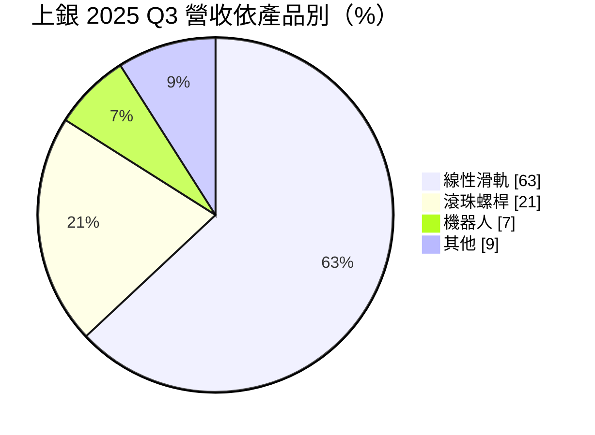
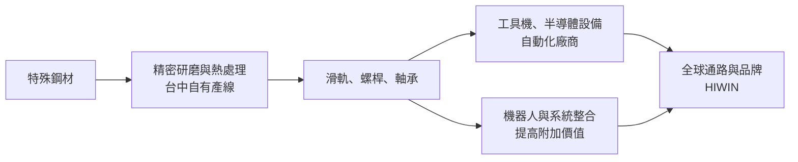
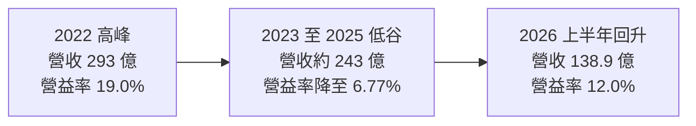
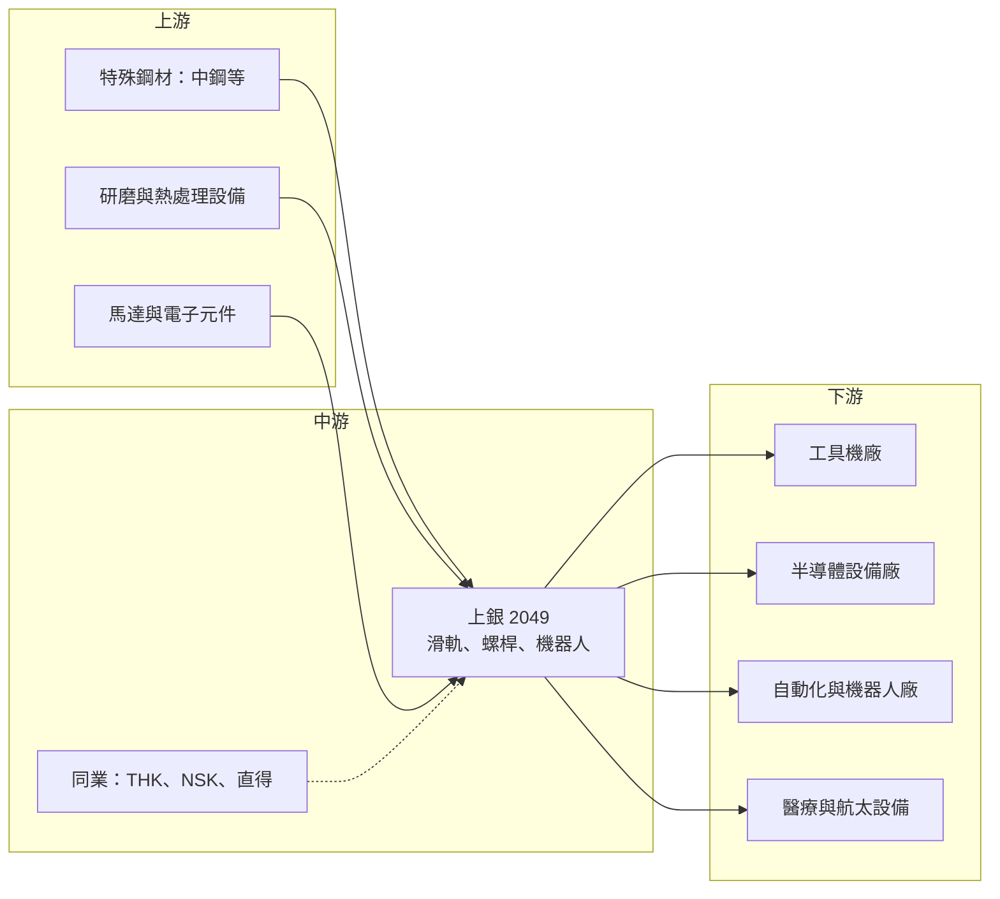

# 2049 上銀

> 上市｜[[產業索引-電機機械|電機機械]]｜上市（櫃）日期 2009/06/26

# 第一章：企業模式與商業藍圖

> [!info] 撰寫說明
> 本文由 Claude 依公開資料整理，架構比照 [[2330台積電]] 的四章研究，資料截至 2026-10-08。財務數字來源：Goodinfo 年度經營績效頁（2020 至 2025 年）、證交所開放資料（基本資料、2026 年第二季資產負債與綜合損益、營益分析、股利）、工商時報 2025 年第三季法說報導、經濟日報與優分析 2025 至 2026 年報導；產業描述為整理性內容，尚未逐條比對原始文件，憑既有知識撰寫的部分已標「待校對」。#待校對

在評估單一個股的長期投資價值時，首要步驟是拆解企業的底層獲利邏輯。本章針對上銀科技（股票代號：2049，以下簡稱上銀）的商業模式進行分析，說明一家台灣精密機械零組件廠，如何在日本與歐洲大廠主導的市場中取得全球前段班的位置，以及它從零組件走向機器人與系統整合的長期方向。

## 一、核心定位：自有品牌的精密傳動元件廠

上銀成立於 1989 年，總部位於台中精密機械科技創新園區，2009 年上市，實收資本額約 35.4 億元，董事長為卓文恒、總經理為蔡惠卿（證交所開放資料）。創辦人卓永財以自有品牌 HIWIN 經營，從一開始就選擇不替外國品牌代工，而是直接與日本、歐洲大廠競爭。#待校對

上銀的核心產品是[[線性滑軌]]與[[滾珠螺桿]]，這兩項零件是讓機器做出精準直線運動的關鍵元件，廣泛用在工具機、半導體設備、自動化產線、醫療設備與機器人上。由於幾乎所有需要精確移動的機器都會用到，上銀的營運可以看作是全球製造業設備投資的縮影。

## 二、終端應用與產品板塊

2025 年第三季的產品營收結構如下（工商時報引述法說資料）：

* **線性滑軌：** 占營收六成以上，是上銀最大的產品線。滑軌讓機台的工作平台沿著軌道平順移動，精度可達微米等級，品質直接影響加工精度與機台壽命。
* **滾珠螺桿：** 占約兩成，負責把馬達的旋轉運動轉換成直線運動，與滑軌搭配使用。高精度、大導程的螺桿在工具機與半導體設備中不可或缺。
* **機器人：** 包含多軸機械手臂、晶圓搬運機器人、SCARA 與醫療機器人等。2025 年第三季占 7%，法人預期 2026 年有機會突破 10%（優分析引述，屬推估）。
* **其他：** 包含軸承、[[減速機]]、線性馬達與驅動控制等機電整合產品。

依地區，2025 年第三季亞洲占 61%、歐洲 27%、台灣 6%、美洲 6%。亞洲中以中國大陸為主要市場，歐洲則是工具機與自動化重鎮，兩者合計接近九成，代表上銀高度依賴外銷，也直接受到中國與歐洲製造業景氣的影響。

## 三、資本轉化邏輯：重資產的精密製造

上銀屬於重資產的製造業，大部分產能集中在台中與嘉義等地的自有工廠，需要大量精密研磨機台、熱處理設備與檢測儀器。#待校對 這種模式有兩個商業特性：

* **營運槓桿高：** 設備折舊與人力成本相對固定，景氣好時產能滿載，毛利率可以拉高到 36% 以上；景氣差時產能閒置，毛利率會明顯下滑。2022 年毛利率 36.6%、2025 年降到 28.8%，正是這種營運槓桿的表現。
* **規模經濟與成本控制：** 精密零件的良率與成本取決於生產規模與製程經驗。上銀以台灣的產業聚落與自建產線，在成本上與日本對手競爭，同時在交期與客製化上提供更彈性的服務。

## 四、企業長期藍圖

上銀的長期策略是從單一零組件供應商，逐步轉型為「元件加整機加系統整合」的解決方案提供者。具體方向包括：

* **機器人業務：** 包含晶圓搬運機器人、工業機械手臂與醫療機器人。上銀與美國新創 Dexterity 合作的 AI 物流機器人預計在 2025 年底至 2026 年初小批量導入（優分析）。
* **人形機器人關鍵元件：** 2026 年推出[[行星滾柱螺桿]]，已與多家台灣廠商測試送樣。人形機器人的關節需要高負載、小體積的傳動元件，若人形機器人走向量產，這會是新的成長來源。
* **半導體設備：** 先進封裝與海外新晶圓廠的投資，帶動晶圓機器人與晶圓移載系統的需求。上銀在 2016 年前後收購以色列晶圓搬運設備公司 Mega-Fabs，強化這塊布局。#待校對
* **價格策略：** 2026 年 3 月底起，上銀針對不同產品與區域調漲價格 7% 至 15%（經濟日報），顯示在需求回溫時具備一定的定價能力。

# 第二章：護城河深度與競爭優勢

本章針對上銀的競爭優勢進行分析。精密傳動元件看似成熟，但真正能在全球市場量產高精度產品的廠商並不多，品牌、精度與產能規模共同構成進入門檻。

## 一、護城河的核心組成要素

* **自有品牌與全球通路：** 上銀從創立初期就堅持自有品牌，在歐洲、日本、美國、中國等地建立銷售與服務據點。設備廠選用零組件時重視長期供貨與售後服務，自有通路讓上銀能直接接觸終端客戶，也能掌握定價權，而不是被代工模式壓縮利潤。#待校對
* **精密製造的經驗與專利：** 滑軌與螺桿的精度、剛性與壽命，取決於材料、熱處理與研磨製程的長期累積。上銀在這些領域累積大量專利與製程經驗，是後進者短期內難以複製的。
* **產品線完整：** 從滑軌、螺桿、軸承、減速機到線性馬達與機器人，上銀能提供設備廠一站式的運動控制方案。客戶整合採購時，完整的產品線能提高黏著度。
* **規模優勢：** 上銀是全球線性滑軌與滾珠螺桿的主要廠商之一，規模讓它在原料採購、設備投資與研發分攤上，比中小型同業更有效率。

## 二、全球主要競爭對手格局

| 公司 | 國家 | 主要產品 | 與上銀的關係 |
|---|---|---|---|
| THK | 日本 | 線性滑軌龍頭 | 全球最大對手，品牌與高階市場優勢 |
| NSK | 日本 | 軸承、滾珠螺桿 | 在螺桿與軸承市場競爭 |
| Bosch Rexroth | 德國 | 線性運動與液壓 | 歐洲市場主要對手 #待校對 |
| Schaeffler | 德國 | 軸承與線性導軌 | 歐洲市場主要對手 #待校對 |
| [[1597直得]] | 台灣 | 線性滑軌、螺桿 | 國內同業，規模較小 |
| 中國本土廠商 | 中國 | 中低階滑軌與螺桿 | 在中國市場以價格競爭 #待校對 |

上銀的定位是介於日本、德國大廠與中國本土廠商之間：精度與品質接近日系，價格與交期更具彈性。美國對中國與日本、韓國、歐洲的關稅條件差異，也影響上銀與各國對手在美國市場的相對競爭力。

## 三、優勢轉化：守得住、守不住與觀察重點

* **守得住：** 中高階的滑軌與螺桿市場，特別是半導體設備、高階工具機與自動化產線。這些客戶重視精度與穩定供貨，上銀的品牌與產能規模能維持一定的定價能力。2026 年 3 月的漲價行動，也和日本 THK 因原物料與能源成本上升而調價同步。
* **守不住：** 中國市場的中低階產品。中國本土廠商在政策扶植下快速擴產，以價格搶占市場。上銀亞洲營收占比高，若中國本土替代加速，營收與毛利率都會承壓。
* **觀察重點：** 第一，機器人營收比重能否持續提升並轉為穩定獲利；第二，人形機器人用的行星滾柱螺桿能否進入量產；第三，產能利用率回升後，毛利率能否回到 2021 至 2022 年 36% 左右的高點。

# 第三章：財務體質與盈利規模

資料日期：2026-10-08。多年度數字取自 Goodinfo 年度經營績效頁，2026 年上半年取自證交所開放資料，表格是撰寫當時的快照；最新月營收、毛利率、累計 EPS 由自動排程寫在本筆記的屬性欄位（月營收、毛利率、累計EPS 等）。#待校對

財務報表是檢驗護城河是否真實存在的最終標準。本章用多年度的三率、ROE、現金流與資本報酬，檢視上銀在工具機景氣循環中的獲利品質。

## 一、獲利能力的基石：三率

| 年度 | 營收（新台幣） | [[毛利率]] | [[營業利益率]] | EPS（元） | [[ROE]] |
|---|---|---|---|---|---|
| 2020 | 213 億 | 27.2% | 8.15% | 6.05 | 6.66% |
| 2021 | 273 億 | 36.0% | 18.8% | 10.36 | 10.9% |
| 2022 | 293 億 | 36.6% | 19.0% | 12.98 | 13.2% |
| 2023 | 246 億 | 31.1% | 10.8% | 5.75 | 5.23% |
| 2024 | 244 億 | 29.6% | 8.44% | 5.57 | 5.16% |
| 2025 | 243 億 | 28.8% | 6.77% | 4.31 | 3.78% |
| 2026 上半年 | 138.9 億 | 33.1% | 12.0% | 4.03 | 未查得 |

* **景氣循環明顯：** 上銀的營收在 2022 年達 293 億元高峰後，連續三年停在 243 億至 246 億元，營業利益率由 19% 降到 6.77%。這三年是工具機與自動化設備的低谷，也顯示上銀的獲利對產能利用率非常敏感。
* **營運槓桿的反向作用：** 營收只比高峰少約 17%，營業利益卻縮小約七成，因為折舊與人力成本相對固定。反過來說，2026 年上半年營收年增約 18%，營業利益率就回到 12%（證交所營益分析），這是同一個營運槓桿在景氣回升時的效果。
* **長期成長：** 2020 至 2025 年營收年複合成長率約 2.7%（推算），長期成長主要靠景氣高峰拉升，低谷時則停滯。

## 二、[[ROE]]：資本效率

2021 至 2025 年平均 ROE 約 7.7%（推算），高峰年度也只有 13% 左右。上銀的 ROE 偏低，原因在於它是重資產製造業，股東權益規模大（2026 年第二季底歸屬母公司權益約 391.7 億元，每股淨值約 110.7 元），而且長期保留大量盈餘再投資於產能。負債比約 31%（證交所開放資料），財務結構穩健，但資本效率有改善空間。

## 三、資本支出與自由現金流

上銀過去在景氣高峰期大舉擴建廠房與設備，這些產能在 2023 至 2025 年的低谷期造成折舊壓力，具體[[CapEx]]金額本次未查得。推估在擴產高峰期[[自由現金流]]較緊，低谷期因資本支出放緩而轉為較寬裕。

股利方面，2025 年度每股配發現金股利 2.0 元，配發率約 46%（證交所股利資料，推算）。2025 年底累積的未分配盈餘超過 200 億元，代表公司偏好保留盈餘、支應長期擴產與轉型，而不是提高配息。

## 四、[[ROIC]] 與 [[WACC]]：價值創造利差

* **ROIC（推算）：** 2025 年營業利益約 243 億元 × 6.77% ≈ 16.5 億元，稅後約 13.2 億元。投入資本以 2026 年第二季底權益總計 392.4 億元，加上假設的有息負債約 100 億元（開放資料未拆分借款，以非流動負債 80.8 億元加上部分短期借款推估），合計約 492 億元，ROIC 約 2.7%（推算）。若以 2026 年上半年營業利益 16.6 億元年化，稅後約 26.6 億元，ROIC 約 5.4%（推算）。2022 年高峰時營業利益約 55.7 億元，ROIC 推估約 10%。
* **WACC（推算）：** 無風險利率 1.75%、市場風險溢酬 6%，β 取機械設備股常見值 1.1，股東權益成本約 8.35%；負債成本 2.5%、稅後約 2.0%；權益約占 80%，WACC 約 7.1%（推算）。
* **結論：** 上銀只有在景氣高峰期 ROIC 才明顯高於 WACC，2023 至 2025 年的低谷期 ROIC 低於資金成本，代表在這段期間並未創造經濟價值。長期而言，上銀必須透過機器人等高附加價值業務提高產品組合，或提升產能利用率，才能讓 ROIC 在整個循環中穩定高於 WACC。

# 第四章：總體風險與地緣政治

任何企業都無法脫離宏觀環境獨立存在。本章分析上銀長期必須面對的地緣政治、產業週期與營運風險。

## 一、地緣政治風險

* **中國市場依賴：** 亞洲營收占六成以上，中國大陸是主要市場。中國推動關鍵零組件國產化，本土滑軌與螺桿廠在政策支持下擴產，可能侵蝕上銀在中國的市占率。
* **美國關稅：** 美國對台灣、日本、韓國、歐洲產品的關稅條件不同，會改變上銀與對手在美國市場的相對價格。美洲營收只占約 6%，但美國製造業回流帶動的自動化需求，是潛在的成長機會。
* **出口管制：** 高精度運動控制元件可能被視為敏感技術，若各國加強出口管制，對中國高階客戶的銷售可能受到限制。#待校對

## 二、產業週期與市場結構風險

* **工具機循環：** 上銀的營收與全球工具機訂單高度相關。工具機屬於資本財，需求受製造業投資意願、利率與匯率影響，通常有 3 至 5 年的循環。2023 至 2025 年的低谷顯示，即使是龍頭廠商也難以避開景氣下行。
* **[[長鞭效應]]：** 設備廠在景氣好時大量備貨零組件，景氣反轉時又同步去庫存，使上銀的訂單波動大於終端需求。
* **淡旺季：** 每年第四季至隔年第一季通常是傳統淡季。

## 三、營運環境的隱性風險

* **原料成本：** 特殊鋼材與能源價格上漲會壓縮毛利率，需要透過漲價轉嫁，但轉嫁有時間落差。
* **匯率：** 外銷比重近九成，新台幣升值、日圓貶值都會影響競爭力。日圓長期弱勢讓日本對手在價格上更有彈性。
* **高額折舊：** 過去擴產累積的設備折舊，在低谷期會成為獲利的沉重負擔。

## 四、科技演進風險

運動控制領域的技術變化相對緩慢，但有兩個方向值得注意。第一，線性馬達與直驅技術可能在部分高階應用取代傳統的螺桿傳動，上銀已布局線性馬達，但需要持續投資。第二，人形機器人與 AI 物流機器人若成為新的大型市場，需要的是小型化、高負載的傳動元件與整合控制能力，誰能率先進入主要機器人廠的供應鏈，將決定下一個十年的市場地位。

# 專有名詞解析

## 金融

- **[[毛利率]]**：營業毛利占營收的比例，反映產品定價能力與生產成本控制。
- **[[營業利益率]]**：扣除營業費用後的營業利益占營收的比例，衡量本業整體獲利能力。
- **[[ROE]]**：股東權益報酬率，稅後淨利除以股東權益，衡量公司運用股東資金的效率。
- **[[ROIC]]**：投入資本報酬率，稅後營業利益除以股東權益與有息負債的合計，衡量本業對所有資金提供者的報酬。
- **[[WACC]]**：加權平均資金成本，依股東權益與負債的比重加權計算的資金成本，ROIC 高於它才代表創造價值。
- **[[CapEx]]**：資本支出，企業用於購置廠房、設備等長期資產的支出。
- **[[自由現金流]]**：營業活動現金流減去資本支出，代表企業可自由用於配息、還債或併購的現金。
- **[[長鞭效應]]**：終端需求的小幅變動，沿供應鏈往上游傳遞時被逐級放大，造成上游庫存與訂單劇烈波動。

## 產業

- **[[線性滑軌]]**：讓機台平台沿直線平順移動的導軌元件，精度可達微米等級，是工具機與自動化設備的關鍵零件。
- **[[滾珠螺桿]]**：把馬達的旋轉運動轉換為直線運動的傳動元件，透過滾珠降低摩擦，提高定位精度與效率。
- **[[行星滾柱螺桿]]**：以多支滾柱取代滾珠的螺桿，承載力更高、體積更小，被視為人形機器人關節的關鍵元件。
- **[[減速機]]**：降低馬達轉速、放大輸出扭力的裝置，機器人每個關節都需要使用，常見類型有諧波與 RV 減速機。
- **[[工具機]]**：用來切削、研磨金屬等材料以製造機械零件的機器，被稱為「機器之母」，需求反映製造業投資景氣。
- **[[晶圓搬運機器人]]**：在半導體設備內部或設備之間搬運晶圓的機械手臂，需要高潔淨度與高精度。

# 核心供應鏈

## 1. 上游：原料與設備
- 特殊鋼材：[[2002中鋼]] 等鋼廠與進口軸承鋼。#待校對
- 精密研磨機台、熱處理與量測設備。
- 馬達、驅動器與感測器等電子元件。

## 2. 中游：上銀本身
- 線性滑軌、滾珠螺桿、軸承、減速機、線性馬達與機器人。
- 相關企業：[[4576大銀微系統]]（精密運動控制平台）。#待校對

## 3. 下游：客戶產業
- 工具機：台灣、中國、歐洲與日本的工具機廠，例如 [[1530亞崴]]、[[4526東台]]。#待校對
- 半導體設備：晶圓搬運與先進封裝設備廠。
- 自動化、物流機器人（如美國 Dexterity）、醫療與航太設備。

## 4. 同業與競爭者
- 國際：THK、NSK、Bosch Rexroth、Schaeffler。
- 台灣：[[1597直得]]。

## 最新新聞
<!-- news:start（自動產生，請勿手動編輯此範圍） -->
- 2026-10-06 📰 媒體 16:50｜營收速報 - 上銀(2049)9月營收27.20億元年增率高達30.14％｜[鉅亨網](https://news.cnyes.com/news/id/6622752)

完整紀錄：[[2049上銀 新聞]]
<!-- news:end -->

## 相關連結
- [公開資訊觀測站](https://mopsov.twse.com.tw/mops/web/t05st03?step=1&firstin=1&co_id=2049)
- [Goodinfo](https://goodinfo.tw/tw/StockDetail.asp?STOCK_ID=2049)
- [Yahoo 股市](https://tw.stock.yahoo.com/quote/2049)
- [鉅亨網新聞](https://www.cnyes.com/twstock/2049/news)
