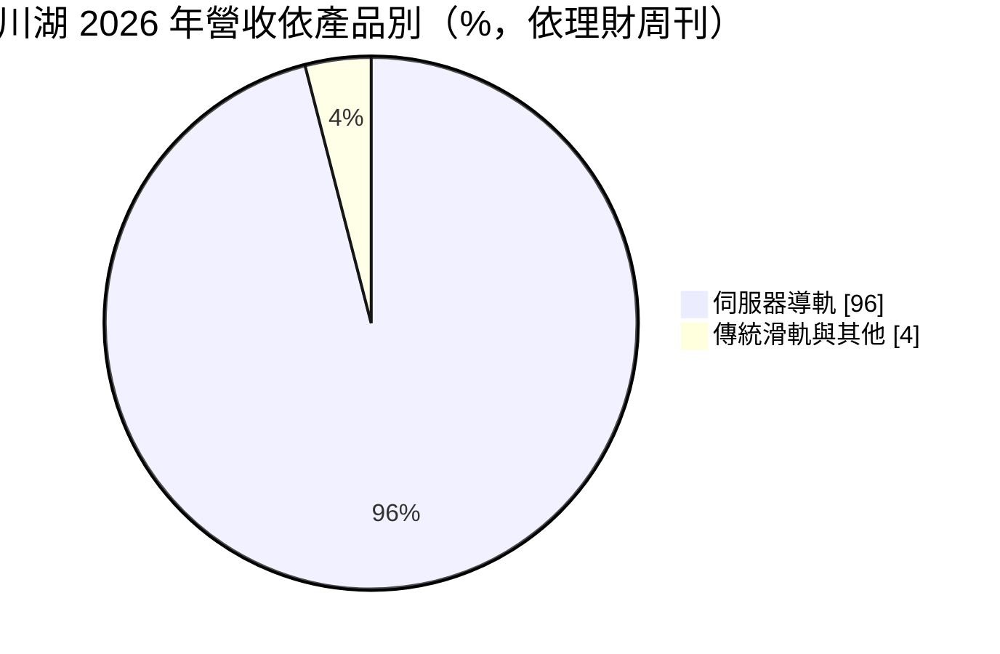
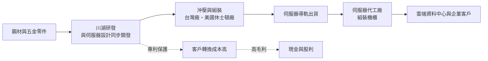
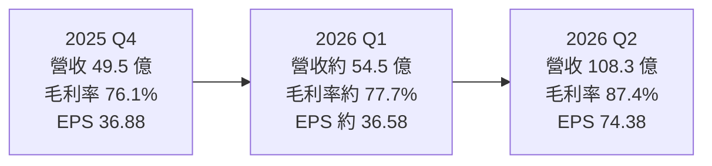
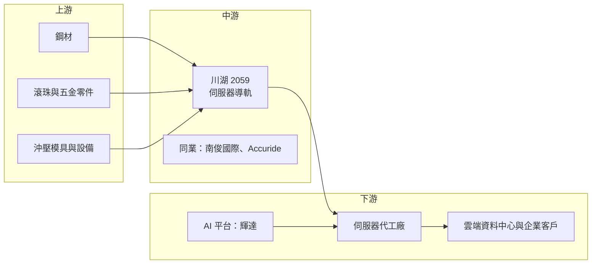

# 2059 川湖

> 上市｜[[產業索引-電子零組件業|電子零組件業]]｜上市（櫃）日期 2008/06/25

# 第一章：企業模式與商業藍圖

> [!info] 撰寫說明
> 本文由 Claude 依公開資料整理，架構比照 [[2330台積電]] 的四章研究，資料截至 2026-10-07。財務數字來源：富果研究 2026 年 2 月法說會整理、優分析 2026 年第二季財報報導、理財周刊 2026 年 8 月報導、Yahoo 股市公司基本資料；產業描述為整理性內容，尚未逐條比對原始文件。#待校對

在評估單一個股的長期投資價值時，首要步驟是拆解企業的底層獲利邏輯。本章針對川湖科技（股票代號：2059，以下簡稱川湖）的商業模式進行定性分析，說明一家做「滑軌」的五金零件廠，為何能在 [[AI伺服器]]時代交出八成以上的毛利率。

## 一、核心定位：全球伺服器滑軌龍頭

川湖成立於 1986 年 9 月 22 日，2008 年上市，董事長為林聰績。公司主要產品是[[伺服器導軌]]（滑軌），也就是把伺服器裝進機櫃、讓維修人員可以把整台機器拉出來檢修的金屬軌道，另外也生產筆電樞紐與廚具、家具用的傳統滑軌。

伺服器滑軌看起來是簡單的金屬件，但每一款伺服器的尺寸、重量、散熱設計與機櫃規格都不同，必須在伺服器設計初期就同步開發。AI 伺服器重量大幅增加，對承重、耐用度與安全性的要求更高。依理財周刊 2026 年 8 月報導，川湖全球伺服器導軌市占率超過三成，是 [[NVDA輝達]] Blackwell 世代（GB200、B200）伺服器導軌的主要供應商。

* **以專利與客製化換取定價權：** 川湖擁有大量滑軌專利，且多數產品是為特定機種客製，客戶不易以價格比較換掉供應商。
* **輕資產的高毛利：** 滑軌單價占整台伺服器成本比例極低，客戶對價格不敏感，但對品質與交期要求高，這是毛利率能從七成多升到八成以上的結構原因。

## 二、終端應用板塊：伺服器滑軌占九成以上

依理財周刊報導，伺服器導軌占營收約 96%，其餘為廚具、家具滑軌與筆電樞紐等傳統產品：

* **伺服器導軌：** 涵蓋 CPU 伺服器、GPU 與 [[TPU]]、[[ASIC]] 等 AI 伺服器、儲存設備。客戶類型中，企業端與超大規模資料中心各約一半。
* **AI 伺服器：** 機架級 AI 伺服器（如輝達 [[NVL72]] 架構）重量大、密度高，帶動單價較高的導軌需求。
* **傳統應用：** 廚具、家具滑軌與筆電樞紐，比重持續下降。

## 三、資本轉化邏輯：小產品、大定價權

* **研發驅動、量產簡單：** 價值集中在設計與專利，製造本身資本密集度不高。2026 年資本支出預估僅 700 萬至 800 萬美元，與每季數十億元的營業利益相比非常小。
* **產能還有空間：** 依 2026 年 2 月法說會，台灣產能利用率約 60%；美國休士頓廠在 2026 年下半年量產，依理財周刊報導可增加約 20% 產能，另規劃川益二期、路竹二期與高雄廠（預計 2027 年下半年投產）。
* **規格升級帶動營收：** 2026 年第二季營收 108.3 億元，季增約 99%，顯示 AI 機櫃出貨放量時，導軌營收會跳躍式成長。

## 四、企業長期藍圖：跟著 AI 機櫃走向全球

* **美國在地生產：** 休士頓廠回應客戶在美國組裝 AI 伺服器的需求，也降低關稅風險。
* **AI 自動化滑軌：** 公司積極布局可配合自動化維運的新型滑軌，延伸到資料中心運維需求。
* **市占提升：** 理財周刊報導川湖在 AI 伺服器導軌的目標占有率可望達五成。

# 第二章：護城河深度與競爭優勢

在長期價值投資中，「護城河」指企業抵禦競爭、維持超額利潤的保護機制。本章分析川湖的護城河構成、全球主要競爭對手，以及這些優勢在 AI 伺服器規格快速演進下能守住多少。

## 一、川湖護城河的核心組成要素

川湖是台灣電子零組件中毛利率最高的公司之一，屬於「寬護城河」，由三個要素組成：

* **1. 專利壁壘：** 滑軌的鎖定、緩衝、快拆等機構都可申請專利，川湖長年累積大量專利並曾積極維權，提高對手仿製門檻。
* **2. 與伺服器設計同步開發的轉換成本：** 導軌必須配合每一款機種的機構設計與測試，一旦被設計進平台，整個產品週期都會由同一家供應。
* **3. 低成本占比帶來的定價權：** 導軌在 AI 伺服器總成本中比例很小，客戶更在意不出錯，而不是省下一點零件成本。

## 二、全球主要競爭對手格局

| 對手 | 定位 | 對川湖的威脅 |
|---|---|---|
| [[6584南俊國際]] | 台灣滑軌廠，伺服器與工業滑軌 | 以價格與交期爭取次要供應商份額 |
| Accuride | 美國老牌滑軌廠 | 具美國本土品牌與產能 |
| 中國滑軌廠 | 中國伺服器與通用滑軌 | 在中國本土伺服器市場以低價競爭 |
| 伺服器廠自製機構件 | 部分 ODM 嘗試整合機構件 | 長期可能壓縮外購比例 |

## 三、優勢轉化：哪些市場守得住、哪些守不住

* **守得住：** 高重量、高密度的 AI 機架與北美大型資料中心專案，這些客戶重視可靠度與專利安全。
* **守不住：** 一般企業伺服器與中國市場的低階導軌，價格競爭較激烈。
* **觀察重點：** 毛利率從 2025 年 76% 升到 2026 年第二季 87.4%，已遠超公司原先「76% 上下 1.5 至 2 個百分點」的指引。這種水準能否延續，取決於 AI 機架的產品組合，以及第二供應商是否被客戶引進。

# 第三章：財務體質與盈利規模

資料日期：2026-10-07。數字取自富果研究法說會整理與優分析財報報導，表格是撰寫當時的快照；最新月營收、毛利率、累計 EPS 由自動排程寫在本筆記的屬性欄位（月營收、毛利率、累計EPS 等）。#待校對

財務報表是檢驗護城河是否真實存在的最終標準。本章用三率、ROE、現金流與資本報酬，檢視川湖在 AI 伺服器週期中的獲利品質。

## 一、獲利能力的基石：三率

| 項目 | 2025 全年 | 2025 Q4 | 2026 Q1 | 2026 Q2 |
|---|---|---|---|---|
| 營收（新台幣） | 175 億 | 49.49 億 | 約 54.5 億（推算） | 108.3 億 |
| [[毛利率]] | 76.05% | 76.1% | 約 77.7%（推算） | 87.4% |
| [[營業利益率]] | 69.07% | 69.2% | 約 67.1%（推算） | 82.1% |
| 稅後淨利 | 98.37 億 | 35.14 億 | 約 34.8 億（推算） | 70.9 億 |
| EPS（元） | 103.23 | 36.88 | 約 36.58（推算） | 74.38 |

* **[[毛利率]]：** 2026 年第二季 87.4%，季增 9.7 個百分點，反映 AI 機架導軌占比提高與營收倍增後的固定成本攤提。
* **[[營業利益率]]：** 營業費用率約 7%，營收倍增時費用幾乎不變，因此營益率可達 82.1%，2026 年上半年 EPS 110.96 元已超過 2025 年全年。
* **業外：** 2026 年第二季稅後淨利年增逾十倍，部分原因是 2025 年同期有匯兌損失、基期偏低，評估時應以營業利益為準。

## 二、[[ROE]]：資本效率

依 Yahoo 股市資料，2026 年第二季 ROE 為 22.95%（單季）。川湖負債比約 20%，ROE 完全由本業高獲利支撐，而非財務槓桿。

## 三、資本支出與自由現金流

* **[[CapEx]]：** 2026 年預估 700 萬至 800 萬美元，加上新廠土地與廠房，相對於獲利規模仍小。
* **[[自由現金流]]：** 2025 年底現金部位約 240.7 億元，每股淨值約 294 元。極高的營益率加上低資本支出，使自由現金流非常充裕，股利發放能力強（具體股利金額未查得）。

## 四、[[ROIC]] 與 [[WACC]]：價值創造利差

川湖的投入資本主要是廠房、設備與營運資金，規模不大，營業利益卻以數十億元計，ROIC 推估遠高於 WACC，屬於典型的高資本報酬企業。風險在於這樣的超額報酬會吸引競爭者與客戶議價，未來利差可能收斂。

# 第四章：總體風險與地緣政治

任何企業都無法脫離宏觀環境獨立存在。本章分析川湖未來必須面對的地緣政治、產業週期與營運風險。

## 一、地緣政治風險

* **美國關稅與在地化：** AI 伺服器組裝逐步移往美國與墨西哥，川湖以休士頓廠因應，但新廠的成本與良率仍待驗證。
* **台灣集中：** 主要研發與產能在台灣高雄一帶，面臨兩岸風險。

## 二、產業週期與市場結構風險

* **AI 資本支出週期：** 營收高度集中於伺服器，雲端業者的資本支出若放緩，導軌需求會同步下滑，並因[[長鞭效應]]放大。
* **客戶集中：** 輝達平台與少數超大規模資料中心占比高，平台世代交替時可能出現訂單空窗。

## 三、營運環境的隱性風險

* **毛利率回歸：** 2026 年第二季毛利率遠超公司原先指引，產品組合改變或客戶議價，都可能讓毛利率回落到七成多。
* **產能擴充：** 美國廠、路竹二期與高雄廠同時推進，需要擴大人力與管理能力。
* **匯率：** 以美元報價為主，新台幣升值會影響獲利。

## 四、科技演進風險

AI 伺服器朝更高密度、[[液冷]]與機櫃整體出貨發展，導軌設計需要配合重量、管線與維修方式改變。若未來機櫃架構改為不需傳統滑軌的設計，或由機櫃廠整合機構件，川湖的產品定位需要跟著調整。

# 專有名詞解析

## 半導體

- **[[TPU]]**：Google 自行設計的 AI 加速晶片，屬於 ASIC 的一種。
- **[[ASIC]]**：特殊應用積體電路，為特定用途客製的晶片，例如雲端業者自研的 AI 加速器。

## 應用

- **[[AI伺服器]]**：搭載 GPU 或 ASIC 加速器、用於 AI 訓練與推論的伺服器，重量與功耗遠高於一般伺服器。
- **[[NVL72]]**：輝達把 72 顆 GPU 以高速互連整合在一個機櫃內的 AI 伺服器架構。

## 金融

- **[[CapEx]]**：資本支出，企業購買土地、廠房與設備的支出。
- **[[自由現金流]]**：營業活動現金流減去資本支出，代表企業可自由用於配息、還債或併購的現金。
- **[[長鞭效應]]**：終端需求的小幅變動，沿供應鏈往上游傳遞時被逐級放大，造成上游庫存與訂單劇烈波動。

## 產業

- **[[伺服器導軌]]**：把伺服器固定在機櫃中並可拉出維修的滑軌，需依每款機種的尺寸與重量客製。
- **[[液冷]]**：以液體帶走晶片熱量的散熱方式，高功耗 AI 伺服器逐步從氣冷改為液冷。

# 核心供應鏈

## 1. 上游：材料
- 鋼材與五金零件：供應商未揭露

## 2. 中游：滑軌同業
- [[6584南俊國際]]、Accuride

## 3. 下游：平台與客戶
- AI 平台：[[NVDA輝達]]（Blackwell 世代導軌主要供應商）
- 伺服器代工廠（推估，依產業結構）：[[2382廣達]]、[[6669緯穎]]、[[2317鴻海]]
- 終端：超大規模資料中心與企業客戶，約各占一半

## 最新新聞
<!-- news:start（自動產生，請勿手動編輯此範圍） -->
- 2026-10-08 📰 媒體 09:30｜台股開盤重挫逾400點！連假賣壓出籠，川湖(2059)再吞跌停、信驊(2574)跌逾9%｜[鉅亨網](https://news.cnyes.com/news/id/6624579)
- 2026-10-07 🏛️ 重訊 10:39｜澄清經濟日報A03版報導｜[觀測站](https://mops.twse.com.tw/mops/#/web/t05st01)
- 2026-10-07 📰 媒體 10:00｜川湖(2059)開盤跌停引關注！高價AI股分歧，資金轉進光通訊與被動元件｜[鉅亨網](https://news.cnyes.com/news/id/6623457)
- 2026-10-06 📰 媒體 17:50｜營收速報 - 川湖(2059)9月營收44.64億元年增率高達196.22％｜[鉅亨網](https://news.cnyes.com/news/id/6622818)
- 2026-10-06 🏛️ 重訊 15:03｜係因本公司有價證券於集中交易市場達公布注意交易資訊標準， 故公布相關財務業務等重大訊息，以利投資人區別瞭解｜[觀測站](https://mops.twse.com.tw/mops/#/web/t05st01)

完整紀錄：[[2059川湖 新聞]]
<!-- news:end -->

## 相關連結
- [公開資訊觀測站](https://mopsov.twse.com.tw/mops/web/t05st03?step=1&firstin=1&co_id=2059)
- [Goodinfo](https://goodinfo.tw/tw/StockDetail.asp?STOCK_ID=2059)
- [Yahoo 股市](https://tw.stock.yahoo.com/quote/2059)
- [鉅亨網新聞](https://www.cnyes.com/twstock/2059/news)
