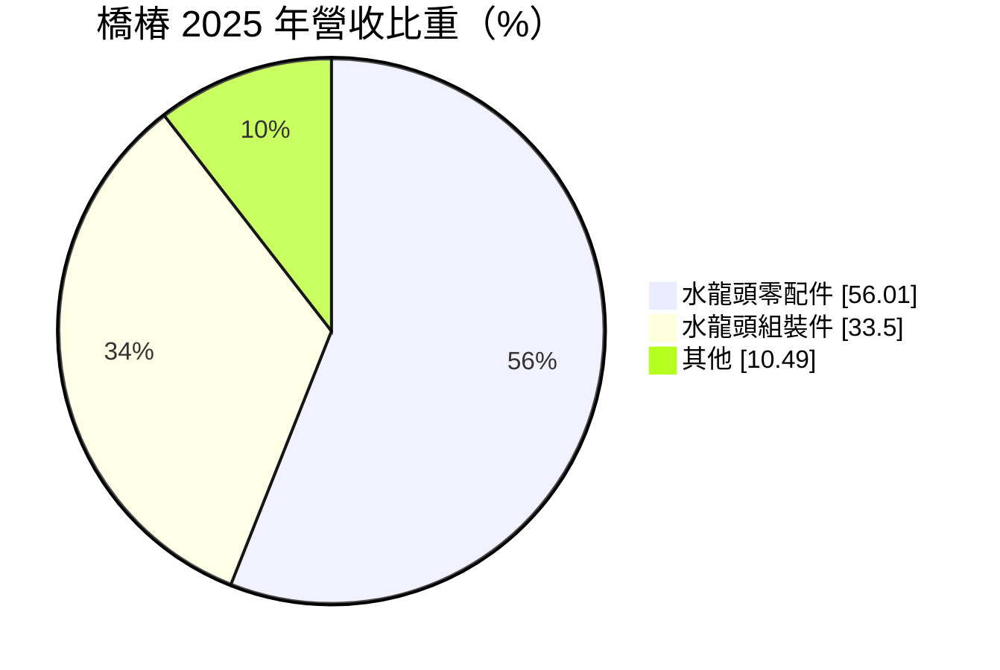
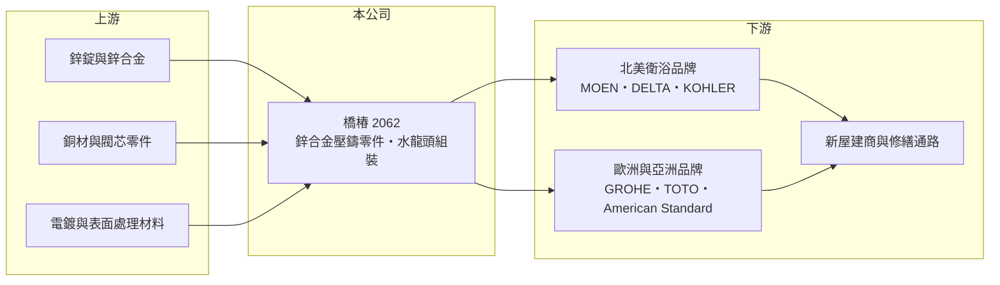

# 2062 橋椿

> 上市｜[[產業索引-居家生活|居家生活]]｜上市（櫃）日期 2007/11/16

# 第一章：企業模式與商業藍圖

> [!info] 撰寫說明
> 精簡版，由 Claude 依公開資料整理，架構比照 [[2330台積電]]，資料截至 2026-10-08。來源：Goodinfo 年度經營績效、富邦 e 點通（MoneyDJ）公司基本資料、富果研究 2026 年 5 月法說會整理與 2024 年個股分析。海外生產據點未查得。#待校對

本章說明橋椿（2062）如何以鋅合金壓鑄切入全球水龍頭品牌供應鏈。

- **核心業務：** 橋椿金屬成立於 1984 年，2007 年上市，總部在台中中部科學園區，生產以[[壓鑄]]與沖壓製成的水龍頭零配件，以及組裝完成的水龍頭成品。產品九成以上用於廚房與衛浴，客戶是北美與歐洲的大型水龍頭品牌。依 2026 年法說會，橋椿可服務的零件市場約 45 億美元、成品市場約 90 億美元。
- **營收結構：** 依 2025 年營收比重，水龍頭零配件占 56.0%，水龍頭組裝件 33.5%，其他 10.5%。鋅合金產品約占營收七至八成。依地區，2026 年第一季北美占 72%、亞洲 15%、歐洲 13%，北美房市是最主要的需求來源。
- **客戶：** 主要客戶包括 MOEN、KOHLER、DELTA、GROHE、TOTO 與 American Standard 等國際衛浴品牌。依 2024 年富果分析，公司前五大客戶合計占北美與歐洲水龍頭市場六成以上，客戶集中但都是產業龍頭。
- **長期方向：** 核心成長邏輯是「[[以鋅代銅]]」：鋅合金原料成本低於銅，又符合愈來愈嚴格的飲用水含鉛規範，這個趨勢正從北美擴散到歐洲與亞洲。管理層目標是把全球零件市占率從約 4% 提高到 10% 以上，並從 [[OEM]] 零件供應商轉型為 [[ODM]] 成品供應商；組裝件比重從 2020 年的 14% 升到 2023 年的 38%，就是這條路線的成果。

# 第二章：護城河深度與競爭優勢

本章分析橋椿的護城河與競爭位置。

- **競爭優勢：** 鋅合金水龍頭零件需要壓鑄、表面處理與精密加工的整合能力，並通過品牌客戶與各國飲用水法規的認證。一旦成為大品牌的合格供應商，轉換成本很高，合作關係通常維持多年。橋椿也投入自動化組裝，讓它能從賣零件延伸到賣整支水龍頭，提高每位客戶的產值。
- **主要對手：** 水龍頭品牌本身多有銅製零件的自製或長期供應商，中國廣東、浙江也有大量衛浴零件廠。台灣同業包括以品牌與代工並行的 [[9934成霖]] 與衛浴品牌 [[1817凱撒衛]]。橋椿的定位是專注鋅合金零件的專業代工廠。
- **觀察重點：** 第一是以鋅代銅能否在歐洲與亞洲加速滲透。第二是 ODM 成品比重能否提高並維持毛利率。第三是北美新屋開工與修繕需求的恢復程度，因為 2025 年營收下滑與毛利率降到 9.7%，主要就是北美需求疲弱造成的。

# 第三章：財務體質與盈利規模

資料日期：2026-10-08，表格是撰寫當時的快照；最新月營收、毛利率、累計 EPS 由自動排程寫在本筆記的屬性欄位（月營收、毛利率、累計EPS 等）。#待校對

本章用五年數字檢視橋椿隨北美房市起伏的獲利表現。

| 年度 | 營收（新台幣） | [[毛利率]] | [[營業利益率]] | EPS（元） | [[ROE]] |
|---|---|---|---|---|---|
| 2021 | 96.4 億 | 14.3% | 5.81% | 2.48 | 7.43% |
| 2022 | 82.4 億 | 16.5% | 8.53% | 3.68 | 10.7% |
| 2023 | 75.7 億 | 11.9% | 4.48% | 1.57 | 4.29% |
| 2024 | 75.7 億 | 14.4% | 6.70% | 2.72 | 7.09% |
| 2025 | 62.9 億 | 9.71% | 1.13% | 0.39 | 1.01% |

- **營收規模：** 營收從 2021 年的 96.4 億元降到 2025 年的 62.9 億元，年複合成長率約 -10.1%（推算）。2021 年受惠疫情期間的居家修繕熱潮，之後美國升息壓抑房市，需求逐年下滑。
- **獲利：** 毛利率在 10% 至 17% 之間，營業利益率 1% 至 9%，屬於製造代工的典型水準，獲利對產能利用率很敏感。近五年平均 ROE 約 6.1%（推算），2025 年降到約 1%。
- **財務特色：** 依法說會，2026 年 3 月底總資產 116 億元、負債 40.3 億元、負債比約 35%，每股淨值約 38 元，財務結構穩健。股本 20 億元多年未變，Goodinfo 統計的歷年平均現金股利約 1.52 元，獲利下滑時配息也會跟著調整。
- **[[ROIC]] 與 [[WACC]]：** 2025 年營業利益約 0.71 億元（62.9 億 × 1.13%），以 20% 稅率計算稅後營業利益約 0.57 億元；股東權益約 76 億元（每股淨值 38.04 元 × 2 億股），總負債約 39.8 億元、假設一半為有息負債約 19.9 億元，ROIC 約 0.6%（推算）；2024 年約 4.1%（推算）。WACC 以 CAPM 推估：無風險利率 1.75%、市場風險溢酬 6%，MoneyDJ 揭露 β 為 0.32，保守改用景氣循環型製造業常見值 0.9，股東權益成本約 7.15%；稅後負債成本約 2%，股權權重約 79%，WACC 約 6.1%（推算）。近年 ROIC 低於 WACC，代表在北美需求低迷期間本業沒有創造價值；若以鋅代銅與 ODM 轉型能讓營業利益率回到 8% 以上，ROIC 才有機會重新超過資金成本。

# 第四章：總體風險與地緣政治

本章整理橋椿長期必須面對的風險。

- **產業週期：** 水龍頭需求取決於北美新屋開工與舊屋修繕，與美國利率、房價高度相關。升息期間房市降溫，訂單減少會透過品牌商的庫存調整放大到零件廠。
- **營運風險：** 客戶集中在少數國際衛浴品牌，北美營收占七成以上，單一客戶調整採購策略影響很大。轉型 ODM 需要投入設計與自動化資本，若成品訂單不如預期，產能利用率下降會壓縮毛利率。
- **其他風險：** 鋅價是主要成本變數，價格上漲時未必能即時轉嫁。美國關稅與供應鏈在地化政策會影響品牌商的採購地點；出口以美元計價，新台幣升值會壓縮毛利。

# 專有名詞解析

## 金融

- **[[ROIC]]**：投入資本報酬率，稅後營業利益除以投入資本，衡量本業運用資金創造報酬的能力。
- **[[WACC]]**：加權平均資金成本，股東與債權人要求報酬率的加權平均，ROIC 高於 WACC 才代表創造價值。

## 產業

- **[[壓鑄]]**：把熔化的金屬在高壓下注入模具成形，適合大量生產複雜形狀的金屬零件。
- **[[以鋅代銅]]**：以鋅合金取代傳統黃銅製作水龍頭零件，原料成本較低，也較容易符合飲用水含鉛法規。
- **[[OEM]]**：代工生產，依客戶設計與品牌製造產品。
- **[[ODM]]**：原始設計製造商，替品牌廠設計並生產產品。

# 核心供應鏈

- 上游：鋅錠與鋅合金、銅材與閥芯零件、電鍍材料，具體供應商未查得。
- 下游／客戶：MOEN、DELTA、KOHLER、GROHE、TOTO、American Standard 等國際衛浴品牌，終端為北美與歐洲的新屋與修繕市場。
- 同業：[[9934成霖]]、[[1817凱撒衛]]，以及中國廣東、浙江的衛浴零件廠。

## 最新新聞
<!-- news:start -->
<!-- news:end -->

## 相關連結
- [公開資訊觀測站](https://mopsov.twse.com.tw/mops/web/t05st03?step=1&firstin=1&co_id=2062)
- [Goodinfo](https://goodinfo.tw/tw/StockDetail.asp?STOCK_ID=2062)
- [Yahoo 股市](https://tw.stock.yahoo.com/quote/2062)
- [鉅亨網新聞](https://www.cnyes.com/twstock/2062/news)
