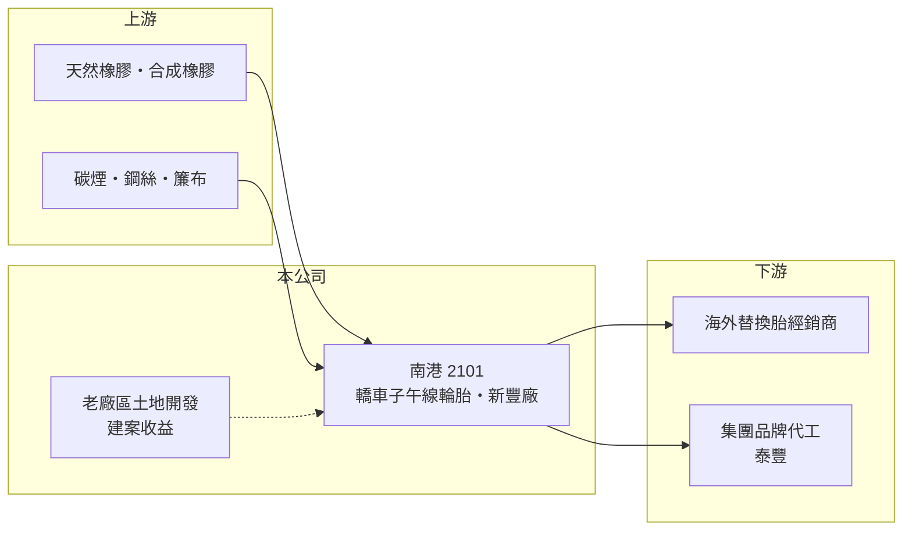

# 2101 南港

> 上市｜[[產業索引-橡膠工業|橡膠工業]]｜上市（櫃）日期 1963/11/01

# 第一章：企業模式與商業藍圖

> [!info] 撰寫說明
> 精簡版，由 Claude 依公開資料整理，架構比照 [[2330台積電]] 的四章研究，資料截至 2026-10-08。來源：證交所開放資料（基本資料、2026 年上半年資產負債與損益、股利）、Goodinfo 年度經營績效、富果研究泰豐法說會整理、工商時報與自由時報新聞標題。不動產建案與產品結構為整理性內容，部分憑既有知識撰寫，尚未逐條比對年報。#待校對

南港輪胎（股票代號：2101，以下簡稱南港）是台灣歷史最悠久的輪胎廠之一，1959 年成立、1963 年上市。理解南港的關鍵在於它其實有兩個引擎：本業的汽車輪胎製造，以及由老廠土地衍生的不動產開發收益，兩者的獲利週期完全不同。

- **核心業務：** 南港以轎車用[[子午線輪胎]]（PCR）為主要產品，在新竹新豐設有生產基地，品牌以外銷為主（產品細項待校對）。依富果研究整理的泰豐法說會，同集團的 [[2102泰豐]] 停止在台生產後，有一部分輪胎委由南港新豐廠代工，代表新豐廠也扮演集團內的生產平台。兩家公司董事長同為郭林諒，屬同一經營團隊。
- **營收結構：** 南港年營收在 2020 年以前約 100 億元上下，2021 至 2023 年降到 74 至 81 億元。2024 年營收跳升到 152 億元、2026 年上半年單半年就有 130 億元，[[營業利益率]]分別達 23.1% 與 32.7%，遠高於輪胎本業的正常水準。依新聞標題，這兩段高峰與「世界明珠」建案入帳有關（推估，待校對），屬於一次性的不動產認列，不能當成輪胎本業的成長。
- **營運據點：** 輪胎生產以台灣新豐廠為核心，銷售市場以外銷為主（地區比重未查得）。不動產部分則來自公司持有的老廠區土地開發。
- **長期方向：** 輪胎本業面對中國與東南亞低價產能競爭，南港的長期價值較取決於能否把土地開發的現金轉化為本業升級或回饋股東。2026 年上半年資產負債表的流動負債高達 298 億元，推估與建案相關的預收或融資有關，建案結算完畢後資產負債結構應會明顯縮小（推估）。

# 第二章：護城河深度與競爭優勢

輪胎是高度競爭的成熟產業，南港的護城河主要來自既有產能與品牌通路，而不是技術或規模。

- **競爭優勢：** 南港在輪胎業經營超過六十年，在海外替換胎市場累積了品牌與經銷通路，適合以中價位產品切入歐美替換胎市場。台灣製造的身分在美國對中國輪胎課徵反傾銷稅後也有一定的價格空間。此外，集團內有泰豐的品牌訂單，可提高新豐廠的產能利用率。
- **主要對手：** 國內同業有 [[2105正新]]、[[2106建大]]，國際上則是普利司通、米其林、固特異等一線品牌，以及中國與泰國、越南的大量中低價產能。南港在規模上遠小於一線大廠，只能在利基尺寸與替換胎市場競爭。
- **守得住與守不住：** 在美國對中國輪胎加稅、客戶分散供應來源的環境下，台灣廠有一定的訂單基礎；但在一般規格的 PCR 價格上，南港沒有成本優勢，2021 至 2022 年本業就曾連續營業虧損。
- **觀察重點：** 長期應觀察建案結算後本業的獲利能否回到 2016 至 2020 年約 5% 至 10% 的營業利益率，以及不動產收益如何配置（再投資、還債或發放股利）。

# 第三章：財務體質與盈利規模

資料日期：2026-10-08，表格是撰寫當時的快照；最新月營收、毛利率、累計 EPS 由自動排程寫在本筆記的屬性欄位（月營收、毛利率、累計EPS 等）。#待校對

財務數字顯示，南港的獲利高度受一次性不動產認列影響，看本業應排除建案年度。

| 年度 | 營收（新台幣） | [[毛利率]] | [[營業利益率]] | EPS（元） | [[ROE]] |
|---|---|---|---|---|---|
| 2021 | 80.8 億 | 16.5% | -10.3% | -0.29 | -2.21% |
| 2022 | 74.1 億 | 14.5% | -5.52% | -1.23 | -9.49% |
| 2023 | 78.5 億 | 19.8% | 5.63% | 0.16 | 1.30% |
| 2024 | 152 億 | 32.1% | 23.1% | 3.53 | 24.6% |
| 2025 | 84.3 億 | 21.5% | 6.86% | 1.01 | 6.17% |
| 2026 上半年 | 130.5 億 | 42.5% | 32.7% | 4.07 | 未查得 |

- **營收規模：** 2020 至 2025 年營收年複合成長率約 -2.8%（推算），代表輪胎本業長期沒有成長，營收的高點來自建案認列。實收資本額約 73.4 億元（證交所資料）。
- **獲利：** 2021 至 2025 年平均 ROE 約 4.1%（推算），其中只有 2024 年因建案入帳超過 20%。2026 年上半年稅後淨利 29.4 億元，營業外淨損 11.0 億元，業外項目的內容未查得。
- **股利：** 依證交所股利資料，2025 年度配發現金股利 0.7 元，2026 年另有一筆 0.6 元的現金股利決議；Goodinfo 統計的長期一般平均現金股利僅 0.29 元，配息穩定度低。

**[[ROIC]] 與 [[WACC]]：** 以 2025 年計，營業利益約 5.78 億元（84.3 億 × 6.86%），稅後約 4.63 億元。2026 年上半年股東權益約 150 億元、總負債約 308 億元，假設其中約一半為有息負債（約 154 億元，推估），投入資本約 304 億元，ROIC 約 1.5%（推算）。WACC 以 CAPM 推估：無風險利率 1.75%、市場風險溢酬 6%、β 取輪胎同業常見值 0.8，股東權益成本約 6.6%；負債成本假設 2.5%、稅後 2.0%，權益占資本約五成，WACC 約 4.3%（推算）。只有 2024 年這類建案入帳年度 ROIC 高於 WACC，輪胎本業在一般年度的資本報酬低於資金成本，長期看並未穩定創造價值。

# 第四章：總體風險與地緣政治

南港的風險分成輪胎本業的產業風險與不動產收益的一次性風險兩部分。

- **產業週期：** 輪胎需求跟著汽車保有量與替換週期，相對穩定，但原料天然橡膠、合成橡膠、碳煙的價格隨油價波動，報價調整常落後成本變化。運費與海運週期也會影響外銷為主的輪胎廠利潤。
- **營運風險：** 本業規模小，面對中國與東南亞大廠的價格競爭，2021 至 2022 年曾連續營業虧損。建案收益一次性入帳後，投資人容易高估公司的常態獲利。
- **其他風險：** 美國對各國輪胎的反傾銷與關稅政策變動，會直接影響外銷價格；新台幣升值會壓縮出口毛利。碳費與歐盟碳邊境機制則會提高高耗能製造業的成本。

# 專有名詞解析

## 金融

- **[[ROIC]]**：投入資本報酬率，稅後營業利益除以股東權益加有息負債，衡量本業運用資本的效率。
- **[[WACC]]**：加權平均資金成本，股東與債權人要求報酬的加權平均，ROIC 高於它才代表創造價值。

## 產業

- **[[子午線輪胎]]**：胎體簾線呈放射狀排列的輪胎結構，耐磨省油，是現今轎車輪胎的主流設計。
- **[[替換胎]]**：車主更換舊胎時購買的輪胎，與新車原廠配胎（OE）相對，需求較穩定、品牌通路影響大。
- **[[反傾銷稅]]**：進口國對低於正常價格傾銷的產品加徵的關稅，美國曾對中國等多國輪胎課徵。

# 核心供應鏈

- 上游：合成橡膠 [[2103台橡]]、[[2108南帝]]；碳煙 [[2104國際中橡]]；天然橡膠來自東南亞。
- 下游／客戶：海外替換胎經銷通路；集團內 [[2102泰豐]] 的品牌代工訂單。
- 同業：[[2105正新]]、[[2106建大]]、[[2109華豐]]，以及普利司通、米其林、固特異等國際大廠。

## 最新新聞
<!-- news:start（自動產生，請勿手動編輯此範圍） -->
- 2026-10-06 📰 媒體 19:50｜營收速報 - 南港(2101)9月營收23.77億元年增率高達270.34％｜[鉅亨網](https://news.cnyes.com/news/id/6622939)

完整紀錄：[[2101南港 新聞]]
<!-- news:end -->

## 相關連結
- [公開資訊觀測站](https://mopsov.twse.com.tw/mops/web/t05st03?step=1&firstin=1&co_id=2101)
- [Goodinfo](https://goodinfo.tw/tw/StockDetail.asp?STOCK_ID=2101)
- [Yahoo 股市](https://tw.stock.yahoo.com/quote/2101)
- [鉅亨網新聞](https://www.cnyes.com/twstock/2101/news)
