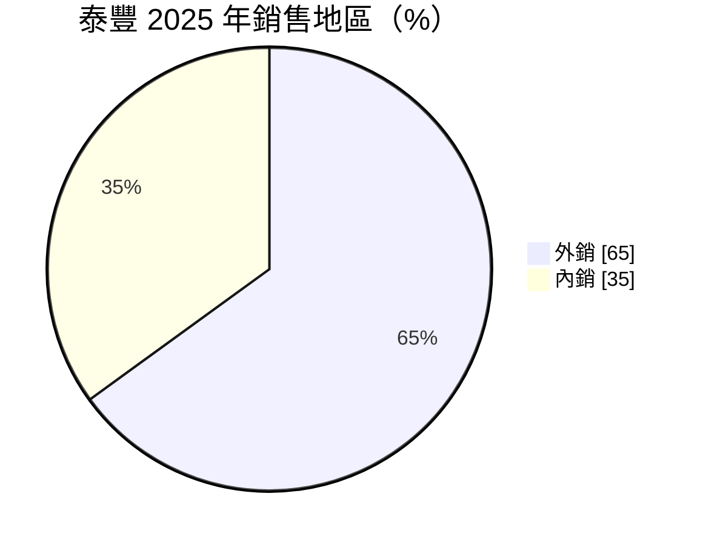
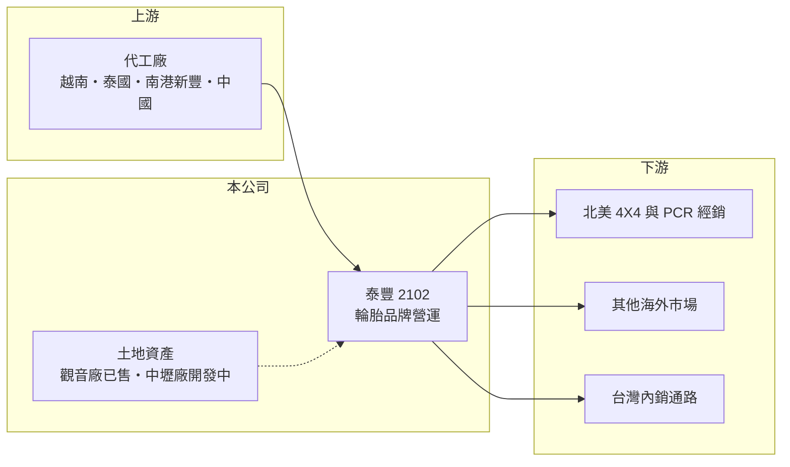

# 2102 泰豐

> 上市｜[[產業索引-橡膠工業|橡膠工業]]｜上市（櫃）日期 1979/07/16

# 第一章：企業模式與商業藍圖

> [!info] 撰寫說明
> 精簡版，由 Claude 依公開資料整理，架構比照 [[2330台積電]] 的四章研究，資料截至 2026-10-08。來源：證交所開放資料（基本資料、2026 年上半年資產負債與損益、股利）、Goodinfo 年度經營績效、富果研究 2025 年 11 月法說會整理、ETtoday 新聞標題。#待校對

泰豐輪胎（股票代號：2102，以下簡稱泰豐）成立於 1955 年，曾是台灣主要的汽車輪胎製造商。2020 年代它經歷了一次根本轉型：關閉台灣的工廠、出售廠房土地，變成只經營品牌、生產全部委外的公司。理解泰豐，必須同時看輪胎品牌與土地資產兩條線。

- **核心業務：** 依 2025 年 11 月法說會，泰豐已停止在台生產，轉為品牌營運商，產品包括轎車[[子午線輪胎]]（PCR）、四輪傳動休旅車胎（4X4）與競速用胎。生產改採[[委外代工]]：越南廠代工 4X4 供應北美，泰國廠代工 PCR 供應美國及其他市場，同集團的 [[2101南港]] 新豐廠代工 PCR 供應北美以外市場，另與中國等地工廠合作。
- **營收結構：** 外銷約 65%、內銷約 35%（2025 年法說會）。由於改為委外，營收從 2020 年的 57 億元縮小到 2025 年的 2.66 億元，公司的規模已和過去的製造廠完全不同。

- **營運據點：** 原有的中壢廠與觀音廠都已關閉。觀音廠土地於 2025 年 7 月經股東會通過，以 69.5 億元出售給 [[2308台達電]]；中壢廠的工商綜合區土地正洽談開發，住宅區部分自辦市地重劃預計 2027 年 8 月前完成。
- **長期方向：** 公司表示售地資金到位後，將評估產業轉型與併購，標準是對股東有利。換言之，泰豐的長期價值主要取決於土地處分的金額與資金運用方式，而不是輪胎本業的成長。

# 第二章：護城河深度與競爭優勢

泰豐目前的護城河很淺，真正的價值在資產而不是營運。

- **競爭優勢：** 泰豐保有數十年的輪胎品牌（Federal）與海外經銷網絡，尤其在競速胎與 4X4 等利基產品上有一定的知名度（品牌細節待校對）。委外生產讓公司不必承擔工廠的固定成本與資本支出，可以依關稅與成本選擇代工地點。
- **主要對手：** 國際輪胎大廠與大量中國、東南亞的中低價品牌。泰豐沒有自有產能，在成本與供貨穩定度上都不如自有工廠的同業，只能在品牌與特定規格上競爭。
- **守得住與守不住：** 守得住的是利基規格的品牌訂單；守不住的是規模經濟，2025 年營業利益率仍約 -85%，代表目前的營收規模不足以支應管銷費用。
- **觀察重點：** 長期應觀察中壢土地的處分或開發進度、售地資金是用於配息、減資還是轉型併購，以及品牌業務能否做到損益兩平。

# 第三章：財務體質與盈利規模

資料日期：2026-10-08，表格是撰寫當時的快照；最新月營收、毛利率、累計 EPS 由自動排程寫在本筆記的屬性欄位（月營收、毛利率、累計EPS 等）。#待校對

泰豐的財報反映的是一家從製造廠轉成資產處分公司的過程，近年的獲利主要來自業外。

| 年度 | 營收（新台幣） | [[毛利率]] | [[營業利益率]] | EPS（元） | [[ROE]] |
|---|---|---|---|---|---|
| 2021 | 15.6 億 | -47.1% | -118% | -5.11 | -36.6% |
| 2022 | 16.2 億 | -1.92% | -45.1% | -2.95 | -29.2% |
| 2023 | 4.78 億 | -62.0% | -225% | -3.76 | -31.0% |
| 2024 | 2.67 億 | 6.53% | -84.6% | -1.01 | -6.68% |
| 2025 | 2.66 億 | 20.4% | -85.0% | 6.28 | 35.2% |

- **營收規模：** 2020 至 2025 年營收年複合成長率約 -46%（推算），反映停產與委外的轉型。實收資本額約 47.3 億元（證交所資料）。
- **獲利：** 2025 年前三季曾因設備減損 8.76 億元而虧損，第四季認列觀音廠售地利益後，全年稅後淨利約 39.7 億元、EPS 6.28 元，業外損益約 31.5 億元。2026 年上半年營收 0.9 億元、EPS -0.09 元，回到本業虧損的常態。
- **財務特色：** 2026 年上半年總資產約 120 億元、股東權益約 96 億元、總負債約 24 億元，每股淨值 20.91 元，資產負債表以土地與售地資金為主。2021 至 2025 年平均 ROE 約 -13.7%（推算），長期幾乎沒有配發現金股利，2025 年度在大賺後也未配息。

**[[ROIC]] 與 [[WACC]]：** 以 2025 年計，營業損失約 2.26 億元（2.66 億 × -85%），股東權益約 96 億元，有息負債推估很少（總負債多為非流動，推估與土地相關稅負或遞延項目有關），投入資本約 96 億元，ROIC 約 -2.4%（推算）。WACC 以 CAPM 推估：無風險利率 1.75%、市場風險溢酬 6%、β 取同業常見值 0.8，股東權益成本約 6.6%，幾乎全為權益融資，WACC 約 6.6%（推算）。本業 ROIC 長期為負，低於資金成本，泰豐近年的股東價值主要來自土地增值與處分，而非營運創造。

# 第四章：總體風險與地緣政治

泰豐的風險集中在轉型執行與資產處分的不確定性。

- **產業週期：** 輪胎需求本身穩定，但委外品牌商的毛利受代工價格、運費與原料成本影響，沒有自有工廠可以消化成本波動。
- **營運風險：** 營收規模太小，營業費用難以攤平；若轉型併購的標的選擇不當，可能把售地現金投入低報酬事業。中壢土地的重劃、開發與處分時程也可能延後。
- **其他風險：** 美國對東南亞輪胎的關稅與反傾銷政策變動，會影響越南、泰國代工產品的競爭力。土地相關的稅負、法規與房地產景氣，也會影響資產處分的金額。

# 專有名詞解析

## 金融

- **[[ROIC]]**：投入資本報酬率，稅後營業利益除以股東權益加有息負債，衡量本業運用資本的效率。
- **[[WACC]]**：加權平均資金成本，股東與債權人要求報酬的加權平均，ROIC 高於它才代表創造價值。

## 產業

- **[[子午線輪胎]]**：胎體簾線呈放射狀排列的輪胎結構，耐磨省油，是現今轎車輪胎的主流設計。
- **[[委外代工]]**：品牌公司不自建工廠，把產品交給其他工廠生產，自己專注設計、品牌與銷售。
- **[[市地重劃]]**：把零散土地重新規劃整理並興建公共設施後，按比例分回地主的開發方式。

# 核心供應鏈

- 上游：代工廠包括 [[2101南港]] 新豐廠，以及越南、泰國、中國等地輪胎廠。
- 下游／客戶：北美與其他海外市場的輪胎經銷商、台灣內銷通路；觀音廠土地買方為 [[2308台達電]]。
- 同業：[[2105正新]]、[[2106建大]]、[[2101南港]]、[[2109華豐]]。

## 最新新聞
<!-- news:start -->
<!-- news:end -->

## 相關連結
- [公開資訊觀測站](https://mopsov.twse.com.tw/mops/web/t05st03?step=1&firstin=1&co_id=2102)
- [Goodinfo](https://goodinfo.tw/tw/StockDetail.asp?STOCK_ID=2102)
- [Yahoo 股市](https://tw.stock.yahoo.com/quote/2102)
- [鉅亨網新聞](https://www.cnyes.com/twstock/2102/news)
