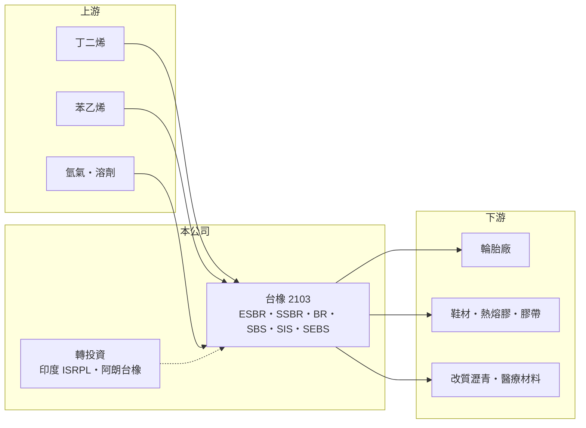

# 2103 台橡

> 上市｜[[產業索引-橡膠工業|橡膠工業]]｜上市（櫃）日期 1982/09/25

# 第一章：企業模式與商業藍圖

> [!info] 撰寫說明
> 精簡版，由 Claude 依公開資料整理，架構比照 [[2330台積電]] 的四章研究，資料截至 2026-10-08。來源：證交所開放資料（基本資料、2026 年上半年資產負債與損益、股利）、Goodinfo 年度經營績效、富果研究 2026 年 5 月法說會整理、工商時報與 Yahoo 股市新聞標題。各地工廠與合資夥伴部分憑既有知識撰寫。#待校對

台橡（股票代號：2103）成立於 1973 年，是台灣第一家合成橡膠廠，現已發展成在台灣、中國、美國、印度等地都有據點的跨國特用彈性體公司，董事長為殷琪。台橡的商業模式是把石化原料丁二烯、苯乙烯聚合成橡膠與彈性體，賣給輪胎、鞋材、膠帶與工業品廠商。

- **核心業務：** 產品分兩大事業。[[合成橡膠]]事業包括 [[ESBR]]、[[SSBR]] 與 BR（聚丁二烯橡膠），主要用於輪胎；[[熱可塑性彈性體]]（TPE）事業包括 SBS、SIS 與 SEBS，用於鞋材、熱熔膠、膠帶、改質瀝青與醫療材料。依 2026 年 5 月法說會，SEBS 是 TPE 中獲利貢獻最高的產品。各產品營收比重未查得。
- **營收結構：** 2025 年合併營收 364.73 億元。地區上，2026 年第一季歐洲營收成長最顯著，美洲與亞洲也有貢獻，顯示台橡的客戶遍布全球輪胎與消費品產業。
- **營運據點：** 台灣高雄為發源地；中國南通有合成橡膠工廠，SSBR 6 萬噸擴建預計 2027 年中完工、2028 年起貢獻營收；美國有 TPE 工廠（待校對）；印度合資公司 ISRPL 是 2026 年第一季最大的轉投資收益來源；與德國朗盛體系的阿朗新科合資「阿朗台橡」生產特用橡膠（合資細節待校對）。越南廠因鞋業大客戶訂單減少，以最小規模營運。
- **長期方向：** 台橡的策略是從大宗輪胎橡膠往高附加價值的方向移動：擴充用於節能輪胎的 SSBR、發展氫化苯乙烯嵌段共聚物（HSBC），並以美國醫療材料認證切入醫療用彈性體，已與全球領先廠商簽署合作協議。

# 第二章：護城河深度與競爭優勢

合成橡膠是石化下游的大宗產品，台橡的護城河來自多地布局與特用等級的客戶認證。

- **競爭優勢：** 第一是全球布局。台橡在亞洲、美洲都有產能，又有印度合資廠，可以就近供應各地輪胎與鞋材客戶，在關稅與供應鏈分散的趨勢下較有彈性。第二是特用等級的認證門檻，SEBS、醫療級材料與輪胎用 SSBR 都需要長時間的客戶驗證，一旦導入不易被替換。第三是穩健的轉投資收益，印度合資與阿朗台橡在本業低迷時仍能貢獻獲利。
- **主要對手：** 合成橡膠有中石化、韓國錦湖石化、日本 JSR 與 Zeon；TPE 有科騰（Kraton）、台灣的李長榮化工，以及大量中國新產能。中國產能擴充使 SIS、BR 等一般等級價格競爭激烈。
- **守得住與守不住：** 守得住的是 SEBS、SSBR 與醫療材料等需要認證的高階等級；守不住的是 BR、SIS 等大宗產品的價格，2026 年第一季 BR 銷量增加但售價受競爭壓抑。
- **觀察重點：** 南通 SSBR 擴建能否如期在 2028 年貢獻獲利、醫療材料認證進度，以及高雄昇華廠搬遷完成後的成本結構。

# 第三章：財務體質與盈利規模

資料日期：2026-10-08，表格是撰寫當時的快照；最新月營收、毛利率、累計 EPS 由自動排程寫在本筆記的屬性欄位（月營收、毛利率、累計EPS 等）。#待校對

台橡的財報呈現典型的石化循環：2021 年高峰之後，獲利隨價差收斂而逐年下滑。

| 年度 | 營收（新台幣） | [[毛利率]] | [[營業利益率]] | EPS（元） | [[ROE]] |
|---|---|---|---|---|---|
| 2021 | 325 億 | 20.9% | 12.1% | 4.76 | 24.8% |
| 2022 | 338 億 | 16.3% | 7.90% | 2.16 | 10.4% |
| 2023 | 314 億 | 10.5% | 3.02% | 0.82 | 4.66% |
| 2024 | 372 億 | 11.1% | 3.70% | 1.04 | 4.92% |
| 2025 | 365 億 | 9.80% | 2.70% | 0.54 | 2.81% |

- **營收規模：** 2020 至 2025 年營收年複合成長率約 8.7%（推算），但 2020 年是疫情低基期；營收成長主要來自原料價格轉嫁，獲利並未同步成長。2026 年上半年營收 222 億元、毛利率 17.0%、營業利益率 11.1%、EPS 2.26 元，毛利率回升。
- **獲利：** 2025 年 EPS 0.54 元，其中第三季提列資產減損 3.87 億元，扣除後約 0.96 元。2021 至 2025 年平均 ROE 約 9.5%（推算），但高度集中在 2021 至 2022 年。
- **股利：** 2025 年度現金股利 0.27 元（證交所資料）；Goodinfo 統計的長期一般平均現金股利約 1.30 元。公司表示配息率近年降至約 50%，待昇華廠搬遷與 SSBR 擴建等重大資本支出完成後再調整。

**[[ROIC]] 與 [[WACC]]：** 以 2025 年計，營業利益約 9.9 億元（365 億 × 2.7%），稅後約 7.9 億元。2026 年上半年權益總計約 239 億元、總負債約 241 億元，假設其中約 140 億元為有息負債（推估），投入資本約 379 億元，ROIC 約 2.1%（推算）；2021 年高峰期同樣方法推算約 9% 至 10%。WACC 以 CAPM 推估：無風險利率 1.75%、市場風險溢酬 6%、β 取石化同業常見值 0.9，股東權益成本約 7.2%；負債成本假設 2.5%、稅後 2.0%，權益占資本約 63%，WACC 約 5.2%（推算）。台橡只有在景氣高峰時 ROIC 高於 WACC，2023 至 2025 年低於資金成本；高值化產品比重能否提高谷底報酬，是長期價值的關鍵。

# 第四章：總體風險與地緣政治

台橡的風險主要來自石化循環、中國產能與原料價格。

- **產業週期：** 合成橡膠價格跟著丁二烯、苯乙烯等原料與輪胎、鞋業需求波動，屬於景氣循環產業。輪胎需求穩定，但鞋材與消費品需求受全球景氣影響較大。
- **營運風險：** 中國持續擴充 BR、SBS、SIS 等產能，使一般等級長期面臨價格壓力；越南廠因大客戶訂單萎縮而縮小營運，顯示單一大客戶的依賴風險。昇華廠搬遷與 SSBR 擴建期間資本支出較高，壓縮配息空間。
- **其他風險：** 美國關稅政策、匯率與油價會影響各地工廠的競爭力與原料成本。台灣碳費方面，台橡的自主減量計畫已獲核准，費率由每公噸 300 元降至 100 元，但長期減碳仍需持續投資。

# 專有名詞解析

## 金融

- **[[ROIC]]**：投入資本報酬率，稅後營業利益除以股東權益加有息負債，衡量本業運用資本的效率。
- **[[WACC]]**：加權平均資金成本，股東與債權人要求報酬的加權平均，ROIC 高於它才代表創造價值。

## 產業

- **[[合成橡膠]]**：以石化原料聚合製成的橡膠，可取代或搭配天然橡膠，主要用於輪胎與工業品。
- **[[ESBR]]**：乳聚苯乙烯丁二烯橡膠，以乳化聚合生產，是用量最大的通用輪胎橡膠。
- **[[SSBR]]**：溶聚苯乙烯丁二烯橡膠，滾動阻力低、抓地力好，是節能輪胎與電動車輪胎的關鍵材料。
- **[[熱可塑性彈性體]]**：加熱可塑形、常溫具橡膠彈性的材料（TPE），如 SBS、SIS、SEBS，可回收再加工。

# 核心供應鏈

- 上游：丁二烯、苯乙烯等石化原料，國內來源包括 [[6505台塑化]] 與輕油裂解廠（實際供應比例未查得）。
- 下游／客戶：輪胎廠如 [[2105正新]]、[[2101南港]]（產業參考，非公司揭露客戶）；鞋材、熱熔膠與膠帶廠；醫療材料廠。
- 同業：[[2108南帝]]（產業參考）、科騰、錦湖石化、JSR、Zeon 與中國石化廠。

## 最新新聞
<!-- news:start -->
<!-- news:end -->

## 相關連結
- [公開資訊觀測站](https://mopsov.twse.com.tw/mops/web/t05st03?step=1&firstin=1&co_id=2103)
- [Goodinfo](https://goodinfo.tw/tw/StockDetail.asp?STOCK_ID=2103)
- [Yahoo 股市](https://tw.stock.yahoo.com/quote/2103)
- [鉅亨網新聞](https://www.cnyes.com/twstock/2103/news)
