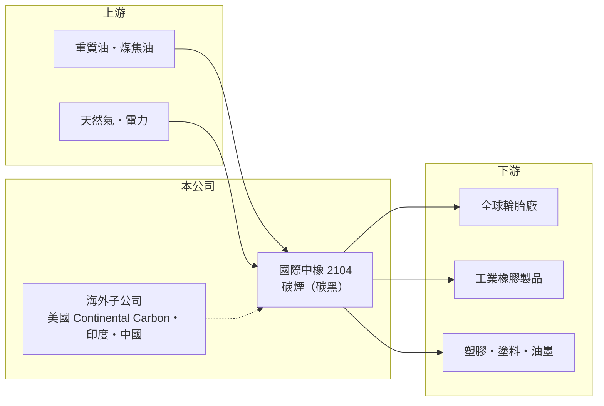

# 2104 國際中橡

> 上市｜[[產業索引-橡膠工業|橡膠工業]]｜上市（櫃）日期 1986/07/15

# 第一章：企業模式與商業藍圖

> [!info] 撰寫說明
> 精簡版，由 Claude 依公開資料整理，架構比照 [[2330台積電]] 的四章研究，資料截至 2026-10-08。來源：證交所開放資料（基本資料、2026 年上半年資產負債與損益、股利）、Goodinfo 年度經營績效、European Rubber Journal 與 Stockopedia 報導標題、工商時報新聞標題。工廠據點與子公司名稱部分憑既有知識撰寫。#待校對

國際中橡投資控股（股票代號：2104，以下簡稱國際中橡）的前身是 1973 年成立的中國合成橡膠，屬和信集團，董事長為辜公怡。雖然名稱是「合成橡膠」，它真正的主力產品是[[碳煙]]（又稱碳黑），是輪胎與橡膠製品不可缺少的補強材料，也是全球主要的碳煙供應商之一。

- **核心業務：** 碳煙是把重質油料不完全燃燒後收集的微細碳粒，加入橡膠可大幅提高耐磨與強度，一條輪胎約有兩到三成重量是碳煙（產業常見值，推估）。國際中橡的營收主要來自輪胎用碳煙，其次是工業橡膠製品與塑膠、塗料用的特用碳煙。
- **營收結構：** 依地區與產品別的營收比重未查得。合併營收在 2018 年達 244 億元高峰，2025 年降到 153 億元。
- **營運據點：** 公司以控股架構經營多國工廠，包括台灣、中國、美國子公司 Continental Carbon，以及印度工廠（據點細節待校對）。依 European Rubber Journal 報導標題，公司正在調整中國產能以因應供過於求、在印度工廠增設第四條生產線，並以印度等地的新產能補足美國工廠縮減的供應。
- **長期方向：** 國際中橡的長期策略是把產能重心從供過於求的中國，移往需求成長較快的印度與美國市場，並優化各地的供貨分配。這是一個資產重組的過程，短期會帶來減損與關廠成本，長期則決定公司能否回到正常獲利。

# 第二章：護城河深度與競爭優勢

碳煙是重資本、高耗能的大宗原料，護城河主要來自全球據點與輪胎廠的認證關係。

- **競爭優勢：** 第一是多國產能。碳煙體積大、運費占比高，適合在客戶附近生產，國際中橡在美國、亞洲與印度都有工廠，可以就近供應全球輪胎大廠。第二是輪胎廠的品質認證，碳煙規格會影響輪胎性能，客戶導入新供應商需要測試期，既有供應關係具有一定黏著度。
- **主要對手：** 全球碳煙龍頭有美國卡博特（Cabot）、德國歐勵隆（Orion）、印度 Birla Carbon，以及大量中國碳煙廠。中國[[產能過剩]]使亞洲碳煙價格長期承壓。
- **守得住與守不住：** 在美國市場，本地產能與關稅保護使碳煙需求相對穩定；在中國市場，國際中橡難以和低成本的本土廠競爭，必須縮減產能。
- **觀察重點：** 中國產能調整完成後的虧損收斂速度、印度新產能的利用率，以及美國工廠的營運穩定度（報導提到美國奧克拉荷馬廠曾因發電機故障影響營收）。

# 第三章：財務體質與盈利規模

資料日期：2026-10-08，表格是撰寫當時的快照；最新月營收、毛利率、累計 EPS 由自動排程寫在本筆記的屬性欄位（月營收、毛利率、累計EPS 等）。#待校對

國際中橡的五年數字顯示，公司從 2021 年的景氣高點一路滑落到大幅虧損。

| 年度 | 營收（新台幣） | [[毛利率]] | [[營業利益率]] | EPS（元） | [[ROE]] |
|---|---|---|---|---|---|
| 2021 | 246 億 | 28.2% | 21.0% | 3.50 | 9.94% |
| 2022 | 234 億 | 14.0% | 7.44% | 0.70 | 1.87% |
| 2023 | 179 億 | 8.20% | 0.84% | -0.51 | -1.53% |
| 2024 | 173 億 | 6.92% | -1.24% | -2.80 | -8.41% |
| 2025 | 153 億 | -5.22% | -14.6% | -4.28 | -15.4% |

- **營收規模：** 2020 至 2025 年營收年複合成長率約 -2.2%（推算）。2026 年上半年營收 67.6 億元，[[毛利率]] -11.5%、營業利益率 -20.4%，歸屬母公司淨損 12.8 億元、EPS -1.32 元，虧損仍未收斂。
- **獲利：** 2025 年歸屬母公司淨損約 41.5 億元。2016 至 2018 年營業利益率曾達 18% 至 19%，代表在供需平衡的年度，碳煙是一門不錯的生意；目前的虧損主要來自中國供過於求與重組成本。2021 至 2025 年平均 ROE 約 -2.7%（推算）。
- **財務特色：** 2026 年上半年歸屬母公司權益約 230 億元、總負債約 241 億元，每股淨值 23.75 元。2025 年度未配發股利；Goodinfo 統計的長期一般平均現金股利約 1.04 元，配息隨景氣大幅波動。

**[[ROIC]] 與 [[WACC]]：** 以 2025 年計，營業損失約 22.3 億元（153 億 × -14.6%），虧損不計稅。權益總計約 241 億元，假設總負債中約 150 億元為有息負債（推估），投入資本約 391 億元，ROIC 約 -5.7%（推算）；以 2018 年高峰推算約 9%。WACC 以 CAPM 推估：無風險利率 1.75%、市場風險溢酬 6%、β 取原物料同業常見值 1.0，股東權益成本約 7.8%；負債成本假設 3%、稅後 2.4%，權益占資本約 62%，WACC 約 5.7%（推算）。2023 年以後 ROIC 明顯低於 WACC，公司正在毀損經濟價值；重組能否讓 ROIC 回到資金成本以上，是長期投資判斷的核心。

# 第四章：總體風險與地緣政治

國際中橡的風險來自碳煙產業的供需結構、跨國營運與環保法規。

- **產業週期：** 碳煙需求與輪胎產量連動，輪胎需求穩定，但碳煙供給受中國擴產影響大，價格週期長而劇烈。原料是重質油，成本隨油價波動，報價調整通常有落差。
- **營運風險：** 多國工廠意味著關廠、減損與重組的執行風險，2025 年的大額虧損就包含產能調整的成本。美國工廠的設備故障曾影響出貨，顯示單一大型工廠的營運中斷風險。
- **其他風險：** 碳煙生產排放大量二氧化碳，各國碳費、碳稅與歐盟碳邊境機制會持續提高成本。美中關稅、印度投資環境與匯率變化，也會影響各地工廠的競爭力。

# 專有名詞解析

## 金融

- **[[ROIC]]**：投入資本報酬率，稅後營業利益除以股東權益加有息負債，衡量本業運用資本的效率。
- **[[WACC]]**：加權平均資金成本，股東與債權人要求報酬的加權平均，ROIC 高於它才代表創造價值。

## 產業

- **[[碳煙]]**：又稱碳黑，重質油不完全燃燒產生的微細碳粒，是輪胎與橡膠製品的主要補強材料。
- **[[產能過剩]]**：產業總產能明顯高於市場需求，導致價格下跌與開工率下降的狀態。

# 核心供應鏈

- 上游：重質油與煤焦油等碳煙原料油，國內來源包括 [[6505台塑化]] 等煉油廠（實際供應比例未查得）。
- 下游／客戶：全球輪胎廠，例如 [[2105正新]]、[[2101南港]]（產業參考，非公司揭露客戶）；工業橡膠製品與塑膠、塗料廠。
- 同業：卡博特、歐勵隆、Birla Carbon 與中國碳煙廠。

## 最新新聞
<!-- news:start -->
<!-- news:end -->

## 相關連結
- [公開資訊觀測站](https://mopsov.twse.com.tw/mops/web/t05st03?step=1&firstin=1&co_id=2104)
- [Goodinfo](https://goodinfo.tw/tw/StockDetail.asp?STOCK_ID=2104)
- [Yahoo 股市](https://tw.stock.yahoo.com/quote/2104)
- [鉅亨網新聞](https://www.cnyes.com/twstock/2104/news)
