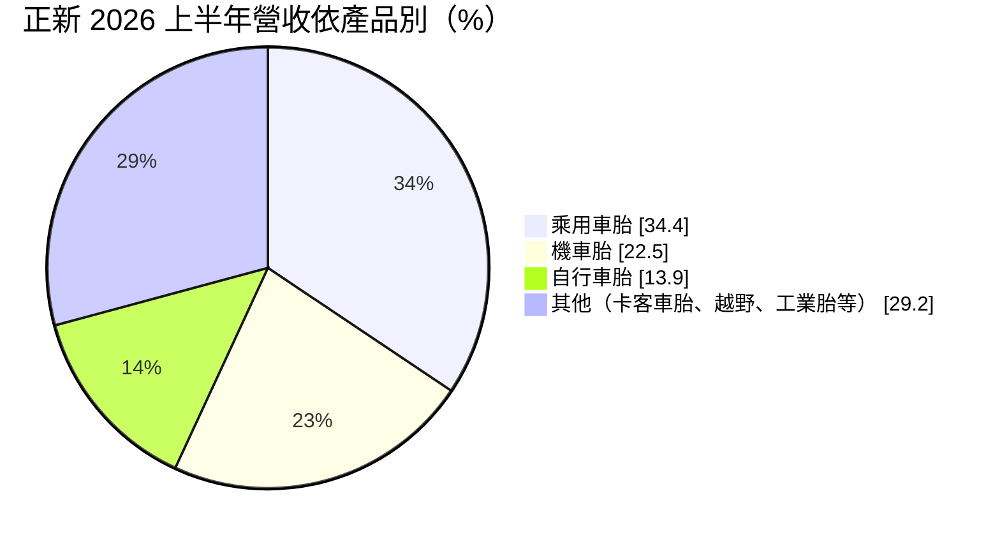
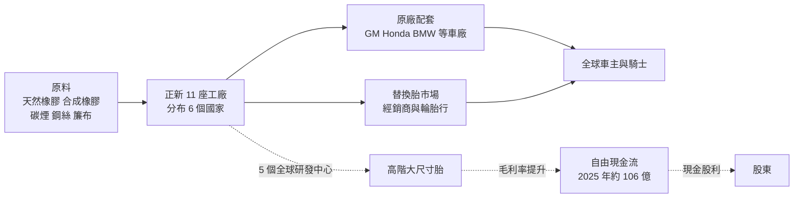
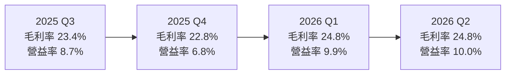
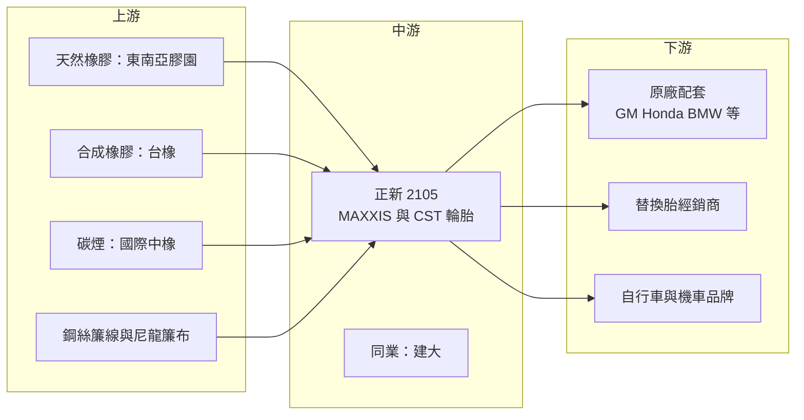

# 2105 正新

> 上市｜[[產業索引-橡膠工業|橡膠工業]]｜上市（櫃）日期 1987/12/07

# 第一章：企業模式與商業藍圖

> [!info] 撰寫說明
> 本文由 Claude 依公開資料整理，架構比照 [[2330台積電]] 的四章研究，資料截至 2026-10-07。財務數字來源：富果研究（正新 2025 年度與 2026 年上半年法說會摘要）、Poorstock（法說會整理）、民報（2026 年上半年獲利報導）、HiStock（季度利潤比率）、nStock 公司簡介；產業描述為整理性內容，尚未逐條比對原始文件。#待校對

在評估單一個股的長期投資價值時，首要步驟是拆解企業的底層獲利邏輯。本章針對正新橡膠工業（股票代號：2105，以下簡稱正新）的商業模式進行定性分析，說明台灣最大輪胎廠如何以自有品牌 MAXXIS（瑪吉斯）在全球市場競爭，以及它為何把重心從「量」轉向「質」。

## 一、核心定位：自有品牌的全品項輪胎製造商

正新是台灣規模最大的輪胎公司，產品涵蓋乘用車胎、機車胎、自行車胎、卡客車胎、越野車與工業用胎，以自有品牌 MAXXIS 與 CST 在全球銷售。和代工廠不同，正新同時經營品牌、通路與製造，既賣給車廠做[[原廠配套]]，也透過經銷商賣到[[替換胎市場]]。

正新的定位有兩個特色：

* **兩輪胎的全球領導者：** 機車胎與自行車胎是正新的傳統強項，在登山車、公路車與機車原廠配套中有很高的能見度。2026 年上半年機車胎銷量 2,990 萬條、自行車胎 4,530 萬條，都比前一年同期成長。
* **中國市場比重高：** 正新 1990 年代就進入中國設廠，2026 年上半年中國大陸營收占比達 48.3%，是最大市場，也是最大的風險來源。

## 二、終端應用與產品板塊：乘用車胎為主、兩輪胎成長

2026 年上半年營收依產品別如下（其餘為卡客車胎、越野與工業用胎等，公司未逐項揭露）：

* **乘用車胎（[[PCR]]）：** 占比從前一年同期的 37.5% 降到 34.4%，但產品結構往大尺寸移動，17 吋以上大尺寸胎占 PCR 銷售比重由 42.8% 升到 44.5%。公司刻意避開中國低價品牌的價格戰，把資源集中在高單價產品。
* **機車胎：** 占比由 20.5% 升到 22.5%，主要成長來自印度與印尼。印度廠原廠配套比重達 71%，主要供應當地 Honda 體系。
* **自行車胎：** 占比由 12.8% 升到 13.9%，自行車產業在 2023 至 2024 年庫存調整後回溫。
* **其他：** 卡客車胎（[[TBR]]）、越野車胎、卡丁車胎與工業用胎。廈門廠卡客車胎事業營運逐步穩定。

## 三、資本轉化邏輯：品牌、通路與多國工廠

* **全球據點：** 正新在 6 個國家擁有 11 座工廠與 5 個研發中心，涵蓋台灣、中國、越南、泰國、印尼、印度等地（國家明細依公開報導整理，#待校對）。多國生產讓正新能就近供應當地車廠，並分散關稅與地緣政治風險。
* **原廠配套帶動品牌：** 打進車廠原廠配套，除了訂單本身，也能提升品牌在替換胎市場的可信度。正新連續 10 年獲 GM 年度最佳供應商，並獲北美 Honda 品質卓越獎，近年也打入 BMW 等國際車廠配套。
* **原料成本傳導：** 天然橡膠約占原料成本 27.3%、合成橡膠約 25.2%，兩者合計超過五成。原料價格下跌時毛利率擴張，上漲時則需靠漲價轉嫁，替換胎市場通常有數月的落後期。

## 四、企業長期藍圖：高階化與新興市場

* **產品高階化：** 持續提高 17 吋以上大尺寸胎與高性能胎比重。旗下 MAXXIS VICTRA SPORT 6 取得 TÜV SÜD 認證，為首款取得此認證的亞洲夏季胎，有助提升在歐洲高階替換胎市場的品牌形象。
* **加碼印度與印尼：** 兩國是全球最大的機車市場之一，正新以當地工廠搶原廠配套與替換需求，是未來機車胎成長的主要動能。
* **品牌行銷：** 透過賽車與卡丁車贊助經營品牌，例如與澳洲卡丁車協會續約至 2031 年。

# 第二章：護城河深度與競爭優勢

在長期價值投資中，「護城河」指企業抵禦競爭、維持超額利潤的保護機制。本章分析正新的護城河構成、全球主要輪胎競爭對手，以及在中國品牌低價擴張下，這些優勢能守住多少。

## 一、正新護城河的核心組成要素

輪胎是資本密集、但技術相對成熟的產業。正新的護城河屬於「窄護城河」，由三個要素組成：

* **1. 兩輪胎的品牌與規格經驗：** 機車胎與自行車胎款式多、規格分散，需要大量模具與配方經驗。正新在這兩個領域經營數十年，原廠配套關係穩固，新進者不易複製。
* **2. 車廠原廠配套認證：** 車廠對輪胎的認證流程長，涵蓋耐久、噪音、濕地抓地與滾動阻力等測試，一旦成為配套供應商，通常會跟著車型週期供貨數年。
* **3. 全球產能與財務體質：** 11 座工廠分散在 6 國，2025 年底現金超過 400 億元、負債比約 39%，有能力在景氣低迷時持續投資與配息。

## 二、全球主要競爭對手格局

| 對手 | 定位 | 對正新的威脅 |
|---|---|---|
| 普利司通、米其林、固特異 | 全球前三大輪胎集團，高階品牌 | 掌握高階原廠配套與品牌溢價 |
| 韓泰、錦湖 | 韓國中高階輪胎 | 在中階乘用車胎直接競爭 |
| 玲瓏、賽輪等中國品牌 | 大量擴產、低價搶市，海外設廠避關稅 | 壓低中低階乘用車胎價格 |
| [[2106建大]] | 台灣自行車與機車胎同業 | 在兩輪胎與 ATV 胎直接競爭 |
| [[2104國際中橡]]、[[2103台橡]] | 上游碳煙與合成橡膠 | 非直接對手，屬原料供應鏈 |

## 三、優勢轉化：哪些市場守得住、哪些守不住

* **守得住：** 機車胎、自行車胎與高階大尺寸乘用車胎。這些市場看重規格齊全與品牌，正新的經驗與配套關係有效。
* **守不住：** 中低階乘用車胎。2025 年營收 908 億元，年減 5.7%，乘用車胎比重也持續下降，反映中國品牌在一般尺寸乘用車胎的價格壓力。正新選擇放棄部分量，換取毛利率。
* **觀察重點：** 2026 年上半年毛利率回到 25%，能否維持取決於橡膠價格與大尺寸胎比重；印度、印尼機車胎能否持續成長；中國市場的需求與價格競爭是否惡化。

# 第三章：財務體質與盈利規模

資料日期：2026-10-07。數字取自法說會摘要與財經資料網站，表格是撰寫當時的快照；最新月營收、毛利率、累計 EPS 由自動排程寫在本筆記的屬性欄位（月營收、毛利率、累計EPS 等）。#待校對

財務報表是檢驗護城河是否真實存在的最終標準。本章用三率、ROE、現金流與資本報酬，檢視正新在產品高階化策略下的獲利品質。

## 一、獲利能力的基石：三率

| 項目 | 2025 全年 | 2025 上半年 | 2026 上半年 | 2026 Q1 | 2026 Q2 |
|---|---|---|---|---|---|
| 營收（新台幣） | 908 億 | 461.5 億 | 486.2 億 | 未查得 | 未查得 |
| [[毛利率]] | 23% | 22% | 25% | 24.8% | 24.8% |
| [[營業利益率]] | 8% | 8% | 10% | 9.9% | 10.0% |
| 稅後淨利 | 未查得 | 23.57 億 | 34.15 億 | 未查得 | 未查得 |
| EPS（元） | 1.50 | 0.73 | 1.05 | 未查得 | 未查得 |

* **[[毛利率]]：** 2026 年上半年回到 25%，比前一年同期提升 3 個百分點。主要來自大尺寸胎比重提高與產品組合改善，推估原料成本也有幫助。
* **[[營業利益率]]：** 上半年 10%，比前一年同期提高 2 個百分點。營收僅成長 5.2%，獲利卻成長約 45%，顯示「少賣量、多賺錢」的策略開始見效。
* **[[淨利率]]與業外：** 2026 年第二季稅後淨利率 6.2%，低於第一季的 7.9%，推估與匯兌損益有關。

## 二、[[ROE]]：資本效率

正新 2025 年 EPS 1.50 元、股價約 30 元，以這個獲利水準推算，ROE 屬於個位數水準（推估，具體數值未查得）。輪胎業資本密集，加上公司保留超過 400 億元現金，帳上資本的報酬率被稀釋，資本效率不高（推估）。

## 三、資本支出與自由現金流

* **[[CapEx]]：** 2026 年上半年資本支出 14.63 億元，主要投入產線升級與新興市場。
* **[[自由現金流]]：** 2025 年營業現金流 135.54 億元、自由現金流 106.26 億元；2026 年上半年營業現金流 83.51 億元、自由現金流約 68.88 億元，年增 27.2%。現金流遠高於獲利，反映大量折舊與資本支出縮減。
* **股利政策：** 2024 年度現金股利 2.4 元，2025 年度 1.8 元，近五年平均約 1.76 元。以 2025 年 EPS 1.50 元計，配發率超過 100%，是以累積現金支應。

## 四、[[ROIC]] 與 [[WACC]]：價值創造利差

輪胎業過去十年在中國產能擴張下，報酬率普遍偏低。正新 2018 至 2025 年多數年度的 ROIC 推估接近或低於 WACC，資本效率不佳（推估，具體數值未查得）。2026 年毛利率回升，加上資本支出收斂，若能維持，ROIC 有機會改善。

# 第四章：總體風險與地緣政治

任何企業都無法脫離宏觀環境獨立存在。本章分析正新未來必須面對的地緣政治、產業週期與營運風險。

## 一、地緣政治風險

* **中國市場集中：** 中國大陸營收占比 48.3%，中國汽車市場的價格戰、本土品牌崛起與兩岸關係，都會直接影響正新。
* **美國關稅與反傾銷：** 美國對多國輪胎課徵反傾銷與反補貼稅，亞洲輸美輪胎經常是調查對象。正新的多國產能讓它能調整出口來源，但輸美產品的稅率變動仍是風險。
* **新興市場政策：** 印度與印尼是成長重心，當地的進口限制、貨幣與政策變化會影響投資報酬。

## 二、產業週期與市場結構風險

* **原料價格：** 天然橡膠與合成橡膠合計占原料成本超過五成。天然橡膠受東南亞氣候與產量影響，合成橡膠受原油價格影響，價格大漲時毛利率會被壓縮。
* **中國產能過剩：** 中國輪胎廠大量擴產並到東南亞設廠，全球中低階輪胎供過於求，價格競爭激烈。
* **兩輪車需求週期：** 自行車在疫情期間爆量後經歷長達兩年的庫存調整，顯示兩輪胎也有明顯的[[長鞭效應]]。

## 三、營運環境的隱性風險

* **卡客車胎事業：** 廈門廠卡客車胎事業過去拖累獲利，雖已逐步穩定，但仍需觀察。
* **匯率：** 營收以人民幣、美元與多國貨幣計價，匯率變動影響業外損益。
* **經營權交接：** 正新近年歷經董事長改選與經營團隊調整，策略延續性是長期觀察重點。

## 四、科技或法規演進

* **電動車輪胎：** 電動車重量較大、扭力強，需要低滾阻、低噪音、耐磨的專用輪胎。能否打進電動車原廠配套，關係到正新在高階市場的地位。
* **歐盟法規：** 歐盟輪胎標籤制度、歐盟[[EUDR]]（零毀林法規）要求天然橡膠可追溯來源，以及未來可能的輪胎磨耗微粒規範，都會提高合規成本。

# 專有名詞解析

## 金融

- **[[毛利率]]**：毛利除以營收，反映產品售價扣除直接生產成本後的獲利空間。
- **[[營業利益率]]**：營業利益除以營收，反映扣除管銷研發費用後的本業獲利能力。
- **[[自由現金流]]**：營業活動現金流減去資本支出，代表企業可自由用於配息、還債或併購的現金。
- **[[ROE]]**：股東權益報酬率，稅後淨利除以股東權益，衡量公司運用股東資本賺錢的效率。

## 產業

- **[[原廠配套]]**：輪胎廠直接供應車廠新車裝配使用的輪胎，認證流程長，常稱 OE 市場。
- **[[替換胎市場]]**：車主更換輪胎的售後市場，品牌與通路是主要競爭因素。
- **[[PCR]]**：乘用車輻射層輪胎，即一般轎車與休旅車使用的輪胎。
- **[[TBR]]**：卡客車輻射層輪胎，用於卡車與巴士，單價高但競爭激烈。
- **[[EUDR]]**：歐盟零毀林法規，要求天然橡膠等商品證明產地未涉及毀林，進口商須提供可追溯資料。
- **[[長鞭效應]]**：終端需求的小幅變動沿供應鏈往上游傳遞時被逐級放大，造成上游庫存與訂單劇烈波動。

# 核心供應鏈

## 1. 上游：橡膠與原料
- 合成橡膠：[[2103台橡]]
- 碳煙：[[2104國際中橡]]
- 天然橡膠：泰國、印尼、馬來西亞等東南亞產地
- 鋼絲簾線、尼龍簾布等補強材料

## 2. 中游：正新本身與同業
- 正新：11 座工廠分布 6 國，自有品牌 MAXXIS、CST
- 台灣同業：[[2106建大]]

## 3. 下游：車廠與通路
- 汽車原廠配套：GM、Honda、BMW 等車廠
- 自行車品牌：[[9921巨大]]、[[9914美利達]]
- 替換胎經銷商與輪胎行

## 最新新聞
<!-- news:start -->
<!-- news:end -->

## 相關連結
- [公開資訊觀測站](https://mopsov.twse.com.tw/mops/web/t05st03?step=1&firstin=1&co_id=2105)
- [Goodinfo](https://goodinfo.tw/tw/StockDetail.asp?STOCK_ID=2105)
- [Yahoo 股市](https://tw.stock.yahoo.com/quote/2105)
- [鉅亨網新聞](https://www.cnyes.com/twstock/2105/news)
