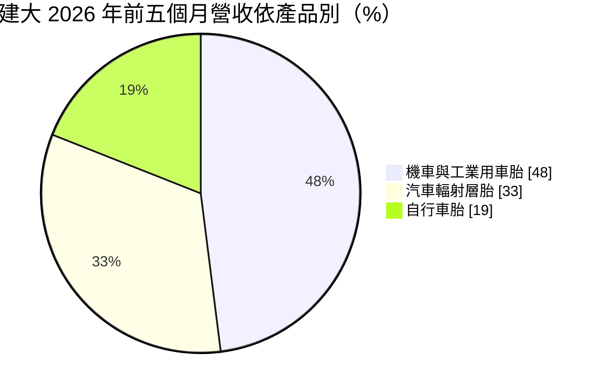
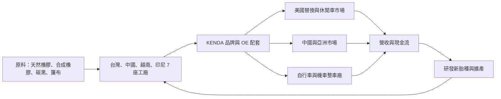
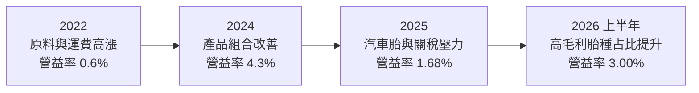
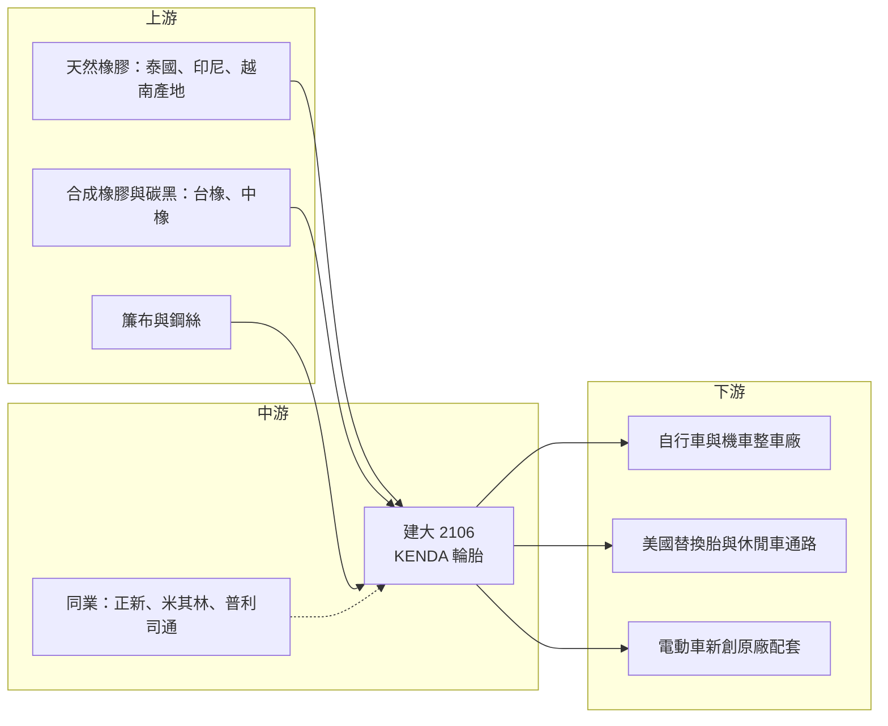

# 2106 建大

> 上市｜[[產業索引-橡膠工業|橡膠工業]]｜上市（櫃）日期 1990/12/20

# 第一章：企業模式與商業藍圖

> [!info] 撰寫說明
> 本文由 Claude 依公開資料整理，架構比照 [[2330台積電]] 的四章研究，資料截至 2026-10-08。財務數字來源：Goodinfo 年度經營績效頁、富果研究 2026 年 6 月法說會整理、證交所開放資料（基本資料、2026 年第二季資產負債與綜合損益、股利）；產業描述為整理性內容，尚未逐條比對原始文件。#待校對

在評估單一個股的長期投資價值時，首要步驟是拆解企業的底層獲利邏輯。本章針對建大工業（股票代號：2106，以下簡稱建大）的商業模式進行定性分析，說明這家以 KENDA 品牌行銷全球的輪胎廠，如何從自行車胎起家，逐步把重心移到機車胎、工業胎與汽車胎，以及為什麼它的獲利長年停留在低檔。

## 一、核心定位：以自有品牌經營利基胎種的中型輪胎廠

建大成立於 1962 年，總部在彰化員林，是台灣歷史最悠久的輪胎廠之一，實收資本額約 95.5 億元。公司以自有品牌 KENDA 銷售，依法說會資料是全球前 30 大輪胎品牌，在台灣、中國、越南與印尼共有 7 座生產工廠與 4 座研發中心。

建大和米其林、普利司通這類全球一線大廠的定位不同。大廠的主戰場是乘用車與卡車輪胎，追求的是規模與原廠配套地位；建大則長期深耕「量小、規格多」的利基胎種，例如自行車胎、機車胎、全地形車（[[ATV]]）胎、草坪機與工業用車胎。這些市場的單一規格銷量不大，大廠興趣有限，反而讓中型廠能靠多品項與快速開模建立地位。

這個定位帶來兩個長期特徵：

* **品項廣、客戶分散：** 利基胎種的規格動輒上千種，客戶從自行車品牌、機車廠到美國的動力運動車與園藝機具通路都有，單一客戶依賴度較低，這讓營收在景氣衰退時不至於崩落。
* **規模經濟有限：** 也因為產品分散，建大很難像大廠一樣靠單一產品的大量生產壓低成本，在原料價格上漲時議價能力有限，這是它毛利率長期在兩成上下徘徊的根本原因。

## 二、產品板塊：機車與工業胎已成最大類別

依法說會資料，2026 年前五個月的營收結構如下：

* **機車與工業用車胎：** 包括機車胎、全地形車胎、草坪機與拖車胎等，是建大目前占比最高、毛利也較好的類別。這類輪胎多用於美國的休閒與園藝市場，產品需要耐磨、抓地與特殊花紋設計，規格多而分散，有利於建大發揮多品項的優勢。2026 年第一季獲利改善，法說會說明主要就是因為這類高毛利產品占比提高。
* **汽車輻射層胎：** 即乘用車用的 [[輻射層輪胎]]，是建大近十年積極投入的板塊，主要銷往美國[[替換市場]]。汽車胎市場規模大，但競爭者也最多，建大在這裡比較像挑戰者而非領導者，2026 年受美國關稅與通路去庫存影響較大。
* **自行車胎：** 建大起家的本業，客戶包括自行車整車品牌與售後零售通路。疫情期間自行車需求暴增，之後在 2022 至 2024 年經歷漫長的庫存調整，法說會表示售後市場已回升，原廠配套市場復甦較慢。

地區方面，2025 年美國占營收 38%、中國 27%、其他地區 35%。美國是最大市場，也是建大以印尼廠作為對美出口據點的原因。

## 三、資本轉化邏輯：多國設廠、品牌通路與原料成本的拉鋸

輪胎是典型的「原料密集」產業。主要原料是天然橡膠、合成橡膠、碳黑、鋼絲與簾布，原料約占生產成本的一半以上（推估，依輪胎業一般結構）。建大的獲利由三個因素決定：原料價格、產品組合與工廠的產能利用率。

* **原料成本傳導有時間差：** 橡膠與石化原料價格上漲時，輪胎售價通常要落後一到兩季才能調整，這段期間毛利率會被壓縮；原料下跌時則相反。2022 年營業利益率只有 0.6%，就是原料與運費高漲、售價追不上的結果。
* **多國產能是對沖工具：** 建大在中國、越南、印尼都有工廠，可以依關稅與成本調整出貨地。美國對中國輪胎課徵[[反傾銷稅]]後，對美出貨改由東南亞工廠供應，是近十年台灣輪胎廠共同的布局邏輯。
* **品牌讓價格有支撐：** 以 KENDA 品牌在替換市場銷售，價格比純代工穩定，但品牌也需要長期的行銷與通路投入，這反映在建大較高的營業費用上。2026 年上半年毛利率 19.73%，營業利益率卻只有 3.00%，代表毛利大部分被營業費用吃掉。

## 四、企業長期藍圖

建大的長期策略可以歸納為三個方向。第一是提高高毛利胎種的比重，也就是把資源集中在機車、ATV、工業胎等利基市場，減少在汽車胎紅海中正面競爭。第二是進入電動車供應鏈，法說會表示公司將於 2026 年第三季起替一家美國新創電動車廠供應原廠配套輪胎，並持續開發 [[免充氣輪胎]] 與電動車專用胎，這是建大少數能進入汽車原廠配套的機會。第三是資產活化，深圳舊廠的都市更新一期已認列為投資性不動產，未來可帶來租金收入，讓公司在本業之外多一個穩定的現金來源。

整體而言，建大是一家「品牌與技術都有基礎、但規模不足以掌握定價權」的公司。它的長期價值取決於能否把產品組合持續推向高毛利利基市場，而不是追求營收規模。

# 第二章：護城河深度與競爭優勢

本章針對建大的競爭優勢進行分析，說明它在利基胎種上的護城河從何而來，以及在汽車胎與中國同業的價格競爭中，哪些優勢守得住、哪些守不住。

## 一、護城河的核心組成要素

* **多品項與開模能力：** 建大的產品線涵蓋上千種規格，從越野自行車胎到草坪機胎都有。每一種花紋與尺寸都需要開發模具與配方，累積下來的模具庫與配方資料，是新進者短時間難以複製的資產。客戶傾向向能提供完整產品線的供應商一次採購，這讓建大在利基市場具有一定的黏著度。
* **KENDA 品牌知名度：** 在自行車與美國動力運動車市場，KENDA 是通路熟悉的品牌，零售商願意上架、消費者願意購買。品牌讓建大在替換市場能維持比代工更穩定的價格，也讓它在景氣低迷時不至於只能以價格搶單。
* **多國生產基地：** 台灣、中國、越南與印尼的工廠分布，讓建大能依據關稅、匯率與勞動成本調度產能。在美國對中國輪胎設下貿易障礙的環境下，擁有東南亞產能本身就是一種競爭門檻，因為建廠與取得客戶認證都需要數年時間。
* **研發與驗證：** 4 座研發中心負責配方與花紋開發，汽車胎與電動車胎需要通過車廠的長期驗證，一旦打入原廠配套，替換成本相對高。

## 二、全球主要競爭對手格局

| 競爭對手 | 國家 | 主要重疊領域 | 與建大的比較 |
|---|---|---|---|
| [[2105正新]]（瑪吉斯 MAXXIS） | 台灣 | 自行車胎、機車胎、ATV 胎、汽車胎 | 營收規模約為建大數倍，產品線高度重疊，是最直接的對手 |
| 米其林 | 法國 | 汽車胎、高階自行車與機車胎 | 全球龍頭，品牌與技術領先，主攻高價位 |
| 普利司通 | 日本 | 汽車胎、機車胎 | 全球前兩大，原廠配套地位穩固 |
| 德國馬牌（Continental） | 德國 | 汽車胎、高階自行車胎 | 在歐洲高階自行車胎具品牌優勢 |
| 中國輪胎廠（玲瓏、賽輪等） | 中國 | 汽車胎、工業胎 | 成本低、擴產快，以價格搶占替換市場 |

正新是建大在台灣最直接的對照組。兩家公司產品線相似，但正新在汽車胎與中國市場的規模大得多。建大相對正新的差異，在於更集中於機車、ATV 與工業胎等利基胎種。

## 三、優勢轉化：守得住、守不住與觀察重點

* **守得住：** 機車、ATV 與工業胎等利基市場。這些市場規格分散、單一品項量小，大廠與中國廠的興趣都不高，建大可以靠模具庫、品牌與通路關係維持地位，這也是近年獲利改善的主要來源。
* **守不住：** 一般規格的汽車替換胎。這塊市場面臨中國與東南亞新產能的價格競爭，加上美國關稅政策反覆，建大缺乏大廠的規模優勢，難以掌握價格。2025 年營業利益率只有 1.68%，顯示汽車胎與費用負擔仍拖累整體獲利。
* **觀察重點：** 第一，機車與工業胎占比能否持續提高；第二，美國電動車原廠配套能否從單一新創客戶擴展到更多車廠；第三，深圳廠都更的租金收入何時開始穩定貢獻。這三點決定建大能否擺脫長期低獲利的格局。

# 第三章：財務體質與盈利規模

資料日期：2026-10-08。數字取自 Goodinfo 年度經營績效頁、富果研究法說會整理與證交所開放資料，表格是撰寫當時的快照；最新月營收、毛利率、累計 EPS 由自動排程寫在本筆記的屬性欄位（月營收、毛利率、累計EPS 等）。#待校對

財務報表是檢驗護城河是否真實存在的最終標準。本章用多年度的三率、ROE 與資本報酬，檢視建大在原料循環與庫存週期中的獲利品質。

## 一、獲利能力的基石：三率

| 年度 | 營收（新台幣） | [[毛利率]] | [[營業利益率]] | EPS（元） | [[ROE]] |
|---|---|---|---|---|---|
| 2019 | 321 億 | 20.4% | 3.90% | 1.16 | 5.36% |
| 2020 | 303 億 | 24.3% | 5.08% | 1.07 | 5.13% |
| 2021 | 349 億 | 20.5% | 4.99% | 1.01 | 4.85% |
| 2022 | 386 億 | 14.7% | 0.60% | 0.37 | 1.77% |
| 2023 | 344 億 | 19.4% | 3.76% | 0.92 | 4.52% |
| 2024 | 342 億 | 22.0% | 4.30% | 1.30 | 6.10% |
| 2025 | 340 億 | 19.2% | 1.68% | 0.13 | 0.62% |
| 2026 上半年 | 182.5 億 | 19.73% | 3.00% | 0.33 | 未查得 |

* **[[毛利率]]：** 建大的毛利率長年在 15% 至 24% 之間，高點出現在 2016 年的 27% 與 2020 年的 24.3%，都是原料價格處於低檔的年份；低點是 2022 年的 14.7%，當年天然橡膠、石化原料與海運費同時高漲。毛利率的波動主要反映原料成本，而不是產品售價的變化。
* **[[營業利益率]]：** 建大毛利率約兩成，但營業利益率多在 5% 以下，代表品牌行銷、研發與管理費用約占營收 15% 以上。費用結構相對固定，只要毛利率下滑 2 至 3 個百分點，營業利益就可能接近歸零，2022 年與 2025 年都是例子。
* **營收趨勢：** 2016 年營收 295 億元，2025 年為 340 億元，十年年複合成長率約 1.6%（推算）；2021 至 2025 年的年複合成長率約 -0.7%（推算）。營收規模大致停留在 300 至 390 億元之間，成長主要來自疫情期間的自行車熱潮，之後回到原本水準。

## 二、[[ROE]]：資本效率

2021 至 2025 年平均 ROE 約 3.6%（推算），近十年只有 2016 年超過 10%。這個水準明顯低於一般投資人要求的股東權益報酬，也解釋了建大股價淨值比長期低於 1 倍的原因。2026 年第二季底歸屬母公司股東權益約 198.5 億元，總負債約 278.8 億元，負債比約 58%（證交所開放資料），財務槓桿不低，但獲利能力不足以把槓桿轉化成高 ROE。

## 三、資本支出、自由現金流與股利

建大近十年陸續在越南、印尼擴建工廠，並投入汽車胎產能，資本支出負擔不輕；具體金額與歷年自由現金流本文未查得。股利方面，Goodinfo 統計建大一般平均現金股利約 0.58 元；2025 年度 EPS 只有 0.13 元，仍配發每股 0.65 元現金股利（證交所股利資料），代表公司是動用以前年度的保留盈餘維持配息。這種做法短期可以穩定股東，但若本業獲利無法回升，長期難以持續。

## 四、[[ROIC]] 與 [[WACC]]：價值創造利差

**ROIC 推算：** 2025 年營收 340 億元、營業利益率 1.68%，營業利益約 5.7 億元，扣除 20% 稅率後約 4.6 億元。2026 年第二季底股東權益約 198.5 億元，總負債約 278.8 億元，假設其中約七成為有息負債（推估，約 195 億元），投入資本約 394 億元，2025 年 ROIC 約 1.2%（推算）。以同樣的資本基礎估算 2024 年（營業利益約 14.7 億元、稅後約 11.8 億元），ROIC 約 3.0%（推算）。

**WACC 推算：** 假設台灣 10 年期公債殖利率 1.75%、市場風險溢酬 6%、β 取傳統製造業常見值 0.8，股東權益成本約 6.55%。負債成本假設 2.5%，稅後約 2.0%；以帳面價值計，權益與負債約各占一半，WACC 約 4.3%（推算）。

**結論：** 建大近年的 ROIC 約 1% 至 3%，低於約 4% 至 5% 的資金成本，代表本業在大多數年份並未創造超過資金成本的報酬。只有在原料便宜、產品組合理想的年份（例如 2016 年），ROIC 才可能高於 WACC。對長期投資人而言，觀察重點不是單一年度的 EPS，而是高毛利胎種的占比能否把營業利益率穩定推升到 5% 以上，因為那大約是 ROIC 跨過 WACC 的門檻（推估）。

# 第四章：總體風險與地緣政治

任何企業都無法脫離宏觀環境獨立存在。本章分析建大長期必須面對的貿易政策、原料循環、營運與技術風險。

## 一、地緣政治與貿易政策

* **美國關稅與反傾銷：** 美國是建大最大的市場，占 2025 年營收 38%。美國過去多次對中國、越南、泰國等地生產的輪胎課徵反傾銷或反補貼稅，加上 2025 年起的[[對等關稅]]政策，讓輪胎業的生產地選擇高度受政策左右。建大以印尼廠作為對美出口據點，但若美國擴大對東南亞的課稅範圍，這個布局的效益就會打折。
* **中國市場的雙面性：** 中國占營收 27%，既是重要市場也是生產基地。中國本土輪胎廠快速擴產並以低價搶市，加上中國經濟成長放緩，建大在中國的獲利空間持續受到擠壓。

## 二、產業週期與市場結構

* **原料價格循環：** 天然橡膠價格受東南亞天候與產量影響，合成橡膠與碳黑則與原油價格連動。2026 年法說會提到中東衝突推升原料成本，預期壓縮第二季毛利，這是輪胎業每隔幾年就會遇到的循環壓力。
* **自行車與休閒車的庫存週期：** 自行車與 ATV 屬於非必需的休閒消費，疫情期間需求暴增後，2022 至 2024 年經歷了漫長的去庫存。這類需求受消費信心與利率影響大，容易出現 [[長鞭效應]]，終端需求小幅變化會讓上游輪胎廠的訂單大幅波動。
* **汽車替換胎供過於求：** 中國與東南亞的輪胎產能持續擴張，替換胎市場的價格競爭可能長期存在。

## 三、營運環境的隱性風險

* **費用結構僵固：** 建大的營業費用約占營收 15% 以上，毛利率稍有下滑就可能侵蝕全部營業利益，獲利對原料價格非常敏感。
* **匯率：** 營收以美元計價為主，新台幣升值會壓縮以台幣計算的營收與毛利。
* **配息與獲利脫鉤：** 近年配息高於當年獲利，若本業長期無法改善，保留盈餘終將耗盡，配息政策可能被迫調整。

## 四、科技與法規演進

* **電動車輪胎：** 電動車重量較重、扭力大，對輪胎的耐磨與低滾阻要求更高。這是建大打入汽車原廠配套的機會，但也需要持續投入研發與驗證。
* **環保法規：** 歐盟的輪胎標籤與輪胎磨耗微粒規範、碳邊境調整機制，以及客戶對回收材料比例的要求，都會增加合規成本。建大已導入回收材料等措施，但中小型輪胎廠在綠色轉型上的投資能力不如大廠，長期可能成為劣勢。
* **免充氣輪胎：** 若免充氣輪胎在自行車、機車或小型電動車上普及，產品形態與製程都會改變，先行研發的廠商有機會取得新市場。

# 專有名詞解析

## 金融

- **[[毛利率]]**：營業毛利占營收的比例，反映產品定價能力與生產成本控制。
- **[[營業利益率]]**：扣除營業費用後的營業利益占營收的比例，衡量本業整體獲利能力。
- **[[ROE]]**：股東權益報酬率，稅後淨利除以股東權益，衡量公司運用股東資金的效率。
- **[[ROIC]]**：投入資本報酬率，稅後營業利益除以股東權益與有息負債的合計，衡量本業對所有資金提供者的報酬。
- **[[WACC]]**：加權平均資金成本，依股東權益與負債的比重加權計算的資金成本，ROIC 高於它才代表創造價值。
- **[[長鞭效應]]**：終端需求的小幅變動，沿供應鏈往上游傳遞時被逐級放大，造成上游庫存與訂單劇烈波動。

## 產業

- **[[輻射層輪胎]]**：胎體簾布以放射狀排列的輪胎，散熱與操控較佳，是現代乘用車的主流結構，又稱子午線輪胎。
- **[[免充氣輪胎]]**：以特殊結構支撐車重、不需灌氣的輪胎，不會爆胎，正被開發用於自行車、小型電動車與機具。
- **[[OE 配套]]**：原廠配套，指輪胎直接安裝在新車出廠，需通過車廠長期驗證，量大但價格壓力也大。
- **[[替換市場]]**：車主在原車輪胎磨耗後自行購買更換的市場，品牌與通路影響力大，價格通常比原廠配套穩定。
- **[[ATV]]**：全地形車，四輪的越野休閒車，主要市場在北美，輪胎規格多、需要特殊花紋設計。
- **[[反傾銷稅]]**：進口國認定外國產品以低於正常價格出口時加徵的關稅，常用於限制特定國家的輪胎、鋼鐵等產品。
- **[[對等關稅]]**：美國自 2025 年起依各國貿易條件訂定的進口關稅，稅率依國家而異，影響企業的生產地選擇。

# 核心供應鏈

## 1. 上游：橡膠與化工原料
- 合成橡膠：[[2103台橡]]
- 碳黑：[[2104國際中橡]]
- 天然橡膠主要來自泰國、印尼、越南等東南亞產地，價格受天候與產量影響。

## 2. 中游：建大本身與同業
- 建大以 KENDA 品牌在台灣、中國、越南、印尼共 7 座工廠生產。
- 台灣同業：[[2105正新]]、[[2101南港]]、[[2102泰豐]]
- 國際大廠：米其林、普利司通、德國馬牌、固特異

## 3. 下游：整車廠與通路
- 自行車整車品牌：台灣代表廠商為 [[9921巨大]]、[[9914美利達]]（個別供貨關係本文未逐一查證）
- 機車整車廠與美國動力運動車、草坪機具廠
- 美國輪胎替換通路與零售商
- 2026 年第三季起供應一家美國新創電動車廠的原廠配套輪胎（客戶名稱未公開）

## 最新新聞
<!-- news:start -->
<!-- news:end -->

## 相關連結
- [公開資訊觀測站](https://mopsov.twse.com.tw/mops/web/t05st03?step=1&firstin=1&co_id=2106)
- [Goodinfo](https://goodinfo.tw/tw/StockDetail.asp?STOCK_ID=2106)
- [Yahoo 股市](https://tw.stock.yahoo.com/quote/2106)
- [鉅亨網新聞](https://www.cnyes.com/twstock/2106/news)
