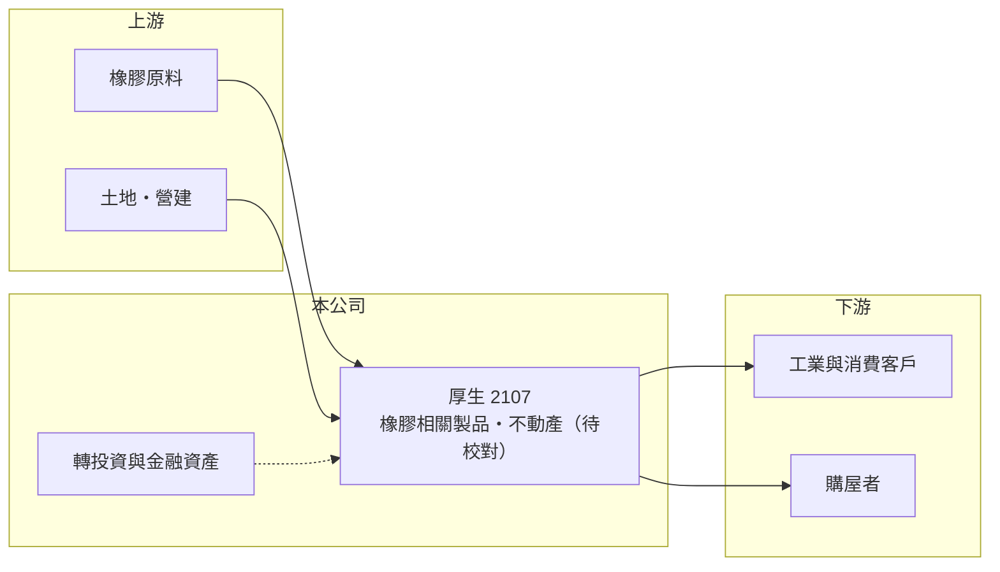

# 2107 厚生

> 上市｜[[產業索引-橡膠工業|橡膠工業]]｜上市（櫃）日期 1992/03/03

# 第一章：企業模式與商業藍圖

> [!info] 撰寫說明
> 精簡版，由 Claude 依公開資料整理，架構比照 [[2330台積電]] 的四章研究，資料截至 2026-10-08。來源：證交所開放資料（基本資料、2026 年上半年資產負債與損益、股利、本益比）、Goodinfo 年度經營績效。公開資料有限，產品與事業結構部分憑既有知識撰寫，需對照年報校正。#待校對

厚生（股票代號：2107）成立於 1963 年、1992 年上市，在證交所產業分類屬於橡膠業，董事長為徐正材。和一般製造業不同，厚生的資產負債表以龐大的股東權益與投資為特色，本業營收規模相對小，因此更適合把它理解為「本業加資產」的公司。

- **核心業務：** 厚生的營業項目包含橡膠相關製品與不動產開發（事業細項與比重待校對）。2019 至 2021 年營收從過去約 14 至 17 億元放大到 27 至 33 億元，且毛利率維持在三成以上，推估與不動產案件認列有關（推估，待校對）。
- **營收結構：** 依 Goodinfo 資料，2025 年營收 14.4 億元、[[毛利率]] 34.2%、[[營業利益率]] 19.6%；2026 年上半年營收 7.5 億元、毛利率 39.1%。產品別營收比重未查得。
- **資產特色：** 2026 年上半年總資產約 174 億元、股東權益約 151 億元、總負債僅約 23 億元，每股淨值 49.80 元，股價淨值比約 0.56 倍（證交所資料）。同期業外收益 2.07 億元，高於營業利益 1.97 億元，代表轉投資與金融資產是獲利的重要來源。
- **長期方向：** 公開資料未見明確的擴產或轉型計畫。對長期投資人而言，厚生的價值關鍵在資產的運用效率：龐大的權益是否能轉化為更高的報酬，或透過股利回饋股東。

# 第二章：護城河深度與競爭優勢

厚生的護城河不在單一產品，而在低負債與資產厚度帶來的財務韌性。

- **競爭優勢：** 第一是資產負債表極為保守，負債占總資產約 13%，景氣低迷時沒有償債壓力。第二是長期持有的土地與投資部位，可在本業之外提供穩定的業外收益。第三是本業毛利率長年維持在 30% 上下，顯示產品或案件具有一定的定價能力。
- **主要對手：** 由於事業組成未查得，難以列出直接競爭對手。若以橡膠製品論，國內同業包括 [[2114鑫永銓]]、[[2109華豐]] 等；若以不動產論，則與各地建商競爭。
- **守得住與守不住：** 守得住的是財務穩定與配息能力；守不住的是成長性，2020 至 2025 年營收年複合成長率約 -15%（推算，受 2020 年高基期影響）。
- **觀察重點：** 年報揭露的事業組成、不動產案件的推案節奏，以及股利政策是否與資產規模相稱。

# 第三章：財務體質與盈利規模

資料日期：2026-10-08，表格是撰寫當時的快照；最新月營收、毛利率、累計 EPS 由自動排程寫在本筆記的屬性欄位（月營收、毛利率、累計EPS 等）。#待校對

厚生的財報特點是高毛利、低負債、低 ROE，原因是大部分資本沒有投入在本業。

| 年度 | 營收（新台幣） | [[毛利率]] | [[營業利益率]] | EPS（元） | [[ROE]] |
|---|---|---|---|---|---|
| 2021 | 27.9 億 | 31.6% | 22.4% | 2.27 | 6.73% |
| 2022 | 19.4 億 | 32.3% | 19.1% | 2.09 | 5.98% |
| 2023 | 13.6 億 | 30.9% | 14.7% | 1.61 | 4.28% |
| 2024 | 14.8 億 | 31.9% | 16.7% | 1.89 | 4.49% |
| 2025 | 14.4 億 | 34.2% | 19.6% | 1.67 | 3.81% |

- **營收規模：** 營收在 2020 年達 32.8 億元高峰後逐年回落，2023 年以後穩定在 14 億元上下。實收資本額約 30.4 億元（證交所資料）。
- **獲利：** 2021 至 2025 年平均 ROE 約 5.1%（推算），EPS 穩定在 1.6 至 2.3 元之間，波動遠小於一般橡膠業。2026 年上半年 EPS 1.14 元，稅後淨利率 46%，業外收益占比高。
- **股利：** 2025 年度現金股利 1.4 元，配息率約 84%（推算，以 EPS 1.67 元計）。Goodinfo 統計的長期一般平均現金股利約 0.68 元，近年配息明顯提高。

**[[ROIC]] 與 [[WACC]]：** 以 2025 年計，營業利益約 2.82 億元（14.4 億 × 19.6%），稅後約 2.26 億元。股東權益約 151 億元，有息負債推估約 10 億元（總負債 23 億元中扣除應付款項，推估），投入資本約 161 億元，ROIC 約 1.4%（推算）。這個數字偏低，是因為權益中有很大一部分是投資與土地，而不是本業營運資產；若只計本業資產，ROIC 會高得多，但資料不足以拆分。WACC 以 CAPM 推估：無風險利率 1.75%、市場風險溢酬 6%、β 取資產股常見值 0.7，股東權益成本約 6.0%，幾乎全為權益融資，WACC 約 5.8%（推算）。以全公司投入資本衡量，ROIC 長期低於 WACC，資本效率偏低；股價長期低於淨值，也反映市場對資產運用效率的折價。

# 第四章：總體風險與地緣政治

厚生的風險主要不在財務，而在資產運用與資訊揭露。

- **產業週期：** 若不動產是重要收入來源，營收會隨推案與完工認列的時點大幅波動，2020 年與 2023 年的落差就是例子。房地產景氣與信用管制也會影響推案。
- **營運風險：** 本業規模小，成長動能有限；大部分獲利仰賴業外收益，金融市場下跌時獲利會同步下滑。公開資訊相對少，投資人不易判斷各事業的真實獲利。
- **其他風險：** 利率上升會壓抑不動產需求；原物料價格與匯率會影響橡膠相關製品的成本。

# 專有名詞解析

## 金融

- **[[股價淨值比]]**：股價除以每股淨值，低於 1 倍代表市場給的價值低於帳面淨資產。
- **[[業外收益]]**：本業以外的收入，例如投資收益、股利、利息與處分資產利益。
- **[[ROIC]]**：投入資本報酬率，稅後營業利益除以股東權益加有息負債，衡量本業運用資本的效率。
- **[[WACC]]**：加權平均資金成本，股東與債權人要求報酬的加權平均，ROIC 高於它才代表創造價值。

# 核心供應鏈

- 上游：天然橡膠與合成橡膠原料，國內供應商如 [[2103台橡]]、[[2108南帝]]（產業參考）；營建與土地。
- 下游／客戶：未查得具名客戶。
- 同業：橡膠業的 [[2114鑫永銓]]、[[2109華豐]]（產業參考）。

## 最新新聞
<!-- news:start -->
<!-- news:end -->

## 相關連結
- [公開資訊觀測站](https://mopsov.twse.com.tw/mops/web/t05st03?step=1&firstin=1&co_id=2107)
- [Goodinfo](https://goodinfo.tw/tw/StockDetail.asp?STOCK_ID=2107)
- [Yahoo 股市](https://tw.stock.yahoo.com/quote/2107)
- [鉅亨網新聞](https://www.cnyes.com/twstock/2107/news)
