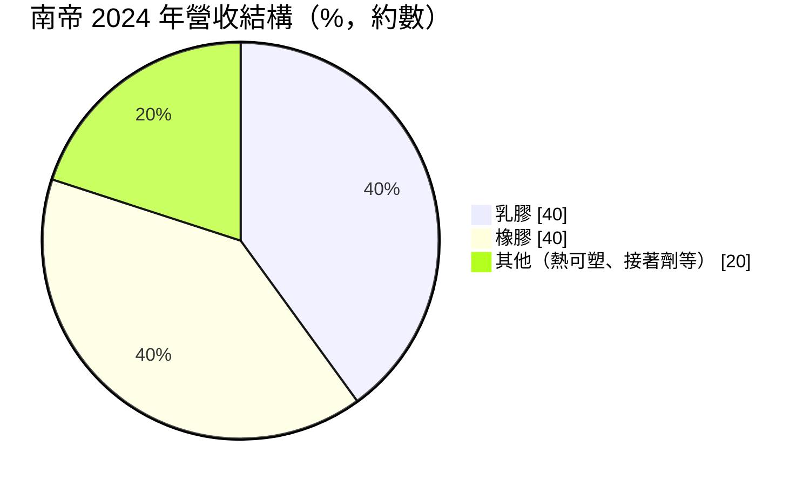
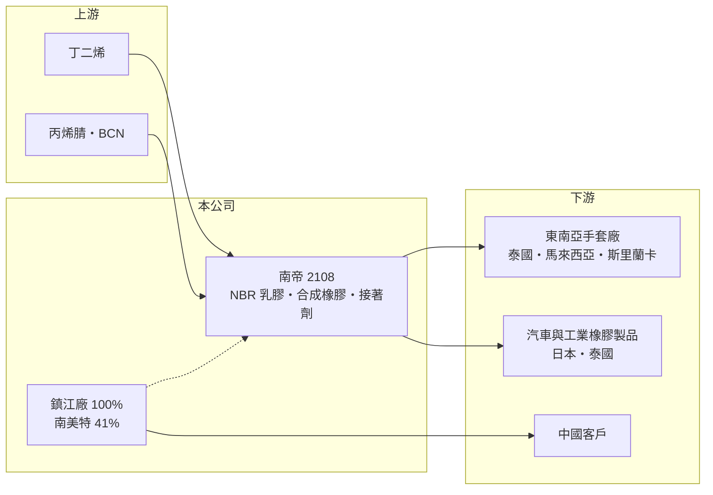

# 2108 南帝

> 上市｜[[產業索引-橡膠工業|橡膠工業]]｜上市（櫃）日期 1992/10/27

# 第一章：企業模式與商業藍圖

> [!info] 撰寫說明
> 精簡版，由 Claude 依公開資料整理，架構比照 [[2330台積電]] 的四章研究，資料截至 2026-10-08。來源：證交所開放資料（基本資料、2026 年上半年資產負債與損益、股利）、Goodinfo 年度經營績效、富果研究 2025 年 3 月法說會整理。#待校對

南帝化學（股票代號：2108，以下簡稱南帝）成立於 1979 年，是台灣主要的合成乳膠與合成橡膠廠。它最為人知的產品是製作丁腈手套的 [[NBR]] 乳膠，2020 至 2021 年疫情期間手套需求暴增，讓南帝的獲利一度創下歷史紀錄，之後又隨手套產業的產能過剩快速回落。

- **核心業務：** 南帝把丁二烯等石化原料聚合成乳膠與乾膠。乳膠以 NBR 乳膠為主，主要賣給東南亞手套廠製作丁腈手套；橡膠產品則用於汽車零件、工業製品等；其他產品包括熱可塑性材料與接著劑。
- **營收結構：** 依 2025 年 3 月法說會，2024 年乳膠與橡膠各約占營收四成，其他產品約兩成。

- **營運據點：** 高雄林園廠年產能約 14.5 萬噸，2024 年產能利用率約六成；乳膠外銷泰國、馬來西亞、斯里蘭卡等手套產地，橡膠內外銷比約 4:6，外銷以日本、泰國為主。中國鎮江廠為 100% 持股，2024 年產能利用率接近九成，主要供應中國市場。另持有高雄楠梓的南美特 41%，生產塗料等產品。
- **長期方向：** 公司表示將鞏固既有產品線、開發新產品並提升效率。長期來看，南帝的成長取決於丁腈手套的長期需求（醫療與衛生標準提高）能否消化疫情後的過剩產能，以及高附加價值的特用橡膠能否提高比重。

# 第二章：護城河深度與競爭優勢

南帝的護城河來自 NBR 乳膠的技術與客戶認證，但在產能過剩時定價能力有限。

- **競爭優勢：** NBR 乳膠的配方會影響手套的薄度、強度與良率，手套廠更換乳膠供應商需要重新調整製程，因此既有供應關係具有黏著度。南帝在台灣與中國兩地生產，可分別服務東南亞與中國客戶，鎮江廠的高利用率也提供穩定的投資收益。
- **主要對手：** 韓國錦湖石化、馬來西亞的 Synthomer，以及大量中國 NBR 乳膠新產能。台灣同業有 [[6582申豐]]（NBR 乳膠）與 [[2103台橡]]（合成橡膠）。
- **守得住與守不住：** 守得住的是高品質、長期合作的手套大廠訂單與特用橡膠利基市場；守不住的是乳膠報價，疫情後手套與乳膠產能同時過剩，[[毛利率]]從 2021 年的 52% 回到 20% 上下。
- **觀察重點：** 手套產業的庫存去化與產能整併、美國對中國手套加徵關稅後的訂單移轉，以及林園廠利用率能否回升。

# 第三章：財務體質與盈利規模

資料日期：2026-10-08，表格是撰寫當時的快照；最新月營收、毛利率、累計 EPS 由自動排程寫在本筆記的屬性欄位（月營收、毛利率、累計EPS 等）。#待校對

南帝的五年數字完整呈現了疫情紅利從高峰回到常態的過程。

| 年度 | 營收（新台幣） | [[毛利率]] | [[營業利益率]] | EPS（元） | [[ROE]] |
|---|---|---|---|---|---|
| 2021 | 235 億 | 52.0% | 42.1% | 14.92 | 53.5% |
| 2022 | 117 億 | 26.4% | 12.7% | 2.42 | 8.58% |
| 2023 | 89.4 億 | 23.4% | 9.36% | 1.45 | 6.20% |
| 2024 | 114 億 | 19.9% | 6.92% | 1.14 | 5.61% |
| 2025 | 95.5 億 | 22.3% | 7.38% | 0.83 | 4.45% |

- **營收規模：** 2020 至 2025 年營收年複合成長率約 -7.9%（推算），主要是 2021 年高基期的影響。疫情前 2016 至 2019 年營收約 95 至 138 億元、ROE 約 11% 至 21%，比較能代表南帝的常態水準。2026 年上半年營收 60.5 億元、毛利率 30.4%、營業利益率 16.6%、EPS 1.28 元，獲利回升。
- **獲利：** 2021 至 2025 年平均 ROE 約 15.7%（推算），但其中 2021 年就占了絕大部分；扣除 2021 年後平均約 6%。
- **股利：** 2025 年度現金股利 1.0 元（證交所資料），2024 年度同為 1 元、配息率約 87%。南帝傾向發放大部分盈餘，配息隨獲利變動。

**[[ROIC]] 與 [[WACC]]：** 以 2025 年計，營業利益約 7.05 億元（95.5 億 × 7.38%），稅後約 5.64 億元。2026 年上半年權益總計約 168 億元、總負債約 24 億元，假設有息負債約 10 億元（推估），投入資本約 178 億元，ROIC 約 3.2%（推算）；2021 年以同樣方法推算超過 30%。WACC 以 CAPM 推估：無風險利率 1.75%、市場風險溢酬 6%、β 取石化同業常見值 0.9，股東權益成本約 7.2%，負債比重很低，WACC 約 7.0%（推算）。疫情期間 ROIC 遠高於 WACC，2022 年以後則低於資金成本；南帝能否在常態年度回到疫情前 10% 以上的 ROIC，是長期價值的關鍵。

# 第四章：總體風險與地緣政治

南帝的風險集中在手套產業的供需與石化原料價格。

- **產業週期：** NBR 乳膠需求幾乎由丁腈手套決定，手套業在疫情期間大幅擴產，之後經歷多年的庫存去化與價格戰，形成強烈的循環。
- **營運風險：** 原料丁二烯與 BCN 合計約占原料成本六至七成，2024 年丁二烯進口均價約每噸 1,300 至 1,400 美元，高於 2023 年的不到 1,000 美元，原料上漲時難以完全轉嫁。林園廠利用率僅約六成，固定成本攤提壓力大。
- **其他風險：** 美國對中國手套加徵關稅，會改變東南亞與中國手套廠的訂單分配，進而影響南帝台灣廠與鎮江廠的接單。匯率、碳費與環保法規也會影響成本。

# 專有名詞解析

## 應用

- **[[丁腈手套]]**：以 NBR 乳膠製成的拋棄式手套，不含天然乳膠過敏原，廣泛用於醫療、食品與工業。

## 金融

- **[[ROIC]]**：投入資本報酬率，稅後營業利益除以股東權益加有息負債，衡量本業運用資本的效率。
- **[[WACC]]**：加權平均資金成本，股東與債權人要求報酬的加權平均，ROIC 高於它才代表創造價值。

## 產業

- **[[NBR]]**：丁腈橡膠（丁二烯與丙烯腈共聚物），耐油性佳，乳膠型態主要用於製作丁腈手套。
- **[[丁二烯]]**：生產合成橡膠的主要石化原料，價格隨油價與乙烯裂解產量波動。

# 核心供應鏈

- 上游：丁二烯與丙烯腈等石化原料，國內來源包括 [[6505台塑化]]、[[1301台塑]]（產業參考，實際供應比例未查得）。
- 下游／客戶：泰國、馬來西亞、斯里蘭卡等地的丁腈手套廠（具名客戶未查得）；日本、泰國的汽車與工業橡膠製品廠。
- 同業：[[6582申豐]]、[[2103台橡]]、錦湖石化、Synthomer。

## 最新新聞
<!-- news:start -->
<!-- news:end -->

## 相關連結
- [公開資訊觀測站](https://mopsov.twse.com.tw/mops/web/t05st03?step=1&firstin=1&co_id=2108)
- [Goodinfo](https://goodinfo.tw/tw/StockDetail.asp?STOCK_ID=2108)
- [Yahoo 股市](https://tw.stock.yahoo.com/quote/2108)
- [鉅亨網新聞](https://www.cnyes.com/twstock/2108/news)
