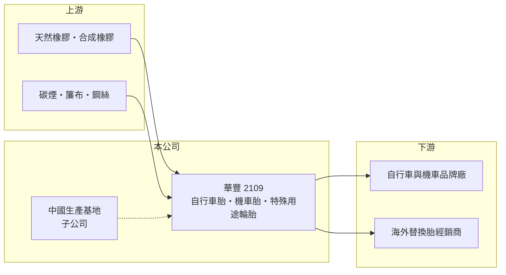

# 2109 華豐

> 上市｜[[產業索引-橡膠工業|橡膠工業]]｜上市（櫃）日期 2000/05/08

# 第一章：企業模式與商業藍圖

> [!info] 撰寫說明
> 精簡版，由 Claude 依公開資料整理，架構比照 [[2330台積電]] 的四章研究，資料截至 2026-10-08。來源：證交所開放資料（基本資料、2026 年上半年資產負債與損益、股利）、Goodinfo 年度經營績效。公開資料有限，產品組合、品牌與工廠據點憑既有知識撰寫，需對照年報校正。#待校對

華豐橡膠（股票代號：2109，以下簡稱華豐）成立於 1959 年、2000 年上市，是台灣老牌的輪胎廠，董事長為沈國榮。和以汽車胎為主的南港、正新不同，華豐的產品偏重自行車胎、機車胎與特殊用途輪胎，屬於輪胎業中的利基型廠商。

- **核心業務：** 華豐生產自行車內外胎、機車胎、全地形車（ATV）與農用、工業用等特殊輪胎，以自有品牌 DURO 行銷（產品組合與品牌待校對）。這類輪胎尺寸規格多、單一訂單量小，比較需要彈性生產與經銷通路，而不是汽車胎那樣的大規模自動化。
- **營收結構：** 年營收長期穩定在 45 至 60 億元之間，2025 年為 44.6 億元。產品別與地區別營收比重未查得。
- **營運據點：** 除台灣外，華豐在中國設有生產基地（地點待校對）。2026 年上半年資產負債表的非控制權益約 14.4 億元，代表有部分子公司與外部股東共同持有。
- **長期方向：** 自行車與機車胎市場成熟，華豐的長期方向在於提高高單價特殊胎與品牌替換胎的比重，並依關稅環境調整各地產能分配（推估）。

# 第二章：護城河深度與競爭優勢

華豐的護城河來自利基市場的規格廣度與品牌通路，規模不大但獲利穩定。

- **競爭優勢：** 第一是產品規格齊全，自行車與特殊用途輪胎需要大量模具與小批量生產能力，新進者要追上需要時間。第二是自有品牌在海外替換胎通路累積的知名度。第三是穩定的財務紀律，2020 年以後連續六年營業利益率維持在 9.7% 至 13.8%，在輪胎業中屬於波動較小的公司。
- **主要對手：** 國內同業 [[2105正新]]、[[2106建大]] 在自行車與機車胎領域規模更大，國際上有德國世偉洛克（Schwalbe）、德國馬牌與大量中國廠。
- **守得住與守不住：** 守得住的是特殊規格與品牌替換胎的毛利；守不住的是一般規格自行車胎的價格，疫情後自行車產業庫存調整也讓營收從 2021 年的 55 億元降到 2025 年的 45 億元。
- **觀察重點：** 自行車產業庫存去化後的需求回升、特殊用途輪胎的比重，以及美國關稅對中國廠產品的影響。

# 第三章：財務體質與盈利規模

資料日期：2026-10-08，表格是撰寫當時的快照；最新月營收、毛利率、累計 EPS 由自動排程寫在本筆記的屬性欄位（月營收、毛利率、累計EPS 等）。#待校對

華豐近五年的財報呈現穩定的中等獲利，波動遠小於石化與大宗輪胎同業。

| 年度 | 營收（新台幣） | [[毛利率]] | [[營業利益率]] | EPS（元） | [[ROE]] |
|---|---|---|---|---|---|
| 2021 | 55.4 億 | 22.6% | 12.6% | 1.30 | 12.4% |
| 2022 | 54.1 億 | 19.9% | 10.6% | 1.05 | 9.61% |
| 2023 | 46.7 億 | 21.9% | 9.74% | 1.51 | 10.8% |
| 2024 | 49.4 億 | 23.5% | 13.8% | 1.61 | 12.0% |
| 2025 | 44.6 億 | 21.9% | 10.9% | 1.16 | 7.90% |

- **營收規模：** 2020 至 2025 年營收年複合成長率約 -1.8%（推算），本業沒有明顯成長。2026 年上半年營收 22.9 億元、毛利率 21.9%、營業利益率 9.3%、EPS 0.72 元。實收資本額約 27.9 億元（證交所資料）。
- **獲利：** 2021 至 2025 年平均 ROE 約 10.5%（推算）。回顧 2017 年曾因虧損 EPS -2.94 元，2020 年後轉為穩定獲利，顯示經營效率有明顯改善。
- **股利：** 2025 年度現金股利 0.5 元，2026 年另有一筆 0.5 元的現金股利決議（證交所資料）；Goodinfo 統計的長期一般平均現金股利僅 0.22 元，近年配息逐步提高，但配息率仍偏低，盈餘多保留在公司。

**[[ROIC]] 與 [[WACC]]：** 以 2025 年計，營業利益約 4.86 億元（44.6 億 × 10.9%），稅後約 3.89 億元。2026 年上半年權益總計約 49.9 億元（含非控制權益）、總負債約 37.6 億元，假設有息負債約 20 億元（推估），投入資本約 70 億元，ROIC 約 5.6%（推算）；2024 年同樣方法推算約 7.8%。WACC 以 CAPM 推估：無風險利率 1.75%、市場風險溢酬 6%、β 取輪胎同業常見值 0.8，股東權益成本約 6.6%；負債成本假設 2.5%、稅後 2.0%，權益占資本約 71%，WACC 約 5.2%（推算）。華豐的 ROIC 約略高於 WACC，屬於小幅創造價值的公司，利差不大，經營效率稍有下滑就可能落到資金成本以下。

# 第四章：總體風險與地緣政治

華豐的風險主要來自兩輪車景氣、原料價格與海外生產環境。

- **產業週期：** 自行車與機車胎需求受消費景氣與自行車產業庫存影響，疫情期間的需求高峰後經歷數年的庫存調整，是典型的庫存循環。
- **營運風險：** 原料天然橡膠、合成橡膠與碳煙價格波動，會壓縮毛利；規模較小，採購議價能力不如大廠。有部分子公司由外部股東共同持有，母公司實際可分得的獲利低於合併數字。
- **其他風險：** 中國生產基地面臨美國關稅、當地環保與勞動成本上升的壓力；新台幣與人民幣匯率變動影響出口報價。

# 專有名詞解析

## 金融

- **[[非控制權益]]**：合併報表中子公司不屬於母公司股東的權益部分，代表外部股東的持分。
- **[[ROIC]]**：投入資本報酬率，稅後營業利益除以股東權益加有息負債，衡量本業運用資本的效率。
- **[[WACC]]**：加權平均資金成本，股東與債權人要求報酬的加權平均，ROIC 高於它才代表創造價值。

## 產業

- **[[替換胎]]**：車主更換舊胎時購買的輪胎，與新車原廠配胎（OE）相對，需求較穩定、品牌通路影響大。
- **[[特殊用途輪胎]]**：用於全地形車、農機、工業車輛等的輪胎，規格多、批量小、單價較高。

# 核心供應鏈

- 上游：合成橡膠 [[2103台橡]]、[[2108南帝]]；碳煙 [[2104國際中橡]]（產業參考）。
- 下游／客戶：自行車品牌如 [[9921巨大]]、[[9914美利達]]（產業參考，非公司揭露客戶）；海外替換胎經銷商。
- 同業：[[2105正新]]、[[2106建大]]、[[2101南港]]。

## 最新新聞
<!-- news:start（自動產生，請勿手動編輯此範圍） -->
- 2026-10-08 📰 媒體 17:23｜營收速報 - 華豐(2109)9月營收3.88億元年增率高達46.1％｜[鉅亨網](https://news.cnyes.com/news/id/6624987)

完整紀錄：[[2109華豐 新聞]]
<!-- news:end -->

## 相關連結
- [公開資訊觀測站](https://mopsov.twse.com.tw/mops/web/t05st03?step=1&firstin=1&co_id=2109)
- [Goodinfo](https://goodinfo.tw/tw/StockDetail.asp?STOCK_ID=2109)
- [Yahoo 股市](https://tw.stock.yahoo.com/quote/2109)
- [鉅亨網新聞](https://www.cnyes.com/twstock/2109/news)
