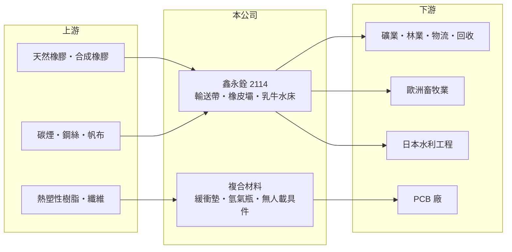

# 2114 鑫永銓

> 上市｜[[產業索引-橡膠工業|橡膠工業]]｜上市（櫃）日期 2010/12/29

# 第一章：企業模式與商業藍圖

> [!info] 撰寫說明
> 精簡版，由 Claude 依公開資料整理，架構比照 [[2330台積電]] 的四章研究，資料截至 2026-10-08。來源：證交所開放資料（基本資料、2026 年上半年資產負債與損益、股利）、Goodinfo 年度經營績效、富果研究 2025 年 12 月法說會整理。#待校對

鑫永銓（股票代號：2114）成立於 1969 年、2010 年上市，是台灣規模最大的橡膠輸送帶廠之一。它是台股中少見的「小而美」型工業品公司：營收不到 20 億元，卻能長年維持 40% 左右的[[毛利率]]與每年 5 元以上的現金股利。

- **核心業務：** 橡膠[[輸送帶]]及相關橡膠製品占營收超過 90%，用於礦業、林業、農業、物流、資源回收與綠能等產業的物料輸送。另有多項利基產品：歐洲酪農使用的乳牛水床、日本為主要市場的充氣式[[橡皮壩]]（公司自稱是日本最大的橡皮壩進口供應商），以及波浪發電板、海上攔污壩等客製品。
- **營收結構：** 產品細分比重未揭露。市場遍布全球，2025 年歐洲畜牧相關產品成長約 12%；美國產品多為大尺寸輸送帶，受關稅影響較小。
- **營運據點：** 以台灣廠為生產基地（地點與產能未查得），設備可生產最大 3.5 米的部件，產品外銷全球。
- **長期方向：** 公司以[[複合材料]]為下一個成長引擎，包括可重複使用數十次的 PCB 壓合用電子級緩衝墊、耐溫 285°C 的熱塑性複合材料、第三型與第四型氫氣瓶，以及無人載具結構件。廠房與設備已備妥，航太 AS9100 認證申請中，但仍處於客戶開發與樣品階段。

# 第二章：護城河深度與競爭優勢

鑫永銓的護城河來自客製化能力與利基市場的深耕，而不是規模。

- **競爭優勢：** 第一是高度客製化。輸送帶的寬度、強度、耐磨與耐熱需求依礦場與工廠而異，鑫永銓能做大尺寸與特殊規格，在小批量訂單上比大廠更有彈性。第二是利基產品的市場地位，例如日本橡皮壩與歐洲乳牛水床，這些市場規模不大，大廠缺乏興趣，小廠又難以取得認證與信任。第三是長期穩定的高毛利，2016 至 2025 年毛利率都在 34% 以上。
- **主要對手：** 國際輸送帶大廠如德國馬牌（ContiTech）、日本普利司通與橫濱橡膠的工業品部門，以及大量中國輸送帶廠（法說會未點名競爭者）。
- **守得住與守不住：** 守得住的是大尺寸、客製化與利基應用的訂單；守不住的是一般規格輸送帶的價格，必須面對中國低價產品的競爭。
- **觀察重點：** 複合材料能否從樣品進入量產、航太認證進度，以及 2025 年第三季毛利率降至 30% 區間後能否回到 40% 以上。

# 第三章：財務體質與盈利規模

資料日期：2026-10-08，表格是撰寫當時的快照；最新月營收、毛利率、累計 EPS 由自動排程寫在本筆記的屬性欄位（月營收、毛利率、累計EPS 等）。#待校對

鑫永銓的財報是本批公司中最穩定的一家，高毛利、高配息、低負債。

| 年度 | 營收（新台幣） | [[毛利率]] | [[營業利益率]] | EPS（元） | [[ROE]] |
|---|---|---|---|---|---|
| 2021 | 19.4 億 | 42.1% | 27.0% | 12.42 | 34.2% |
| 2022 | 18.5 億 | 45.6% | 32.3% | 5.03 | 12.8% |
| 2023 | 15.6 億 | 42.3% | 33.7% | 6.02 | 15.4% |
| 2024 | 14.7 億 | 40.2% | 30.3% | 5.11 | 12.9% |
| 2025 | 16.0 億 | 39.7% | 31.2% | 5.78 | 14.4% |

- **營收規模：** 2020 至 2025 年營收年複合成長率約 0%（推算），營收長期在 15 至 19 億元之間，屬於成熟穩定型。2026 年上半年營收 8.1 億元、毛利率 39.1%、營業利益率 31.5%、EPS 3.08 元。實收資本額約 7.8 億元（證交所資料）。
- **獲利：** 2021 至 2025 年平均 ROE 約 17.9%（推算）；2021 年 EPS 12.42 元明顯偏高，推估含有一次性業外收益（未查得）。扣除 2021 年，ROE 穩定在 13% 至 15%。
- **股利：** 2025 年度現金股利 5.0 元（證交所資料），法說會表示連續多年現金股利至少 5 元；Goodinfo 統計的長期一般平均現金股利約 3.87 元，配息率常在 80% 以上（推算）。

**[[ROIC]] 與 [[WACC]]：** 以 2025 年計，營業利益約 4.99 億元（16.0 億 × 31.2%），稅後約 4.0 億元。2026 年上半年股東權益約 30.3 億元、總負債約 9.5 億元，假設有息負債約 3 億元（推估），投入資本約 33 億元，ROIC 約 12%（推算）。WACC 以 CAPM 推估：無風險利率 1.75%、市場風險溢酬 6%、β 取工業品同業常見值 0.7，股東權益成本約 6.0%，負債比重低，WACC 約 5.9%（推算）。ROIC 長期約為 WACC 的兩倍，鑫永銓是持續創造經濟價值的公司；不過營收沒有成長，價值創造的總量受限於本業規模。

# 第四章：總體風險與地緣政治

鑫永銓的風險主要來自客戶產業的資本支出週期與新事業的執行。

- **產業週期：** 輸送帶需求跟著礦業、林業與物流業的設備更新與擴廠，原物料景氣好時需求增加，景氣差時客戶延後更換。
- **營運風險：** 複合材料事業尚未量產，若市場接受度不如預期，已投入的廠房設備會拖累資本報酬率。產品組合變動會讓毛利率出現季度波動。
- **其他風險：** 原料橡膠、碳煙與鋼絲價格波動；歐元、日圓與美元匯率影響外銷報價，2025 年前三季就有匯兌損失；美國關稅政策可能影響部分產品的出口。

# 專有名詞解析

## 金融

- **[[ROIC]]**：投入資本報酬率，稅後營業利益除以股東權益加有息負債，衡量本業運用資本的效率。
- **[[WACC]]**：加權平均資金成本，股東與債權人要求報酬的加權平均，ROIC 高於它才代表創造價值。

## 產業

- **[[輸送帶]]**：在礦場、工廠、港口等場所連續輸送物料的橡膠帶，需要依環境耐磨、耐熱或耐油。
- **[[橡皮壩]]**：以橡膠布充氣或充水撐起的活動式攔河壩，可依水位升降，用於灌溉與防洪。
- **[[複合材料]]**：由兩種以上材料結合而成、兼具輕量與高強度的材料，例如碳纖維複合材料。

# 核心供應鏈

- 上游：合成橡膠 [[2103台橡]]、[[2108南帝]]；碳煙 [[2104國際中橡]]（產業參考）。
- 下游／客戶：全球礦業、林業、物流與回收業者；歐洲酪農；日本水利工程；PCB 壓合製程業者（具名客戶未查得）。
- 同業：德國馬牌（ContiTech）、普利司通工業品、中國輸送帶廠。

## 最新新聞
<!-- news:start -->
<!-- news:end -->

## 相關連結
- [公開資訊觀測站](https://mopsov.twse.com.tw/mops/web/t05st03?step=1&firstin=1&co_id=2114)
- [Goodinfo](https://goodinfo.tw/tw/StockDetail.asp?STOCK_ID=2114)
- [Yahoo 股市](https://tw.stock.yahoo.com/quote/2114)
- [鉅亨網新聞](https://www.cnyes.com/twstock/2114/news)
