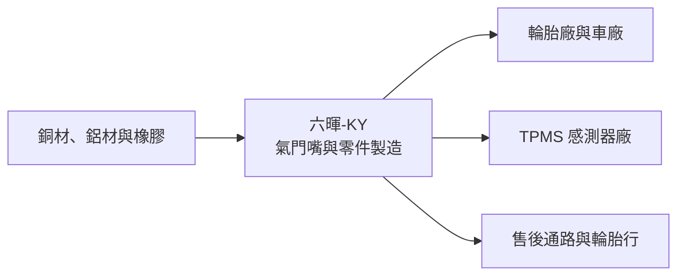
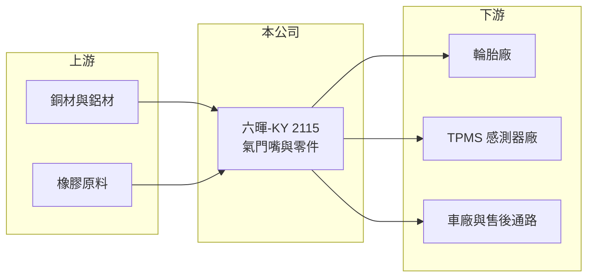

# 2115 六暉-KY

> 上市｜[[產業索引-汽車工業|汽車工業]]｜上市（櫃）日期 2013/12/25

# 第一章：企業模式與商業藍圖

> [!info] 撰寫說明
> 本文由 Claude 依公開資料整理，架構比照 [[2330台積電]] 的四章研究，資料截至 2026-10-08。財務數字來源：Goodinfo 台灣股市資訊網年度經營績效、nstock 公司簡介、證交所開放資料（本筆記 _data 快照）；公開資料有限，客戶、據點與產品延伸部分憑既有知識與新聞標題整理並標「待校對」。#待校對

在評估單一個股的長期投資價值時，首要步驟是拆解企業的底層獲利邏輯。本章針對六暉控股（股票代號：2115，以下簡稱六暉-KY）的商業模式進行定性分析，說明一家專做輪胎氣門嘴的小零件廠，如何在胎壓偵測法規與汽車售後市場中找到穩定的需求。

## 一、核心定位：輪胎氣門嘴的專業製造商

六暉-KY 於 2009 年在開曼群島設立控股公司，2013 年在台灣上市，屬於 [[KY股]]，2019 年在台灣設立分公司。依 nstock 公司簡介，主要業務是各種氣門嘴及其零配件的生產與銷售。氣門嘴是輪胎充氣與保持氣壓的小零件，每個輪胎都需要一個，汽車、機車、自行車與工業車輛都會用到。

氣門嘴的單價低，但它有兩個長期需求來源。第一，新車與新輪胎出廠時必須安裝，需求跟著全球汽車與輪胎產量走。第二，換輪胎時通常會一起更換氣門嘴，形成穩定的售後替換需求。此外，[[TPMS]]（胎壓偵測系統）在歐美與中國等市場成為法規配備，胎壓感測器需要搭配金屬氣門嘴，這讓氣門嘴從低價零件變成和電子感測器整合的較高價產品。2013 年報導指出六暉 TPMS 相關產品將月產 40 萬套（2013 年），顯示公司很早就切入這個領域。

## 二、產品板塊

公司未在本次查得的資料中揭露產品別營收比重，以下為定性分類，不畫圓餅圖。

* **一般橡膠與金屬氣門嘴：** 汽車、機車、自行車與工業車輛使用的標準氣門嘴，是公司的基本盤，以量取勝。
* **TPMS 氣門嘴與零件：** 搭配胎壓感測器的金屬氣門嘴與相關零件，技術要求與單價較高（待校對）。
* **其他金屬加工零件：** 以氣門嘴累積的金屬切削與加工能力，承接其他車輛零件（品項與比重未查得，待校對）。

## 三、資本轉化邏輯（營運模式）

* **大量生產的小零件：** 氣門嘴屬於標準化程度高的產品，獲利來自大量生產的成本效率與品質穩定度。六暉-KY 毛利率長期約二成，反映這種製造效率導向的商業模式。
* **原物料轉嫁：** 主要原料為銅、鋁與橡膠，原物料價格變動會影響毛利率，轉嫁能力取決於與客戶的議價。

## 四、企業長期藍圖

六暉-KY 的長期方向是提高 TPMS 氣門嘴等較高附加價值產品的比重，並把金屬加工能力延伸到其他車輛零件。2026 年前九月累計營收 27.19 億元、年增 21.08%（nstock），顯示近期需求成長。經營層的資本配置偏保守，負債比約 35%，並維持穩定配息（2025 年度現金股利 1.5 元，證交所開放資料）。

# 第二章：護城河深度與競爭優勢

在長期價值投資中，「護城河」指企業抵禦競爭、維持超額利潤的保護機制。本章分析六暉-KY 在氣門嘴市場的護城河、主要對手與可守住的範圍。

## 一、護城河的核心組成要素

* **1. 專業化的規模經濟：** 氣門嘴是小而專的產品，長期專注同一品類的廠商能累積模具、製程與自動化經驗，以較低成本大量生產。
* **2. 客戶驗證與供貨穩定：** 輪胎廠與 TPMS 廠商重視品質一致性，一旦通過驗證，不會為了小幅價差頻繁換供應商。
* **3. 護城河偏窄：** 氣門嘴技術門檻不高，主要優勢是成本與品質，缺乏專利或品牌帶來的定價權。

## 二、全球主要競爭對手格局

| 對手 | 定位 | 對六暉-KY 的威脅 |
|---|---|---|
| Schrader（Sensata 旗下） | 氣門嘴與 TPMS 國際龍頭 | 掌握原廠 TPMS 市場 |
| 太平洋工業（Pacific Industrial） | 日本氣門嘴與 TPMS 大廠 | 在日系車廠具優勢 |
| 中國氣門嘴廠 | 低成本大量生產 | 以價格搶售後與中低階市場 |
| [[2231為升]] | 台灣 TPMS 系統廠 | 可能是客戶，也在 TPMS 生態系競爭（間接） |

## 三、優勢轉化：守得住／守不住／觀察重點

* **守得住：** 品質要求高的輪胎廠與 TPMS 客戶訂單，以及長期合作的售後通路。
* **守不住：** 一般標準氣門嘴的價格競爭，中國廠商成本更低。
* **觀察重點：** TPMS 相關產品比重能否提高、毛利率能否維持在 20% 以上，以及新金屬零件業務能否帶來穩定營收。

# 第三章：財務體質與盈利規模

資料日期：2026-10-08。數字取自 Goodinfo 年度經營績效、nstock 與證交所開放資料快照，表格是撰寫當時的快照；最新月營收、毛利率、累計 EPS 由自動排程寫在本筆記的屬性欄位（月營收、毛利率、累計EPS 等）。#待校對

財務報表是檢驗護城河是否真實存在的最終標準。本章用多年度的三率、ROE 與資本報酬，檢視六暉-KY 的獲利品質。

## 一、獲利能力的基石：三率

| 年度 | 營收（新台幣） | [[毛利率]] | [[營業利益率]] | EPS（元） | [[ROE]] |
|---|---|---|---|---|---|
| 2019 | 27.2 億 | 22.6% | 11.5% | 2.81 | 10.7% |
| 2020 | 26.0 億 | 24.1% | 12.6% | 6.58 | 23.7% |
| 2021 | 34.0 億 | 24.9% | 13.9% | 4.02 | 14.1% |
| 2022 | 30.4 億 | 21.9% | 11.0% | 2.28 | 7.57% |
| 2023 | 25.9 億 | 20.5% | 7.31% | 1.76 | 5.77% |
| 2024 | 31.3 億 | 22.2% | 10.3% | 2.05 | 6.78% |
| 2025 | 29.8 億 | 20.7% | 8.55% | 1.58 | 5.08% |

* **[[毛利率]]：** 長期穩定在 20% 至 25%，波動小，反映氣門嘴需求穩定、成本結構單純。2026 年上半年毛利率 19.3%（證交所開放資料）。
* **[[營業利益率]]：** 2019 至 2021 年在 11% 至 14%，2023 年以後降到 7% 至 10%，推估與原物料成本、價格競爭有關（推估）。2020 年 EPS 6.58 元明顯高於營業利益可支撐的水準，推估含一次性業外收益（推估，原因未查得）。
* **長期指標：** 2020 至 2025 年營收年複合成長率約 2.8%（推算）；2021 至 2025 年平均 ROE 約 7.9%（推算）。2025 年度現金股利 1.5 元，配息率約 95%（以 EPS 1.58 元推算）。

## 二、[[ROE]]：資本效率

六暉-KY 2026 年第二季底負債約 17.9 億元、權益約 33.0 億元，負債比約 35%（證交所開放資料）。ROE 從 2020 至 2021 年的高點逐年下降到 5% 上下，原因是營業利益率下滑、而權益規模維持不變。高配息率代表公司把大部分盈餘發還股東，沒有大量保留盈餘做擴張。

## 三、資本支出與自由現金流

* **[[CapEx]]：** 逐年數字未查得。氣門嘴生產屬中度資本密集，以自動化設備汰換為主。
* **[[自由現金流]]：** 逐年數字未查得。以高配息率與穩定負債比推估，自由現金流多數年度為正（推估）。

## 四、[[ROIC]] 與 [[WACC]]：價值創造利差

有息負債明細未查得，以權益加非流動負債近似投入資本。2025 年營業利益約 2.55 億元（營收 29.8 億元 × 8.55%），稅後約 2.04 億元；投入資本以 2026 年第二季底權益 33.0 億元加非流動負債 7.8 億元，約 40.8 億元計算，ROIC 約 5.0%（推算）。2021 年營業利益約 4.73 億元，稅後約 3.78 億元，以相近資本規模估算 ROIC 約 9%（推算）。

WACC 以 CAPM 推估：台灣 10 年期公債約 1.5% 至 2%，市場風險溢酬約 6%，β 未查得，汽車零件股常見值採 0.9 至 1.1（假設），權益成本約 6.9% 至 8.6%；稅前負債成本假設 3%（KY 公司海外借款，假設）、稅後 2.4%，負債約占投入資本兩成，WACC 約 6% 至 7.4%（推算）。

兩者比較，六暉-KY 在 2019 至 2021 年 ROIC 高於 WACC，2023 年以後則落在資金成本附近或略低。公司仍是穩定獲利、高配息的小型製造業，但近年的資本報酬只勉強覆蓋資金成本，未來若 TPMS 等高附加價值產品比重提高，才可能恢復價值創造。

# 第四章：總體風險與地緣政治

任何企業都無法脫離宏觀環境獨立存在。本章分析六暉-KY 長期必須面對的地緣政治、產業與營運風險。

## 一、地緣政治與貿易

* **KY 公司的治理與資訊透明度：** 註冊在開曼群島、營運據點主要在海外（推估在中國，待校對），投資人取得營運資訊的管道較少，需要依賴公司公告與法說。
* **關稅與貿易限制：** 若生產集中在中國，美國對中國零件的關稅會影響銷美產品的競爭力。

## 二、產業週期與市場結構

* **汽車與輪胎產量：** 新車與新胎需求受景氣影響，售後替換需求相對穩定，兩者組合讓營收波動中等。
* **價格競爭：** 氣門嘴是標準化產品，價格競爭長期存在。

## 三、營運環境的隱性風險

* **原物料價格：** 銅、鋁與橡膠價格上漲時，若無法及時轉嫁，毛利率會受壓。
* **匯率：** 營收以美元與人民幣計價為主（推估），匯率波動影響以台幣表達的獲利。
* **資金匯回：** KY 公司配息需要把海外子公司盈餘匯回，受當地外匯與稅務規定影響。

## 四、科技或法規演進

* **TPMS 法規擴大：** 更多國家把 TPMS 列為標配，是長期需求的支撐。
* **輪胎技術變化：** 免充氣輪胎等新技術若普及，長期可能減少氣門嘴需求，但目前仍處早期。

# 專有名詞解析

## 應用

- **[[TPMS]]**：胎壓偵測系統，即時監測輪胎氣壓並在異常時警示駕駛，歐美新車法規強制配備。

## 金融

- **[[KY股]]**：註冊在海外、在台灣上市櫃的外國企業，股票代號後加 KY，營運多在海外。
- **[[ROIC]]**：投入資本報酬率，衡量公司用股東與債權人資金創造本業稅後利潤的效率。
- **[[WACC]]**：加權平均資金成本，依股權與負債比重加權的資金成本，是 ROIC 要超過的門檻。

# 核心供應鏈

## 1. 上游：原物料
- 銅材、鋁材與合成橡膠（具體供應商未查得）

## 2. 中游：六暉-KY 本身
- 汽機車、自行車與工業車輛氣門嘴，TPMS 相關零件（待校對）

## 3. 下游：客戶
- 輪胎廠、TPMS 感測器廠、車廠與售後通路（具名客戶未查得）

## 4. 同業
- 台灣：[[2231為升]]（TPMS）、[[2105正新]]、[[2106建大]]（輪胎廠，潛在客戶，推估）
- 海外：Schrader、太平洋工業、中國氣門嘴廠

## 最新新聞
<!-- news:start（自動產生，請勿手動編輯此範圍） -->
- 2026-10-06 📰 媒體 17:50｜營收速報 - 六暉-KY(2115)9月營收3.39億元年增率高達47.75％｜[鉅亨網](https://news.cnyes.com/news/id/6622819)

完整紀錄：[[2115六暉-KY 新聞]]
<!-- news:end -->

## 相關連結
- [公開資訊觀測站](https://mopsov.twse.com.tw/mops/web/t05st03?step=1&firstin=1&co_id=2115)
- [Goodinfo](https://goodinfo.tw/tw/StockDetail.asp?STOCK_ID=2115)
- [Yahoo 股市](https://tw.stock.yahoo.com/quote/2115)
- [鉅亨網新聞](https://www.cnyes.com/twstock/2115/news)
