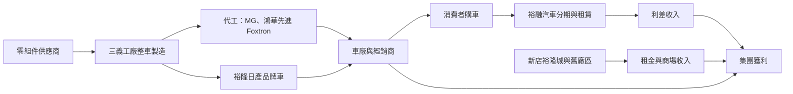
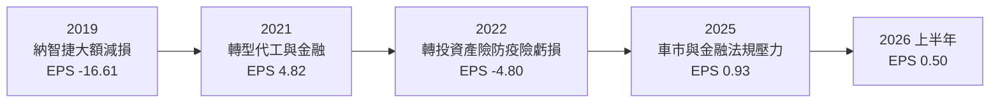
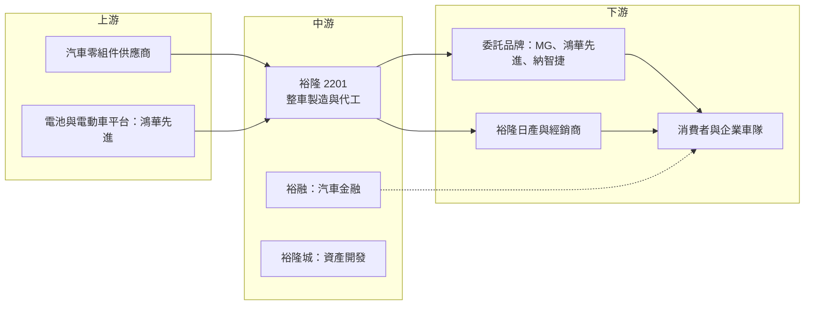

# 2201 裕隆

> 上市｜[[產業索引-汽車工業|汽車工業]]｜上市（櫃）日期 1976/07/08

# 第一章：企業模式與商業藍圖

> [!info] 撰寫說明
> 本文由 Claude 依公開資料整理，架構比照 [[2330台積電]] 的四章研究，資料截至 2026-10-08。財務數字來源：Goodinfo 年度經營績效頁、富果研究 2026 年 3 月法說會整理、CMoney 2020 年裕隆年報分析、中央社 2022 年 11 月報導、證交所開放資料（基本資料、2026 年第二季資產負債與綜合損益、股利）；產業描述為整理性內容，尚未逐條比對原始文件。#待校對

在評估單一個股的長期投資價值時，首要步驟是拆解企業的底層獲利邏輯。本章針對裕隆汽車（股票代號：2201，以下簡稱裕隆）的商業模式進行定性分析，說明這家台灣最老牌的汽車製造商，如何從自有品牌車廠轉型為[[整車代工]]、[[汽車金融]]與資產開發的綜合控股公司，以及這個轉型對長期價值的意義。

## 一、核心定位：從自主品牌車廠走向代工、金融與資產開發

裕隆成立於 1953 年，是台灣第一家汽車製造商，也是裕隆集團的核心公司，現任董事長為嚴陳莉蓮，實收資本額約 107 億元。裕隆的歷史大致可以分成三個階段：早期與日產合作在台灣生產汽車；2000 年代後期推出自有品牌納智捷（Luxgen），試圖成為台灣[[自主品牌]]車廠；2019 年納智捷銷售不振，裕隆一次認列大額[[減損]]，之後逐步轉向整車代工、汽車金融與資產開發。

現在的裕隆，比較適合理解成一家「汽車相關事業的控股公司」，而不是單純的車廠。它的主要價值來源包括：

* **整車製造與代工：** 三義工廠替其他品牌代工生產汽車，包括 MG G50+ 與鴻華先進的電動車（[[EV]]） Foxtron Bria。代工可以提高工廠的產能利用率，但每輛車的利潤遠低於自有品牌。
* **汽車金融（裕融企業）：** 裕隆合併報表包含 [[9941裕融]]，裕融經營汽車分期、租賃等融資業務，是集團最穩定的獲利來源之一。依 CMoney 整理的 2019 年資料，裕隆持有裕融約 54%。
* **轉投資裕隆日產：** 裕隆日產（[[2227裕日車]]）負責日產品牌在台灣的銷售，裕隆以[[權益法]]認列其損益。依同一來源，2019 年裕隆持有裕日車約 50%。
* **資產開發：** 新店裕隆城是裕隆把舊廠區轉為商場與住宅的[[資產活化]]案，2025 年人流突破 1,000 萬人次。

## 二、事業板塊：製造、金融、通路與資產開發

裕隆未在本文查得的資料中揭露各部門的營收比重，因此不畫圓餅圖，以下依法說會說明整理各事業的角色：

* **整車製造：** 以代工為主，策略是提升成本競爭力、爭取新代工案，並研議導入 AI 改善製造流程。整車製造的營收規模大但利潤薄，獲利高度依賴產能利用率。
* **能源：** 公司把儲能與動力電池列為新事業方向，包括[[表後儲能]]、充儲整合、光儲整合與電池循環，目標是建立能源生態系。這仍在起步階段，成效尚待驗證。
* **金融服務：** 裕融的融資業務貢獻穩定獲利，但 2025 年受法規因素影響，獲利受到壓抑。2026 年上半年合併稅後淨利約 20.1 億元，歸屬母公司只有約 5.2 億元，差額約 14.9 億元屬於[[非控制權益]]（證交所開放資料），顯示裕融等子公司的少數股東分走相當比例的獲利，母公司本身的獲利能力仍弱。
* **資產開發與通路：** 裕隆城商場營收持續成長，北區租賃業務穩定貢獻收益，公司也規劃整合大台北的經銷與後勤體系。

## 三、資本轉化邏輯：代工、利差與收租的組合

* **代工的邏輯：** 汽車廠的固定成本很高，產量太低時每輛車分攤的折舊與人力成本會急遽上升。裕隆承接代工，是為了讓三義工廠維持足夠的產量，而不是追求高利潤。
* **金融的邏輯：** 汽車金融靠資金成本與放款利率之間的利差賺錢，需要大量借款支撐放款規模，這就是裕隆合併負債比高達 74% 的原因；法說會指出，扣除裕融的融資借款後，負債比約 30%。
* **資產活化的邏輯：** 裕隆擁有新店等早期取得的土地，把舊工業用地轉為商場與住宅，可以創造穩定的租金收入與一次性的開發利益。

## 四、企業長期藍圖

裕隆的長期方向可以歸納為四點。第一，深化與鴻海的合作。裕隆與鴻海合資的鴻華先進專注電動車開發，2026 年雙方同意將納智捷品牌納入鴻華先進旗下，裕隆則繼續服務既有納智捷車主並擔任代工製造者。第二，發展能源事業，以儲能與電池循環作為新的成長來源。第三，持續資產活化，提高裕隆城與既有土地的使用效率。第四，深化中國與菲律賓等海外市場，並重新建立中國事業的治理架構。

整體而言，裕隆已從「自主品牌車廠」轉變為「代工製造加上金融與不動產」的組合。長期價值不再取決於賣出多少輛自有品牌車，而是取決於代工產能能否填滿、金融與租金收入能否穩定，以及能源新事業能否落地。

# 第二章：護城河深度與競爭優勢

本章針對裕隆的競爭優勢進行分析。由於裕隆的事業組合多元，護城河也分散在不同業務，本章說明哪些優勢真實存在，哪些已經在納智捷時代流失。

## 一、護城河的核心組成要素

* **台灣少數具完整整車產能的工廠：** 三義工廠具備沖壓、焊接、塗裝與總裝的完整產線，以及車輛認證與品質系統。對想在台灣生產汽車的新品牌（尤其是電動車新創）而言，自建工廠成本高、時間長，委託裕隆代工是較快的選擇。
* **與鴻海的策略合作：** 鴻海以電子代工的規模與供應鏈切入電動車，裕隆提供汽車製造經驗與產能。這個合作讓裕隆在電動車時代保有參與的機會。
* **汽車金融的通路與資料：** 裕融在台灣汽車分期市場經營多年，擁有經銷商通路與客戶信用資料，這是新進金融業者難以快速複製的。
* **土地資產：** 早期取得的土地在都市化後大幅增值，資產活化可帶來長期租金收入。

## 二、全球主要競爭對手格局

| 競爭對手 | 主要重疊領域 | 與裕隆的比較 |
|---|---|---|
| [[2207和泰車]] | 台灣汽車銷售與汽車金融 | 代理豐田，台灣新車市占第一，獲利與規模遠高於裕隆 |
| [[2204中華]] | 台灣整車製造與代工 | 同屬裕隆集團，製造三菱與商用車，並發展電動商用車 |
| 國瑞汽車 | 台灣整車製造 | 豐田在台生產基地，產量規模大 |
| 進口車品牌 | 台灣新車市場 | 歐洲、日本與中國品牌進口車持續搶占市場 |
| [[2317鴻海]]（鴻華先進） | 電動車開發 | 合作夥伴，鴻華先進主導電動車平台與品牌 |

## 三、優勢轉化：守得住、守不住與觀察重點

* **守得住：** 汽車金融與資產開發的穩定收入，以及作為台灣少數整車代工廠的地位。只要台灣汽車市場維持一定規模，裕融的融資業務與裕隆城的租金收入就能提供穩定現金流。
* **守不住：** 自主品牌。納智捷在 2019 年的大額減損與 2026 年併入鴻華先進，代表裕隆已經放棄自主品牌的路線。台灣新車市場規模有限（2025 年新車領牌約 41.4 萬輛、年減 9%），加上關稅降低後進口車競爭更激烈，本土品牌很難建立規模。
* **觀察重點：** 第一，代工訂單能否填滿三義工廠的產能，特別是鴻華先進電動車的量產規模；第二，裕融在法規變動後的獲利能否恢復；第三，能源新事業能否產生實際營收。

# 第三章：財務體質與盈利規模

資料日期：2026-10-08。數字取自 Goodinfo 年度經營績效頁、富果研究法說會整理與證交所開放資料，表格是撰寫當時的快照；最新月營收、毛利率、累計 EPS 由自動排程寫在本筆記的屬性欄位（月營收、毛利率、累計EPS 等）。#待校對

財務報表是檢驗護城河是否真實存在的最終標準。本章用多年度的三率、ROE 與資本報酬，檢視裕隆轉型過程中的獲利品質。由於合併報表包含裕融的金融業務，毛利率與一般車廠不能直接比較。

## 一、獲利能力的基石：三率

| 年度 | 營收（新台幣） | [[毛利率]] | [[營業利益率]] | EPS（元） | [[ROE]] |
|---|---|---|---|---|---|
| 2019 | 856 億 | 6.69% | -35.9% | -16.61 | -34.7% |
| 2020 | 826 億 | 22.6% | -1.48% | 2.80 | 7.94% |
| 2021 | 780 億 | 30.0% | 9.14% | 4.82 | 11.4% |
| 2022 | 771 億 | 35.6% | 13.1% | -4.80 | 未查得（來源數字不一致） |
| 2023 | 821 億 | 35.1% | 10.5% | 4.63 | 10.5% |
| 2024 | 858 億 | 31.3% | 8.47% | 3.78 | 7.58% |
| 2025 | 724 億 | 32.3% | 8.16% | 0.93 | 3.82% |
| 2026 上半年 | 343.7 億 | 32.76% | 9.68% | 0.50 | 未查得 |

* **2019 年的大洗澡：** 依 CMoney 整理的年報資料，裕隆 2019 年稅後淨損約 245 億元，主要來自設備與無形資產減損約 126 億元，以及與東風裕隆（納智捷中國合資）有關的應收款項減損約 176 億元。這次一次性認列，讓之後的財報擺脫納智捷的沉重包袱。
* **2022 年的業外衝擊：** 中央社報導指出，裕隆轉投資的新安東京海上產險因防疫險理賠大幅虧損，裕隆前三季依持股認列約 68.32 億元損失。這是與本業無關的一次性事件，但也提醒投資人，裕隆的轉投資組合可能帶來意外風險。
* **[[毛利率]]與[[營業利益率]]：** 2021 年以後毛利率維持在三成以上，這個水準遠高於一般整車廠，原因是合併報表包含裕融的金融業務與資產開發收入。營業利益率約 8% 至 13%，2025 年因車市衰退與金融法規影響降到 8.16%。
* **營收趨勢：** 2016 年營收 1,122 億元，2025 年為 724 億元，十年間營收縮小約三成五，反映納智捷退場與業務轉型；2021 至 2025 年營收年複合成長率約 -1.8%（推算）。

## 二、[[ROE]]：資本效率

扣除來源數字不一致的 2022 年，2021 至 2025 年其餘四年平均 ROE 約 8.3%（推算），且呈逐年下滑的趨勢，2025 年只剩 3.82%。股價淨值比約 0.46 倍（2026 年 10 月初，證交所本益比資料），代表市場對裕隆資產的報酬能力相當保守。需要注意的是，合併獲利有相當比例屬於非控制權益，母公司股東實際享有的報酬低於合併數字所呈現的。

## 三、資本支出、自由現金流與股利

依法說會資料，2025 年營業活動現金流入約 190 億元，投資活動流出約 61 億元，籌資活動流出約 143 億元（主要為降低借款），自由現金流為正。不過，合併現金流包含裕融的融資業務，營業現金流的變化很大一部分反映放款規模的增減，不能直接解讀為本業的現金創造能力。股利方面，2025 年度配發現金股利 0.56 元（證交所股利資料），以 EPS 0.93 元計算配發率約 60%（推算），Goodinfo 統計長期一般平均現金股利約 0.73 元。

## 四、[[ROIC]] 與 [[WACC]]：價值創造利差

**ROIC 推算：** 2025 年合併營業利益約 59 億元，扣除 20% 稅率後約 47.3 億元。2026 年第二季底權益總計約 951 億元，總負債約 2,734 億元，其中大部分是裕融的融資借款，假設約七成為有息負債（推估，約 1,914 億元），投入資本約 2,865 億元，ROIC 約 1.7%（推算）。由於金融業務的利息支出已列在營業成本中，這個算法會低估金融事業的報酬，因此也可以改用 ROE 觀察：2025 年 ROE 為 3.82%。

**WACC 推算：** 假設台灣 10 年期公債殖利率 1.75%、市場風險溢酬 6%、β 取汽車與控股公司常見值 1.0，股東權益成本約 7.75%。負債成本假設 2.5%，稅後約 2.0%；以帳面價值計，權益約占 33%、負債約占 67%，WACC 約 3.9%（推算）。

**結論：** 不論用 ROIC 對比 WACC，或用 ROE 對比約 7.75% 的股東權益成本，裕隆 2025 年都沒有創造超過資金成本的報酬。2021 與 2023 年 ROE 超過 10%，曾短暫高於股東權益成本，但無法持續。對長期投資人而言，裕隆的價值比較接近「資產價值加上轉型選擇權」，關鍵在於土地資產能否變現、代工與能源事業能否提高母公司本身的獲利。

# 第四章：總體風險與地緣政治

任何企業都無法脫離宏觀環境獨立存在。本章分析裕隆長期必須面對的地緣政治、產業結構、營運與技術風險。

## 一、地緣政治

* **關稅與進口車競爭：** 台美關稅談判可能降低美國進口車的關稅，台灣對外的汽車關稅若持續下調，進口車價格競爭力提高，會壓縮本地生產車輛的空間。公司也表示 2025 年車市受關稅不確定性壓抑。
* **中國事業：** 裕隆在中國的事業（包括過去的東風裕隆）曾帶來大額減損，中國汽車市場價格戰激烈，本土電動車品牌崛起，台資車廠的經營空間有限。
* **兩岸關係：** 台灣汽車零件供應鏈與中國有一定程度的連結，兩岸關係變化可能影響供應穩定與成本。

## 二、產業週期與市場結構

* **台灣車市規模有限：** 台灣每年新車銷量約 40 至 45 萬輛，市場小且成熟，難以支撐多家本地製造廠的規模經濟。2025 年第四季銷量回升，主要來自貨物稅減徵政策延續，政策退場後需求可能回落。
* **汽車金融的信用週期：** 景氣下滑時，汽車貸款的違約率上升，裕融的呆帳費用會增加；利率上升時資金成本提高，利差也會被壓縮。
* **代工的議價力弱：** 代工廠的獲利取決於委託品牌的銷量，委託方的產品若銷售不佳，代工廠的產能利用率會隨之下滑。

## 三、營運環境的隱性風險

* **轉投資的意外損失：** 2022 年產險防疫險虧損的經驗顯示，裕隆龐雜的轉投資組合可能在意想不到的地方帶來損失。
* **金融法規：** 法說會提到金融事業獲利受法規因素壓抑，汽車分期與租賃業務受金融監理規範影響，法規變動會直接衝擊獲利。
* **少數股東分享獲利：** 裕融等子公司並非百分之百持股，合併獲利中有相當比例屬於少數股東，母公司股東實際能分配的獲利較少。
* **轉型執行：** 納智捷品牌整合、能源事業與海外市場都尚在起步階段，執行成效仍待驗證。

## 四、科技與法規演進

* **電動化：** 汽車產業正從燃油車轉向電動車，電動車的零件結構、製造流程與供應鏈都與燃油車不同。裕隆透過與鴻海合作參與電動車製造，但電動車平台與核心技術掌握在鴻華先進手上，裕隆的角色以製造為主。
* **[[軟體定義汽車]]：** 未來汽車的價值越來越多來自軟體、電子架構與數據服務，傳統車廠若只負責組裝，附加價值將持續下降。
* **儲能與電池循環：** 能源事業需要面對技術快速變化、電池價格下跌與電力市場規則調整，新進者的成本與技術風險都不低。

# 專有名詞解析

## 應用

- **[[EV]]**：電動車，以電池與馬達取代內燃機的汽車，零件結構與製造流程不同於傳統燃油車。

## 金融

- **[[非控制權益]]**：合併報表中子公司不屬於母公司的那部分股權，其分得的損益不歸母公司股東。
- **[[權益法]]**：持股約兩成至五成的轉投資，依持股比例認列被投資公司損益的會計方法，收益列在業外。
- **[[減損]]**：資產的可回收金額低於帳面價值時，把差額認列為損失，常見於產品失敗或景氣惡化時。
- **[[毛利率]]**：營業毛利占營收的比例，反映產品定價能力與生產成本控制。
- **[[ROE]]**：股東權益報酬率，稅後淨利除以股東權益，衡量公司運用股東資金的效率。
- **[[ROIC]]**：投入資本報酬率，稅後營業利益除以股東權益與有息負債的合計，衡量本業對所有資金提供者的報酬。
- **[[WACC]]**：加權平均資金成本，依股東權益與負債的比重加權計算的資金成本，ROIC 高於它才代表創造價值。

## 產業

- **[[整車代工]]**：汽車廠替其他品牌生產整輛汽車，由委託品牌負責設計與銷售，代工廠賺取製造費用。
- **[[自主品牌]]**：由本地車廠自行設計、生產並以自有品牌銷售的汽車，例如裕隆過去的納智捷。
- **[[汽車金融]]**：提供購車分期付款、租賃等融資服務，靠資金成本與放款利率之間的利差獲利。
- **[[資產活化]]**：把閒置或低度使用的土地、廠房轉為商場、住宅或出租，以提高資產報酬。
- **[[表後儲能]]**：設置在用電戶電表之後的儲能系統，用於削峰填谷、備援或搭配太陽能使用。
- **[[軟體定義汽車]]**：汽車功能主要由軟體控制並可透過網路更新，價值重心從硬體轉向軟體與電子架構。

# 核心供應鏈

## 1. 上游：零組件與技術夥伴
- 汽車零組件：[[1319東陽]]（OEM 塑膠件）等台灣零件廠
- 電動車平台與合作：[[2317鴻海]]（鴻華先進）

## 2. 中游：裕隆本身與集團公司
- 汽車金融：[[9941裕融]]
- 日產品牌銷售：[[2227裕日車]]
- 集團整車廠：[[2204中華]]

## 3. 下游：品牌、通路與消費者
- 代工委託品牌：MG、鴻華先進 Foxtron、納智捷
- 台灣汽車經銷商與企業車隊

## 4. 同業
- [[2207和泰車]]、國瑞汽車、進口車品牌

## 最新新聞
<!-- news:start -->
<!-- news:end -->

## 相關連結
- [公開資訊觀測站](https://mopsov.twse.com.tw/mops/web/t05st03?step=1&firstin=1&co_id=2201)
- [Goodinfo](https://goodinfo.tw/tw/StockDetail.asp?STOCK_ID=2201)
- [Yahoo 股市](https://tw.stock.yahoo.com/quote/2201)
- [鉅亨網新聞](https://www.cnyes.com/twstock/2201/news)
