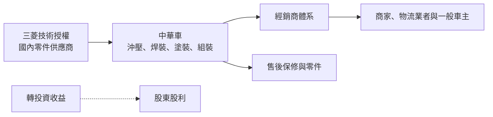
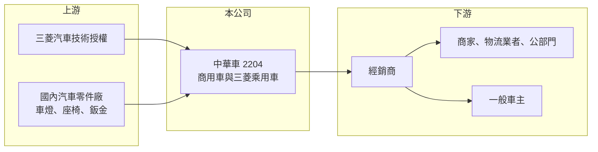

# 2204 中華

> 上市｜[[產業索引-汽車工業|汽車工業]]｜上市（櫃）日期 1991/03/12

# 第一章：企業模式與商業藍圖

> [!info] 撰寫說明
> 本文由 Claude 依公開資料整理，架構比照 [[2330台積電]] 的四章研究，資料截至 2026-10-08。財務數字來源：Goodinfo 台灣股市資訊網年度經營績效、旺得富（工商時報）2025 年 11 月法說會報導、8891 新車新聞、證交所開放資料（本筆記 _data 快照）；轉投資與股東結構部分憑既有知識整理並標「待校對」。#待校對

在評估單一個股的長期投資價值時，首要步驟是拆解企業的底層獲利邏輯。本章針對中華汽車工業（股票代號：2204，以下簡稱中華車）的商業模式進行定性分析，說明這家台灣最主要的國產商用車廠，如何依靠輕型商用車的穩定需求、三菱的技術合作與龐大的轉投資，形成「本業微利、業外支撐」的獲利結構。

## 一、核心定位：台灣輕型商用車的主要供應者

中華車成立於 1969 年，屬於裕隆集團，長期與日本三菱汽車技術合作（股東結構待校對），1991 年上市，工廠位於桃園楊梅（待校對）。公司在台灣生產與銷售三菱品牌乘用車，以及菱利（Veryca）、得利卡（Delica）、J Space 等輕型商用車。輕型商用車是小商家、物流與工程業者的生財工具，需求跟著國內經濟活動走，比一般家用車穩定，這是中華車最核心的市場。

依 8891 報導，2024 年台灣汽車市場下滑、國產車衰退 6.2%，中華車全年銷量約 5.2 萬台、僅微幅下滑 0.8%，主要靠全新 J Space 廂車與貨車撐住。依 2025 年 11 月法說，J Space 累計訂單超過 1.8 萬台。這說明中華車在商用車市場有穩固的基本盤，新車款推出時能有效帶動銷量。

## 二、產品板塊

公司未在本次查得的資料中揭露產品別營收比重，以下為定性分類，不畫圓餅圖。

* **輕型商用車：** 菱利、得利卡、J Space 等廂車與小貨車，是中華車的招牌產品，國產化程度高。
* **三菱品牌乘用車：** 在台組裝或進口的三菱休旅車。XFORCE 小型休旅是三菱品牌九年來第一款全新國產車型，2025 年底車展上市，法人預期與 J Space 共同帶動銷量成長（2025 年 11 月報導）。
* **電動商用車：** ET35 電動貨車與電動資源回收車，2025 年與新竹物流等大型物流業者進入第二階段合作。公司表示已自行開發集中式電子電氣架構與整合域控制器（eDCU），國產化比重逾九成。
* **電動機車與零組件：** 過去推出 e-moving 電動機車（待校對），以及汽車零件、模具與售後服務。

## 三、資本轉化邏輯（營運模式）

* **國產車的成本與關稅優勢：** 國產車相對進口車有[[進口車關稅]]保護，加上在地零件供應鏈，讓中華車能以較低成本提供商用車。這項優勢建立在政策上，關稅調降就會縮小。
* **轉投資是重要的獲利來源：** 中華車帳上權益約 421.5 億元，遠大於營收規模所需，代表有大量轉投資資產（證交所開放資料）。2026 年上半年營業利益 9.24 億元、[[業外收益]] 7.96 億元，業外幾乎與本業相當，是理解中華車獲利的關鍵。

## 四、企業長期藍圖

中華車在 2025 年法說提出三個重點：自主研發、核心產品銷售與新車推出。長期方向是把商用車技術電動化，以 ET35 等電動商用車搶先布局物流業的淨零需求，並向日本三菱提供小型商用車技術、拓展外銷。公司也在開發電動車與智慧製造產業園區，目標 2050 年淨零排放。資本配置方面，中華車長期維持高現金股利，2025 年度配發 3.6 元（證交所開放資料），以轉投資收益與本業現金流支撐股東回饋。

# 第二章：護城河深度與競爭優勢

在長期價值投資中，「護城河」指企業抵禦競爭、維持超額利潤的保護機制。本章分析中華車在商用車市場的護城河、主要對手，以及關稅與電動化對優勢的影響。

## 一、護城河的核心組成要素

* **1. 商用車的品牌與通路：** 菱利、得利卡在台灣商用車市場經營數十年，車主重視耐用、維修方便與殘值，既有的經銷與保修網路形成轉換成本。
* **2. 國產化與在地研發：** 中華車具備車身開發與電動商用車的自主研發能力，能針對台灣法規與使用情境設計車款，這是單純進口代理商沒有的能力。
* **3. 政策保護型優勢：** 國產車的關稅與貨物稅結構是重要支撐，但這屬於外部條件，一旦政策變動就會削弱。

## 二、全球主要競爭對手格局

| 對手 | 定位 | 對中華車的威脅 |
|---|---|---|
| [[2207和泰車]] | Toyota 總代理，國內汽車市占第一 | 品牌與通路規模最大，若擴大商用車產品線會直接競爭 |
| 福特六和 | 國產商用車與休旅車 | 在貨車與廂車市場競爭 |
| [[2201裕隆]] | 集團內國產車與電動車平台 | 部分車款與通路重疊 |
| 進口商用車與中國電動商用車 | 價格或電動化優勢 | 關稅調降時威脅增加 |

## 三、優勢轉化：守得住／守不住／觀察重點

* **守得住：** 輕型商用車基本盤。這個市場重視實用、保修與殘值，品牌忠誠度高，中華車可以長期維持市占。
* **守不住：** 一般乘用車市場。乘用車競爭者多、進口車選擇豐富，中華車的三菱乘用車規模有限，獲利貢獻較小。
* **觀察重點：** 長期可以看三件事：電動商用車能否形成規模、進口車關稅調降時商用車市占是否下滑，以及本業營業利益率能否穩定在 5% 以上，降低對業外收益的依賴。

# 第三章：財務體質與盈利規模

資料日期：2026-10-08。數字取自 Goodinfo 年度經營績效與證交所開放資料快照，表格是撰寫當時的快照；最新月營收、毛利率、累計 EPS 由自動排程寫在本筆記的屬性欄位（月營收、毛利率、累計EPS 等）。#待校對

財務報表是檢驗護城河是否真實存在的最終標準。本章用多年度的三率、ROE 與資本報酬，檢視中華車「本業微利、業外支撐」的獲利結構。

## 一、獲利能力的基石：三率

| 年度 | 營收（新台幣） | [[毛利率]] | [[營業利益率]] | EPS（元） | [[ROE]] |
|---|---|---|---|---|---|
| 2019 | 321 億 | 16.5% | 5.68% | -2.38 | -4.71% |
| 2020 | 309 億 | 15.9% | 5.75% | 6.01 | 8.06% |
| 2021 | 311 億 | 15.9% | 6.55% | 7.67 | 9.57% |
| 2022 | 296 億 | 16.5% | 6.57% | -14.22 | -18.5% |
| 2023 | 384 億 | 15.7% | 6.88% | 10.36 | 15.7% |
| 2024 | 392 億 | 14.5% | 4.39% | 7.34 | 10.5% |
| 2025 | 321 億 | 15.2% | 3.54% | 5.47 | 7.71% |

* **[[毛利率]]：** 七年間穩定在 14.5% 至 16.5%，反映整車組裝的成本結構與國產車的定價空間都很穩定。2026 年上半年毛利率 14.3%（證交所開放資料）。
* **[[營業利益率]]：** 本業營業利益率穩定在 3.5% 至 7%，每年都是正值。但 EPS 波動極大，2019 年與 2022 年為虧損，2023 年卻高達 10.36 元，說明 EPS 主要被轉投資損益左右。2022 年的大額虧損推估與大陸轉投資的減損或處分有關（推估，待校對）。
* **長期指標：** 2020 至 2025 年營收年複合成長率約 0.8%（推算）；2021 至 2025 年平均 ROE 約 5.0%（推算）。2025 年度現金股利 3.6 元，以 EPS 5.47 元推算配息率約 66%。

## 二、[[ROE]]：資本效率

中華車的資產負債表非常保守，2026 年第二季底負債約 133.2 億元、權益約 421.5 億元（其中歸屬母公司 383.5 億元），負債比約 24%，每股淨值 69.28 元（證交所開放資料）。大量權益投入轉投資，使 ROE 長期偏低，五年平均約 5%。對投資人而言，中華車比較像「商用車本業加上一個投資組合」，市場評價也常反映轉投資資產的折價。

## 三、資本支出與自由現金流

* **[[CapEx]]：** 逐年數字未查得。新車開發、電動商用車與產業園區是主要投資方向。
* **[[自由現金流]]：** 逐年數字未查得。以穩定的本業獲利、低負債與高配息推估，本業加上轉投資股利的現金流應足以支應股利（推估）。

## 四、[[ROIC]] 與 [[WACC]]：價值創造利差

中華車有息負債很低（非流動負債僅約 9.4 億元），以權益近似投入資本會嚴重低估本業的資本效率，因此分兩種角度推算。以全部權益 421.5 億元計算，2025 年營業利益約 11.4 億元（營收 321 億元 × 3.54%），稅後約 9.1 億元，ROIC 約 2.2%（推算）。若只計入本業使用的資本（以權益扣除轉投資，轉投資金額未查得），本業 ROIC 會明顯較高。

WACC 以 CAPM 推估：台灣 10 年期公債約 1.5% 至 2%，市場風險溢酬約 6%，β 未查得，汽車整車股常見值採 0.8 至 1.0（假設），權益成本約 6.3% 至 8%；有息負債比重低，WACC 約 6% 至 8%（推算）。

兩者比較，以整體資本計算，中華車的本業 ROIC 低於 WACC，整體報酬則依賴轉投資收益。公司創造的價值很大程度取決於轉投資的品質與資本配置，這也是市場長期給予低於淨值評價的原因。

# 第四章：總體風險與地緣政治

任何企業都無法脫離宏觀環境獨立存在。本章分析中華車長期必須面對的政策、產業與營運風險。

## 一、地緣政治與政策

* **關稅與貨物稅：** 2025 年前三季營收與獲利下滑，原因之一是台灣汽車市場的關稅與貨物稅議題（2025 年 11 月法說）。台美貿易談判若使進口車關稅調降，國產車的價格優勢會縮小，這是最重要的長期風險。
* **大陸轉投資：** 過去大陸轉投資曾造成大額虧損（推估），未來兩岸關係與大陸汽車市場競爭仍會影響業外損益。

## 二、產業週期與市場結構

* **國內車市規模有限：** 台灣汽車市場每年約 40 萬台上下，成長空間有限，中華車的營收主要靠新車款週期推動。
* **商用車需求與景氣：** 輕型商用車跟著中小企業與物流需求走，景氣下行時換車需求延後。

## 三、營運環境的隱性風險

* **對母公司技術的依賴：** 三菱品牌車款與部分技術依賴日本三菱，日方策略調整會影響車款規劃。日方股東持股若有變化，技術合作的深度也可能調整，值得長期留意。
* **業外收益波動：** 轉投資損益起伏大，可能讓 EPS 與本業表現脫節。

## 四、科技或法規演進

* **電動化與淨零法規：** 物流業與公部門的淨零要求會加速商用車電動化，中華車若電動商用車布局成功，可以延續商用車優勢；若落後，中國電動商用車可能乘勢進入。
* **車輛安全法規：** ADAS 與車輛安全法規趨嚴，新車開發成本上升。

# 專有名詞解析

## 金融

- **[[業外收益]]**：本業以外的收入，例如轉投資收益、利息與匯兌利益，通常較不穩定。
- **[[ROIC]]**：投入資本報酬率，衡量公司用股東與債權人資金創造本業稅後利潤的效率。
- **[[WACC]]**：加權平均資金成本，依股權與負債比重加權的資金成本，是 ROIC 要超過的門檻。

## 產業

- **[[國產車]]**：在台灣組裝生產的汽車，相對進口車享有關稅保護，零件多來自在地供應鏈。
- **[[進口車關稅]]**：進口整車需繳納的關稅，稅率調降會縮小國產車的價格優勢。

# 核心供應鏈

## 1. 上游：技術與零件
- 技術合作：日本三菱汽車
- 國內零件供應鏈：[[1319東陽]]、[[1522堤維西]]、[[6605帝寶]] 等（推估，實際往來未查得）

## 2. 中游：中華車本身
- 輕型商用車（菱利、得利卡、J Space）、三菱乘用車（XFORCE 等）、ET35 電動貨車

## 3. 下游：客戶
- 經銷商體系、物流業者（如新竹物流）、公部門與一般車主

## 4. 同業
- 台灣：[[2207和泰車]]、[[2201裕隆]]、[[2227裕日車]]、[[2206三陽工業]]
- 海外：中國與日韓商用車品牌

## 最新新聞
<!-- news:start -->
<!-- news:end -->

## 相關連結
- [公開資訊觀測站](https://mopsov.twse.com.tw/mops/web/t05st03?step=1&firstin=1&co_id=2204)
- [Goodinfo](https://goodinfo.tw/tw/StockDetail.asp?STOCK_ID=2204)
- [Yahoo 股市](https://tw.stock.yahoo.com/quote/2204)
- [鉅亨網新聞](https://www.cnyes.com/twstock/2204/news)
