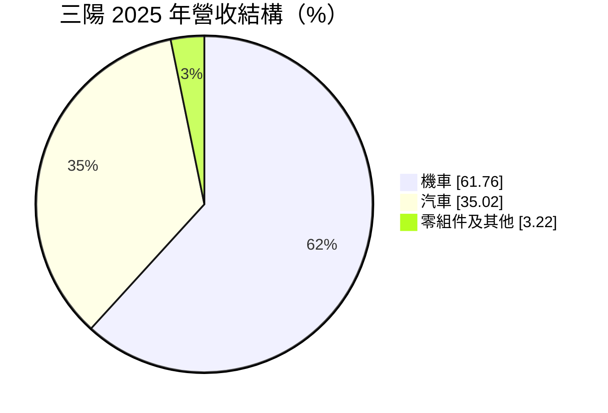
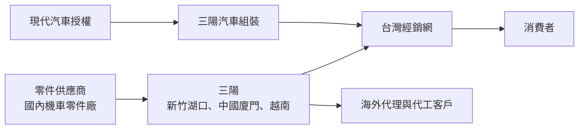
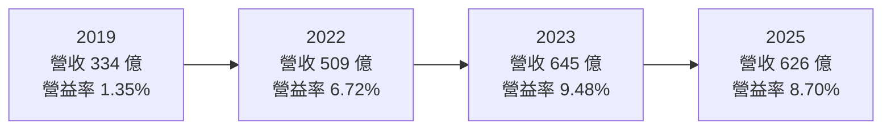
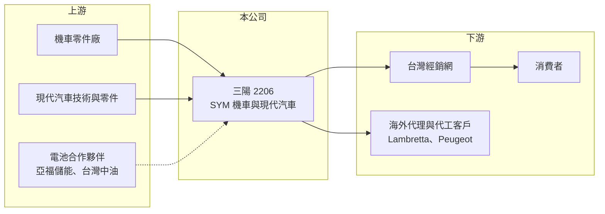

# 2206 三陽工業

> 上市｜[[產業索引-汽車工業|汽車工業]]｜上市（櫃）日期 1996/07/29

# 第一章：企業模式與商業藍圖

> [!info] 撰寫說明
> 本文由 Claude 依公開資料整理，架構比照 [[2330台積電]] 的四章研究，資料截至 2026-10-08。財務數字來源：Goodinfo 台灣股市資訊網年度經營績效、富果研究 2026 年 4 月 29 日法說會整理、證交所開放資料（本筆記 _data 快照）；轉投資細節部分憑既有知識整理並標「待校對」。#待校對

在評估單一個股的長期投資價值時，首要步驟是拆解企業的底層獲利邏輯。本章針對三陽工業（股票代號：2206，以下簡稱三陽）的商業模式進行定性分析，說明這家老牌機車廠如何從 2014 年單月市占只剩 9% 的谷底，重回台灣機車市占第一，並把汽車代理、海外外銷與能源事業組合成多角化的獲利結構。

## 一、核心定位：台灣機車龍頭加上現代汽車在台製造銷售

三陽成立於 1961 年，總部在新竹湖口，1996 年上市，以 SYM 品牌生產機車，同時在台灣組裝與銷售韓國現代（Hyundai）汽車。依 2026 年 4 月法說會整理，2025 年營收 626.3 億元，其中機車占 61.76%、汽車占 35.02%、零組件及其他占 3.22%。

三陽的機車事業是公司價值的核心。2022 年 5 月三陽重返台灣機車市占第一，2025 年市占 44.3%，單月最高曾達 46.9%；相較之下，2014 年單月市占曾低到 9%。這段翻轉來自產品平台整合、新車款密集推出與通路改革，也讓公司毛利率從 2014 年的 12.7% 提高到 2025 年的 20.7%。

## 二、產品板塊

* **台灣機車：** SYM 品牌速克達與檔車，是市占第一的主力。2025 年國內機車市場約 70.8 萬台，三陽 2026 年內銷目標約 32 萬台。
* **機車外銷與代工：** 產品外銷超過 100 個國家，並為義大利 Lambretta、法國 Peugeot 代工。2025 年外銷約 39 萬台，2026 年預估成長一成至約 43 萬台。
* **現代汽車：** 在台組裝與銷售現代汽車，為台灣非豪華乘用車品牌第三名，2026 年目標銷量 2.1 萬台以上、市占 5%。公司推動「一季一台新車」，導入 HEV、EV、FCEV 車款與氫燃料電池巴士。
* **零組件與能源：** 包括零件銷售與新的電池、換電事業。

## 三、資本轉化邏輯（營運模式）

* **平台化降低成本：** 三陽整合車架與引擎平台，新車開發時間從 18 個月縮短到 8 個月，全車系符合七期環保法規。平台共用讓三陽可以用較少的開發成本推出更多車款，這是市占回升的重要原因。
* **多地生產：** 生產基地位於台灣新竹、中國廈門與越南，廈門的轉投資廈杏摩托以[[權益法]]認列收益（待校對），越南工廠服務東南亞市場。
* **汽車代理的低毛利、高營收：** 現代汽車業務貢獻三成五營收，但組裝代理的毛利率通常低於機車（推估），主要角色是擴大營收規模與通路使用效率。

## 四、企業長期藍圖

三陽提出「現金、能源、資產」三大循環。現金循環以長期 ROE 大於 15%、專案投資報酬率大於 20% 為目標，股利配發率目標約 50%。能源循環方面，2025 年前後與亞福儲能合作投資約 30 億元開發鋁電池，目標 2028 年投產，並與台灣中油合作開發鋰三元電池、在台南試運行換電系統。資產循環則是活化土地與廠房。這顯示經營層有清楚的資本報酬紀律，同時押注下一代電池技術作為長期選擇權。

# 第二章：護城河深度與競爭優勢

在長期價值投資中，「護城河」指企業抵禦競爭、維持超額利潤的保護機制。本章分析三陽在台灣機車市場的護城河、主要對手，以及電動化對優勢的影響。

## 一、護城河的核心組成要素

* **1. 品牌與通路規模：** 台灣機車市場由少數品牌主導，三陽市占四成以上，經銷與維修據點密集。機車是高頻使用的交通工具，車主重視維修便利，通路規模形成很強的轉換成本。
* **2. 平台化的成本優勢：** 引擎與車架平台共用、開發週期縮短，讓三陽能以較低成本快速推出新車款，並把規模經濟轉化為較高毛利率。
* **3. 法規與零件供應鏈：** 七期環保法規提高了燃油機車的技術門檻，加上台灣完整的機車零件供應鏈，新進者很難以燃油機車切入市場。

## 二、全球主要競爭對手格局

| 對手 | 定位 | 對三陽的威脅 |
|---|---|---|
| 光陽（KYMCO，未上市） | 台灣機車老牌龍頭 | 長期爭奪市占第一 |
| 台灣山葉（Yamaha） | 日系品牌，運動型速克達強 | 年輕與性能車款市場競爭 |
| Gogoro | 電動機車與換電網路 | 電動化轉換時的主要威脅 |
| [[1599宏佳騰]] | 電動與燃油機車 | 電動機車市場競爭 |
| 汽車市場：[[2207和泰車]] 等 | 汽車代理與國產車 | 現代汽車的市占競爭 |

## 三、優勢轉化：守得住／守不住／觀察重點

* **守得住：** 燃油與油電機車市場。三陽的平台、通路與市占優勢，在燃油機車仍是主流的情況下很難被撼動。
* **守不住：** 若電動機車滲透率快速上升，換電網路與電池技術會成為新的競爭核心，三陽的燃油平台優勢可能減弱。汽車業務則受韓國原廠策略與進口車競爭影響，議價力有限。
* **觀察重點：** 長期可以看機車市占能否維持四成以上、外銷量能否持續成長，以及鋁電池與換電布局能否在電動化時代建立新的優勢。

# 第三章：財務體質與盈利規模

資料日期：2026-10-08。數字取自 Goodinfo 年度經營績效、富果法說會整理與證交所開放資料快照，表格是撰寫當時的快照；最新月營收、毛利率、累計 EPS 由自動排程寫在本筆記的屬性欄位（月營收、毛利率、累計EPS 等）。#待校對

財務報表是檢驗護城河是否真實存在的最終標準。本章用多年度的三率、ROE 與資本報酬，檢視三陽重返龍頭後的獲利品質。

## 一、獲利能力的基石：三率

| 年度 | 營收（新台幣） | [[毛利率]] | [[營業利益率]] | EPS（元） | [[ROE]] |
|---|---|---|---|---|---|
| 2019 | 334 億 | 17.4% | 1.35% | 2.71 | 14.9% |
| 2020 | 408 億 | 19.1% | 4.81% | 2.41 | 13.1% |
| 2021 | 416 億 | 19.1% | 5.34% | 2.30 | 11.9% |
| 2022 | 509 億 | 19.1% | 6.72% | 3.93 | 18.6% |
| 2023 | 645 億 | 20.8% | 9.48% | 7.95 | 29.2% |
| 2024 | 656 億 | 20.4% | 8.92% | 6.02 | 19.0% |
| 2025 | 626 億 | 20.7% | 8.70% | 5.78 | 13.9% |

* **[[毛利率]]：** 2019 年 17.4% 提高到 2023 年以後的 20% 以上，反映市占提升帶來的規模經濟與產品組合改善。2026 年上半年毛利率 20.96%（證交所開放資料）。
* **[[營業利益率]]：** 從 2019 年的 1.35% 提高到 2023 年的 9.48%，六年間增加約 8 個百分點，是三陽轉型成功最明確的證據。2019 年營業利益很低但 EPS 仍有 2.71 元，顯示當時獲利高度依賴轉投資與業外收益（推估）。
* **長期指標：** 2020 至 2025 年營收年複合成長率約 8.9%（推算）；2021 至 2025 年平均 ROE 約 18.5%（推算）。2025 年 ROE 13.87%（法說會），股利目標配發率約 50%。

## 二、[[ROE]]：資本效率

三陽的 ROE 長期維持在兩成上下，2023 年高達 29.2%，在汽機車整車廠中屬於高水準。不過合併權益約 419.5 億元中，歸屬母公司只有 258.4 億元（2026 年第二季底，證交所開放資料），[[非控制權益]]占比高，代表部分子公司有其他股東；分析時應以歸屬母公司的獲利與權益計算 ROE。負債比約 57%，財務槓桿中等。

## 三、資本支出與自由現金流

* **[[CapEx]]：** 逐年數字未查得。機車平台開發、汽車新車導入與鋁電池投資（約 30 億元，2025 年前後）是主要資本支出。
* **[[自由現金流]]：** 逐年數字未查得。以穩定獲利與約 50% 配發率推估，自由現金流多數年度為正（推估）。

## 四、[[ROIC]] 與 [[WACC]]：價值創造利差

有息負債明細未查得，以權益加非流動負債近似投入資本。2025 年營業利益約 54.5 億元（營收 626 億元 × 8.7%），稅後約 43.6 億元；投入資本以 2026 年第二季底權益 419.5 億元加非流動負債 289.3 億元，約 708.8 億元計算，ROIC 約 6.2%（推算）。由於權益包含大量轉投資（如廈杏，待校對），本業實際使用的資本較少，本業 ROIC 應高於此數字。

WACC 以 CAPM 推估：台灣 10 年期公債約 1.5% 至 2%，市場風險溢酬約 6%，β 未查得，汽機車整車股常見值採 0.9 至 1.1（假設），權益成本約 6.9% 至 8.6%；稅前負債成本假設 2.5%、稅後 2%，負債約占投入資本四成，WACC 約 5% 至 6%（推算）。

兩者比較，三陽 2022 年以後的 ROIC 已高於 WACC，ROE 也持續高於權益成本，屬於正在創造價值的公司。關鍵是能否在電動化轉型期維持機車本業的高報酬，並讓鋁電池等新投資達到公司自訂的 20% 專案報酬率門檻。

# 第四章：總體風險與地緣政治

任何企業都無法脫離宏觀環境獨立存在。本章分析三陽長期必須面對的政策、產業與營運風險。

## 一、地緣政治與貿易

* **中國轉投資：** 廈門的生產與轉投資收益受兩岸關係影響，政策變化可能衝擊業外收益（待校對）。
* **汽車關稅：** 2025 年汽車銷量因關稅影響下滑 9.5%（法說會）。台美貿易談判若調降進口車關稅，現代汽車在台組裝的成本優勢會改變。

## 二、產業週期與市場結構

* **國內機車市場飽和：** 台灣機車持有量高，新車需求主要來自換車，市場規模長期難以大幅成長，2025 年國內市場年減 6%。
* **補助政策：** 汰舊換新與電動機車補助會影響每年銷量的時間分布，補助退場時銷量可能下滑。

## 三、營運環境的隱性風險

* **汽車代理依賴原廠：** 現代汽車業務依賴韓國原廠授權與車款規劃，授權條件改變會影響三成五的營收。
* **新事業投資風險：** 鋁電池仍在開發，2028 年投產目標若延後或技術不如預期，約 30 億元投資的報酬會打折。
* **匯率：** 外銷與海外子公司以美元、人民幣、越南盾計價，匯率波動影響獲利。

## 四、科技或法規演進

* **機車電動化：** 若政府加速推動燃油機車淘汰，或電池成本大幅下降，電動機車滲透率可能快速提升，三陽需要確保在電動化市場維持競爭力。
* **環保法規：** 排放標準持續加嚴，增加燃油車開發成本，但也提高新進者門檻。

# 專有名詞解析

## 應用

- **[[電動車]]**：以電池與馬達取代內燃機驅動的車輛，包括電動汽車與電動機車。

## 金融

- **[[權益法]]**：持有被投資公司一定比例股權時，按持股比例認列其損益的會計方法，收益列在業外。
- **[[非控制權益]]**：子公司中不屬於母公司的股東權益，子公司虧損時會讓合併淨利與母公司淨利出現差異。
- **[[ROIC]]**：投入資本報酬率，衡量公司用股東與債權人資金創造本業稅後利潤的效率。
- **[[WACC]]**：加權平均資金成本，依股權與負債比重加權的資金成本，是 ROIC 要超過的門檻。

# 核心供應鏈

## 1. 上游：零件與合作夥伴
- 機車零件供應鏈：[[1525江申]]、[[1526日馳]] 等國內零件廠（推估，實際往來未查得）
- 汽車：韓國現代汽車
- 電池：亞福儲能（鋁電池合作）、台灣中油（鋰三元電池與換電）

## 2. 中游：三陽本身
- 台灣新竹湖口、中國廈門、越南生產基地

## 3. 下游：客戶
- 台灣經銷商與消費者；海外 100 多國代理商；義大利 Lambretta、法國 Peugeot 代工

## 4. 同業
- 台灣：光陽、台灣山葉、Gogoro、[[1599宏佳騰]]；汽車市場 [[2207和泰車]]、[[2204中華]]、[[2227裕日車]]

## 最新新聞
<!-- news:start -->
<!-- news:end -->

## 相關連結
- [公開資訊觀測站](https://mopsov.twse.com.tw/mops/web/t05st03?step=1&firstin=1&co_id=2206)
- [Goodinfo](https://goodinfo.tw/tw/StockDetail.asp?STOCK_ID=2206)
- [Yahoo 股市](https://tw.stock.yahoo.com/quote/2206)
- [鉅亨網新聞](https://www.cnyes.com/twstock/2206/news)
