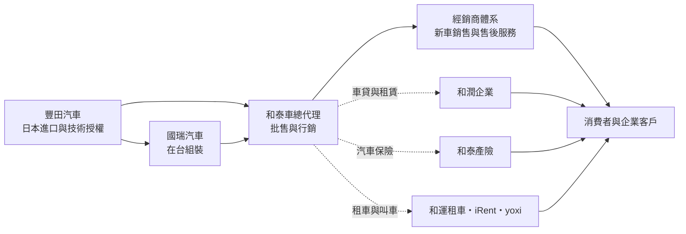
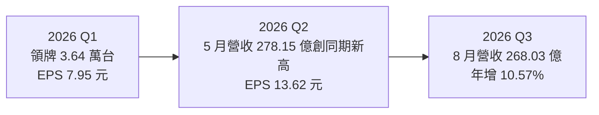
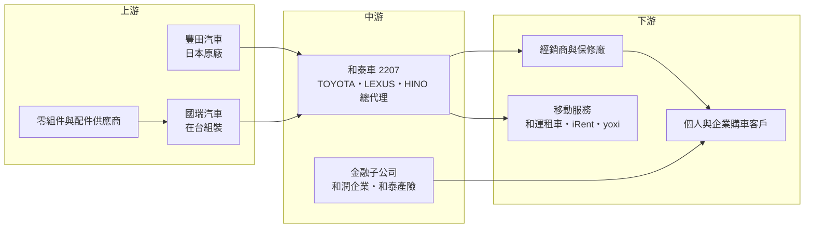

# 2207 和泰車

> 上市｜[[產業索引-汽車工業|汽車工業]]｜上市（櫃）日期 1997/02/25

# 第一章：企業模式與商業藍圖

> [!info] 撰寫說明
> 本文由 Claude 依公開資料整理，架構比照 [[2330台積電]] 的四章研究，資料截至 2026-10-07。財務數字來源：和泰車 2025 年財報新聞（工商時報）、2026 年第一季財報新聞（經濟日報）、2026 年 5 月營收新聞（中央社）、上半年財報與車市報導（8891 汽車、自由時報）、winvest 與豐存股財務摘要；產業描述為整理性內容，尚未逐條比對原始文件。#待校對

在評估單一個股的長期投資價值時，首要步驟是拆解企業的底層獲利邏輯。本章針對和泰汽車（股票代號：2207，以下簡稱和泰車）的商業模式進行定性分析，說明一家「不製造汽車」的代理商，如何靠品牌代理權、經銷網路與車貸保險，建立台灣汽車市場最穩固的獲利結構。

## 一、核心定位：TOYOTA 在台總代理與汽車生態系經營者

和泰車成立於 1955 年，1997 年上市，是日本豐田汽車海外市場的第一家[[總代理]]，在台灣代理 TOYOTA、LEXUS 與商用車品牌 HINO（日野）。2025 年三品牌合計市占率 38.6%，其中商用車市占率 37.6%，連續五年第一。

和泰車的定位可以分成三層：

* **代理與批售：** 向國瑞汽車（豐田在台組裝廠）與日本進口整車，批售給各區經銷商，再由經銷商賣給消費者。
* **經銷與售後服務：** 透過轉投資的經銷商體系提供新車銷售、保養維修與零件，售後服務是比新車銷售更穩定的獲利來源。
* **汽車金融與移動服務：** 車貸與租賃（[[6592和潤企業]]）、汽車保險（和泰產險）、租車與共享汽車（和運租車、iRent），以及叫車平台 yoxi，形成從買車、用車到換車的完整生態系。

## 二、終端應用板塊：車種與事業結構

和泰車未公開各事業的營收比重，因此本節不畫圓餅圖，改以定性描述：

* **新車銷售：** 營收主體。2026 年 1 月第六代 RAV4 上市後受訂逾 2.2 萬台；Corolla Cross、Camry 與 LEXUS ES300h 大改款也是主力。2026 年前 5 月 TOYOTA 與 LEXUS 合計市占率 38.1%，為歷年次高。
* **油電與電動車：** TOYOTA 以[[油電混合車]]為主力，純電車 bZ4X 銷售在 2026 年第一季顯著成長。
* **商用車：** HINO 卡車與 TOYOTA Hilux 等商用車型，2026 年 7 月大改款 Hilux 上市。HINO 經銷子公司 2026 年 5 月營收約 30.1 億元，占集團營收 10.8%。
* **金融與保險：** 和潤企業的車貸、租賃與和泰產險的投資收益，2026 年第一季獲利成長主要來自和泰產險投資收益增加。
* **中國事業：** 透過「和通汽車投資」經營中國的豐田與 LEXUS 經銷據點，2026 年上半年淨損 1.38 億元。

## 三、資本轉化邏輯：輕資產代理加金融放大

* **代理模式的輕資產特性：** 和泰車不負擔車輛研發與大部分製造資本支出，主要成本是向豐田與國瑞採購整車，因此資本報酬率高於一般車廠。
* **金融放大效果：** 消費者買車時同時辦理車貸與保險，和泰車在一台車上能收取銷售利潤、利差與保費，客戶黏著度也因此提高。
* **售後與再銷售：** 保養維修、零件、中古車與租賃車到期後再出售，延長單一客戶的貢獻週期。

## 四、企業長期藍圖：守住市占、擴大移動服務與電動化

* **銷量目標：** 2026 年三品牌年銷目標 16.5 萬台，預估市占率 38.4%（TOYOTA 30.2%、LEXUS 6.6%、HINO 1.6%），台灣整體車市預估下修至約 43 萬輛。
* **電動化：** 在豐田全球策略下，以油電混合車為主、逐步導入純電與插電式油電車型。
* **移動服務：** iRent 共享汽車與 yoxi 叫車平台是和泰車把客戶關係從「買車」延伸到「用車」的布局。
* **中國事業調整：** 中國車市價格戰激烈，經銷據點普遍虧損，未來可能持續收縮（推估）。

# 第二章：護城河深度與競爭優勢

在長期價值投資中，「護城河」指企業抵禦競爭、維持超額利潤的保護機制。本章分析和泰車的護城河構成、主要競爭對手，以及這些優勢在進口車關稅與電動化浪潮下能守住多少。

## 一、和泰車護城河的核心組成要素

和泰車擁有台灣汽車業最深的護城河，屬於「寬護城河」，由三個要素組成：

* **1. 獨家代理權與品牌：** TOYOTA 與 LEXUS 在台灣的代理權由和泰車長期持有，品牌在妥善率、保值性上的口碑深植消費者心中，是競爭對手難以複製的無形資產。
* **2. 經銷與服務網路：** 全台密集的經銷與保修據點，讓 TOYOTA 車主的保養便利性與二手車殘值都優於多數品牌，新品牌很難在短時間內建立同等規模。
* **3. 金融生態系：** 和潤車貸、和泰產險與租賃業務形成交叉銷售，客戶從買車、保險、保養到換車都留在和泰體系內，轉換成本高。

## 二、主要競爭對手格局

| 對手 | 定位 | 對和泰車的威脅 |
|---|---|---|
| [[2204中華]] | 三菱代理與自製商用車 | 商用車與國產車市場競爭 |
| [[2201裕隆]] | 日產代理與自有品牌，經營納智捷 | 國產轎車與休旅車競爭 |
| [[9941裕融]] | 裕隆集團車貸公司 | 汽車金融市場直接競爭 |
| [[2227裕日車]] | NISSAN 在台銷售 | 國產休旅與轎車競爭 |
| 汎德永業等進口車代理 | BMW、賓士、福斯等進口品牌 | 進口車關稅調降後價格更具競爭力 |
| Tesla、中國電動車品牌 | 純電車 | 電動化加速時搶奪年輕與科技族群 |

## 三、優勢轉化：哪些市場守得住、哪些守不住

* **守得住：** 主流家用車、油電混合車與商用車市場。2026 年前 5 月在進口車關稅觀望氣氛下，TOYOTA 與 LEXUS 合計市占率仍達 38.1%。
* **守不住：** 中國市場經銷業務。2026 年上半年和通汽車投資淨損 1.38 億元，旗下多個豐田與 LEXUS 據點虧損，顯示在中國車市價格戰中代理經銷的護城河並不存在。
* **觀察重點：** 進口車關稅調整後國產車與進口車的價差變化、純電車市占提升速度，以及和泰產險投資收益的波動。

# 第三章：財務體質與盈利規模

資料日期：2026-10-07。數字取自公司財報新聞與財經媒體整理，表格是撰寫當時的快照；最新月營收、毛利率、累計 EPS 由自動排程寫在本筆記的屬性欄位（月營收、毛利率、累計EPS 等）。#待校對

財務報表是檢驗護城河是否真實存在的最終標準。本章用三率、ROE、現金流與資本報酬，檢視和泰車的獲利品質。

## 一、獲利能力的基石：三率

| 項目 | 2025 全年 | 2026 Q1 | 2026 Q2 | 2026 上半年 |
|---|---|---|---|---|
| 營收（新台幣） | 2,826.08 億 | 未查得 | 未查得 | 約 1,609 億 |
| [[毛利率]] | 未查得 | 未查得 | 未查得 | 21.62% |
| [[營業利益率]] | 未查得 | 未查得 | 未查得 | 14.24% |
| 歸屬母公司淨利 | 189.00 億 | 44.3 億 | 約 76 億（推算） | 約 120 億 |
| EPS（元） | 33.93 | 7.95 | 13.62 | 21.57 |

* **[[毛利率]]：** 2026 年上半年 21.62%，代理商的毛利率主要取決於車型組合、日圓匯率與促銷力度。
* **[[營業利益率]]：** 上半年 14.24%，較前一年改善。
* **[[淨利率]]：** 上半年稅後淨利率約 8.77%。第二季 EPS 13.62 元明顯高於第一季，上半年 EPS 較前一年同期增加 7.08 元，第二季獲利大增的具體原因（本業、產險投資或一次性收益）未查得，待校對。

## 二、[[ROE]]：資本效率

依豐存股資料，和泰車 2025 年 ROE 約 22.78%，代理模式的輕資產特性讓 ROE 長期維持在二成上下。資料中 2026 年 ROE 13.92% 應為上半年數字，年化後仍與 2025 年相當（推估）。需注意的是，合併報表包含和潤企業與和泰產險的金融資產，ROE 受金融子公司槓桿影響。

## 三、資本支出與自由現金流

* **[[CapEx]]：** 本業資本支出以經銷據點、物流中心與租賃車隊為主，金額相對營收不高。和潤企業的租賃資產與放款增加，會使合併報表的投資現金流與借款同步上升。
* **[[自由現金流]]：** 汽車代理本業現金流穩定，但合併報表的自由現金流受金融子公司放款成長影響較大，需分開觀察（推估）。
* **股利政策：** 2025 年度每股配發現金股利 20 元，配發率 58.94%，以 2026 年 3 月 11 日收盤價 509 元計算殖利率 3.92%。

## 四、[[ROIC]] 與 [[WACC]]：價值創造利差

以本業代理業務來看，投入資本不大而獲利穩定，推估 ROIC 遠高於 WACC，是和泰車長期享有較高本益比的原因。但金融子公司的放款資產規模大、報酬率較低，合併計算時會拉低整體 ROIC（推估，具體數值未查得）。

# 第四章：總體風險與地緣政治

任何企業都無法脫離宏觀環境獨立存在。本章分析和泰車未來必須面對的地緣政治、產業週期與營運風險。

## 一、地緣政治與貿易政策風險

* **進口車關稅：** 2026 年台美貿易談判涉及進口車關稅調降，市場出現觀望氣氛，第一季 TOYOTA 與 LEXUS 領牌數減少約 4,645 台。若進口車關稅大幅調降，國產車的價格優勢縮小，LEXUS 等進口車型則可能受惠。
* **日圓匯率：** 進口車與零件以日圓計價，日圓升值會推高成本。
* **中國市場：** 中國車市價格戰激烈，和泰車在中國的經銷據點持續虧損。

## 二、產業週期與市場結構風險

* **台灣車市規模：** 2026 年台灣車市預估由 44 萬輛下修至 43 萬輛，新車需求受利率、景氣與關稅政策影響。
* **電動化轉型：** 若純電車普及速度快於預期，TOYOTA 以油電混合為主的產品線可能失去部分市占。
* **利率：** 和潤企業的車貸與租賃業務受利率變化影響利差。

## 三、營運環境的隱性風險

* **產險投資收益波動：** 2026 年第一季獲利成長主要來自和泰產險投資收益，股市與債市波動會讓獲利跟著波動。
* **供應鏈與交車：** 新車型交車速度取決於豐田全球產能與國瑞組裝進度。
* **代理權集中：** 和泰車的核心價值建立在豐田代理權，雖然雙方合作數十年，但代理條件的任何變化都會直接衝擊獲利。

## 四、法規與技術演進風險

* **燃油車禁售與碳排法規：** 台灣規劃 2040 年新車全面電動化，車輛碳排與能效標準逐步加嚴，代理商需跟隨原廠導入更多純電與插電式油電車型。
* **自動駕駛與軟體定義汽車：** 汽車價值逐漸轉向軟體與電池，傳統代理與保修服務的角色可能改變；共享汽車與叫車平台也可能降低年輕族群的購車意願。

# 專有名詞解析

## 金融

- **[[汽車融資]]**：提供購車貸款、分期付款與租賃的金融服務，和潤企業為和泰集團的汽車金融公司。
- **[[產險]]**：產物保險，承保車輛、財產等損失，保費收入可投資運用，投資收益會影響獲利。
- **[[配發率]]**：現金股利占每股盈餘的比例，代表公司把多少獲利以現金發給股東。
- **[[自由現金流]]**：營業活動現金流減去資本支出，代表企業可自由用於配息、還債或併購的現金。

## 產業

- **[[總代理]]**：取得汽車原廠授權，在特定國家或地區獨家負責進口、批售與行銷該品牌車輛的公司。
- **[[領牌數]]**：新車向監理單位登記領取車牌的數量，是觀察汽車品牌實際銷售與市占率的主要指標。
- **[[油電混合車]]**：同時搭載汽油引擎與電動馬達的車輛，不需外部充電，以回收煞車能量降低油耗。
- **[[純電車]]**：只靠電池與馬達驅動、需外部充電的車輛，簡稱 BEV。
- **[[國產車]]**：在台灣組裝生產的車輛，關稅負擔較進口車低，國瑞汽車為豐田在台組裝廠。
- **[[進口車關稅]]**：政府對進口整車課徵的關稅，調降時會縮小進口車與國產車的價差。
- **[[售後服務]]**：新車售出後的保養、維修、零件與配件銷售，毛利率通常高於新車銷售且較穩定。
- **[[共享汽車]]**：以分鐘或小時計費、由用戶自行取還車的租車服務，例如 iRent。

# 核心供應鏈

## 1. 上游：原廠與組裝
- 原廠：豐田汽車（日本）
- 在台組裝：國瑞汽車（和泰車為主要股東之一）
- 零組件：國瑞汽車在台採購的本土零組件供應鏈（個別供應商未查證）

## 2. 中游：和泰車本身與金融子公司
- 汽車金融：[[6592和潤企業]]
- 產險：和泰產險
- 配件：車美仕

## 3. 下游：經銷與客戶
- 各區經銷商：北都、桃苗、中部、南都、高都等經銷體系
- 個人消費者、企業與政府車隊

## 4. 同業比較
- 國產與代理同業：[[2204中華]]、[[2201裕隆]]、[[2227裕日車]]
- 汽車金融同業：[[9941裕融]]

## 最新新聞
<!-- news:start -->
<!-- news:end -->

## 相關連結
- [公開資訊觀測站](https://mopsov.twse.com.tw/mops/web/t05st03?step=1&firstin=1&co_id=2207)
- [Goodinfo](https://goodinfo.tw/tw/StockDetail.asp?STOCK_ID=2207)
- [Yahoo 股市](https://tw.stock.yahoo.com/quote/2207)
- [鉅亨網新聞](https://www.cnyes.com/twstock/2207/news)
