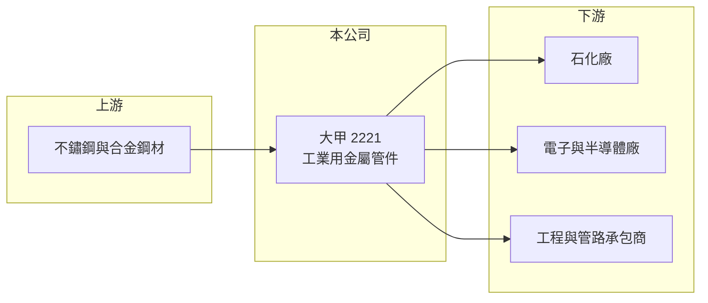

# 2221 大甲

> 上櫃｜[[產業索引-其他業|其他業]]｜上市（櫃）日期 2007/08/01

# 第一章：企業模式與商業藍圖

> [!info] 撰寫說明
> 精簡版，由 Claude 依公開資料整理，架構比照 [[2330台積電]]，資料截至 2026-10-07。來源：nStock 大甲公司簡介、winvest 營收快訊。#待校對

大甲永和機械是[[金屬管件]]製造商，產品用於石化與電子工業的管路系統，2026 年營收與獲利明顯成長。

- **核心業務：** 製造及買賣石化工業與電子工業用的金屬管件及附屬配件。
- **營收結構：** 本次未查到石化與電子應用的營收比重。
- **營運據點：** 公司 1977 年成立，2007 年上櫃，生產據點明細本次未查到。
- **長期方向：** 電子工業（推估包含半導體廠的[[廠務工程]]管路）需求成長，可分散對石化業的依賴。

# 第二章：護城河深度與競爭優勢

大甲的優勢在於工業級管件的製造經驗與客戶認證。

- **競爭優勢：** 石化與電子廠管路對材質與耐壓有嚴格要求，取得認證後轉換成本較高（推估）。
- **主要對手：** 國內外工業管件與配件製造商，本次未查到具體名單。
- **觀察重點：** 8 月營收 1.99 億元，年增 81.32%，觀察高成長是否來自特定專案或可持續的訂單。

# 第三章：財務體質與盈利規模

資料日期：2026-10-07，以下數字是撰寫當時的快照；最新月營收、毛利率、累計 EPS 由自動排程寫在本筆記的屬性欄位（月營收、毛利率、累計EPS 等）。#待校對

大甲 2026 年營收與獲利同步成長，配息率也偏高。

- **營收規模：** 2026 年 1 至 8 月累計營收 11.46 億元，年增 29.09%；7 月營收 1.40 億元，年增 38.53%。
- **獲利：** 2026 年第二季 EPS 1.17 元，年增 138.78%；[[毛利率]] 23.84%、[[營業利益率]] 14.57%。
- **財務特色：** 資本額僅 4.23 億元，近五年平均現金股利 2.22 元、平均[[殖利率]] 5.92%，2025 年配息 1.5 元。

# 第四章：總體風險與地緣政治

大甲的風險在於下游資本支出循環與原料價格。

- **產業週期：** 管件需求跟隨石化與電子廠的建廠與擴產週期，專案結束後營收可能回落。
- **營運風險：** 營收成長若集中在少數大型專案，客戶集中度偏高（推估）。
- **其他風險：** 不鏽鋼與合金原料價格波動，以及匯率變動，會影響毛利率。

# 專有名詞解析

## 金融

- **[[殖利率]]**：每年現金股利除以股價，用來衡量配息報酬。

## 產業

- **[[金屬管件]]**：彎頭、三通、法蘭等連接管路的金屬零件，用於工廠流體輸送系統。
- **[[廠務工程]]**：晶圓廠與工廠的水、氣、化學品供應及排放等基礎設施工程。

# 核心供應鏈

- 上游：不鏽鋼與合金鋼材供應商（推估）
- 下游／客戶：石化廠、電子與半導體廠，以及管路工程承包商（推估）
- 同業：國內外工業管件製造商（本次未查到具體名單）

## 最新新聞
<!-- news:start -->
<!-- news:end -->

## 相關連結
- [公開資訊觀測站](https://mopsov.twse.com.tw/mops/web/t05st03?step=1&firstin=1&co_id=2221)
- [Goodinfo](https://goodinfo.tw/tw/StockDetail.asp?STOCK_ID=2221)
- [Yahoo 股市](https://tw.stock.yahoo.com/quote/2221)
- [鉅亨網新聞](https://www.cnyes.com/twstock/2221/news)
