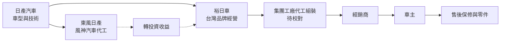
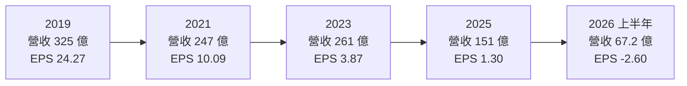
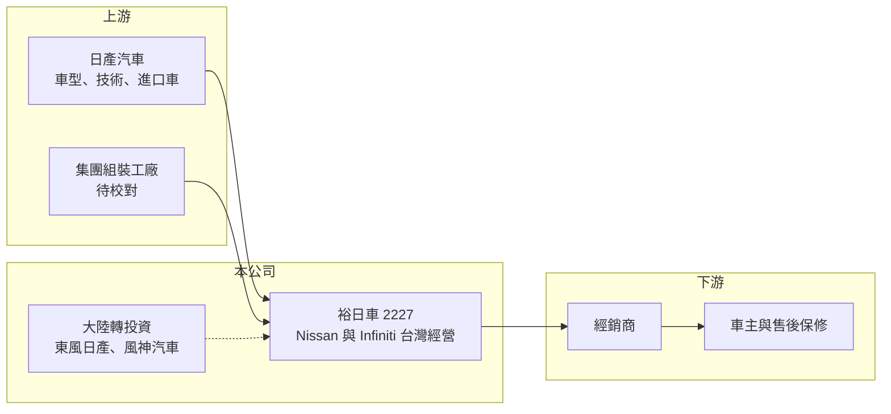

# 2227 裕日車

> 上市｜[[產業索引-汽車工業|汽車工業]]｜上市（櫃）日期 2004/12/21

# 第一章：企業模式與商業藍圖

> [!info] 撰寫說明
> 本文由 Claude 依公開資料整理，架構比照 [[2330台積電]] 的四章研究，資料截至 2026-10-08。財務數字來源：Goodinfo 台灣股市資訊網年度經營績效、富果研究 2025 年 11 月 19 日法說會整理、證交所開放資料（本筆記 _data 快照）；股東結構與集團分工部分憑既有知識整理並標「待校對」。#待校對

在評估單一個股的長期投資價值時，首要步驟是拆解企業的底層獲利邏輯。本章針對裕隆日產汽車（股票代號：2227，以下簡稱裕日車）的商業模式進行定性分析，說明它如何以「台灣代理加大陸轉投資」的雙引擎模式，在 2019 年創造每股 24 元的獲利，又為何在日產母廠轉型與大陸車市價格戰中，獲利一路下滑到 2026 年上半年轉為虧損。

## 一、核心定位：Nissan 在台灣的品牌經營者加上大陸轉投資

裕日車成立於 2003 年，由裕隆汽車與日本日產汽車合資設立（持股比例待校對），2004 年上市，總部登記在苗栗三義。依 2025 年 11 月法說會，主要業務是 Nissan、Infiniti 品牌在台灣的國產車製造（委託集團工廠生產，待校對）、進口車銷售，以及售後保修與零配件銷售。

裕日車的第二個獲利來源在中國大陸。公司轉投資東風日產相關事業，由風神汽車負責代工，裕日車以轉投資收益認列（法說會）。2019 年 EPS 24.27 元、ROE 34.7%，營業利益率卻只有 4.2%，說明當時大部分獲利來自大陸轉投資。也因此，裕日車的長期價值高度取決於兩件事：日產品牌在台灣的產品力，以及東風日產在中國市場的競爭力。

## 二、產品板塊

公司未在本次查得的資料中揭露產品別營收比重，以下為定性分類，不畫圓餅圖。

* **新車銷售：** Nissan 國產與進口車款，以及 Infiniti 豪華品牌。2025 年 1 至 10 月合計銷售 10,644 台、年減 35.2%，主因是 Juke、Livina、Altima 與 Infiniti Q50 四款車型停售。
* **售後保修與零配件：** 2025 年 1 至 10 月進廠保修約 49.9 萬台，零配件銷售約 27 億元，保修會員約 10.9 萬、年增 17.2%。這是隨著路上 Nissan 保有量而穩定產生的收入，比新車銷售穩定。
* **大陸轉投資收益：** 東風日產 2025 年 1 至 9 月銷量 41.9 萬台，累計年減 9.4%；以權益法列入業外收益。

## 三、資本轉化邏輯（營運模式）

* **輕資產的品牌經營：** 裕日車本身主要負責品牌、行銷與通路，生產委託集團工廠（待校對），因此本業毛利率只有一成上下，營業利益率很低。本業的價值在於品牌通路與售後服務的現金流。
* **依賴母廠車款：** 新車銷售完全取決於日產提供的車型。日產母廠近年經營困難，2025 財年預估營業虧損 2,750 億日圓、集團淨損 6,500 億日圓（2025 年 10 月與 2026 年 2 月報導），車款更新放緩，直接造成台灣停售車型增加。

## 四、企業長期藍圖

依 2025 年 11 月法說，台灣 2026 年國產車以改款與特仕車為主，沒有全新車款；計畫引進一款全新歐規進口車，Kicks 後繼車款仍與日方討論；美規車款則待法規完全開放後評估引進。大陸方面，東風日產規劃 2025 至 2027 年推出十款新車，首款純電車 N7 累計銷量 4.37 萬台，並自 2026 年第四季起進軍海外。整體而言，裕日車的長期方向取決於母廠的產品規劃，公司本身能主導的空間有限。資本配置上，2025 年度現金股利降到 0.84 元（證交所開放資料），反映獲利大幅下降。

# 第二章：護城河深度與競爭優勢

在長期價值投資中，「護城河」指企業抵禦競爭、維持超額利潤的保護機制。本章分析裕日車在台灣汽車市場的護城河、主要對手，以及它對母廠的依賴程度。

## 一、護城河的核心組成要素

* **1. 品牌總代理權：** 裕日車是 Nissan 與 Infiniti 在台灣的唯一經營者，代理權本身就是門檻。但這項優勢來自母廠授權，不是公司自己能控制的資產。
* **2. 售後保修網路：** 路上累積的 Nissan 車輛需要原廠保修與零件，每年近 50 萬台次進廠，形成穩定的服務收入，這是裕日車最可靠的現金流。
* **3. 國產車的關稅優勢：** 國產車款相對進口車有關稅保護，但台灣市場規模小，加上車款減少，這項優勢正在縮小。

## 二、全球主要競爭對手格局

| 對手 | 定位 | 對裕日車的威脅 |
|---|---|---|
| [[2207和泰車]] | Toyota 與 Lexus 總代理，市占第一 | 產品線完整、通路規模大，搶走同級車款客戶 |
| [[2206三陽工業]] | 現代汽車在台製造銷售 | 在中價位休旅車直接競爭 |
| [[2204中華]] | 三菱品牌與商用車 | 部分車款重疊 |
| 中國電動車品牌 | 價格與電動化優勢 | 在大陸市場壓縮東風日產，在台灣也逐步進入 |

## 三、優勢轉化：守得住／守不住／觀察重點

* **守得住：** 售後保修與零件業務。只要 Nissan 保有量仍大，這部分收入就能延續多年。
* **守不住：** 新車市占與大陸轉投資收益。前者取決於母廠車款，後者面對中國電動車價格戰，都不是裕日車能控制的。
* **觀察重點：** 長期可以看三件事：日產母廠的重整能否帶來新車款、東風日產的電動車能否止住銷量下滑，以及本業營業利益能否回到正值。

# 第三章：財務體質與盈利規模

資料日期：2026-10-08。數字取自 Goodinfo 年度經營績效、富果法說會整理與證交所開放資料快照，表格是撰寫當時的快照；最新月營收、毛利率、累計 EPS 由自動排程寫在本筆記的屬性欄位（月營收、毛利率、累計EPS 等）。#待校對

財務報表是檢驗護城河是否真實存在的最終標準。本章用多年度的三率、ROE 與資本報酬，檢視裕日車從高峰到虧損的變化。

## 一、獲利能力的基石：三率

| 年度 | 營收（新台幣） | [[毛利率]] | [[營業利益率]] | EPS（元） | [[ROE]] |
|---|---|---|---|---|---|
| 2019 | 325 億 | 14.9% | 4.20% | 24.27 | 34.7% |
| 2020 | 297 億 | 13.8% | 1.01% | 21.80 | 30.2% |
| 2021 | 247 億 | 11.4% | 0.50% | 10.09 | 14.9% |
| 2022 | 236 億 | 12.5% | 0.48% | 8.04 | 12.6% |
| 2023 | 261 億 | 11.7% | 0.45% | 3.87 | 6.28% |
| 2024 | 231 億 | 11.5% | 0.26% | 5.57 | 9.03% |
| 2025 | 151 億 | 9.47% | -4.05% | 1.30 | 2.09% |

* **[[毛利率]]：** 從 2019 年的 14.9% 降到 2025 年的 9.47%，2026 年上半年只剩 8.34%（證交所開放資料）。銷量下滑讓固定的通路與管理成本攤不開。
* **[[營業利益率]]：** 2021 至 2024 年都在 0.5% 以下，2025 年轉為 -4.05%，2026 年上半年 -5.27%。本業已無法自給自足。
* **[[業外收益]]：** 2025 年前三季營業外收入 4 億元，低於前一年同期的 10.3 億元，主因是大陸轉投資收益下降與匯率不利；2026 年上半年業外轉為損失 6.36 億元（證交所開放資料），造成稅後虧損 7.81 億元。
* **長期指標：** 2020 至 2025 年營收年複合成長率約 -12.7%（推算）；2021 至 2025 年平均 ROE 約 9.0%（推算），但呈逐年下滑趨勢。

## 二、[[ROE]]：資本效率

裕日車財務結構保守，2026 年第二季底負債約 49.0 億元、權益約 177.4 億元，負債比約 22%，每股淨值 59.13 元（證交所開放資料）。ROE 從 2019 年的 34.7% 一路降到 2025 年的 2.09%，下降的原因不是財務槓桿，而是大陸轉投資收益與本業同時萎縮。

## 三、資本支出與自由現金流

* **[[CapEx]]：** 逐年數字未查得。品牌經營屬輕資產模式，資本支出以展示中心與保修設備為主。
* **[[自由現金流]]：** 逐年數字未查得。過去大陸轉投資的現金股利是重要現金來源，轉投資收益下降後，現金流與配息能力同步減弱。

## 四、[[ROIC]] 與 [[WACC]]：價值創造利差

裕日車幾乎沒有有息負債（推估），以權益近似投入資本。2024 年營業利益約 0.6 億元（營收 231 億元 × 0.26%），稅後約 0.48 億元，以權益約 177 億元計算，本業 ROIC 約 0.3%（推算）；2025 年營業虧損，本業 ROIC 為負值。若把大陸轉投資收益視為投資報酬，整體報酬率大致可用 ROE 代表，2019 年約 35%，2025 年約 2%。

WACC 以 CAPM 推估：台灣 10 年期公債約 1.5% 至 2%，市場風險溢酬約 6%，β 未查得，汽車股常見值採 0.8 至 1.0（假設），權益成本約 6.3% 至 8%；幾乎沒有負債，WACC 約 6% 至 8%（推算）。

兩者比較，裕日車在 2019 至 2022 年靠大陸轉投資創造遠高於 WACC 的報酬，2023 年以後整體報酬已低於資金成本，本業則長期無法創造價值。這是一家價值高度依賴外部夥伴（日產與東風日產）的公司，長期投資需要先判斷母廠的復原能力。

# 第四章：總體風險與地緣政治

任何企業都無法脫離宏觀環境獨立存在。本章分析裕日車長期必須面對的母廠、市場與政策風險。

## 一、地緣政治與政策

* **大陸車市與兩岸風險：** 大陸轉投資收益受中國汽車市場與兩岸政策影響。中國電動車價格戰使日系合資品牌市占持續下滑，2025 年 1 至 10 月中國新能源車市占已達 46.7%（法說會）。
* **台灣進口車關稅：** 若台美貿易談判調降進口車關稅，美規車款可以引進，但國產車的價格優勢也會縮小。

## 二、產業週期與市場結構

* **母廠經營困境：** 日產正在進行大規模重整，車款開發與全球產能縮減，可能讓台灣可銷售的車款持續減少。
* **台灣車市成長有限：** 2025 年台灣汽車市場預估約 40 萬台、年減 11%（法說會），市場規模小、競爭激烈。

## 三、營運環境的隱性風險

* **營收規模萎縮：** 營收從 2019 年的 325 億元降到 2025 年的 151 億元，經銷商與通路的獲利能力也會受影響，可能引發通路調整。
* **匯率：** 進口車與零件以日圓計價，轉投資收益以人民幣計價，匯率波動影響損益。

## 四、科技或法規演進

* **電動化落後風險：** 日產在電動車領域起步早，但近年新車款更新緩慢；若台灣市場加速電動化，裕日車可能缺乏具競爭力的電動車款。
* **車輛安全與排放法規：** 法規更新會淘汰部分舊車款，Juke、Livina 等車款停售即與產品生命週期與法規有關（推估）。

# 專有名詞解析

## 金融

- **[[權益法]]**：持有被投資公司一定比例股權時，按持股比例認列其損益的會計方法，收益列在業外。
- **[[業外收益]]**：本業以外的收入，例如轉投資收益、利息與匯兌利益，通常較不穩定。
- **[[ROIC]]**：投入資本報酬率，衡量公司用股東與債權人資金創造本業稅後利潤的效率。
- **[[WACC]]**：加權平均資金成本，依股權與負債比重加權的資金成本，是 ROIC 要超過的門檻。

## 產業

- **[[總代理]]**：取得國外品牌在特定市場獨家銷售權的公司，營運依賴原廠授權與車款規劃。
- **[[國產車]]**：在台灣組裝生產的汽車，相對進口車享有關稅保護，零件多來自在地供應鏈。

# 核心供應鏈

## 1. 上游：母廠與生產
- 日本日產汽車（技術授權與股東，持股比例待校對）
- 集團工廠代工組裝：[[2201裕隆]]（待校對）

## 2. 中游：裕日車本身
- Nissan 與 Infiniti 國產車、進口車、售後保修與零配件
- 大陸轉投資：東風日產相關事業，風神汽車代工

## 3. 下游：客戶
- 國內經銷商與車主

## 4. 同業
- 台灣：[[2207和泰車]]、[[2206三陽工業]]、[[2204中華]]、[[2201裕隆]]

## 最新新聞
<!-- news:start -->
<!-- news:end -->

## 相關連結
- [公開資訊觀測站](https://mopsov.twse.com.tw/mops/web/t05st03?step=1&firstin=1&co_id=2227)
- [Goodinfo](https://goodinfo.tw/tw/StockDetail.asp?STOCK_ID=2227)
- [Yahoo 股市](https://tw.stock.yahoo.com/quote/2227)
- [鉅亨網新聞](https://www.cnyes.com/twstock/2227/news)
