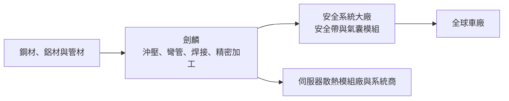
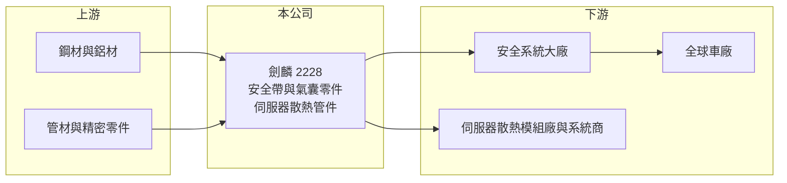

# 2228 劍麟

> 上市｜[[產業索引-汽車工業|汽車工業]]｜上市（櫃）日期 2013/11/25

# 第一章：企業模式與商業藍圖

> [!info] 撰寫說明
> 本文由 Claude 依公開資料整理，架構比照 [[2330台積電]] 的四章研究，資料截至 2026-10-08。財務數字來源：Goodinfo 台灣股市資訊網年度經營績效、科技新報 2025 年 11 月 17 日法說會報導、證交所開放資料（本筆記 _data 快照）；客戶名單與產品細項部分憑既有知識整理並標「待校對」。#待校對

在評估單一個股的長期投資價值時，首要步驟是拆解企業的底層獲利邏輯。本章針對劍麟（股票代號：2228）的商業模式進行定性分析，說明這家汽車安全帶與安全氣囊零組件廠如何以金屬成形與精密加工能力，長期供應國際安全系統大廠，並在 2025 年把同樣的能力延伸到 AI 伺服器散熱。

## 一、核心定位：國際安全系統大廠的關鍵零件供應商

劍麟成立於 1977 年，總部在新北汐止，2013 年上市，本業是汽車被動安全零組件，包括安全帶與安全氣囊的零件。安全帶的捲收器、扣環與高度調整器，以及安全氣囊的金屬件，都屬於攸關乘員生命的[[被動安全]]零件，車廠與 [[Tier 1]] 安全系統大廠對品質與可靠度要求極高（產品細項待校對）。

劍麟的客戶是全球少數幾家安全系統大廠（如 Autoliv、ZF、均勝安全等，待校對），由它們整合成安全帶與氣囊模組後再賣給車廠。這種結構讓劍麟的需求跟著全球汽車產量走，而且因為每輛車都必須配備安全帶與多個氣囊，需求不受燃油車或電動車轉換影響。

## 二、產品板塊

公司未在本次查得的資料中揭露產品別營收比重，以下為定性分類，不畫圓餅圖。

* **安全帶零組件：** 捲收器與扣環等金屬與機構件，是劍麟的傳統主力。
* **安全氣囊零組件：** 安全氣囊的金屬件與相關零件。2025 年報導指出，南投廠汽車業務的成長多來自大陸市場的安全氣囊產品，毛利較低。
* **AI 伺服器散熱零組件：** 2025 年下半年起布局金屬 Manifold（分歧管）與散熱管路加工件，2025 年底小量出貨、2026 年逐步拉量。南投二廠第一條產線已完成試產，單線滿載年營收約 2 至 3 億元，廠區可容納 4 至 5 條產線。

## 三、資本轉化邏輯（營運模式）

* **金屬成形的核心能力：** 劍麟的強項是金屬沖壓、彎管、焊接與精密加工。這些能力既能做安全零件，也能做液冷散熱的分歧管與管路，因此 AI 散熱是能力的延伸，而不是全新事業。
* **多地產能配置：** 生產據點包括台灣、中國大陸與波蘭。大陸工廠生產安全氣囊等產品，北美出貨多以墨西哥為交貨地；台灣生產部分美國交貨的零組件；波蘭則提供「非中國供應鏈」方案（2025 年法說）。

## 四、企業長期藍圖

劍麟的長期策略是「鞏固本業、延伸新應用」。本業方面，透過台灣、大陸、波蘭三地產能配置提高供應鏈韌性，回應客戶分散產地的要求。新業務方面，以既有金屬成形能力切入 AI 伺服器 [[液冷]]散熱，已取得台系模組廠與系統商新案的供應商資格。經營層一向重視股東回饋，2025 年度現金股利 4.5 元（證交所開放資料），以 EPS 5.25 元計算配息率約 86%（推算）。

# 第二章：護城河深度與競爭優勢

在長期價值投資中，「護城河」指企業抵禦競爭、維持超額利潤的保護機制。本章分析劍麟在汽車安全零件市場的護城河、主要對手與可守住的範圍。

## 一、護城河的核心組成要素

* **1. 安全零件的認證門檻：** 安全帶與氣囊零件攸關人命，從開發、驗證到量產需要數年，客戶一旦導入就很少更換供應商。這是劍麟最主要的護城河。
* **2. 與 Tier 1 大廠的長期關係：** 全球安全系統市場由少數大廠主導，劍麟長期供應這些大廠，累積的品質紀錄與共同開發經驗是新進者難以取代的。
* **3. 跨國產能的供應鏈韌性：** 台灣、大陸、波蘭的產能配置，讓劍麟能依關稅與客戶要求調整出貨地，這在供應鏈重組的時代是加分條件。

## 二、全球主要競爭對手格局

| 對手 | 定位 | 對劍麟的威脅 |
|---|---|---|
| 安全系統大廠內部自製 | Autoliv、ZF 等自有零件產能（待校對） | 客戶可能把零件改回自製 |
| 中國安全零件廠 | 規模大、成本低 | 在大陸市場與價格敏感產品競爭 |
| 日韓與歐洲零件廠 | 服務當地 Tier 1 | 在各地區市場競爭 |
| [[3017奇鋐]]、[[3324雙鴻]] 等散熱大廠 | 伺服器液冷散熱 | 新業務領域的主要競爭者或客戶 |

## 三、優勢轉化：守得住／守不住／觀察重點

* **守得住：** 已量產的安全帶與氣囊零件專案。安全零件的轉換成本高，訂單黏著度強。
* **守不住：** 大陸市場的低價安全氣囊產品，毛利率偏低，且面對中國廠商的價格競爭。
* **觀察重點：** 長期可以看三件事：毛利率能否維持在 24% 上下、AI 散熱業務能否擴充到多條產線並穩定獲利，以及美國關稅下高毛利訂單的生產地調整對獲利的影響。

# 第三章：財務體質與盈利規模

資料日期：2026-10-08。數字取自 Goodinfo 年度經營績效、科技新報法說會報導與證交所開放資料快照，表格是撰寫當時的快照；最新月營收、毛利率、累計 EPS 由自動排程寫在本筆記的屬性欄位（月營收、毛利率、累計EPS 等）。#待校對

財務報表是檢驗護城河是否真實存在的最終標準。本章用多年度的三率、ROE 與資本報酬，檢視劍麟的獲利品質。

## 一、獲利能力的基石：三率

| 年度 | 營收（新台幣） | [[毛利率]] | [[營業利益率]] | EPS（元） | [[ROE]] |
|---|---|---|---|---|---|
| 2019 | 45.8 億 | 27.5% | 13.6% | 8.66 | 17.0% |
| 2020 | 34.2 億 | 21.8% | 4.05% | 1.30 | 2.59% |
| 2021 | 36.8 億 | 22.2% | 4.08% | 3.14 | 6.38% |
| 2022 | 43.7 億 | 26.0% | 10.3% | 5.97 | 11.4% |
| 2023 | 48.9 億 | 24.8% | 11.5% | 6.78 | 12.1% |
| 2024 | 50.4 億 | 24.8% | 10.5% | 9.51 | 15.2% |
| 2025 | 49.5 億 | 23.6% | 9.16% | 5.25 | 8.14% |

* **[[毛利率]]：** 長期在 22% 至 28%，對汽車零件廠而言屬於中上水準，反映安全零件的認證門檻帶來的定價空間。2026 年上半年毛利率 21.7%（證交所開放資料），受低毛利大陸氣囊產品比重提高與關稅影響。
* **[[營業利益率]]：** 2020 至 2021 年受疫情與車用晶片短缺影響降到 4%，2022 年以後回到 9% 至 12%。汽車產量回升時，[[營運槓桿]]讓利潤率快速改善。
* **一次性因素：** 2024 年 EPS 9.51 元較高，含一次性所得稅回沖（2025 年 11 月法說報導）；2025 年回到 5.25 元。
* **長期指標：** 2020 至 2025 年營收年複合成長率約 7.7%（推算）；2021 至 2025 年平均 ROE 約 10.6%（推算）。配息率長期偏高。

## 二、[[ROE]]：資本效率

劍麟 2026 年第二季底負債約 19.9 億元、權益約 49.5 億元，負債比約 29%，每股淨值 62.05 元（證交所開放資料）。低負債、ROE 一成上下，代表本業有穩定的資本報酬，但沒有財務槓桿放大。

## 三、資本支出與自由現金流

* **[[CapEx]]：** 逐年數字未查得。南投二廠的散熱產線、波蘭廠產能是近年主要投資。
* **[[自由現金流]]：** 逐年數字未查得。以高配息率與低負債推估，多數年度自由現金流為正（推估）。

## 四、[[ROIC]] 與 [[WACC]]：價值創造利差

有息負債明細未查得，以權益加非流動負債近似投入資本。2025 年營業利益約 4.53 億元（營收 49.5 億元 × 9.16%），稅後約 3.63 億元；投入資本以 2026 年第二季底權益 49.5 億元加非流動負債 10.2 億元，約 59.7 億元計算，ROIC 約 6.1%（推算）。2023 年營業利益約 5.62 億元，稅後約 4.5 億元，以相近資本規模估算 ROIC 約 7.5%（推算）。

WACC 以 CAPM 推估：台灣 10 年期公債約 1.5% 至 2%，市場風險溢酬約 6%，β 未查得，汽車零件股常見值採 0.9 至 1.1（假設），權益成本約 6.9% 至 8.6%；稅前負債成本假設 2.5%、稅後 2%，負債約占投入資本一成五，WACC 約 6.2% 至 7.6%（推算）。

兩者比較，劍麟在汽車產量正常的年度 ROIC 約與 WACC 相當或略高，疫情年度則明顯低於資金成本。它是穩定、高配息的利基零件廠，但超額報酬不大。AI 散熱業務若能以較高毛利放量，是提升 ROIC 的主要機會。

# 第四章：總體風險與地緣政治

任何企業都無法脫離宏觀環境獨立存在。本章分析劍麟長期必須面對的貿易、產業與營運風險。

## 一、地緣政治與貿易

* **美國關稅：** 2025 年部分高毛利美國訂單轉往北美生產，台灣端獲利下降（法說報導）。關稅政策持續變動，會影響各地工廠的產能配置與獲利結構。
* **中國產能：** 大陸工廠服務大陸與北美市場，美中貿易與兩岸政策變化會影響其角色。波蘭與台灣產能是分散風險的布局。

## 二、產業週期與市場結構

* **全球汽車產量：** 安全零件需求跟著全球新車產量走，車市下行或晶片短缺會直接影響出貨，2020 年營收與獲利大幅下滑就是例子。
* **客戶集中：** 全球安全系統市場由少數大廠主導，劍麟的客戶集中度高，大客戶的策略調整會影響訂單。

## 三、營運環境的隱性風險

* **原物料：** 鋼材與鋁材價格波動影響成本。
* **匯率：** 外銷以美元與歐元計價，新台幣升值壓縮毛利。
* **新業務競爭：** AI 散熱市場成長快，但大型散熱廠與中國廠商也積極擴產，價格競爭可能比預期激烈。

## 四、科技或法規演進

* **安全法規持續加嚴：** 各國新車安全評等（NCAP）要求越來越多氣囊與安全帶功能，長期有利安全零件需求。
* **自動駕駛：** 自動駕駛改變座艙設計，安全帶與氣囊的形式可能改變，零件商需要跟著開發新產品。

# 專有名詞解析

## 應用

- **[[被動安全]]**：事故發生時保護乘員的裝置，如安全帶與安全氣囊，與避免事故的主動安全相對。

## 金融

- **[[營運槓桿]]**：固定成本占比高時，營收增加會讓營業利益以更快速度成長，反之亦然。
- **[[ROIC]]**：投入資本報酬率，衡量公司用股東與債權人資金創造本業稅後利潤的效率。
- **[[WACC]]**：加權平均資金成本，依股權與負債比重加權的資金成本，是 ROIC 要超過的門檻。

## 產業

- **[[Tier 1]]**：直接供應整車廠的一階系統供應商，負責整合多個零件成為模組或系統。
- **[[液冷]]**：以液體帶走熱量的散熱方式，效率高於氣冷，AI 伺服器逐步採用。

# 核心供應鏈

## 1. 上游：材料
- 鋼材、鋁材與管材：[[2002中鋼]] 等（推估，實際往來未查得）

## 2. 中游：劍麟本身
- 台灣（汐止總部、南投廠）、中國大陸、波蘭生產據點
- 安全帶與安全氣囊零組件、AI 伺服器 Manifold 與散熱管路

## 3. 下游：客戶
- 全球安全系統大廠（Autoliv、ZF、均勝安全等，待校對）
- 台系伺服器散熱模組廠與系統商（名稱未揭露）

## 4. 同業
- 台灣：[[2239英利-KY]]、[[4551智伸科]]（汽車零件）；散熱領域 [[3017奇鋐]]、[[3324雙鴻]]
- 海外：中國與歐洲安全零件廠

## 最新新聞
<!-- news:start -->
<!-- news:end -->

## 相關連結
- [公開資訊觀測站](https://mopsov.twse.com.tw/mops/web/t05st03?step=1&firstin=1&co_id=2228)
- [Goodinfo](https://goodinfo.tw/tw/StockDetail.asp?STOCK_ID=2228)
- [Yahoo 股市](https://tw.stock.yahoo.com/quote/2228)
- [鉅亨網新聞](https://www.cnyes.com/twstock/2228/news)
