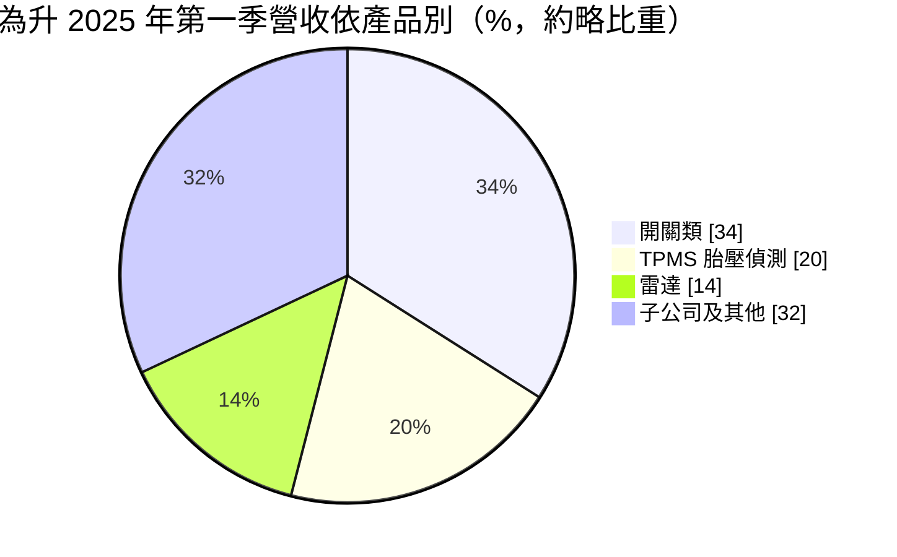
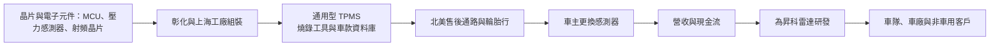
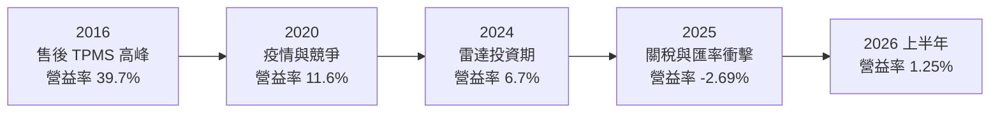
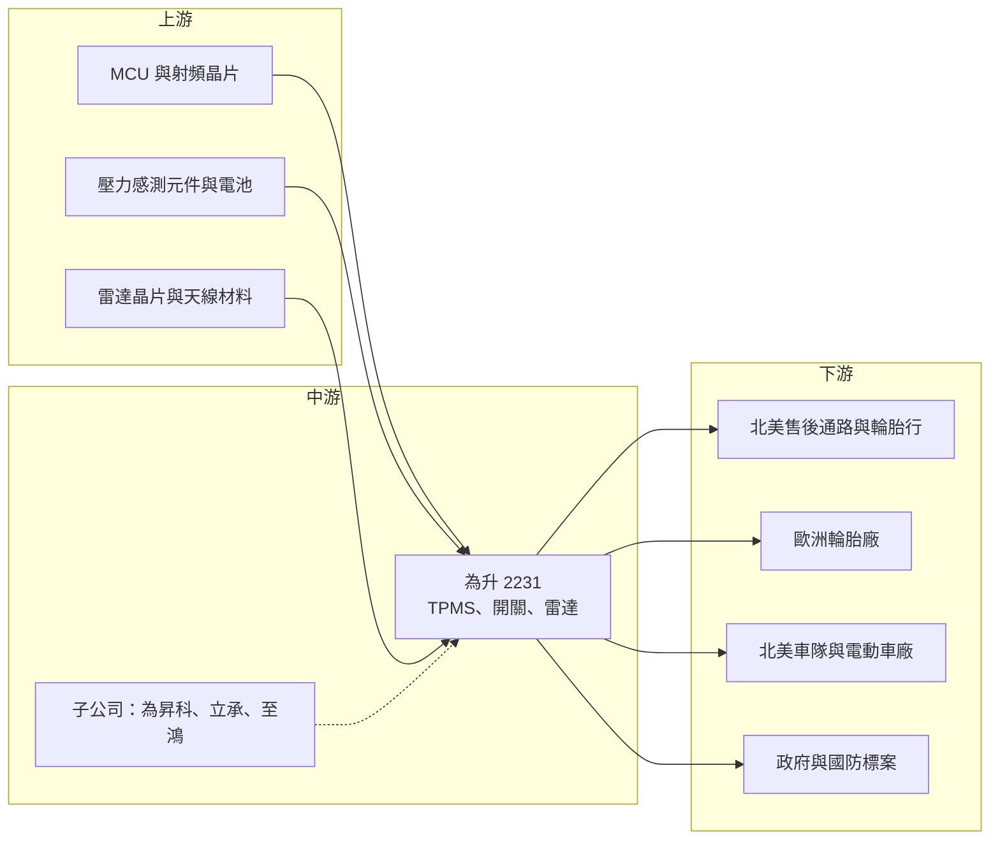

# 2231 為升

> 上市｜[[產業索引-汽車工業|汽車工業]]｜上市（櫃）日期 2010/11/19

# 第一章：企業模式與商業藍圖

> [!info] 撰寫說明
> 本文由 Claude 依公開資料整理，架構比照 [[2330台積電]] 的四章研究，資料截至 2026-10-08。財務數字來源：Goodinfo 年度經營績效頁、富果研究 2025 年 6 月與 12 月法說會整理、證交所開放資料（基本資料、2026 年第二季資產負債與綜合損益、股利）；產業描述為整理性內容，尚未逐條比對原始文件。#待校對

在評估單一個股的長期投資價值時，首要步驟是拆解企業的底層獲利邏輯。本章針對為升電裝（股票代號：2231，以下簡稱為升）的商業模式進行定性分析，說明這家彰化的汽車電子廠，如何靠售後市場的通用型胎壓偵測器建立高獲利，又為什麼在 2020 年之後獲利大幅下滑，以及它押注毫米波雷達的轉型邏輯。

## 一、核心定位：售後市場汽車電子與通用型 TPMS 的領導者

為升成立於 1989 年，總部在彰化，實收資本額約 13.6 億元。公司早期以汽車遙控器、防盜器與電子開關起家，之後切入 [[TPMS]]（胎壓偵測系統），成為全球售後市場通用型胎壓偵測器的領導業者之一。近年再透過子公司為昇科投入 [[毫米波雷達]] 與先進駕駛輔助系統。

為升的核心商業模式建立在 [[AM 售後市場]]。美國自 2007 年起要求新車必須配備胎壓偵測系統，這些感測器裝在輪圈內，電池壽命約 5 至 10 年，車子開到一定年限就需要更換。原廠的感測器各車款規格不同，維修廠若要為每一種車款備貨，庫存壓力很大；[[通用型感測器]]可以透過燒錄程式對應多種車款，讓維修廠只需要備少量品項。為升就是靠這種通用型產品，在北美售後市場取得地位。

依 2025 年 6 月法說會資料，為升本業的通用型 TPMS 約九成銷往售後市場，開關與感測器也以售後市場為主，母公司的原廠配套產品占營收不到一成。

## 二、產品板塊：開關、TPMS、雷達與子公司業務

依法說會資料，2025 年第一季的營收結構大致如下（子公司及其他業務為約三成的概數）：

* **開關與感測器：** 汽車電子開關（例如車窗、後照鏡開關）與各類感測器，以售後市場為主，是為升最穩定的事業，持續貢獻現金流。
* **TPMS 胎壓偵測：** 通用型胎壓偵測器，主要銷往北美售後市場，另有球型 TPMS 出貨給歐洲輪胎廠。美國平均車齡約 13 年，早期安裝的感測器陸續進入更換期，是長期需求的支撐。
* **毫米波雷達：** 由子公司為昇科開發，產品包括[[盲點偵測]]、車內生命偵測等。2024 年底法說會指出毫米波雷達打入北美電動車市場，2025 年底法說會則表示已取得美國大型電商車隊客戶，預計 2026 年下半年開始貢獻營收。
* **子公司及其他：** 包括立承（AI 影像與熱像儀）、至鴻（交通、通訊與國防的系統整合標案）與北美的引擎零件售服子公司。

生產據點方面，彰化廠主要供應北美市場，上海廠生產雷達與 TPMS，主要供應中國與歐洲市場，兩地可以彈性調配產能。

## 三、資本轉化邏輯：通用化設計、軟體燒錄與售後通路

* **通用化的價值：** 通用型 TPMS 的核心不只是硬體，而是對應上千種車款的通訊協定資料庫與燒錄工具。維修廠一旦習慣某家的燒錄工具與軟體，轉換成本就會提高，這是為升在 2016 至 2019 年能維持五成毛利率的原因。
* **售後市場的定價力：** 售後市場的客戶分散，採購量較小，對價格的敏感度低於車廠，因此毛利率可以遠高於原廠配套。
* **研發投資的轉向：** TPMS 市場成熟後，為升把資源投入毫米波雷達，雷達需要大量研發與車廠驗證，在營收規模尚小時會壓低整體獲利率。

## 四、企業長期藍圖

為升的長期策略有三個方向。第一，守住 TPMS 與開關的售後市場現金流，並嘗試切入原廠配套，公司預期 1 至 2 年內看到成果。第二，把毫米波雷達從乘用車延伸到車隊、礦車、攪拌車等特種車輛，以及智慧交通、長照監測等非車用領域，並開發新一代波導天線雷達。第三，整合雷達、TPMS、影像與熱像儀等感測技術，提供系統解決方案；2025 年底法說會也提到與國際國防業者合作，在台灣生產[[反無人機系統]]，參與國防部與海巡署的標案，實際時程取決於政府預算與招標進度。

整體而言，為升正處於「成熟的高毛利本業」與「尚未獲利的新事業」交接的階段。長期價值取決於雷達與系統整合業務能否在 TPMS 進入成熟期之前，接棒成為新的獲利來源。

# 第二章：護城河深度與競爭優勢

本章針對為升的競爭優勢進行分析，說明它在售後 TPMS 市場的護城河從何而來，以及在雷達這個新戰場中面對哪些更強大的對手。

## 一、護城河的核心組成要素

* **車款資料庫與燒錄工具：** 通用型 TPMS 需要對應各車廠、各車款的通訊協定，累積的資料庫與相容性測試需要多年時間建立。維修廠熟悉的工具與軟體形成使用習慣，轉換成本不低。
* **售後通路關係：** 為升長期經營北美售後通路，與零件經銷商、輪胎行建立合作關係。售後市場講求品項齊全與供貨穩定，長期合作的通路不會輕易更換供應商。
* **台灣與上海的雙產地：** 中國的 TPMS 競爭者受美國關稅影響較大，為升可以把對美出貨集中在台灣生產，取得相對的成本優勢。
* **雷達技術的先行投入：** 為昇科在毫米波雷達的天線設計與演算法上已投入多年，並取得北美車隊與電動車客戶，這是新進者短期內不易追上的經驗。

## 二、全球主要競爭對手格局

| 競爭對手 | 國家 | 主要重疊領域 | 與為升的比較 |
|---|---|---|---|
| Sensata（Schrader） | 美國 | TPMS 原廠與售後 | 全球 TPMS 龍頭，原廠配套市占高 |
| 德國馬牌（Continental） | 德國 | TPMS、車用雷達 | 一階大廠，原廠配套與雷達技術領先 |
| Huf | 德國 | TPMS | 原廠與售後市場皆有布局 |
| 保隆科技 | 中國 | TPMS | 成本低，原廠與售後市場積極擴張 |
| Bosch | 德國 | 車用雷達 | 全球車用雷達龍頭 |
| [[3552同致]] | 台灣 | 倒車雷達與車用感測 | 國內同業，以原廠配套為主 |

## 三、優勢轉化：守得住、守不住與觀察重點

* **守得住：** 北美售後通用型 TPMS 的地位與開關類產品的現金流。售後市場的分散特性與資料庫門檻，讓大型一階廠商較難以低價切入，美國車齡老化也長期支撐換裝需求。
* **守不住：** TPMS 的高毛利。為升的毛利率從 2016 年的 54.3% 降到 2025 年的 32.6%，反映售後 TPMS 市場競爭加劇、產品價格下滑，以及雷達等新業務尚未形成規模。原廠配套的雷達市場則由 Bosch、Continental 等巨頭主導，為升只能從利基市場切入。
* **觀察重點：** 第一，北美電商車隊雷達專案在 2026 年下半年起的出貨規模；第二，TPMS 能否打入原廠配套；第三，反無人機與政府標案能否轉化為穩定營收，而不只是一次性的專案。

# 第三章：財務體質與盈利規模

資料日期：2026-10-08。數字取自 Goodinfo 年度經營績效頁、富果研究法說會整理與證交所開放資料，表格是撰寫當時的快照；最新月營收、毛利率、累計 EPS 由自動排程寫在本筆記的屬性欄位（月營收、毛利率、累計EPS 等）。#待校對

財務報表是檢驗護城河是否真實存在的最終標準。本章用十年的三率、ROE 與資本報酬，檢視為升從高獲利到轉型陣痛的變化。

## 一、獲利能力的基石：三率

| 年度 | 營收（新台幣） | [[毛利率]] | [[營業利益率]] | EPS（元） | [[ROE]] |
|---|---|---|---|---|---|
| 2016 | 34.2 億 | 54.3% | 39.7% | 12.14 | 38.5% |
| 2019 | 40.9 億 | 50.6% | 28.8% | 8.00 | 21.8% |
| 2020 | 33.4 億 | 38.1% | 11.6% | 2.03 | 6.18% |
| 2021 | 40.8 億 | 41.0% | 14.5% | 4.23 | 11.9% |
| 2022 | 39.6 億 | 41.5% | 11.4% | 4.70 | 9.53% |
| 2023 | 44.0 億 | 39.8% | 10.4% | 3.20 | 6.40% |
| 2024 | 46.7 億 | 32.9% | 6.70% | 3.37 | 9.56% |
| 2025 | 36.5 億 | 32.6% | -2.69% | -1.63 | -9.05% |
| 2026 上半年 | 14.87 億 | 35.92% | 1.25% | 0.39 | 未查得 |

* **[[毛利率]]：** 十年間毛利率從 54.3% 降到 32.6%，下滑超過 20 個百分點。早期的高毛利來自通用型 TPMS 剛普及時的稀缺性，之後競爭者增加、產品價格下降，加上營收結構中毛利較低的子公司與系統整合業務比重提高。
* **[[營業利益率]]：** 營業利益率的下滑比毛利率更劇烈，從近四成降到 2025 年的虧損，主因是雷達研發與子公司費用持續增加，而新業務的營收還不足以支撐。2025 年第二季又遇到新台幣急升與美中關稅提高，全年轉為營業虧損。
* **2026 年的合併與母公司差異：** 2026 年上半年合併稅後淨損約 0.25 億元，但歸屬母公司淨利約 0.53 億元（證交所開放資料），代表虧損主要出現在有少數股東的子公司，母公司本業已恢復獲利。
* **營收趨勢：** 2021 至 2025 年營收年複合成長率約 -2.7%（推算），2016 至 2024 年則從 34.2 億元成長到 46.7 億元，2025 年的下滑主要是客戶庫存調整與匯率因素。

## 二、[[ROE]]：資本效率

2021 至 2025 年平均 ROE 約 5.7%（推算），與 2016 至 2019 年動輒 20% 至 38% 的水準相比，已經大幅下降。每股淨值從 2019 年的 33.5 元降到 2025 年的 24.77 元。2026 年第二季底總負債約 63.0 億元、權益總計約 43.8 億元，負債比約 59%（證交所開放資料），財務槓桿比過去高，部分來自[[可轉換公司債]]與子公司的資金需求。

## 三、資本支出、自由現金流與股利

為升的資本支出規模不大，主要投入在研發與子公司營運；歷年自由現金流本文未查得。股利方面，Goodinfo 統計為升長期一般平均現金股利約 4.14 元，反映過去高獲利時期的高配息；2025 年度虧損，改以資本公積發放每股 0.5 元現金（證交所股利資料）。從過去的高配息到現在動用資本公積配發，是獲利能力下降最直接的訊號。

## 四、[[ROIC]] 與 [[WACC]]：價值創造利差

**ROIC 推算：** 2025 年營業利益約 -0.98 億元（營收 36.5 億元 × 營業利益率 -2.69%），ROIC 為負值，約 -1.3%（推算，虧損不計稅）。以 2024 年估算，營業利益約 3.13 億元，扣除 20% 稅率後約 2.50 億元；以 2026 年第二季底權益總計約 43.8 億元，加上假設約一半總負債為有息負債（推估，約 31.5 億元），投入資本約 75.3 億元，ROIC 約 3.3%（推算）。2016 年營業利益約 13.6 億元，當年 ROE 高達 38.5%，ROIC 遠高於資金成本（推估）。

**WACC 推算：** 假設台灣 10 年期公債殖利率 1.75%、市場風險溢酬 6%、β 取中小型電子零件股常見值 1.0，股東權益成本約 7.75%。負債成本假設 2.5%，稅後約 2.0%；以帳面價值計，權益約占 58%、負債約占 42%，WACC 約 5.3%（推算）。

**結論：** 為升在 2019 年以前的 ROIC 明顯高於資金成本，是典型的高報酬利基公司；2023 年以後 ROIC 降到資金成本以下，2025 年更轉為負值，代表轉型期間持續毀損經濟價值。雷達與系統整合業務若能在 2026 至 2027 年形成規模，ROIC 才有機會回到資金成本以上。

# 第四章：總體風險與地緣政治

任何企業都無法脫離宏觀環境獨立存在。本章分析為升長期必須面對的地緣政治、產業結構、營運與技術風險。

## 一、地緣政治

* **美國關稅：** 北美是為升最重要的售後市場，美國對台灣與中國的關稅政策直接影響成本與客戶下單。中國競爭者受關稅影響較大，對為升相對有利，但關稅政策反覆也會讓客戶保守進貨。
* **中國產能：** 上海廠供應中國與歐洲市場，兩岸關係與中國經濟變化會影響上海廠的營運。
* **國防與政府標案：** 反無人機與交通系統整合業務高度依賴政府預算與政策方向，政策變化會影響訂單時程。

## 二、產業週期與市場結構

* **售後市場的庫存週期：** 售後通路會依景氣與關稅前景調整庫存，造成為升出貨的短期波動。法說會提到售後市場庫存預計在 2026 年初出清。
* **TPMS 市場成熟：** 美國強制安裝 TPMS 已近二十年，市場已進入成熟期，價格競爭持續，長期毛利率下滑壓力存在。
* **雷達市場的巨頭競爭：** 車用雷達的原廠配套市場由 Bosch、Continental 等一階大廠主導，中小型廠商只能從車隊、特種車輛與非車用等利基市場切入。

## 三、營運環境的隱性風險

* **匯率：** 營收以美元為主，2025 年第二季新台幣急升直接造成虧損，顯示獲利對匯率高度敏感。
* **子公司虧損：** 為昇科等子公司仍處於投資期，虧損會持續拖累合併獲利。
* **專案營收的不確定性：** 政府標案與系統整合的營收認列集中在下半年，季度獲利波動大；客戶與合作夥伴多受保密協議限制，外界難以驗證進度。
* **可轉換公司債：** 公司過去發行可轉換公司債，到期時的償還或轉換可能影響資金與股本。

## 四、科技與法規演進

* **原廠直裝感測器的整合：** 若未來車廠把胎壓偵測整合進其他車身感測系統（例如以輪速訊號間接偵測胎壓），獨立的 TPMS 感測器需求可能下降。
* **車內生命偵測法規：** 歐洲新車安全評鑑對兒童遺留車內偵測的要求，可能帶動車內雷達需求，是為升雷達業務的潛在機會。
* **AI 與感測融合：** 雷達、影像與熱像儀的融合需要 AI 演算法，技術迭代快速，研發投入若跟不上，產品可能很快失去競爭力。

# 專有名詞解析

## 半導體

- **[[MCU]]**：微控制器，整合處理器、記憶體與周邊介面的小型晶片，負責感測器與汽車電子的控制運算。

## 應用

- **[[TPMS]]**：胎壓偵測系統，以裝在輪圈內的感測器監測輪胎氣壓，美國自 2007 年起強制新車配備。
- **[[毫米波雷達]]**：以 30 至 300 GHz 頻段電磁波偵測物體距離與速度的感測器，不受光線與天候影響，用於 ADAS。
- **[[ADAS]]**：先進駕駛輔助系統，例如盲點偵測、自動緊急煞車，以雷達與攝影機感測車輛周邊。
- **[[盲點偵測]]**：以雷達偵測駕駛視線死角的來車並發出警示，是車用雷達最常見的應用之一。
- **[[反無人機系統]]**：以雷達、光電偵測與干擾設備發現並阻止無人機入侵，用於國防與重要設施防護。

## 金融

- **[[可轉換公司債]]**：可依約定價格轉換成公司股票的債券，轉換後會稀釋原股東持股。
- **[[毛利率]]**：營業毛利占營收的比例，反映產品定價能力與生產成本控制。
- **[[ROE]]**：股東權益報酬率，稅後淨利除以股東權益，衡量公司運用股東資金的效率。
- **[[ROIC]]**：投入資本報酬率，稅後營業利益除以股東權益與有息負債的合計，衡量本業對所有資金提供者的報酬。
- **[[WACC]]**：加權平均資金成本，依股東權益與負債的比重加權計算的資金成本，ROIC 高於它才代表創造價值。

## 產業

- **[[AM 售後市場]]**：汽車出廠後的維修與零件更換市場，需求來自既有車輛，與新車銷售的相關性較低。
- **[[OEM]]**：原廠委託製造或原廠配套，零件直接供應車廠裝在新車上，量大但價格壓力較大。
- **[[通用型感測器]]**：透過燒錄程式可對應多種車款的售後 TPMS 感測器，讓維修廠以少量品項服務多數車款。

# 核心供應鏈

## 1. 上游：電子元件
- 微控制器與射頻晶片：國際車用晶片廠（個別供應商本文未查得）
- 壓力感測元件與鈕扣電池

## 2. 中游：為升本身與子公司
- 為昇科：毫米波雷達與 AI 演算法
- 立承：AI 影像、熱像儀，具美國 NDAA 認證的系統
- 至鴻：交通、通訊與國防系統整合

## 3. 下游：客戶
- 北美汽車售後零件經銷商與輪胎行
- 歐洲知名輪胎廠（球型 TPMS）
- 美國大型電商車隊、北美電動車廠
- 國防部、海巡署與地方政府標案

## 4. 同業
- 台灣：[[3552同致]]
- 國際：Sensata（Schrader）、德國馬牌、Huf、保隆科技、Bosch

## 最新新聞
<!-- news:start -->
<!-- news:end -->

## 相關連結
- [公開資訊觀測站](https://mopsov.twse.com.tw/mops/web/t05st03?step=1&firstin=1&co_id=2231)
- [Goodinfo](https://goodinfo.tw/tw/StockDetail.asp?STOCK_ID=2231)
- [Yahoo 股市](https://tw.stock.yahoo.com/quote/2231)
- [鉅亨網新聞](https://www.cnyes.com/twstock/2231/news)
