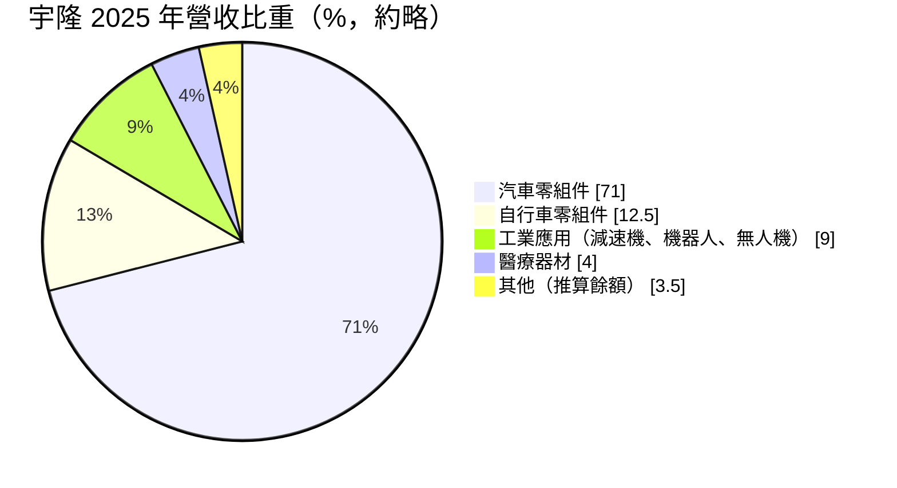
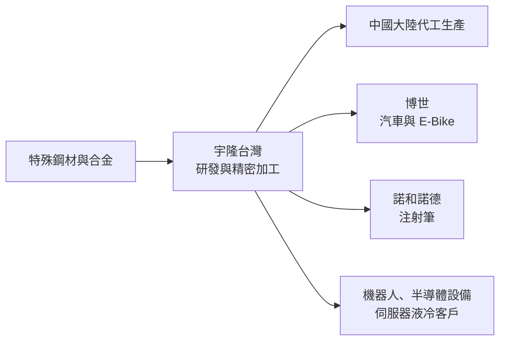
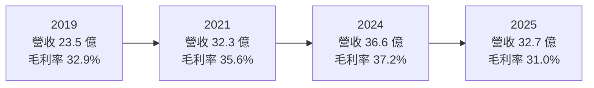
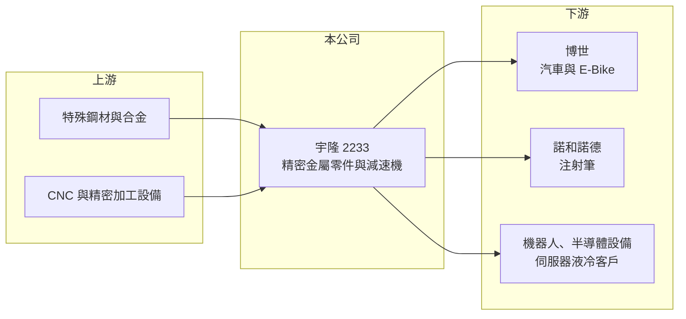

# 2233 宇隆

> 上市｜[[產業索引-汽車工業|汽車工業]]｜上市（櫃）日期 2019/09/17

# 第一章：企業模式與商業藍圖

> [!info] 撰寫說明
> 本文由 Claude 依公開資料整理，架構比照 [[2330台積電]] 的四章研究，資料截至 2026-10-08。財務數字來源：Goodinfo 台灣股市資訊網年度經營績效、富果研究 2025 年 6 月 27 日法說會整理、證交所開放資料（本筆記 _data 快照）；產業描述為整理性內容，尚未逐條比對原始文件。#待校對

在評估單一個股的長期投資價值時，首要步驟是拆解企業的底層獲利邏輯。本章針對宇隆科技（股票代號：2233，以下簡稱宇隆）的商業模式進行定性分析，說明這家台中的精密金屬零件廠，如何以博世（Bosch）的汽車零件訂單建立高毛利基礎，並把精密加工能力延伸到醫療、電動自行車、減速機與 AI 伺服器液冷接頭。

## 一、核心定位：國際大廠的精密金屬零件供應商

宇隆成立於 1987 年，總部在台中梧棲，2019 年上市，專做高精度的金屬切削與加工零件。依 2025 年 6 月法說會，最大客戶是德國博世，宇隆供應其汽車零組件（用於內燃機與混合動力車款）以及電動自行車（E-Bike）後驅輪轂馬達零件；醫療零件則供應丹麥諾和諾德（Novo Nordisk）的胰島素注射筆關鍵零組件。

宇隆的商業模式是「高精度、中小量、多品項」的代工製造。精密零件需要嚴格的尺寸公差與一致性，客戶在驗證後通常長期採購，因此宇隆毛利率長期在 30% 以上，明顯高於一般汽車零件廠。這個毛利水準證明它不是單純比價的加工廠，而是有技術含量的精密零件供應商。

## 二、產品板塊

依 2025 年法說會整理的營收比重（汽車比重文中有 70% 與 72% 兩種數字，此處取 71%；其他為推算餘額）：

* **汽車零組件：** 內燃機與混合動力車款的精密零件，主要客戶為博世，是營收與獲利的基礎。
* **自行車零組件：** 避震器、花鼓與新開發的 E-Bike 馬達零件，後驅輪轂馬達零件 2025 年 9 月起量產。
* **工業應用：** 諧波、行星、微型行星減速機與行星絲桿，鎖定[[人形機器人]]關節與靈巧手；諧波減速機已在美國申請發明專利。
* **醫療器材：** 胰島素注射筆零件，2025 年第一季因客戶去化庫存，比重從前一年同期約 9% 降到約 4%。
* **AI 伺服器液冷[[快接頭]]：** 預計 2025 年第四季起貢獻營收。

## 三、資本轉化邏輯（營運模式）

* **核心技術留在台灣：** 研發與關鍵製程在台灣，中國大陸工廠採代工模式，核心技術不外流。公司也評估在東南亞設立生產基地，回應客戶的供應鏈多元化要求。
* **匯率與降價機制：** 美元營收約占三成，與博世訂有匯率波動超過 5% 可啟動價格協商的機制；但客戶每年初會要求年度降價，影響第一季毛利率。這是汽車零件產業常見的定價模式。

## 四、企業長期藍圖

宇隆的長期目標是降低對汽車與單一客戶的依賴：三年內把汽車營收比重從約七成降到 50% 至 55%，工業應用與 E-Bike 合計提升到約 45%，自行車業務兩年內目標比重 18% 至 19%。減速機、人形機器人與伺服器液冷都是這個策略的延伸。經營層的資本配置維持穩定配息，2025 年度現金股利 4 元（證交所開放資料），配息率約六成（以 EPS 6.7 元推算）。

# 第二章：護城河深度與競爭優勢

在長期價值投資中，「護城河」指企業抵禦競爭、維持超額利潤的保護機制。本章分析宇隆在精密金屬零件市場的護城河、主要對手與可守住的範圍。

## 一、護城河的核心組成要素

* **1. 國際大廠的長期驗證：** 博世與諾和諾德都是對品質要求極嚴格的客戶，汽車與醫療零件的驗證週期長、轉換成本高。宇隆能長期供應這兩家公司，本身就是技術能力的證明。
* **2. 高精度加工能力：** 微型行星減速機最小約 10mm、注射筆零件的精度要求，都需要累積多年的製程經驗，這也是毛利率能維持三成以上的原因。
* **3. 客戶集中的雙面性：** 主要營收來自少數大客戶，關係穩固是優勢，但客戶的策略調整（降價、庫存調整、轉單）也會直接衝擊宇隆。

## 二、全球主要競爭對手格局

| 對手 | 定位 | 對宇隆的威脅 |
|---|---|---|
| [[4551智伸科]] | 精密金屬零件，汽車與醫療客戶 | 業務模式最相近的台灣同業 |
| [[4583台灣精銳]]、[[2049上銀]] | 減速機與傳動元件 | 機器人減速機領域的競爭者 |
| 日本 Harmonic Drive、中國減速機廠 | 諧波減速機龍頭與低價競爭者 | 機器人減速機市場的主要對手 |
| 歐洲與中國精密加工廠 | 汽車與醫療零件代工 | 爭取博世等客戶的訂單 |

## 三、優勢轉化：守得住／守不住／觀察重點

* **守得住：** 已量產的博世汽車與 E-Bike 零件、諾和諾德醫療零件。驗證門檻高，客戶不易更換。
* **守不住：** 內燃機相關零件的長期需求會隨電動化下降；減速機市場則面臨日本龍頭與中國低價廠商夾擊。
* **觀察重點：** 長期可以看汽車營收比重是否如期降到五成多、減速機能否取得人形機器人量產訂單，以及毛利率能否在多元化過程中維持 30% 上下。

# 第三章：財務體質與盈利規模

資料日期：2026-10-08。數字取自 Goodinfo 年度經營績效、富果法說會整理與證交所開放資料快照，表格是撰寫當時的快照；最新月營收、毛利率、累計 EPS 由自動排程寫在本筆記的屬性欄位（月營收、毛利率、累計EPS 等）。#待校對

財務報表是檢驗護城河是否真實存在的最終標準。本章用多年度的三率、ROE 與資本報酬，檢視宇隆的獲利品質。

## 一、獲利能力的基石：三率

| 年度 | 營收（新台幣） | [[毛利率]] | [[營業利益率]] | EPS（元） | [[ROE]] |
|---|---|---|---|---|---|
| 2019 | 23.5 億 | 32.9% | 13.6% | 5.07 | 11.0% |
| 2020 | 25.4 億 | 32.4% | 16.0% | 6.23 | 13.0% |
| 2021 | 32.3 億 | 35.6% | 20.1% | 9.01 | 17.7% |
| 2022 | 33.5 億 | 32.9% | 16.3% | 10.32 | 18.6% |
| 2023 | 33.4 億 | 32.7% | 15.9% | 8.86 | 15.1% |
| 2024 | 36.6 億 | 37.2% | 18.8% | 10.96 | 17.2% |
| 2025 | 32.7 億 | 31.0% | 12.6% | 6.70 | 9.97% |

* **[[毛利率]]：** 七年間穩定在 31% 至 37%，是汽車零件股中少見的高水準。2025 年降到 31%，原因包括醫療客戶去化庫存、年度降價與上半年稼動率約六成（法說會）。2026 年上半年毛利率 29.6%（證交所開放資料）。
* **[[營業利益率]]：** 長期在 13% 至 20%，2025 年降到 12.6%，2026 年上半年約 12%。新產品開發與研發費用增加，短期壓抑利潤率。
* **長期指標：** 2020 至 2025 年營收年複合成長率約 5.2%（推算）；2021 至 2025 年平均 ROE 約 15.7%（推算）。

## 二、[[ROE]]：資本效率

宇隆 2026 年第二季底負債約 32.3 億元、權益約 41.5 億元，負債比約 44%（證交所開放資料）。2021 至 2024 年 ROE 維持在 15% 至 19%，在精密零件廠中屬於優秀水準，主要來自高毛利率而非財務槓桿。2025 年 ROE 降到約 10%，反映營收與稼動率下滑。

## 三、資本支出與自由現金流

* **[[CapEx]]：** 逐年數字未查得。減速機、液冷接頭與東南亞產能評估，可能讓資本支出維持在較高水準。
* **[[自由現金流]]：** 逐年數字未查得。以穩定獲利與約六成配息率推估，多數年度自由現金流為正（推估）。

## 四、[[ROIC]] 與 [[WACC]]：價值創造利差

有息負債明細未查得，以權益加非流動負債近似投入資本。2024 年營業利益約 6.88 億元（營收 36.6 億元 × 18.8%），稅後約 5.5 億元；以約 58 億元投入資本估算，ROIC 約 9.5%（推算）。2025 年營業利益約 4.12 億元，稅後約 3.3 億元，投入資本以 2026 年第二季底權益 41.5 億元加非流動負債 18.3 億元，約 59.8 億元計算，ROIC 約 5.5%（推算）。

WACC 以 CAPM 推估：台灣 10 年期公債約 1.5% 至 2%，市場風險溢酬約 6%，β 未查得，精密零件股採 1.0 至 1.2（假設），權益成本約 7.5% 至 9.2%；稅前負債成本假設 2.5%、稅後 2%，負債約占投入資本三成，WACC 約 5.9% 至 7.0%（推算）。

兩者比較，宇隆在 2021 至 2024 年 ROIC 明顯高於 WACC，是長期創造價值的精密零件廠；2025 年因稼動率下滑，ROIC 回落到資金成本附近。多元化產品若能把稼動率拉回八成以上，ROIC 有機會回到過去水準。

# 第四章：總體風險與地緣政治

任何企業都無法脫離宏觀環境獨立存在。本章分析宇隆長期必須面對的客戶、產業與營運風險。

## 一、地緣政治與貿易

* **供應鏈多元化要求：** 歐美客戶要求供應商分散產地，宇隆在中國大陸的代工產能可能需要部分移往東南亞，增加資本支出與管理成本。
* **美國關稅：** 美元營收約三成，美國關稅政策會影響客戶的採購地選擇。

## 二、產業週期與市場結構

* **客戶集中：** 博世是最大客戶，博世的產品策略、降價要求或轉單，都會直接影響宇隆的營收與毛利率。
* **內燃機零件的長期萎縮：** 汽車零組件主要用於內燃機與混合動力車，電動化會讓部分零件需求逐步下降，這是宇隆積極多元化的根本原因。
* **醫療客戶庫存循環：** 注射筆零件受減重藥物需求影響，客戶庫存調整會造成出貨起伏。

## 三、營運環境的隱性風險

* **年度降價：** 汽車零件客戶每年要求降價，宇隆必須靠製程改善抵銷，否則毛利率會逐年下滑。
* **匯率：** 新台幣升值壓縮毛利，雖有價格協商機制，但有門檻與時間落差。
* **新事業執行：** 減速機與人形機器人市場仍在早期，量產時程不確定。

## 四、科技或法規演進

* **人形機器人與自動化：** 若人形機器人進入量產，精密減速機需求會大幅增加，是長期最大的選擇權。
* **醫療法規：** 醫療零件需符合嚴格的品質系統規範，法規變化會影響認證成本。

# 專有名詞解析

## 應用

- **[[人形機器人]]**：外型與動作模仿人類的機器人，關節需要大量精密減速機與致動器。

## 金融

- **[[ROIC]]**：投入資本報酬率，衡量公司用股東與債權人資金創造本業稅後利潤的效率。
- **[[WACC]]**：加權平均資金成本，依股權與負債比重加權的資金成本，是 ROIC 要超過的門檻。

## 產業

- **[[快接頭]]**：液冷系統中可快速插拔且不漏液的管路接頭，是 AI 伺服器液冷的關鍵零件。
- **[[諧波減速機]]**：利用彈性齒輪變形傳動的減速機，體積小、精度高，常用於機器人關節。

# 核心供應鏈

## 1. 上游：材料與設備
- 特殊鋼材與合金、CNC 與精密加工設備（具體供應商未查得）

## 2. 中游：宇隆本身
- 台灣研發與加工、中國大陸代工生產，評估東南亞據點

## 3. 下游：客戶
- 德國博世（汽車零組件、E-Bike 馬達零件）
- 丹麥諾和諾德（胰島素注射筆零件）
- 美國人形機器人客戶、半導體晶圓搬運設備客戶、高階咖啡研磨機供應鏈（未具名）

## 4. 同業
- 台灣：[[4551智伸科]]、[[4583台灣精銳]]、[[2049上銀]]
- 海外：Harmonic Drive、中國減速機廠

## 最新新聞
<!-- news:start -->
<!-- news:end -->

## 相關連結
- [公開資訊觀測站](https://mopsov.twse.com.tw/mops/web/t05st03?step=1&firstin=1&co_id=2233)
- [Goodinfo](https://goodinfo.tw/tw/StockDetail.asp?STOCK_ID=2233)
- [Yahoo 股市](https://tw.stock.yahoo.com/quote/2233)
- [鉅亨網新聞](https://www.cnyes.com/twstock/2233/news)
