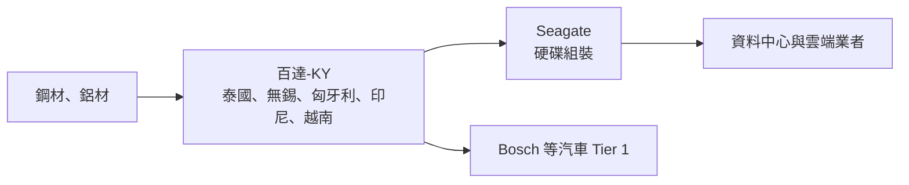
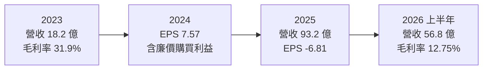
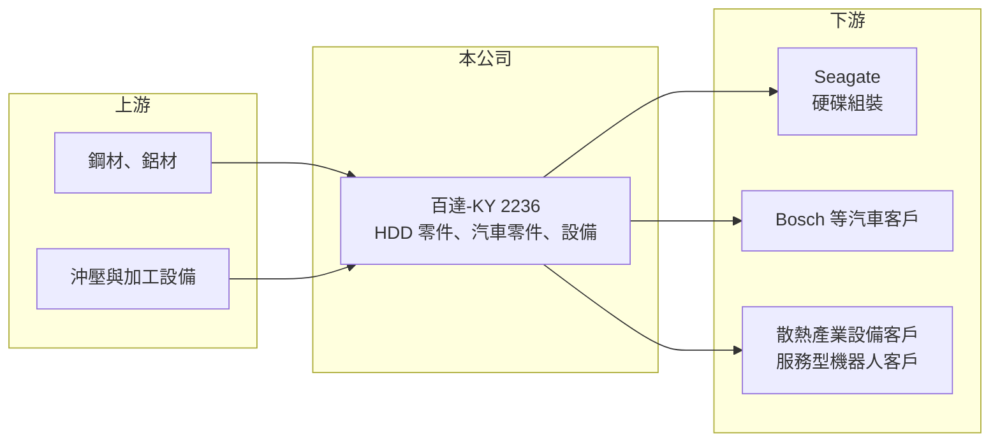

# 2236 百達-KY

> 上市｜[[產業索引-汽車工業|汽車工業]]｜上市（櫃）日期 2015/06/03

# 第一章：企業模式與商業藍圖

> [!info] 撰寫說明
> 本文由 Claude 依公開資料整理，架構比照 [[2330台積電]] 的四章研究，資料截至 2026-10-08。財務數字來源：Goodinfo 台灣股市資訊網年度經營績效、富果研究 2025 年 12 月 26 日法說會整理、證交所開放資料（本筆記 _data 快照）；併購前的業務細節公開資料有限，部分標「待校對」。#待校對

在評估單一個股的長期投資價值時，首要步驟是拆解企業的底層獲利邏輯。本章針對百達精密（股票代號：2236，以下簡稱百達-KY）的商業模式進行定性分析，說明這家原本以汽車零件與金屬成型設備為主的小型 KY 公司，如何透過併購新加坡上市的大道工業（BIGL），在短時間內轉變為以硬碟零組件為主、營收規模放大數倍的公司，以及併購整合帶來的財務代價。

## 一、核心定位：以併購轉型為硬碟零組件供應商

百達-KY 於 2011 年在開曼群島設立，2015 年在台灣上市，屬於 [[KY股]]。併購前的業務包括汽車零部件、智能設備（金屬沖壓成型機械）與服務型機器人。2023 年底，公司完成對新加坡上市公司大道工業（BIGL）的收購，2024 年 4 月持股達 96.2%。BIGL 的主力是硬碟（[[HDD]]）零部件，主要客戶為 Seagate，主要生產基地在泰國。

這次併購徹底改變了百達-KY 的事業結構。依 2025 年法說會，HDD 零部件占總營收超過 75%，汽車零部件規模較小但淨利率良好。換句話說，今天的百達-KY 是一家「以硬碟零件為主體、汽車零件與設備為輔」的精密金屬零件集團，它的長期命運很大程度取決於硬碟產業與單一大客戶。

## 二、產品板塊

公司揭露 HDD 占比超過 75%，其餘板塊比重未查得，以下為定性分類，不畫圓餅圖。

* **硬碟零部件：** 供應 Seagate 的硬碟金屬零件，以泰國為主要生產基地。資料中心的高容量硬碟需求是這個板塊的長期動能，公司看好 2026 至 2027 年高階儲存需求成長。
* **汽車零部件：** 生產據點在中國無錫、匈牙利與印尼，匈牙利廠以 Bosch 為主要客戶，正在拓展其他歐洲客戶。
* **智能設備：** 金屬沖壓成型設備，2025 年接獲散熱產業詢價。
* **服務型機器人：** 業務涵蓋新加坡與台灣，正進行「[[非紅供應鏈]]」認證以進入台灣公部門與敏感場域。

## 三、資本轉化邏輯（營運模式）

* **槓桿併購：** 收購 BIGL 的資金中，約 6,800 萬美元來自銀行借款（法說會），使公司負債大幅增加。2026 年第二季底負債約 60.4 億元、權益約 24.1 億元，負債比約 71%（證交所開放資料）。
* **產能重整：** 深圳廠生產重心移往泰國，公司出售深圳子公司（預計 2026 年第一季完成），並縮減越南通訊產品產能、把無錫部分沖壓訂單移往越南。這些調整的目的是把資本集中到獲利較好的產線。

## 四、企業長期藍圖

百達-KY 的長期方向是在完成併購整合後，以 HDD 零件為現金流主體，搭配汽車零件的歐洲客戶擴張，以及機器人與設備業務的在地化。管理層形容 2025 年為轉型磨合期。資本配置上，公司優先處分非核心資產、降低借款，2025 年下半年度董事會擬議現金股利 0.4 元並配股 0.25 元（證交所開放資料）。這次併購是否成功，要看未來三到五年能否把營收放大轉化為穩定的獲利與現金流。

# 第二章：護城河深度與競爭優勢

在長期價值投資中，「護城河」指企業抵禦競爭、維持超額利潤的保護機制。本章分析百達-KY 在硬碟零件與汽車零件市場的護城河、主要對手與可守住的範圍。

## 一、護城河的核心組成要素

* **1. 硬碟大廠的認證供應地位：** 全球硬碟市場只剩少數廠商，零件供應商需要長期認證，BIGL 與 Seagate 的長期合作關係，是新進者很難切入的門檻。
* **2. 泰國硬碟產業聚落：** 泰國是全球硬碟生產重鎮，在地生產能就近服務客戶、降低物流與交期風險。
* **3. 客戶集中的脆弱性：** HDD 營收集中在 Seagate，議價力偏向客戶；這種護城河是「被選中」而非「不可取代」，客戶的轉單或降價都會直接衝擊獲利。

## 二、全球主要競爭對手格局

| 對手 | 定位 | 對百達-KY 的威脅 |
|---|---|---|
| 日本與東南亞硬碟零件廠（如 NHK Spring、Nidec 相關事業） | 硬碟精密零件 | 在同一批硬碟大廠爭取份額 |
| 中國精密沖壓廠 | 低成本金屬零件 | 在汽車與通訊零件領域以價格競爭 |
| 歐洲汽車零件廠 | 在地服務 Bosch 等客戶 | 匈牙利廠拓展客戶時的競爭者 |

## 三、優勢轉化：守得住／守不住／觀察重點

* **守得住：** 已認證的硬碟零件訂單，只要資料中心對高容量硬碟需求持續，泰國產能就有穩定出貨。
* **守不住：** 越南通訊產品與部分低毛利沖壓件，已在縮減中。
* **觀察重點：** 長期可以看三件事：毛利率能否從 2025 年第三季的 11.5% 回到 2024 年同期的 25% 水準、借款能否逐年下降，以及處分深圳廠後的利益是否用於改善財務結構。

# 第三章：財務體質與盈利規模

資料日期：2026-10-08。數字取自 Goodinfo 年度經營績效、富果法說會整理與證交所開放資料快照，表格是撰寫當時的快照；最新月營收、毛利率、累計 EPS 由自動排程寫在本筆記的屬性欄位（月營收、毛利率、累計EPS 等）。#待校對

財務報表是檢驗護城河是否真實存在的最終標準。本章用多年度的三率、ROE 與資本報酬，檢視百達-KY 併購前後的變化。

## 一、獲利能力的基石：三率

| 年度 | 營收（新台幣） | [[毛利率]] | [[營業利益率]] | EPS（元） | [[ROE]] |
|---|---|---|---|---|---|
| 2019 | 18.0 億 | 24.4% | 6.29% | 0.88 | 3.90% |
| 2020 | 11.8 億 | 24.8% | 4.61% | 0.69 | 2.08% |
| 2021 | 13.7 億 | 26.0% | 6.56% | 1.47 | 5.57% |
| 2022 | 14.2 億 | 27.8% | 7.96% | 1.64 | 6.05% |
| 2023 | 18.2 億 | 31.9% | 9.95% | 2.99 | 9.33% |
| 2024 | 17.8 億 | 19.3% | -17.1% | 7.57 | 17.2% |
| 2025 | 93.2 億 | 10.7% | -0.24% | -6.81 | -18.6% |

註：Goodinfo 顯示 2024 年營收 17.8 億元、2025 年 93.2 億元，BIGL 營收併入合併報表的起始時點與上述持股時程不完全一致，待以年報校對。

* **[[毛利率]]：** 併購前的 2019 至 2023 年在 24% 至 32%；併入 HDD 業務後降到 2025 年的 10.7%，2026 年上半年 12.75%（證交所開放資料）。毛利率下降一方面是業務結構改變，另一方面是收購時資產重估增值，使折舊費用大增。
* **2024 年 EPS 7.57 元的性質：** 2024 年營業利益率 -17.1%，EPS 卻達 7.57 元，主因是收購時認列的[[廉價購買利益]]，屬於[[一次性收益]]（法說會說明此利益與資產重估有關），不代表本業獲利能力。
* **2025 年虧損原因：** 併購後的文化整合、資產重估造成的折舊增加、2025 年第三季約 288 萬新幣匯損（美元借款部位），以及遞延所得稅的一次性調整。2025 年前三季歸屬母公司淨損約 1.43 億元。
* **長期指標：** 2020 至 2025 年營收年複合成長率約 51%（推算，主要來自併購，不具可比性）；2021 至 2025 年平均 ROE 約 3.9%（推算）。

## 二、[[ROE]]：資本效率

併購前百達-KY 的 ROE 只有 2% 至 9%；2024 年的 17.2% 來自一次性利益，2025 年則為 -18.6%。2026 年上半年營業利益 2.13 億元，但業外損失 1.11 億元，歸屬母公司淨利僅約 0.19 億元（證交所開放資料），說明高負債帶來的利息與匯兌成本正在吃掉本業獲利。

## 三、資本支出與自由現金流

* **[[CapEx]]：** 逐年數字未查得。併購後以整合與產能調整為主，並透過處分深圳廠回收資金。
* **[[自由現金流]]：** 逐年數字未查得。高負債期間，自由現金流是否足以償還併購借款，是最重要的財務觀察點。

## 四、[[ROIC]] 與 [[WACC]]：價值創造利差

有息負債明細未查得，以權益加非流動負債近似投入資本，但流動負債 39.6 億元中可能也有短期借款，實際投入資本可能更高。2025 年營業利益約 -0.22 億元（營收 93.2 億元 × -0.24%），ROIC 約為零或負值（推算）。以 2026 年上半年營業利益 2.13 億元年化，約 4.25 億元，稅後約 3.4 億元，投入資本以權益 24.1 億元加非流動負債 20.8 億元，約 44.9 億元計算，ROIC 約 7.6%（推算，若計入短期借款會更低）。

WACC 以 CAPM 推估：台灣 10 年期公債約 1.5% 至 2%，市場風險溢酬約 6%，β 未查得，考量高財務槓桿與整合風險，採 1.2 至 1.4（假設），權益成本約 8.7% 至 10.4%；稅前負債成本假設 4%（美元借款，假設）、稅後 3.2%，負債約占投入資本五成，WACC 約 6% 至 7%（推算）。

兩者比較，2025 年 ROIC 明顯低於 WACC，2026 年上半年本業回升後，ROIC 約在資金成本附近。這次併購能否創造價值，關鍵在於毛利率能否回升、借款能否下降，讓本業報酬不再被財務成本吃掉。

# 第四章：總體風險與地緣政治

任何企業都無法脫離宏觀環境獨立存在。本章分析百達-KY 長期必須面對的客戶、財務與營運風險。

## 一、地緣政治與貿易

* **多國營運：** 生產據點分散在泰國、中國、越南、匈牙利與印尼，雖然有助於分散關稅風險，但也增加管理複雜度與各國法規、匯率風險。
* **非紅供應鏈要求：** 機器人業務需要通過非紅供應鏈認證，才能進入台灣公部門市場，代表地緣政治會直接影響可服務的客戶範圍。

## 二、產業週期與市場結構

* **硬碟產業集中：** 全球硬碟廠只剩少數幾家，HDD 營收集中在 Seagate，客戶的出貨量、技術路線與議價都會直接影響百達-KY。
* **儲存技術替代：** 固態硬碟（SSD）持續侵蝕消費性硬碟市場，硬碟需求集中在資料中心高容量產品，零件規格與數量會跟著改變。

## 三、營運環境的隱性風險

* **高財務槓桿：** 負債比約 71%，美元借款帶來利息與匯兌風險，2025 年第三季即認列約 288 萬新幣匯損。
* **併購整合：** 跨國企業文化整合需要時間，管理層自己形容 2025 年為磨合期，整合不順會拖累效率。
* **資產處分執行：** 深圳廠處分若延後或價格不如預期，資金回收與降低負債的計畫會受影響。

## 四、科技或法規演進

* **高容量硬碟技術：** 熱輔助磁記錄（HAMR）等新技術提高單顆硬碟容量，零件設計會改變，供應商需要配合客戶開發。
* **會計與稅務：** KY 公司跨多國營運，遞延所得稅與國際稅制變化（如全球最低稅負）可能造成一次性調整。

# 專有名詞解析

## 金融

- **[[廉價購買利益]]**：併購價格低於被併公司可辨認淨資產公允價值時，差額一次認列為利益，屬非經常性收益。
- **[[一次性收益]]**：不會重複發生的收益，例如處分資產或併購利益，分析長期獲利時應排除。
- **[[KY股]]**：註冊在海外、在台灣上市櫃的外國企業，股票代號後加 KY，營運多在海外。
- **[[ROIC]]**：投入資本報酬率，衡量公司用股東與債權人資金創造本業稅後利潤的效率。
- **[[WACC]]**：加權平均資金成本，依股權與負債比重加權的資金成本，是 ROIC 要超過的門檻。

## 產業

- **[[HDD]]**：傳統硬碟，以磁碟片儲存資料，單位容量成本低，主要用於資料中心的大容量儲存。
- **[[非紅供應鏈]]**：排除中國大陸製造或零件的供應鏈，常見於政府、國防與敏感場域的採購要求。

# 核心供應鏈

## 1. 上游：材料與設備
- 鋼材、鋁材與沖壓加工設備（具體供應商未查得）

## 2. 中游：百達-KY 本身
- 子公司大道工業（BIGL，2024 年 4 月持股 96.2%）：泰國 HDD 零件
- 汽車零件：中國無錫、匈牙利、印尼；越南（BVN）通訊產品縮減中；深圳廠處分中

## 3. 下游：客戶
- Seagate（HDD）
- Bosch（匈牙利廠汽車零件）
- 散熱產業（設備詢價）、新加坡與台灣服務型機器人客戶

## 4. 同業
- 台灣：[[4551智伸科]]、[[2233宇隆]]（精密金屬零件）
- 海外：日本與東南亞硬碟零件廠、中國精密沖壓廠

## 最新新聞
<!-- news:start（自動產生，請勿手動編輯此範圍） -->
- 2026-10-07 🏛️ 重訊 15:06｜代重要子公司 BIGL Technologies (Thailand) Co., Ltd. 公告發放股利決議｜[觀測站](https://mops.twse.com.tw/mops/#/web/t05st01)

完整紀錄：[[2236百達-KY 新聞]]
<!-- news:end -->

## 相關連結
- [公開資訊觀測站](https://mopsov.twse.com.tw/mops/web/t05st03?step=1&firstin=1&co_id=2236)
- [Goodinfo](https://goodinfo.tw/tw/StockDetail.asp?STOCK_ID=2236)
- [Yahoo 股市](https://tw.stock.yahoo.com/quote/2236)
- [鉅亨網新聞](https://www.cnyes.com/twstock/2236/news)
