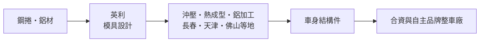
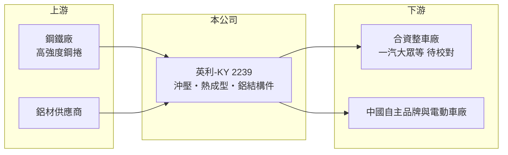

# 2239 英利-KY

> 上市｜[[產業索引-汽車工業|汽車工業]]｜上市（櫃）日期 2016/01/27

# 第一章：企業模式與商業藍圖

> [!info] 撰寫說明
> 本文由 Claude 依公開資料整理，架構比照 [[2330台積電]] 的四章研究，資料截至 2026-10-08。財務數字來源：Goodinfo 台灣股市資訊網年度經營績效、證交所開放資料（本筆記 _data 快照）；業務與據點參考 Goodinfo 基本資料。客戶名單、陸股子公司等部分憑既有知識整理並標「待校對」。公司未揭露產品別營收比重，公開資料有限。#待校對

在評估單一個股的長期投資價值時，首要步驟是拆解企業的底層獲利邏輯。本章說明英利-KY（股票代號：2239，以下簡稱英利）如何以中國東北為基地，替整車廠生產車身結構件，以及這種模式為何在中國車市價格戰中承受壓力。

## 一、核心定位：在中國替整車廠做車身結構件

英利是開曼註冊、在台上市的控股公司，2015 年設立、2016 年上市，營運主體在中國。依 Goodinfo 基本資料，主要業務是汽車零部件、[[沖壓]]件與[[熱成型]]件的製造，以及模具設計。子公司分布在長春、佛山、天津、寧波、青島與台州，長春的據點還包括鋁業公司，代表產品已從鋼製件延伸到鋁製結構件。

* **車身結構件：** 車門防撞樑、保險桿骨架、座椅骨架這類安全結構件，需要高強度鋼與精準的沖壓模具。這類零件與車型設計綁定，一旦拿到車型專案，通常會供應到車型生命週期結束。
* **熱成型與輕量化：** 熱成型是把鋼板加熱後沖壓再急速冷卻，能做出強度更高、重量更輕的零件。電動車需要減重延長續航，這是英利長期的技術方向。
* **客戶結構：** 據既有資料，主要客戶為一汽大眾等合資車廠（待校對）。長春英利汽車部件曾在中國 A 股掛牌（待校對），英利的財報因此有可觀的非控制權益，2026 年上半年歸屬母公司權益 117.0 億元、權益總計 183.7 億元（證交所開放資料）。

## 二、資本轉化邏輯

英利屬於資本密集的製造業：沖壓線、熱成型爐、模具都需要先投資，再靠車型量產數年回收。因此[[產能利用率]]與客戶車型的銷量決定獲利。當合作車型熱賣時，固定成本攤得很薄；當合資品牌在中國市占下滑時，產線閒置會讓毛利率快速下降。

## 三、企業長期方向

英利的長期課題是把客戶從傳統合資品牌，轉向中國自主品牌與電動車廠，同時用鋁製件與熱成型件提高每輛車的零件價值。2019 年營收 222 億元、營業利益率 6.45%，到 2025 年營收降為 191 億元、營業利益率 -2.68%（Goodinfo），說明轉型速度還跟不上舊客戶的萎縮。長期的關鍵在於工廠整併與新客戶導入，讓資產規模與訂單重新匹配。

# 第二章：護城河深度與競爭優勢

在長期價值投資中，「護城河」指企業抵禦競爭、維持超額利潤的保護機制。本章分析英利的優勢、對手，以及它為什麼難以守住利潤。

## 一、護城河的核心組成要素

* **1. 車型專案的轉換成本：** 結構件要跟車體一起做碰撞測試與認證，車型開發後期換供應商的成本很高，所以英利在已拿到的車型上有穩定訂單。不過這只保證「這一代車」，下一代車型仍要重新競標。
* **2. 鄰近客戶的工廠布局：** 沖壓件體積大、運費高，工廠必須蓋在整車廠旁邊。英利在長春、天津、佛山等汽車產業聚落設廠，形成就近供應的優勢，但也代表工廠很難搬去追新客戶。
* **3. 模具與熱成型技術：** 自有模具設計能力可以縮短開發時程，熱成型件與鋁件的技術門檻高於一般沖壓。這是英利能爭取電動車專案的主要籌碼。

## 二、主要對手

| 對手 | 定位 | 對英利的威脅 |
|---|---|---|
| 華域汽車、凌雲股份等中國零件集團 | 規模大、綁定大型車廠 | 以規模與價格爭取車型專案 |
| 車廠自有沖壓廠 | 整車廠內製大型件 | 壓縮外包空間 |
| 其他台資在陸沖壓零件廠 | 同樣服務中國車廠 | 在部分零件重疊（推估） |

## 三、守得住／守不住／觀察重點

* **守得住：** 已量產車型的長期供貨，以及需要熱成型與鋁件技術的高強度零件。
* **守不住：** 中國車市價格戰之下，車廠要求年降價格，而合資品牌銷量下滑讓產能閒置，2022 年起毛利率從 16% 左右降到 10% 上下。
* **觀察重點：** 自主品牌與電動車客戶的營收占比能否提升，以及閒置工廠能否整併，這兩點決定毛利率能否回到兩位數。

# 第三章：財務體質與盈利規模

資料日期：2026-10-08。數字取自 Goodinfo 年度經營績效與證交所開放資料快照，表格是撰寫當時的快照；最新月營收、毛利率、累計 EPS 由自動排程寫在本筆記的屬性欄位（月營收、毛利率、累計EPS 等）。#待校對

財務報表是檢驗護城河是否真實存在的最終標準。本章用多年度三率、ROE 與資本報酬，檢視英利從穩定獲利轉為虧損的過程。

## 一、多年度三率與 ROE

| 年度 | 營收（新台幣） | [[毛利率]] | [[營業利益率]] | EPS（元） | [[ROE]] |
|---|---|---|---|---|---|
| 2021 | 203 億 | 14.8% | 3.33% | 5.64 | 6.87% |
| 2022 | 228 億 | 10.5% | 0.07% | 1.18 | 1.31% |
| 2023 | 243 億 | 12.9% | 2.51% | 1.41 | 1.51% |
| 2024 | 215 億 | 11.9% | 0.43% | -0.09 | 0.07% |
| 2025 | 191 億 | 10.0% | -2.68% | -7.87 | -6.46% |
| 2026 上半年 | 83.0 億 | 7.37% | -6.94% | -3.82 | 未查得 |

* **[[毛利率]]：** 2019 年 16.8%，2025 年 10.0%，2026 年上半年 7.37%。下滑主因是營收規模縮小、固定成本攤不開，以及車廠年降壓力。
* **[[營業利益率]]：** 從 2019 年的 6.45% 一路降到負值，2026 年上半年營業損失 5.76 億元（證交所開放資料）。
* **長期指標：** 2020 至 2025 年營收年複合成長率約 -2.4%（推算，216 億到 191 億）；2021 至 2025 年平均 ROE 約 0.7%（推算）。2025 年度官方快照未列現金股利。

## 二、財務結構

2026 年第二季底資產 354.9 億元、負債 171.2 億元，負債比約 48%，每股淨值 99.39 元（證交所開放資料）。股價淨值比僅 0.18 倍，代表市場對其資產能否產生報酬存疑。

## 三、[[ROIC]] 與 [[WACC]]

有息負債金額未查得，以權益近似投入資本。2025 年營業損失約 5.1 億元（191 億元 × -2.68%），本業 ROIC 為負；即使回推 2019 年營業利益約 14.3 億元、稅後約 11.5 億元，以目前權益 183.7 億元計算也只有約 6%（推算）。WACC 以 CAPM 推估：無風險利率 1.5% 至 2%、市場風險溢酬 6%、β 未查得，汽車零件常見值取 1.0（假設），權益成本約 7.5% 至 8%；負債成本假設 3%、稅後 2.4%，負債與權益約各半，WACC 約 5% 至 6%（推算）。ROIC 近年低於 WACC，代表英利目前沒有為股東創造價值，資產規模大於它能產生的報酬。

# 第四章：總體風險與地緣政治

任何企業都無法脫離宏觀環境獨立存在。本章整理英利長期必須面對的風險。

## 一、地緣政治與政策

* **營運集中中國：** 工廠與客戶都在中國，受中國汽車政策、兩岸關係與資金匯出限制影響。開曼控股架構讓台灣股東對營運主體的掌握較間接。

## 二、產業週期與市場結構

* **合資品牌退潮：** 中國自主品牌與電動車快速崛起，傳統合資品牌市占下滑，依賴合資車型的零件廠訂單同步減少。
* **價格戰外溢：** 整車廠降價會轉嫁給供應商，沖壓件屬於同質性較高的零件，議價能力有限。

## 三、營運環境的隱性風險

* **閒置產能與減損：** 營收萎縮後，若工廠長期閒置，可能需要提列資產減損，進一步侵蝕淨值。
* **原物料與匯率：** 鋼材、鋁材價格波動，以及人民幣兌新台幣匯率變動，都會影響報表數字；2026 年上半年其他綜合損益 9.03 億元主要來自匯率換算（推估）。

## 四、技術演進

* **一體化壓鑄：** 部分電動車廠以大型[[一體化壓鑄]]取代數十個沖壓件焊接，若普及，傳統沖壓結構件的需求會減少，英利需要在鋁件與熱成型上加快轉型。

# 專有名詞解析

## 金融

- **[[產能利用率]]**：實際產出占總產能的比例，固定成本高的製造業毛利率高度取決於此數字。
- **[[ROIC]]**：投入資本報酬率，衡量公司用股東與債權人資金創造本業稅後利潤的效率。
- **[[WACC]]**：加權平均資金成本，依股權與負債比重加權的資金成本，是 ROIC 要超過的門檻。

## 產業

- **[[沖壓]]**：以模具與壓床把金屬板材壓成特定形狀的加工方式，是車身零件最主要的製程。
- **[[熱成型]]**：把鋼板加熱到高溫後沖壓並急速冷卻，做出高強度、輕量化的車身安全件。
- **[[一體化壓鑄]]**：用超大型壓鑄機把原本數十個零件一次鑄成一個鋁件，可減少焊接工序與重量。

# 核心供應鏈

## 1. 上游：原物料
- 高強度鋼板、鋁材供應商（中國鋼廠為主，名稱未查得）

## 2. 中游：英利本身
- 長春、天津、佛山、寧波、青島、台州等地子公司，生產車身結構件與模具

## 3. 下游：客戶
- 中國合資與自主品牌整車廠（客戶名單待校對）

## 4. 同業
- 中國：華域汽車、凌雲股份
- 台股汽車零件：[[2243宏旭-KY]]、[[4551智伸科]]

## 最新新聞
<!-- news:start -->
<!-- news:end -->

## 相關連結
- [公開資訊觀測站](https://mopsov.twse.com.tw/mops/web/t05st03?step=1&firstin=1&co_id=2239)
- [Goodinfo](https://goodinfo.tw/tw/StockDetail.asp?STOCK_ID=2239)
- [Yahoo 股市](https://tw.stock.yahoo.com/quote/2239)
- [鉅亨網新聞](https://www.cnyes.com/twstock/2239/news)
