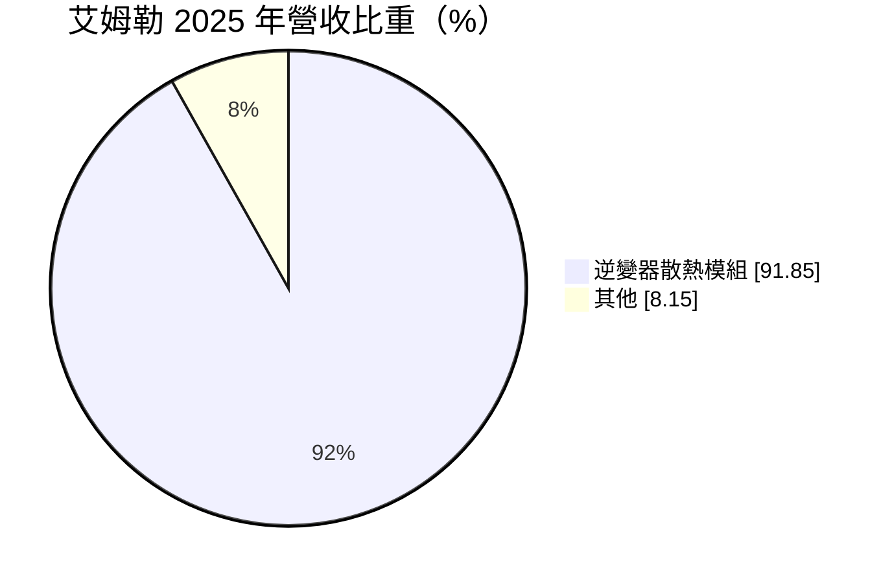
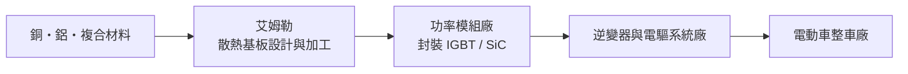
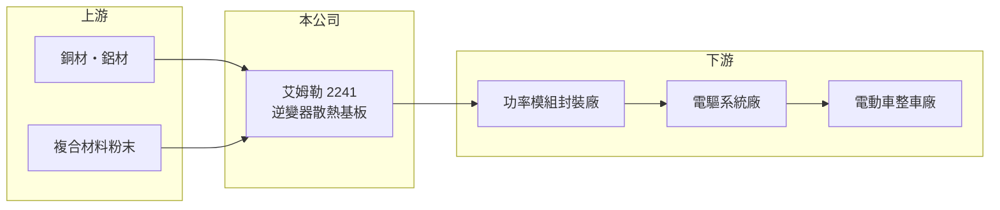

# 2241 艾姆勒

> 上市｜[[產業索引-汽車工業|汽車工業]]｜上市（櫃）日期 2020/08/26

# 第一章：企業模式與商業藍圖

> [!info] 撰寫說明
> 本文由 Claude 依公開資料整理，架構比照 [[2330台積電]] 的四章研究，資料截至 2026-10-08。財務數字來源：Goodinfo 台灣股市資訊網年度經營績效、MoneyDJ 理財網個股基本資料（營收比重）、證交所開放資料（本筆記 _data 快照）；材料技術與客戶類型憑既有知識整理並標「待校對」。公開資料有限。#待校對

在評估單一個股的長期投資價值時，首要步驟是拆解企業的底層獲利邏輯。本章說明艾姆勒科技（股票代號：2241，以下簡稱艾姆勒）如何切入電動車[[逆變器]]的散熱零件，以及為何營收規模小、長期處於虧損。

## 一、核心定位：功率模組的散熱基板

艾姆勒 2011 年成立、2020 年上市，總部在新北市林口。依 MoneyDJ，2025 年營收中逆變器散熱模組占 91.85%，其他占 8.15%，幾乎是單一產品公司。

電動車的逆變器負責把電池的直流電轉成驅動馬達的交流電，裡面的[[功率模組]]（IGBT 或 [[SiC]] 元件）在運作時會大量發熱。艾姆勒生產的是貼在功率模組底部的[[散熱基板]]，常見形式是帶有針狀鰭片的銅或鋁基材，以及鋁碳化矽等複合材料（材料細節待校對）。散熱效果直接影響功率模組能承受的電流與壽命，所以這是一個有材料與加工門檻的零件。

## 二、資本轉化邏輯

艾姆勒不直接賣給車廠，而是賣給功率模組封裝廠，屬於二階或三階供應商。產品要通過模組廠與車廠的雙重驗證，開發期長，但一旦進入量產車型，訂單會隨車型延續數年。問題在於量產規模：散熱基板需要專用模具與加工設備，營收規模太小時折舊與人事費用攤不開，這是艾姆勒長年虧損的主因。

## 三、企業長期方向

艾姆勒的長期方向取決於電動車滲透率，以及 SiC 功率模組的普及。SiC 元件功率密度更高，散熱要求更嚴格，理論上對高階散熱基板有利。公司要做的是取得更多量產車型專案，把營收拉到能支撐固定成本的規模；2026 年 1 至 8 月累計營收 6.39 億元，較前一年同期 4.36 億元成長約 46%（證交所開放資料），是規模擴大的初步跡象。

# 第二章：護城河深度與競爭優勢

在長期價值投資中，「護城河」指企業抵禦競爭、維持超額利潤的保護機制。本章分析艾姆勒的技術優勢與它面對的競爭。

## 一、護城河的核心組成要素

* **1. 車規驗證的轉換成本：** 散熱基板要通過功率模組的熱循環與可靠度測試，再隨模組通過車廠驗證，整個流程往往需要數年。客戶一旦採用，量產期間不會輕易更換。
* **2. 材料與加工技術：** 針狀鰭片的成形、複合材料的配方與表面處理，都需要長期累積的製程經驗，專利是艾姆勒的主要資產（待校對）。
* **3. 規模不足的弱點：** 護城河的另一面是規模。艾姆勒營收不到 10 億元，與國際大廠相比議價能力有限，技術優勢還沒有轉化成穩定獲利。

## 二、主要對手

| 對手 | 定位 | 對艾姆勒的威脅 |
|---|---|---|
| 日本、德國散熱材料廠 | 長期供應歐日功率模組大廠 | 品牌與實績較深，先取得一線車型 |
| 中國散熱基板廠 | 成本低、貼近中國電動車市場 | 價格競爭最激烈 |
| 功率模組廠自製 | 大型模組廠可能內製 | 壓縮外購需求 |

## 三、守得住／守不住／觀察重點

* **守得住：** 已量產車型的持續出貨，以及需要客製化設計的高功率模組。
* **守不住：** 標準規格產品的價格，中國業者擴產後報價持續承壓。
* **觀察重點：** 營收能否穩定超過損益兩平的規模，以及毛利率能否從 2025 年的 3.5% 回到兩成以上的水準。

# 第三章：財務體質與盈利規模

資料日期：2026-10-08。數字取自 Goodinfo 年度經營績效與證交所開放資料快照，表格是撰寫當時的快照；最新月營收、毛利率、累計 EPS 由自動排程寫在本筆記的屬性欄位（月營收、毛利率、累計EPS 等）。#待校對

財務報表是檢驗護城河是否真實存在的最終標準。本章用多年度數字檢視艾姆勒的獲利能力。

## 一、多年度三率與 ROE

| 年度 | 營收（新台幣） | [[毛利率]] | [[營業利益率]] | EPS（元） | [[ROE]] |
|---|---|---|---|---|---|
| 2021 | 11.4 億 | 12.9% | -6.3% | -1.23 | -6.64% |
| 2022 | 7.31 億 | -1.18% | -37.9% | -2.46 | -14.5% |
| 2023 | 8.84 億 | -0.68% | -26.9% | -2.47 | -15.5% |
| 2024 | 6.89 億 | 0.39% | -31.0% | -1.98 | -14.5% |
| 2025 | 7.86 億 | 3.5% | -16.6% | -0.70 | -5.06% |
| 2026 上半年 | 4.73 億 | 9.30% | -8.26% | -0.42 | 未查得 |

* **[[毛利率]]：** 2019 年仍有 25.9%，2022 至 2024 年接近零甚至為負，2026 年上半年回升到 9.30%。毛利率的變化幾乎完全跟著營收規模走，說明固定成本占比很高。
* **[[營業利益率]]：** 連續五年為負，但虧損幅度從 2022 年的 -37.9% 縮小到 2026 年上半年的 -8.26%。
* **長期指標：** 2020 至 2025 年營收年複合成長率約 -1.5%（推算）；2021 至 2025 年平均 ROE 約 -11%（推算）。官方快照未列 2025 年度現金股利。

## 二、財務結構

2026 年第二季底資產 23.0 億元、負債 8.0 億元，負債比約 35%，每股淨值 12.53 元（證交所開放資料）。長期虧損使淨值偏低，若虧損延續，可能需要再籌資。

## 三、[[ROIC]] 與 [[WACC]]

2025 年營業損失約 1.3 億元（7.86 億元 × -16.6%），投入資本以權益 15.0 億元近似，ROIC 約 -9%（推算）。WACC 以 CAPM 推估：無風險利率 1.5% 至 2%、市場風險溢酬 6%、β 未查得，小型電動車零件股取 1.2（假設），權益成本約 8.7% 至 9.2%；負債比重低，WACC 約 8% 至 9%（推算）。ROIC 長期低於 WACC，艾姆勒目前仍在消耗股東資本，價值創造要等規模經濟出現。

# 第四章：總體風險與地緣政治

任何企業都無法脫離宏觀環境獨立存在。本章整理艾姆勒長期必須面對的風險。

## 一、產業週期與市場結構

* **電動車成長放緩：** 散熱基板需求與電動車產量直接連動，歐美電動車補貼退場或銷量放緩，會讓專案延後。
* **中國供應鏈價格壓力：** 中國電動車與功率模組產業鏈完整，散熱零件報價低，可能壓縮艾姆勒的毛利空間。

## 二、營運風險

* **客戶集中：** 營收規模小，少數功率模組客戶的訂單變動就能大幅影響營收（客戶名單未查得）。
* **持續虧損：** 連年虧損消耗淨值，籌資可能稀釋股東權益。

## 三、其他風險

* **原物料：** 銅、鋁價格波動直接影響成本。
* **技術路線：** 若功率模組改用雙面散熱、直接液冷等新架構，散熱基板的設計需要跟著改變，研發投入不能中斷。

# 專有名詞解析

## 半導體

- **[[功率模組]]**：把多顆 IGBT 或 SiC 功率元件封裝在一起、負責大電流開關的模組。
- **[[SiC]]**：碳化矽，耐高壓、耐高溫的第三代半導體材料，用於電動車逆變器與快充。

## 應用

- **[[逆變器]]**：把電池直流電轉換成交流電驅動馬達的裝置，是電動車電驅系統的核心。

## 金融

- **[[ROIC]]**：投入資本報酬率，衡量公司用股東與債權人資金創造本業稅後利潤的效率。
- **[[WACC]]**：加權平均資金成本，依股權與負債比重加權的資金成本，是 ROIC 要超過的門檻。

## 產業

- **[[散熱基板]]**：貼在功率模組底部、把熱導向冷卻系統的金屬或複合材料板，常帶有鰭片結構。

# 核心供應鏈

## 1. 上游：原物料
- 銅、鋁與複合材料供應商（名稱未查得）

## 2. 中游：艾姆勒本身
- 逆變器散熱基板的設計、成形與表面處理

## 3. 下游：客戶
- 功率模組封裝廠、電驅系統廠，最終用於電動車（客戶名單未查得）

## 4. 同業
- 國外散熱材料廠與中國散熱基板廠（名稱未查得）
- 台股電動車零件：[[2497怡利電]]、[[4551智伸科]]

## 最新新聞
<!-- news:start -->
<!-- news:end -->

## 相關連結
- [公開資訊觀測站](https://mopsov.twse.com.tw/mops/web/t05st03?step=1&firstin=1&co_id=2241)
- [Goodinfo](https://goodinfo.tw/tw/StockDetail.asp?STOCK_ID=2241)
- [Yahoo 股市](https://tw.stock.yahoo.com/quote/2241)
- [鉅亨網新聞](https://www.cnyes.com/twstock/2241/news)
