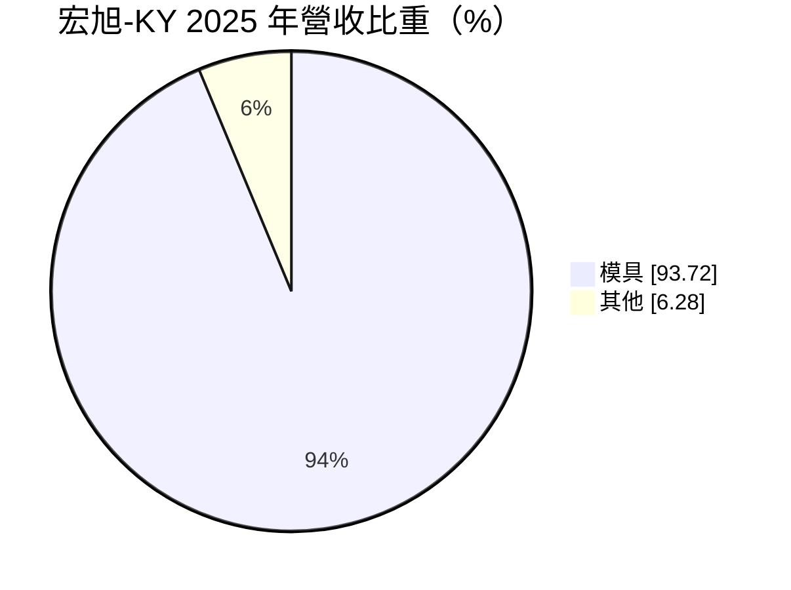
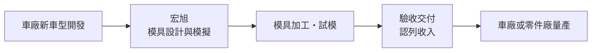
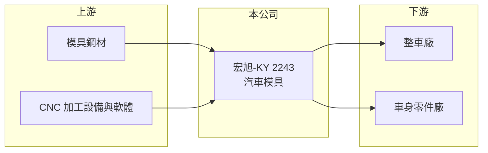

# 2243 宏旭-KY

> 上市｜[[產業索引-汽車工業|汽車工業]]｜上市（櫃）日期 2017/09/27

# 第一章：企業模式與商業藍圖

> [!info] 撰寫說明
> 本文由 Claude 依公開資料整理，架構比照 [[2330台積電]] 的四章研究，資料截至 2026-10-08。財務數字來源：Goodinfo 台灣股市資訊網年度經營績效、MoneyDJ 理財網個股基本資料（營收比重）、證交所開放資料（本筆記 _data 快照）。模具種類、生產據點與客戶憑既有知識整理並標「待校對」。公開資料有限。#待校對

在評估單一個股的長期投資價值時，首要步驟是拆解企業的底層獲利邏輯。本章說明宏旭-KY（股票代號：2243，以下簡稱宏旭）以汽車模具為主的商業模式，以及這種「專案型」生意為何獲利起伏很大。

## 一、核心定位：替車廠開發新車型的模具

宏旭是開曼註冊的控股公司，2015 年設立、2017 年上市。依 MoneyDJ，2025 年營收中模具占 93.72%、其他占 6.28%。汽車[[模具]]是車廠開發新車型時，用來沖壓車身外板或成形零件的大型工具，每一套都依車型客製，主要營運地區在中國（待校對）。

模具業和一般零件業最大的差別是「接案」性質：車廠每推出新車型或改款，就需要一批新模具，模具交付後收入就結束，不像零件會隨車型量產持續出貨。因此宏旭的營收取決於車廠開發新車的節奏，而不是汽車銷量本身。

## 二、資本轉化邏輯

模具專案從設計、加工、試模到客戶驗收常常要一年以上，期間客戶會先付部分款項。宏旭的負債以流動負債為主（2026 年第二季底 21.6 億元），推估其中相當部分是專案預收款（推估）。這種模式的風險是：專案若延誤或驗收不過，成本已經投入，損失會集中認列，2020 年與 2023 年的毛利率大幅下滑即可能與此有關（推估）。

## 三、企業長期方向

中國車廠，尤其是電動車品牌，車型更新週期遠比傳統車廠短，對模具的需求量大，是宏旭的成長來源。長期的關鍵在於專案管理能力：能否準時交付、控制試模成本，讓毛利率穩定在一成以上。2025 年營業利益率 5.95%、ROE 10.9%，是近七年最好的一年（Goodinfo），但需要觀察能否延續。

# 第二章：護城河深度與競爭優勢

在長期價值投資中，「護城河」指企業抵禦競爭、維持超額利潤的保護機制。本章分析宏旭的競爭位置。

## 一、護城河的核心組成要素

* **1. 設計與模擬經驗：** 大型車身模具需要模擬金屬成形時的回彈與破裂，經驗累積越多，試模次數越少、成本越低。這是模具廠之間最實際的差距。
* **2. 客戶關係：** 車廠傾向把新車型交給合作過、能準時交付的模具廠，過往交付紀錄就是接案的門票。
* **3. 護城河偏窄：** 模具每一案都要重新競標，沒有長期合約保護，加上中國模具廠眾多，宏旭的優勢主要來自執行力而非結構性壁壘。

## 二、主要對手

| 對手 | 定位 | 對宏旭的威脅 |
|---|---|---|
| 天汽模、成飛集成等中國模具廠 | 規模大、與國有車廠關係深 | 價格與產能競爭 |
| 日本、德國模具廠 | 高精度、高單價 | 搶下高階車型專案 |
| 車廠自有模具部門 | 內製關鍵模具 | 減少外包量 |

## 三、守得住／守不住／觀察重點

* **守得住：** 已建立合作關係、重視交期的電動車新創與自主品牌客戶（推估）。
* **守不住：** 一般模具的報價，中國業者競爭激烈。
* **觀察重點：** 毛利率能否維持在一成以上，以及專案虧損是否再度出現。

# 第三章：財務體質與盈利規模

資料日期：2026-10-08。數字取自 Goodinfo 年度經營績效與證交所開放資料快照，表格是撰寫當時的快照；最新月營收、毛利率、累計 EPS 由自動排程寫在本筆記的屬性欄位（月營收、毛利率、累計EPS 等）。#待校對

財務報表是檢驗護城河是否真實存在的最終標準。本章用多年度數字檢視宏旭獲利的波動。

## 一、多年度三率與 ROE

| 年度 | 營收（新台幣） | [[毛利率]] | [[營業利益率]] | EPS（元） | [[ROE]] |
|---|---|---|---|---|---|
| 2021 | 15.0 億 | 5.12% | -0.69% | -1.82 | -15.3% |
| 2022 | 17.0 億 | 8.06% | 0.87% | -0.65 | -5.83% |
| 2023 | 16.7 億 | 0.67% | -6.9% | -2.21 | -24.7% |
| 2024 | 19.1 億 | 8.64% | 1.75% | 0.24 | 2.35% |
| 2025 | 17.4 億 | 14.4% | 5.95% | 1.22 | 10.9% |
| 2026 上半年 | 9.62 億 | 10.76% | 2.46% | 0.33 | 未查得 |

* **[[毛利率]]：** 介於 0.67% 到 14.4% 之間，波動很大，反映模具專案的成本控制差異。
* **[[營業利益率]]：** 2019 至 2023 年多數年度為負，2024 年轉正、2025 年達 5.95%。
* **長期指標：** 2021 至 2025 年營收年複合成長率約 3.8%（推算）；2021 至 2025 年平均 ROE 約 -6.5%（推算）。官方快照未列 2025 年度現金股利。

## 二、財務結構

2026 年第二季底資產 35.1 億元、負債 24.4 億元，負債比約 69%，每股淨值 13.85 元（證交所開放資料）。負債比偏高，但其中可能包含專案預收款（推估），需要看有息負債才能判斷真正的財務壓力，有息負債金額未查得。

## 三、[[ROIC]] 與 [[WACC]]

2025 年營業利益約 1.04 億元（17.4 億元 × 5.95%），稅後約 0.83 億元；以權益 10.7 億元近似投入資本，ROIC 約 7.7%（推算），若加計有息負債會更低。WACC 以 CAPM 推估：無風險利率 1.5% 至 2%、市場風險溢酬 6%、β 未查得，取 1.1（假設），權益成本約 8.1% 至 8.6%；負債成本假設 3%，WACC 約 7% 至 8%（推算）。2025 年 ROIC 大致與 WACC 打平，過去多數年度則明顯低於 WACC，宏旭長期尚未證明能穩定創造價值。

# 第四章：總體風險與地緣政治

任何企業都無法脫離宏觀環境獨立存在。本章整理宏旭長期必須面對的風險。

## 一、地緣政治與政策

* **營運集中中國：** 客戶與營運多在中國（待校對），受中國汽車產業政策與兩岸關係影響，開曼控股架構也讓資訊揭露較間接。

## 二、產業週期與市場結構

* **車廠開發節奏：** 車廠縮減新車型或延後改款時，模具需求立刻下降；中國車市整併後，倒閉或縮編的車廠也可能造成應收帳款風險。

## 三、營運風險

* **專案損失：** 單一大型專案延誤或驗收失敗，就可能讓整年度轉虧，2020 年與 2023 年的低毛利即是例子。
* **財務槓桿：** 負債比約七成，若預收款減少，營運資金壓力會上升。

## 四、技術演進

* **一體化壓鑄：** 若車身改用大型[[一體化壓鑄]]，沖壓模具的需求會被壓鑄模具取代，宏旭需要調整產品組合（推估）。

# 專有名詞解析

## 金融

- **[[ROIC]]**：投入資本報酬率，衡量公司用股東與債權人資金創造本業稅後利潤的效率。
- **[[WACC]]**：加權平均資金成本，依股權與負債比重加權的資金成本，是 ROIC 要超過的門檻。

## 產業

- **[[模具]]**：讓金屬或塑膠成形的工具，汽車模具依車型客製，是新車開發的前期投資。
- **[[一體化壓鑄]]**：用超大型壓鑄機把原本數十個零件一次鑄成一個鋁件，可減少焊接工序與重量。

# 核心供應鏈

## 1. 上游：原物料與設備
- 模具鋼材、CNC 加工設備與 CAE 模擬軟體（供應商名稱未查得）

## 2. 中游：宏旭本身
- 汽車模具設計、加工、試模

## 3. 下游：客戶
- 中國整車廠與車身零件廠（客戶名單未查得）

## 4. 同業
- 中國：天汽模、成飛集成
- 台股汽車零件：[[2239英利-KY]]

## 最新新聞
<!-- news:start -->
<!-- news:end -->

## 相關連結
- [公開資訊觀測站](https://mopsov.twse.com.tw/mops/web/t05st03?step=1&firstin=1&co_id=2243)
- [Goodinfo](https://goodinfo.tw/tw/StockDetail.asp?STOCK_ID=2243)
- [Yahoo 股市](https://tw.stock.yahoo.com/quote/2243)
- [鉅亨網新聞](https://www.cnyes.com/twstock/2243/news)
