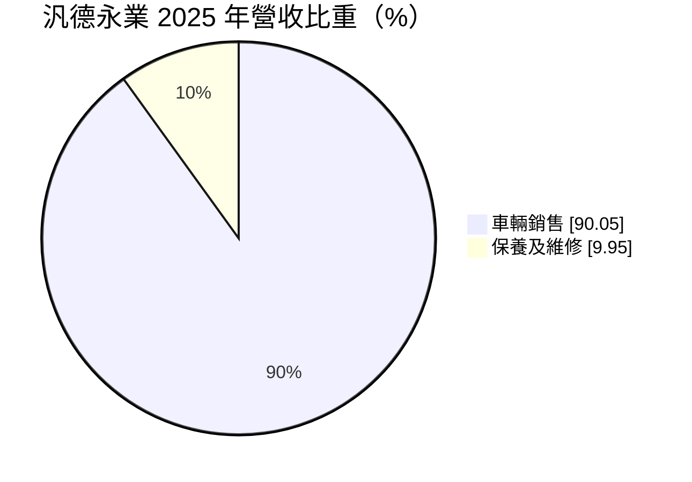
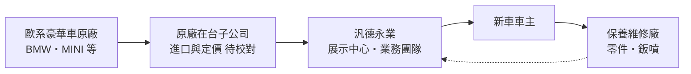
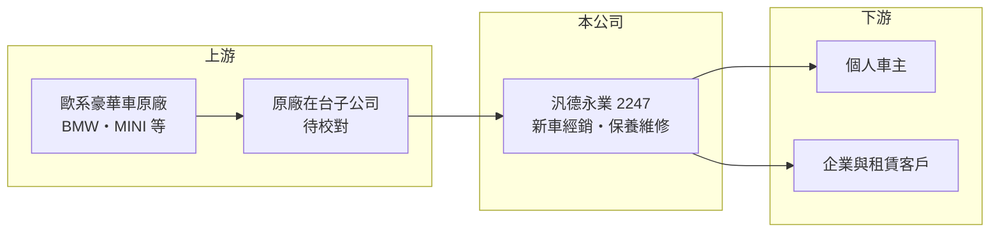

# 2247 汎德永業

> 上市｜[[產業索引-汽車工業|汽車工業]]｜上市（櫃）日期 2020/10/12

# 第一章：企業模式與商業藍圖

> [!info] 撰寫說明
> 本文由 Claude 依公開資料整理，架構比照 [[2330台積電]] 的四章研究，資料截至 2026-10-08。財務數字來源：Goodinfo 台灣股市資訊網年度經營績效、MoneyDJ 理財網個股基本資料（營收比重）、證交所開放資料（本筆記 _data 快照）。代理品牌與據點憑既有知識整理並標「待校對」。#待校對

在評估單一個股的長期投資價值時，首要步驟是拆解企業的底層獲利邏輯。本章說明汎德永業（股票代號：2247）如何以豪華進口車經銷為本業，靠售後服務與穩定配息建立長期價值。

## 一、核心定位：台灣最大的豪華進口車經銷商之一

汎德永業成立於 1979 年，2020 年上市，同時有兩檔特別股（22471、22472）掛牌。依 MoneyDJ，2025 年營收中車輛銷售占 90.05%、保養及維修占 9.95%。公司主要經銷 BMW、MINI 等歐系豪華品牌，集團旗下也經營其他超跑與豪華品牌（品牌名單待校對）。

需要注意的是，汎德永業是「經銷商」而非「總代理」：品牌進口與定價主要由原廠在台子公司決定（待校對），汎德永業負責展示中心、銷售與維修廠。因此它的毛利率穩定落在 11% 到 12%，是典型的通路生意，靠周轉與規模賺錢。

## 二、資本轉化邏輯

* **新車銷售帶來客戶：** 新車毛利不高，但每賣出一台車，就多一位未來五到十年回廠保養的客戶。
* **售後服務是利潤核心：** 保養維修雖只占營收約一成，但毛利率通常遠高於新車（推估），而且與景氣關聯較低。路上車輛保有量越大，售後收入越穩定。

## 三、企業長期方向

汎德永業的長期成長來自三件事：台灣豪華車市場的滲透、電動車款帶來的換車需求，以及據點擴充帶動的售後產能。營收從 2019 年的 337 億元成長到 2024 年的 576 億元，2025 年回落到 514 億元（Goodinfo）。資本配置上公司重視配息，2025 年下半年配發現金股利 8 元（證交所開放資料），並以特別股籌措長期資金。

# 第二章：護城河深度與競爭優勢

在長期價值投資中，「護城河」指企業抵禦競爭、維持超額利潤的保護機制。本章分析汎德永業的優勢與限制。

## 一、護城河的核心組成要素

* **1. 經銷權與據點網路：** 豪華品牌在台灣通常只授權少數經銷商，汎德永業長期經營累積的據點、客戶名單與服務口碑，新進者很難在短時間複製。
* **2. 保有量帶來的售後收入：** 售後保養與車主的品牌黏著度高，豪華車主傾向回原廠體系保養，形成可預期的現金流。
* **3. 對原廠的依賴：** 經銷權由原廠授權，車款、價格與經銷政策都受原廠左右。這是汎德永業最大的結構性限制。

## 二、主要對手

| 對手 | 定位 | 對汎德永業的威脅 |
|---|---|---|
| 其他 BMW 經銷商 | 同品牌不同區域經銷 | 在交界區域搶客 |
| 賓士、奧迪等品牌經銷商 | 同級豪華車 | 爭奪同一批高所得客戶 |
| 特斯拉等直營電動車品牌 | 不透過經銷商 | 改變豪華車的銷售模式 |
| [[2207和泰車]] 的 Lexus | 日系豪華車 | 價格與保值性競爭 |

## 三、守得住／守不住／觀察重點

* **守得住：** 售後維修與既有車主的換購需求。
* **守不住：** 新車毛利率，原廠促銷與同業折扣讓新車毛利難以提高。
* **觀察重點：** 營收波動時營業利益率能否維持在 3% 以上，以及原廠是否改採代理制或直營制。

# 第三章：財務體質與盈利規模

資料日期：2026-10-08。數字取自 Goodinfo 年度經營績效與證交所開放資料快照，表格是撰寫當時的快照；最新月營收、毛利率、累計 EPS 由自動排程寫在本筆記的屬性欄位（月營收、毛利率、累計EPS 等）。#待校對

財務報表是檢驗護城河是否真實存在的最終標準。本章用多年度數字檢視汎德永業的獲利穩定度。

## 一、多年度三率與 ROE

| 年度 | 營收（新台幣） | [[毛利率]] | [[營業利益率]] | EPS（元） | [[ROE]] |
|---|---|---|---|---|---|
| 2021 | 421 億 | 12.1% | 3.69% | 15.36 | 10.7% |
| 2022 | 441 億 | 12.1% | 4.15% | 18.28 | 12.3% |
| 2023 | 508 億 | 11.6% | 4.31% | 22.17 | 14.3% |
| 2024 | 576 億 | 11.1% | 4.06% | 23.93 | 14.8% |
| 2025 | 514 億 | 11.2% | 3.50% | 18.32 | 11.3% |
| 2026 上半年 | 206 億 | 11.63% | 3.09% | 6.55 | 未查得 |

* **[[毛利率]]：** 七年都在 11% 到 12% 之間，波動很小，反映通路業「賺價差與服務費」的本質。
* **[[營業利益率]]：** 3% 到 4% 之間，主要隨營收規模變動。2026 年 1 至 8 月營收 280.7 億元，較前一年同期 353.6 億元減少約 21%（證交所開放資料），營業利益率也降到 3.09%。
* **長期指標：** 2020 至 2025 年營收年複合成長率約 5.4%（推算）；2021 至 2025 年平均 ROE 約 12.7%（推算）。股利穩定，Goodinfo 統計歷年平均現金股利約 12.55 元。

## 二、財務結構

2026 年第二季底資產 216.2 億元、負債 88.8 億元，負債比約 41%，每股淨值 157.74 元（證交所開放資料）。經銷商需要庫存車與據點不動產，非流動負債 45.7 億元可能包含長期借款與租賃負債（推估）。

## 三、[[ROIC]] 與 [[WACC]]

2025 年營業利益約 18.0 億元（514 億元 × 3.5%），稅後約 14.4 億元。投入資本以權益 127.3 億元加非流動負債 45.7 億元近似（約 173 億元，有息負債細項未查得），ROIC 約 8.3%（推算）；若只用權益則約 11.3%。WACC 以 CAPM 推估：無風險利率 1.5% 至 2%、市場風險溢酬 6%、β 未查得，汽車通路取 0.8（假設），權益成本約 6.3% 至 6.8%；負債成本假設 2.5%、稅後 2%，負債約占資本三成，WACC 約 5% 至 5.5%（推算）。ROIC 穩定高於 WACC，代表汎德永業以低毛利、高周轉的模式長期創造價值，雖然利差不大，但勝在穩定。

# 第四章：總體風險與地緣政治

任何企業都無法脫離宏觀環境獨立存在。本章整理汎德永業長期必須面對的風險。

## 一、政策與法規

* **進口車關稅與貨物稅：** 若台灣調整進口車關稅或貨物稅，會改變進口豪華車的售價與需求；電動車相關稅賦優惠的變化也會影響換車時點。

## 二、產業週期與市場結構

* **豪華車需求的景氣循環：** 豪華車屬於可延後的消費，股市與景氣轉弱時需求下降。2025 至 2026 年營收下滑即反映需求降溫（推估）。
* **銷售模式改變：** 部分歐洲車廠嘗試代理制或直營制，經銷商改領佣金，若在台灣推行，會改變汎德永業的營收與獲利結構。

## 三、營運風險

* **原廠依賴：** 品牌競爭力、車款更新與召回事件都非公司可控。
* **庫存與匯率：** 車款以歐元計價（待校對），匯率波動與庫存跌價會影響毛利。

## 四、技術演進

* **電動車保養需求較低：** 電動車沒有引擎機油等定期耗材，長期可能降低每台車的售後收入，經銷商需要以電池檢測、軟體服務與鈑噴維修補足。

# 專有名詞解析

## 金融

- **[[特別股]]**：股息通常固定、優先於普通股分配的股票，企業常用來籌措長期資金。
- **[[ROIC]]**：投入資本報酬率，衡量公司用股東與債權人資金創造本業稅後利潤的效率。
- **[[WACC]]**：加權平均資金成本，依股權與負債比重加權的資金成本，是 ROIC 要超過的門檻。

## 產業

- **[[經銷商]]**：向原廠或總代理購車、再銷售給消費者並提供維修服務的通路業者。
- **[[總代理]]**：取得國外品牌在特定市場獨家銷售權的公司，營運依賴原廠授權與車款規劃。
- **[[代理制]]**：車廠直接對消費者定價銷售、經銷商只負責交車與服務並領取佣金的銷售模式。

# 核心供應鏈

## 1. 上游：原廠
- BMW、MINI 等歐系豪華品牌原廠及其在台子公司（品牌名單待校對）

## 2. 中游：汎德永業本身
- 展示中心、業務團隊、保養維修廠

## 3. 下游：客戶
- 個人車主、企業與租賃客戶

## 4. 同業
- [[2207和泰車]]、[[2227裕日車]]
- 其他歐系豪華車經銷商（未上市）

## 最新新聞
<!-- news:start -->
<!-- news:end -->

## 相關連結
- [公開資訊觀測站](https://mopsov.twse.com.tw/mops/web/t05st03?step=1&firstin=1&co_id=2247)
- [Goodinfo](https://goodinfo.tw/tw/StockDetail.asp?STOCK_ID=2247)
- [Yahoo 股市](https://tw.stock.yahoo.com/quote/2247)
- [鉅亨網新聞](https://www.cnyes.com/twstock/2247/news)
