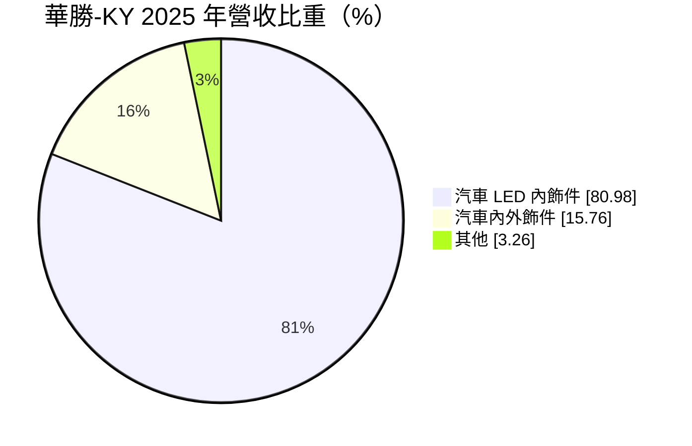
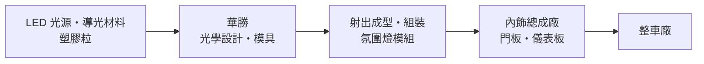
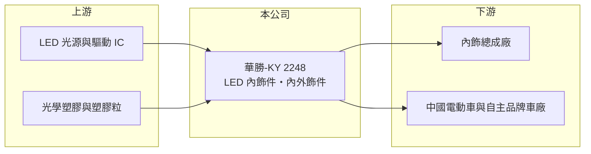

# 2248 華勝-KY

> 上市｜[[產業索引-汽車工業|汽車工業]]｜上市（櫃）日期 2025/03/13

# 第一章：企業模式與商業藍圖

> [!info] 撰寫說明
> 本文由 Claude 依公開資料整理，架構比照 [[2330台積電]] 的四章研究，資料截至 2026-10-08。財務數字來源：Goodinfo 台灣股市資訊網年度經營績效、MoneyDJ 理財網個股基本資料（營收比重）、證交所開放資料（本筆記 _data 快照）。產品應用、生產據點與客戶類型憑既有知識整理並標「待校對」。公開資料有限。#待校對

在評估單一個股的長期投資價值時，首要步驟是拆解企業的底層獲利邏輯。本章說明華勝-KY（股票代號：2248，以下簡稱華勝）如何靠汽車[[氛圍燈]]與內飾件，在短短幾年內把營收放大三倍。

## 一、核心定位：讓車內「會發光」的內飾零件

華勝是開曼註冊的控股公司，2017 年設立，2025 年 3 月上市。依 MoneyDJ，2025 年營收中汽車 LED 內飾件占 80.98%、汽車內外飾件占 15.76%、其他占 3.26%。LED 內飾件主要是門板、儀表板、中控台上的氛圍燈與發光飾條，把光源、導光條與塑膠飾板整合成一個模組。營運據點以中國為主（待校對）。

氛圍燈原本只出現在豪華車，近年中國電動車品牌把它當作座艙差異化的配備，大量用在中價位車款，這是華勝營收快速成長的背景。

## 二、資本轉化邏輯

華勝的附加價值在光學設計：同一條導光條要做到亮度均勻、顏色一致，還要配合車廠的造型設計。這讓產品毛利率高於一般塑膠內飾件，2024 年毛利率 32.8%、2025 年 30.7%（Goodinfo）。產品與車型綁定，取得專案後隨車型量產出貨。

## 三、企業長期方向

華勝的長期方向是把氛圍燈從單色燈條升級為可變色、可與音樂或駕駛輔助系統連動的智慧光源，提高每台車的零件價值，同時把客戶從中國品牌延伸到國際車廠（推估）。2025 年上市取得資金，有助於擴充產能。2026 年 1 至 8 月營收 18.1 億元，較前一年同期 12.0 億元成長約 51%（證交所開放資料）。

# 第二章：護城河深度與競爭優勢

在長期價值投資中，「護城河」指企業抵禦競爭、維持超額利潤的保護機制。本章分析華勝的優勢能維持多久。

## 一、護城河的核心組成要素

* **1. 光學設計能力：** 氛圍燈看似簡單，但要在狹長曲面上做到均勻發光，需要光學模擬與模具經驗，這是華勝毛利率能維持三成的原因。
* **2. 車型專案綁定：** 內飾件需要配合車廠的造型開發與驗證，量產後通常供應到車型改款，形成數年的訂單能見度。
* **3. 快速回應中國車廠：** 中國電動車品牌開發週期短，貼近客戶、能快速打樣的供應商較易拿到專案（推估）。

## 二、主要對手

| 對手 | 定位 | 對華勝的威脅 |
|---|---|---|
| 中國內飾與車燈廠 | 同樣服務中國車廠 | 價格競爭，可能壓縮毛利 |
| 國際內飾總成廠 | 掌握門板、儀表板整合 | 可能自製或指定其他燈條供應商 |
| [[3717聯嘉投控]]、[[3346麗清]] | 台系車用 LED 模組廠 | 在車用照明模組部分重疊（推估） |

## 三、守得住／守不住／觀察重點

* **守得住：** 需要客製光學設計的高階氛圍燈專案。
* **守不住：** 規格標準化後的單色燈條，價格會隨普及快速下降。
* **觀察重點：** 毛利率能否維持在三成左右，以及客戶是否從少數中國品牌擴散到更多車廠。

# 第三章：財務體質與盈利規模

資料日期：2026-10-08。數字取自 Goodinfo 年度經營績效與證交所開放資料快照，表格是撰寫當時的快照；最新月營收、毛利率、累計 EPS 由自動排程寫在本筆記的屬性欄位（月營收、毛利率、累計EPS 等）。#待校對

財務報表是檢驗護城河是否真實存在的最終標準。本章用多年度數字檢視華勝的成長品質。

## 一、多年度三率與 ROE

| 年度 | 營收（新台幣） | [[毛利率]] | [[營業利益率]] | EPS（元） | [[ROE]] |
|---|---|---|---|---|---|
| 2021 | 9.27 億 | 23.8% | 2.95% | 2.28 | 12.6% |
| 2022 | 12.5 億 | 22.0% | 5.0% | 2.65 | 13.4% |
| 2023 | 19.3 億 | 21.9% | 6.82% | 3.29 | 15.0% |
| 2024 | 20.8 億 | 32.8% | 15.4% | 6.42 | 24.5% |
| 2025 | 20.7 億 | 30.7% | 14.0% | 5.32 | 17.1% |
| 2026 上半年 | 13.3 億 | 31.38% | 16.03% | 4.05 | 未查得 |

* **[[毛利率]]：** 2024 年從兩成出頭跳升到三成以上，代表產品組合轉向高附加價值的 LED 內飾件。
* **[[營業利益率]]：** 從 2021 年的 2.95% 提高到 2026 年上半年的 16.03%，營收放大後費用攤薄，[[營運槓桿]]明顯。
* **長期指標：** 2020 至 2025 年營收年複合成長率約 24%（推算，6.94 億到 20.7 億）；2021 至 2025 年平均 ROE 約 16.5%（推算）。2025 年度現金股利約 3.11 元（證交所開放資料），以 EPS 5.32 元計算配息率約 58%（推算）。

## 二、財務結構

2026 年第二季底資產 35.7 億元、負債 18.0 億元，負債比約 51%，每股淨值 37.04 元（證交所開放資料）。負債幾乎都是流動負債（17.7 億元），推估以應付帳款與短期借款為主。

## 三、[[ROIC]] 與 [[WACC]]

2025 年營業利益約 2.9 億元（20.7 億元 × 14.0%），稅後約 2.3 億元；以權益 17.6 億元近似投入資本，ROIC 約 13%（推算），若加計有息負債（未查得）約在 10% 至 13%。WACC 以 CAPM 推估：無風險利率 1.5% 至 2%、市場風險溢酬 6%、β 未查得，取 1.1（假設），權益成本約 8.1% 至 8.6%；負債成本假設 3%，WACC 約 7% 至 8%（推算）。ROIC 高於 WACC 約 3 至 6 個百分點，華勝目前正在創造價值，但成長期較短，需要更多年度驗證能否持續。

# 第四章：總體風險與地緣政治

任何企業都無法脫離宏觀環境獨立存在。本章整理華勝長期必須面對的風險。

## 一、地緣政治與政策

* **營運集中中國：** 生產與客戶多在中國（待校對），受中國汽車政策、兩岸關係與資金匯出限制影響。

## 二、產業週期與市場結構

* **中國車市價格戰：** 車廠降價會轉嫁給供應商，氛圍燈若成為標準配備，單價會下滑。
* **客戶集中：** 成長快的零件廠常依賴少數車廠，單一客戶銷量變化會放大到營收（客戶名單未查得）。

## 三、營運風險

* **產能擴充：** 營收快速成長需要持續擴產，若擴產時點與需求錯開，折舊會壓縮毛利率。
* **匯率：** 以人民幣營運、以新台幣報表，匯率變動影響換算後的獲利。

## 四、技術演進

* **座艙設計潮流：** 氛圍燈屬於設計潮流型配備，若車廠的座艙設計重心轉向大螢幕或其他材質，需求可能放緩。

# 專有名詞解析

## 應用

- **[[氛圍燈]]**：安裝在車內門板、儀表板等處的裝飾照明，可調整顏色與亮度，用來營造座艙氣氛。
- **[[導光條]]**：把點狀 LED 光源均勻擴散成線狀光的光學塑膠件，是氛圍燈的關鍵零件。

## 金融

- **[[營運槓桿]]**：固定成本占比高時，營收成長會帶動利潤以更大幅度成長的現象。
- **[[ROIC]]**：投入資本報酬率，衡量公司用股東與債權人資金創造本業稅後利潤的效率。
- **[[WACC]]**：加權平均資金成本，依股權與負債比重加權的資金成本，是 ROIC 要超過的門檻。

# 核心供應鏈

## 1. 上游：原物料與元件
- LED 光源、驅動 IC、光學塑膠（供應商名稱未查得）

## 2. 中游：華勝本身
- 光學設計、模具、射出成型與模組組裝

## 3. 下游：客戶
- 內飾總成廠與整車廠（客戶名單未查得）

## 4. 同業
- 台股車用照明：[[3717聯嘉投控]]、[[3346麗清]]
- 中國內飾與車燈廠（名稱未查得）

## 最新新聞
<!-- news:start -->
<!-- news:end -->

## 相關連結
- [公開資訊觀測站](https://mopsov.twse.com.tw/mops/web/t05st03?step=1&firstin=1&co_id=2248)
- [Goodinfo](https://goodinfo.tw/tw/StockDetail.asp?STOCK_ID=2248)
- [Yahoo 股市](https://tw.stock.yahoo.com/quote/2248)
- [鉅亨網新聞](https://www.cnyes.com/twstock/2248/news)
